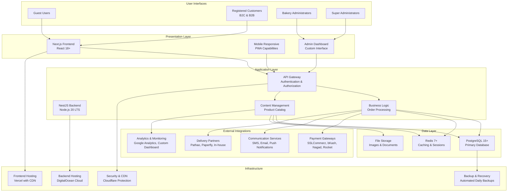

# SOFTWARE REQUIREMENTS SPECIFICATION
## Saffron Bakery & Dairy Enterprise E-Commerce Platform

**Document Version:** 1.0  
**Date:** December 1, 2025  
**Prepared For:** Saffron Bakery & Dairy Enterprise Development Team  
**Document Status:** Final  
**Compliance:** IEEE 830-1998 Standard for Software Requirements Specifications  

---

## EXECUTIVE SUMMARY

This Software Requirements Specification (SRS) document defines the complete requirements for the Saffron Bakery & Dairy Enterprise e-commerce platform development project. This comprehensive specification serves as the authoritative source for development team implementation guidance, quality assurance testing criteria, project management scope definition, stakeholder communication and agreement, regulatory compliance verification, and Bangladesh-specific requirement documentation.

The Saffron e-commerce platform is designed to serve the Bangladesh market with specialized bakery and dairy products, featuring a complete online shopping experience with bilingual support (Bengali/English), Bangladesh-specific payment methods, and culturally appropriate features. The system will be built using a modern technology stack including Next.js, NestJS, PostgreSQL, and Redis, hosted on Vercel (frontend) and DigitalOcean (backend) with Cloudflare CDN optimization.

This document synthesizes requirements from user requirements analysis, technical architecture specifications, Bangladesh market research, business objectives, and regulatory compliance requirements. It provides a complete foundation for a 9-month development project with a budget of BDT 31 lakh, targeting launch before major festival seasons.

---

## TABLE OF CONTENTS

1. [Introduction](#1-introduction)
    1.1 [Purpose](#11-purpose)
    1.2 [Scope](#12-scope)
    1.3 [Definitions, Acronyms, and Abbreviations](#13-definitions-acronyms-and-abbreviations)
    1.4 [References](#14-references)
    1.5 [Overview](#15-overview)

2. [Overall Description](#2-overall-description)
    2.1 [Product Perspective](#21-product-perspective)
    2.2 [Product Functions](#22-product-functions)
    2.3 [User Characteristics](#23-user-characteristics)
    2.4 [Constraints](#24-constraints)
    2.5 [Assumptions and Dependencies](#25-assumptions-and-dependencies)

3. [Specific Requirements](#3-specific-requirements)
    3.1 [Functional Requirements](#31-functional-requirements)
        3.1.1 [Product Catalog and Menu Management](#311-product-catalog-and-menu-management)
        3.1.2 [E-Commerce and Shopping Cart](#312-ecommerce-and-shopping-cart)
        3.1.3 [User Account Management](#313-user-account-management)
        3.1.4 [Custom Order Requests](#314-custom-order-requests)
        3.1.5 [Content Management System](#315-content-management-system)
        3.1.6 [Order Processing and Fulfillment](#316-order-processing-and-fulfillment)
        3.1.7 [Promotion and Discount System](#317-promotion-and-discount-system)
        3.1.8 [Notification and Email System](#318-notification-and-email-system)
        3.1.9 [Administrative Dashboard and Reporting](#319-administrative-dashboard-and-reporting)
    3.2 [Non-Functional Requirements](#32-non-functional-requirements)
        3.2.1 [Performance Requirements](#321-performance-requirements)
        3.2.2 [Security Requirements](#322-security-requirements)
        3.2.3 [Usability and Accessibility Requirements](#323-usability-and-accessibility-requirements)
        3.2.4 [Reliability and Availability Requirements](#324-reliability-and-availability-requirements)
        3.2.5 [Scalability Requirements](#325-scalability-requirements)
    3.3 [External Interface Requirements](#33-external-interface-requirements)
        3.3.1 [User Interfaces](#331-user-interfaces)
        3.3.2 [External System Interfaces](#332-external-system-interfaces)
        3.3.3 [API Interfaces](#333-api-interfaces)
    3.4 [Bangladesh-Specific Requirements](#34-bangladesh-specific-requirements)
        3.4.1 [Cultural Requirements](#341-cultural-requirements)
        3.4.2 [Regulatory Requirements](#342-regulatory-requirements)
        3.4.3 [Payment Ecosystem Requirements](#343-payment-ecosystem-requirements)
        3.4.4 [Infrastructure Requirements](#344-infrastructure-requirements)

4. [Supporting Information](#4-supporting-information)
    4.1 [Traceability Matrices](#41-traceability-matrices)
        4.1.1 [Requirements to Design Traceability](#411-requirements-to-design-traceability)
        4.1.2 [Requirements to Development Traceability](#412-requirements-to-development-traceability)
        4.1.3 [Requirements to Testing Traceability](#413-requirements-to-testing-traceability)
        4.1.4 [Requirements to Deployment Traceability](#414-requirements-to-deployment-traceability)
        4.1.5 [Cross-Functional Dependencies Matrix](#415-cross-functional-dependencies-matrix)
    4.2 [Version Control and Document History](#42-version-control-and-document-history)
        4.2.1 [Document Version Control Procedures](#421-document-version-control-procedures)
        4.2.2 [Change Management Process](#422-change-management-process)
        4.2.3 [Document History and Revisions](#423-document-history-and-revisions)
        4.2.4 [Approval Workflow](#424-approval-workflow)
    4.3 [Assumptions, Constraints, and Dependencies Summary](#43-assumptions-constraints-and-dependencies-summary)
        4.3.1 [Technical Assumptions](#431-technical-assumptions)
        4.3.2 [Business Constraints](#432-business-constraints)
        4.3.3 [External Dependencies](#433-external-dependencies)
        4.3.4 [Risk Assessment and Mitigation](#434-risk-assessment-and-mitigation)
    4.4 [Quality Assurance and Validation Procedures](#44-quality-assurance-and-validation-procedures)
        4.4.1 [Requirements Validation Process](#441-requirements-validation-process)
        4.4.2 [Quality Assurance Metrics](#442-quality-assurance-metrics)
        4.4.3 [Testing Strategy and Procedures](#443-testing-strategy-and-procedures)
        4.4.4 [Compliance Verification Procedures](#444-compliance-verification-procedures)

5. [Appendices](#5-appendices)
    5.1 [Requirement Templates and Guidelines](#51-requirement-templates-and-guidelines)
        5.1.1 [Functional Requirement Template](#511-functional-requirement-template)
        5.1.2 [Non-Functional Requirement Template](#512-non-functional-requirement-template)
        5.1.3 [Interface Requirement Template](#513-interface-requirement-template)
        5.1.4 [Compliance Requirement Template](#514-compliance-requirement-template)
        5.1.5 [Requirements Writing Guidelines](#515-requirements-writing-guidelines)
    5.2 [Bangladesh Compliance Checklists](#52-bangladesh-compliance-checklists)
        5.2.1 [Regulatory Compliance Checklist](#521-regulatory-compliance-checklist)
        5.2.2 [Cultural Compliance Checklist](#522-cultural-compliance-checklist)
        5.2.3 [Payment System Compliance Checklist](#523-payment-system-compliance-checklist)
        5.2.4 [Technical Compliance Checklist](#524-technical-compliance-checklist)
    5.3 [Implementation Guidance](#53-implementation-guidance)
        5.3.1 [Development Phases and Milestones](#531-development-phases-and-milestones)
        5.3.2 [Technology Stack Implementation Guide](#532-technology-stack-implementation-guide)
        5.3.3 [Bangladesh-Specific Implementation Considerations](#533-bangladesh-specific-implementation-considerations)
        5.3.4 [Quality Assurance Implementation Guide](#534-quality-assurance-implementation-guide)
    5.4 [Glossary of Terms](#54-glossary-of-terms)
        5.4.1 [Technical Terms](#541-technical-terms)
        5.4.2 [Business Terms](#542-business-terms)
        5.4.3 [Bangladesh-Specific Terms](#543-bangladesh-specific-terms)
        5.4.4 [Acronyms and Abbreviations](#544-acronyms-and-abbreviations)

---

## 1. INTRODUCTION

### 1.1 PURPOSE

This Software Requirements Specification (SRS) document defines the complete requirements for the Saffron Bakery & Dairy Enterprise e-commerce platform development project. This document serves as the authoritative source for:

- Development team implementation guidance
- Quality assurance testing criteria
- Project management scope definition
- Stakeholder communication and agreement
- Regulatory compliance verification
- Bangladesh-specific requirement documentation

This SRS synthesizes requirements from:
- User Requirements Document (URD) analysis
- Technical architecture specifications
- Bangladesh market research and constraints
- Business objectives and success metrics
- Regulatory and compliance requirements

The primary purpose of this document is to establish a clear, comprehensive, and unambiguous understanding of all requirements for the Saffron e-commerce platform, ensuring alignment between business stakeholders, development teams, and quality assurance personnel throughout the project lifecycle.

### 1.2 SCOPE

#### IN-SCOPE FEATURES AND MODULES

**Core E-Commerce Platform**
- Product catalog with advanced search, filtering, and sorting
- Shopping cart with persistent storage and synchronization
- Multi-step checkout process with guest checkout option
- Order management system with real-time tracking
- User account management with profiles and preferences
- Payment integration with Bangladesh-specific methods
- Order confirmation and notification system

**Content Management**
- Dynamic homepage with customizable sections
- Product information management with bilingual content
- Static pages (About Us, Our Farm, Quality Promise, etc.)
- Blog and recipe content management
- SEO optimization for all content

**Administrative Features**
- Comprehensive admin dashboard
- Product and inventory management
- Order processing and fulfillment tools
- Customer management and communication
- Analytics and reporting capabilities
- Promotion and discount code management

**Specialized Features**
- Real-time freshness tracking system
- Custom cake designer tool
- B2B ordering capabilities
- Loyalty program integration
- Subscription service for recurring orders

#### OUT-OF-SCOPE FEATURES (PHASE 1)

**Mobile Applications**
- Native iOS and Android applications
- App store deployment and maintenance
- Device-specific features (push notifications, offline mode)

**Advanced Personalization**
- AI-powered product recommendations
- Machine learning for user behavior analysis
- Predictive ordering based on history

**Multi-Vendor Marketplace**
- Third-party seller integration
- Commission-based revenue model
- Seller management dashboard

**International Expansion**
- Multi-currency support beyond BDT
- International shipping options
- Multi-language support beyond Bengali/English

#### PROJECT BOUNDARIES

**Technical Boundaries:**
- Technology stack: Next.js, NestJS, PostgreSQL, Redis
- Hosting: Vercel (Frontend) + DigitalOcean (Backend)
- Payment gateways: Bangladesh-specific integrations required
- Performance: <3 seconds load time on 4G
- Mobile: 70%+ of traffic expected

**Business Boundaries:**
- Budget: BDT 31 lakh development budget
- Timeline: 9-month delivery schedule
- Market: Bangladesh focus with expansion plans
- Compliance: Bangladesh e-commerce regulations

### 1.3 DEFINITIONS, ACRONYMS, AND ABBREVIATIONS

#### TECHNICAL TERMS

| Term | Definition |
|-------|------------|
| API | Application Programming Interface - Set of protocols for building software applications |
| CDN | Content Delivery Network - Distributed network of servers that delivers web content |
| PWA | Progressive Web Application - Web apps that offer offline functionality and app-like experience |
| SSR | Server-Side Rendering - Rendering web pages on server before sending to client |
| SSG | Static Site Generation - Pre-rendering pages at build time |
| JWT | JSON Web Token - Compact URL-safe means of representing claims to be transferred between two parties |
| RBAC | Role-Based Access Control - Method of restricting system access to authorized users |
| CI/CD | Continuous Integration/Continuous Deployment - Automation of software integration and deployment |
| TTFB | Time to First Byte - Measurement of responsiveness of a web server |
| LCP | Largest Contentful Paint - Measures loading performance of web pages |

#### BUSINESS TERMS

| Term | Definition |
|-------|------------|
| B2C | Business-to-Consumer - Sales directly to individual consumers |
| B2B | Business-to-Business - Sales to other businesses |
| SKU | Stock Keeping Unit - Unique code for each product variant |
| COD | Cash on Delivery - Payment method where customer pays when receiving goods |
| CTA | Call to Action - Prompt designed to provoke immediate response |
| KPI | Key Performance Indicator - Measurable value demonstrating effectiveness of business objectives |
| NPS | Net Promoter Score - Metric measuring customer loyalty and satisfaction |
| UX | User Experience - Overall experience a user has when using a product or system |
| UI | User Interface - Point of human-computer interaction and communication |

#### BANGLADESH-SPECIFIC TERMS

| Term | Definition |
|-------|------------|
| bKash | Leading mobile wallet service in Bangladesh with 70% market share |
| Nagad | Government-backed mobile wallet service in Bangladesh |
| Rocket | Mobile banking service from Dutch-Bangla Bank |
| SSLCommerz | Primary payment gateway provider in Bangladesh |
| TIN | Tax Identification Number - Unique identifier for tax purposes in Bangladesh |
| BSTI | Bangladesh Standards and Testing Institution - National standards body |
| BDT | Bangladeshi Taka - Currency of Bangladesh (৳) |
| Pohela Boishakh | Bengali New Year - Major cultural celebration |
| Eid | Major Islamic festival celebrated in Bangladesh |

### 1.4 REFERENCES

#### PRIMARY DOCUMENTS

| Document | Path | Purpose |
|----------|-------|---------|
| Saffron_Website_Complete_User_Requirements_Document.md | docs/Implementation/URD/ | Comprehensive user requirements and business objectives |
| Saffron_Website_Technology_Stack_Comprehensive_Document.md | / | Technical architecture and technology stack specifications |
| Section_3_User_Roles_and_Personas.md | docs/Implementation/URD/ | Detailed user roles and persona definitions |
| Section_5_Non_Functional_Requirements.md | docs/Implementation/URD/ | Non-functional requirements and constraints |
| Section_6_Assumptions_Dependencies_Constraints.md | docs/Implementation/URD/ | Project assumptions and constraints |
| Saffron_15_Phase_Development_Roadmap_Linux_to_Cloud.md | / | Development methodology and implementation phases |
| saffron-website-content-book.md | / | Content strategy and guidelines |
| SRS_Framework.md | docs/Implementation/SRS/ | Framework structure and templates for this SRS |

#### STANDARDS AND REGULATIONS

| Standard/Regulation | Version | Relevance |
|----------------------|---------|-----------|
| IEEE 830-1998 | 1998 | Standard for Software Requirements Specifications |
| Bangladesh E-Commerce Act | 2023 | Legal requirements for e-commerce operations in Bangladesh |
| Bangladesh Digital Commerce Policy | 2023 | Policy framework for digital commerce in Bangladesh |
| PCI DSS | 4.0 | Payment Card Industry Data Security Standard for payment processing |
| WCAG | 2.1 Level AA | Web Content Accessibility Guidelines for inclusive design |
| GDPR | 2018 | General Data Protection Regulation for data privacy compliance |
| ISO/IEC 27001 | 2022 | Information security management systems standard |

#### TECHNICAL REFERENCES

| Technology | Documentation | Purpose |
|-------------|----------------|---------|
| Next.js | 14+ | Frontend framework documentation and best practices |
| NestJS | Latest | Backend framework documentation and patterns |
| PostgreSQL | 15+ | Database system documentation and optimization |
| Redis | 7+ | Caching system documentation and configuration |
| SSLCommerz | Latest API | Payment gateway integration documentation |
| bKash API | Latest | Mobile wallet integration documentation |
| Nagad API | Latest | Mobile wallet integration documentation |
| Cloudflare | Latest | CDN and security configuration documentation |

### 1.5 OVERVIEW

This SRS is organized into five main sections:

**1. Introduction: Context, scope, and definitions**
- Establishes purpose and scope of project
- Defines terminology and acronyms used throughout the document
- Provides reference materials and standards
- Outlines document structure and overview

**2. Overall Description: Product perspective, functions, user characteristics**
- Describes product functions and features
- Details user characteristics and needs
- Outlines constraints and assumptions
- Defines dependencies and interfaces

**3. Specific Requirements: Detailed functional and non-functional requirements**
- Comprehensive functional requirements with unique identifiers
- Non-functional requirements (performance, security, usability)
- Interface requirements (user, hardware, software)
- Bangladesh-specific requirements and constraints

**4. Supporting Information: Appendices and reference materials**
- Traceability matrices for requirements tracking
- Document control and version management
- Change management procedures
- Supporting diagrams and illustrations

**5. Appendices: Additional information and reference materials**
- Glossary of terms
- Document history and revisions
- Approval records and sign-offs
- Additional technical specifications

Each requirement is uniquely identified using the following scheme:
- FR-XXX: Functional Requirements
- NFR-XXX: Non-Functional Requirements
- BR-XXX: Business Requirements
- DR-XXX: Data Requirements
- IR-XXX: Integration Requirements
- CR-XXX: Compliance Requirements

Traceability matrices are provided to track requirements through:
- Design phase
- Development phase
- Testing phase
- Deployment phase

This SRS document serves as the foundation for the entire Saffron Bakery e-commerce platform development project, ensuring all stakeholders have a clear understanding of requirements, constraints, and success criteria. The document will be maintained throughout the project lifecycle with proper version control and change management procedures as outlined in the supporting information sections.

---

## 2. OVERALL DESCRIPTION

### 2.1 PRODUCT PERSPECTIVE

#### System Context and Architecture

The Saffron Bakery & Dairy Enterprise e-commerce platform is a comprehensive web-based system designed to serve the Bangladesh market with specialized bakery and dairy products. The system operates as a standalone platform with strategic integrations to external payment gateways, delivery services, and communication systems.

#### System Architecture Diagram

#### Technology Stack Overview

| Component | Technology | Version | Purpose |
|-----------|-------------|---------|---------|
| **Frontend Framework** | Next.js | 14+ | Server-side rendering, static generation, API routes |
| **UI Library** | React | 18+ | Component-based user interface development |
| **Backend Framework** | NestJS | Latest | Enterprise-grade Node.js application framework |
| **Database** | PostgreSQL | 15+ | Primary data storage with ACID compliance |
| **Caching** | Redis | 7+ | Session management, query caching, real-time data |
| **Frontend Hosting** | Vercel | Latest | Global CDN, serverless functions, edge deployment |
| **Backend Hosting** | DigitalOcean | Latest | Cloud infrastructure with Singapore region |
| **CDN & Security** | Cloudflare | Latest | Content delivery, DDoS protection, WAF |
| **Payment Processing** | SSLCommerz | Latest API | Primary payment gateway for Bangladesh |
| **Mobile Wallets** | bKash, Nagad, Rocket | Latest APIs | Bangladesh-specific mobile payment integration |

#### System Interfaces

##### User Interfaces
- **Web Browser Interface**: Responsive web application supporting modern browsers (Chrome, Firefox, Safari, Edge)
- **Mobile Interface**: Progressive Web Application (PWA) with mobile-optimized experience
- **Administrative Interface**: Custom dashboard for content and order management

##### External System Interfaces
- **Payment Gateway APIs**: Secure integration with Bangladesh payment systems
- **SMS Gateway APIs**: Transactional SMS for order notifications and OTP
- **Email Service APIs**: Transactional and marketing email delivery
- **Delivery Partner APIs**: Real-time order tracking and fulfillment integration
- **Analytics APIs**: User behavior tracking and business intelligence

##### Internal System Interfaces
- **RESTful APIs**: Standardized API endpoints for frontend-backend communication
- **Database Interfaces**: Optimized database queries with connection pooling
- **Cache Interfaces**: Redis integration for performance optimization
- **File Storage Interfaces**: Cloud storage for product images and documents

#### Relationship to Other Systems

The Saffron e-commerce platform operates as a standalone system but maintains critical interfaces with external services essential for Bangladesh market operations:

1. **Payment Ecosystem Integration**: Direct integration with Bangladesh's dominant payment methods
2. **Delivery Network Integration**: Connection to local delivery partners for order fulfillment
3. **Communication Infrastructure**: Integration with local SMS and email services
4. **Analytics Integration**: Connection to analytics platforms for business intelligence

The system is designed to be independent of existing bakery operations initially, with planned Phase 2 integration to internal ERP and inventory management systems.

### 2.2 PRODUCT FUNCTIONS

#### Core E-Commerce Functions

##### 2.2.1 Product Catalog Management
- **Product Discovery**: Advanced search, filtering, and categorization system
- **Product Information Display**: Detailed product descriptions with bilingual content
- **Inventory Management**: Real-time stock tracking and availability status
- **Freshness Tracking**: Specialized system for bakery and dairy product freshness
- **Product Media**: High-quality images, 360-degree views, and product videos
- **Pricing Management**: Dynamic pricing with promotional capabilities
- **Product Variants**: Size, flavor, and customization options management

##### 2.2.2 Shopping Cart and Checkout
- **Cart Management**: Persistent shopping cart with synchronization across devices
- **Guest Checkout**: Streamlined checkout process without registration requirement
- **Multi-step Checkout**: Intuitive checkout flow with progress indicators
- **Address Management**: Multiple delivery addresses with validation
- **Order Summary**: Clear breakdown of costs including taxes and delivery fees
- **Payment Processing**: Secure integration with Bangladesh payment methods
- **Order Confirmation**: Immediate confirmation with detailed receipt

##### 2.2.3 User Account Management
- **Registration Process**: Simple registration with social media options
- **Profile Management**: Comprehensive user profiles with preferences
- **Order History**: Complete order history with tracking capabilities
- **Wishlist Management**: Save products for future purchases
- **Subscription Service**: Recurring order setup and management
- **Loyalty Program**: Points accumulation and redemption system
- **B2B Account Management**: Special features for business customers

##### 2.2.4 Order Processing and Fulfillment
- **Order Management**: Comprehensive order processing dashboard
- **Payment Verification**: Real-time payment confirmation and reconciliation
- **Order Routing**: Intelligent order assignment to delivery partners
- **Tracking System**: Real-time order tracking with notifications
- **Delivery Management**: Coordination with multiple delivery partners
- **Returns and Refunds**: Streamlined return and refund processing
- **Customer Communication**: Automated notifications throughout order lifecycle

#### Content Management Functions

##### 2.2.5 Dynamic Content Management
- **Homepage Management**: Customizable homepage sections and banners
- **Static Pages**: Management of About Us, Contact, and informational pages
- **Blog Management**: Recipe and content blog with bilingual support
- **SEO Optimization**: Built-in SEO tools for content optimization
- **Media Library**: Centralized management of images and videos
- **Content Scheduling**: Scheduled content publication and promotions

##### 2.2.6 Marketing and Promotions
- **Coupon Management**: Creation and management of discount codes
- **Campaign Management**: Marketing campaign creation and tracking
- **Email Marketing**: Integrated email marketing capabilities
- **Social Media Integration**: Social media content sharing and integration
- **Analytics Dashboard**: Comprehensive marketing analytics and reporting

#### Administrative Functions

##### 2.2.7 System Administration
- **User Management**: Comprehensive user account and role management
- **Security Management**: Access control and security configuration
- **System Configuration**: Flexible system settings and customization
- **Integration Management**: Configuration of third-party integrations
- **Performance Monitoring**: System health and performance monitoring
- **Backup Management**: Automated backup and recovery procedures

##### 2.2.8 Business Intelligence
- **Sales Analytics**: Comprehensive sales reporting and analysis
- **Customer Analytics**: Customer behavior and preference analysis
- **Product Analytics**: Product performance and popularity metrics
- **Financial Reporting**: Revenue, cost, and profitability analysis
- **Inventory Analytics**: Stock levels and turnover analysis
- **Marketing Analytics**: Campaign effectiveness and ROI analysis

#### Specialized Bakery Functions

##### 2.2.9 Custom Cake Designer
- **Design Interface**: Interactive cake customization tool
- **Visual Preview**: Real-time preview of custom designs
- **Pricing Calculator**: Dynamic pricing based on customization
- **Order Integration**: Seamless integration with order system
- **Design Gallery**: Pre-designed templates and inspiration gallery

##### 2.2.10 Freshness Tracking System
- **Production Tracking**: Real-time production status monitoring
- **Freshness Indicators**: Visual indicators of product freshness
- **Expiration Management**: Automated expiration date tracking
- **Quality Control**: Quality assurance workflow integration
- **Batch Tracking**: Complete batch traceability system

### 2.3 USER CHARACTERISTICS

#### 2.3.1 Guest Users

##### Demographic Profile
- **Age Range**: 18-55 years, with concentration 25-40
- **Technical Proficiency**: Basic to Intermediate digital literacy
- **Primary Devices**: Mobile smartphones (70%), desktop/laptop (30%)
- **Internet Access**: Primarily 4G mobile data, urban broadband
- **Geographic Distribution**: Major urban centers (Dhaka, Chittagong, Sylhet)

##### Behavioral Characteristics
- **Shopping Patterns**: Occasional purchases for special occasions
- **Decision Factors**: Price sensitivity, product quality, delivery convenience
- **Trust Requirements**: Clear product information, customer reviews
- **Payment Preferences**: Mobile wallets (bKash, Nagad), cash on delivery
- **Language Preference**: Bengali primary, English secondary

##### Goals and Motivations
- Discover quality bakery products for special occasions
- Compare prices and quality with local alternatives
- Find convenient delivery options for busy schedules
- Verify product freshness and quality before purchase
- Experience seamless online shopping without registration

##### Pain Points and Challenges
- Concerns about online food quality and freshness
- Difficulty trusting new bakery brands without physical inspection
- Limited time for shopping due to demanding work schedules
- Uncertainty about delivery timing and reliability
- Preference for seeing products before purchasing

#### 2.3.2 Registered Customers (B2C)

##### Demographic Profile
- **Age Range**: 25-45 years, family-oriented
- **Technical Proficiency**: Intermediate to Advanced digital literacy
- **Primary Devices**: Mobile smartphones (60%), desktop/laptop (40%)
- **Internet Access**: High-speed broadband, 4G mobile data
- **Income Level**: Middle to upper-middle class (BDT 50,000-150,000/month)

##### Behavioral Characteristics
- **Shopping Patterns**: Regular weekly purchases, special occasion orders
- **Decision Factors**: Product quality, convenience, loyalty benefits
- **Trust Requirements**: Consistent quality, reliable delivery
- **Payment Preferences**: Multiple payment methods, saved preferences
- **Language Preference**: Bilingual comfort, context-dependent

##### Goals and Motivations
- Convenient weekly bakery shopping for family
- Ensure fresh, quality products for children
- Save time with recurring orders for regular items
- Discover new products and special offers
- Earn loyalty rewards for regular purchases

##### Pain Points and Challenges
- Limited time for physical shopping due to work and family commitments
- Concerns about product freshness when ordering online
- Difficulty managing multiple delivery addresses
- Need for reliable delivery for children's school events
- Budget management for family expenses

#### 2.3.3 Business Customers (B2B)

##### Demographic Profile
- **Business Types**: Hotels, restaurants, cafes, corporate offices
- **Technical Proficiency**: Intermediate to Advanced business software literacy
- **Primary Devices**: Desktop/laptop for work, tablet for mobile operations
- **Internet Access**: High-speed business connections
- **Purchase Volume**: Regular bulk orders, high transaction values

##### Behavioral Characteristics
- **Shopping Patterns**: Scheduled bulk orders, recurring procurement
- **Decision Factors**: Product consistency, reliability, cost optimization
- **Trust Requirements**: Long-term supplier relationships, documentation
- **Payment Preferences**: Corporate credit terms, bank transfers
- **Language Preference**: Professional English, formal Bengali

##### Goals and Motivations
- Secure reliable bakery supply for business operations
- Maintain consistent quality for customer satisfaction
- Optimize procurement costs through bulk ordering
- Streamline ordering process for multiple locations
- Build supplier relationships for better service

##### Pain Points and Challenges
- Managing orders for multiple business locations
- Ensuring consistent quality across all deliveries
- Coordinating delivery schedules with business operations
- Managing invoices and payment terms
- Finding suppliers who understand business needs

#### 2.3.4 Bakery Administrators

##### Demographic Profile
- **Role Types**: Content managers, marketing coordinators, order processors
- **Technical Proficiency**: Advanced digital literacy, marketing technology expertise
- **Primary Devices**: Laptop for content creation, smartphone for quick updates
- **Internet Access**: High-speed connection at office and home
- **Experience Level**: 2-5 years in digital marketing/content management

##### Behavioral Characteristics
- **Work Patterns**: Daily content updates, campaign management
- **Decision Factors**: Brand consistency, customer engagement
- **Tool Requirements**: User-friendly CMS, analytics capabilities
- **Collaboration Needs**: Cross-functional coordination
- **Language Requirements**: Bilingual content creation capabilities

##### Goals and Motivations
- Create engaging content that drives sales
- Ensure product information is accurate and up-to-date
- Develop promotional campaigns that increase customer engagement
- Maintain brand consistency across all digital touchpoints
- Optimize website performance for better conversion rates

##### Pain Points and Challenges
- Managing content in both Bengali and English
- Keeping product information synchronized with inventory
- Creating content that appeals to diverse customer segments
- Coordinating with multiple departments for content approval
- Balancing promotional content with brand storytelling

#### 2.3.5 Super Administrators

##### Demographic Profile
- **Role Types**: System owners, IT managers, technical directors
- **Technical Proficiency**: Expert-level technical knowledge
- **Primary Devices**: High-performance workstations for technical tasks
- **Internet Access**: Multiple redundant connections
- **Experience Level**: 5+ years in system administration/technical management

##### Behavioral Characteristics
- **Work Patterns**: Strategic planning, system maintenance, troubleshooting
- **Decision Factors**: System reliability, security, scalability
- **Tool Requirements**: Comprehensive admin dashboard, monitoring tools
- **Risk Management**: Proactive system monitoring and maintenance
- **Technical Oversight**: Full system architecture responsibility

##### Goals and Motivations
- Ensure system reliability and security for business operations
- Optimize website performance for better user experience
- Implement new technologies to improve business efficiency
- Maintain data integrity and compliance with regulations
- Scale systems to support business growth

##### Pain Points and Challenges
- Balancing system security with user convenience
- Managing technical debt while implementing new features
- Ensuring system uptime during maintenance and updates
- Coordinating with multiple vendors and service providers
- Keeping up with evolving technology and security threats

### 2.4 CONSTRAINTS

#### 2.4.1 Technical Constraints

##### Performance Constraints
- **Response Time Requirements**: 
  - Page load time: <2 seconds on 4G connection
  - API response time: <200ms for 95th percentile
  - Database query response: <50ms average
  - Checkout process completion: <3 seconds total
- **Scalability Requirements**:
  - Support 10,000 concurrent users
  - Handle 1,000 orders per hour at peak
  - Support 100,000 products in catalog
  - Database capacity for 1 million customer records
- **Mobile Optimization**:
  - Touch-optimized interface elements (minimum 44x44px)
  - Progressive Web App implementation
  - Offline functionality for basic features
  - Performance budget: <3MB total page weight

##### Technology Stack Constraints
- **Frontend Technology**: Next.js 14+ with React 18+ (mandatory)
- **Backend Technology**: Node.js 20 LTS with NestJS framework (mandatory)
- **Database Technology**: PostgreSQL 15+ with Redis 7+ caching (mandatory)
- **Hosting Infrastructure**: Vercel (frontend) + DigitalOcean (backend)
- **CDN Requirements**: Cloudflare with Bangladesh presence
- **Browser Support**: Modern browsers (Chrome 90+, Firefox 88+, Safari 14+, Edge 90+)

##### Integration Constraints
- **Payment Gateway Requirements**:
  - SSLCommerz primary integration (mandatory)
  - bKash mobile wallet support (mandatory)
  - Nagad mobile wallet support (mandatory)
  - Rocket mobile wallet support (mandatory)
  - PCI DSS compliance for payment processing
- **Communication Service Requirements**:
  - SMS gateway integration for OTP and notifications
  - Email service integration for transactional emails
  - Push notification capability for PWA
- **Delivery Partner Integration**:
  - Real-time tracking API integration
  - Multiple delivery partner support
  - In-house delivery management capability

#### 2.4.2 Business Constraints

##### Budget Constraints
- **Development Budget**: BDT 31 lakh (approximately USD 36,500) total
- **Infrastructure Costs**: Monthly hosting and service fees must remain within operational budget
- **Marketing Budget**: Digital marketing expenses aligned with customer acquisition costs
- **Maintenance Costs**: Ongoing maintenance and support within 15% of development budget annually
- **ROI Requirements**: System must generate positive ROI within 18 months of launch

##### Timeline Constraints
- **Development Timeline**: 9-month total development schedule
- **Phase 1 Launch**: Minimum viable product within 6 months
- **Feature Complete**: Full feature set within 9 months
- **Market Entry**: Launch before major festival season (Eid)
- **Scaling Timeline**: System ready for 5x traffic growth in Year 1

##### Resource Constraints
- **Development Team**: Limited team size with specific skill requirements
- **Content Creation**: Limited resources for bilingual content development
- **Customer Support**: Limited customer service team capacity
- **Technical Expertise**: Bangladesh-specific payment integration expertise
- **Training Requirements**: Staff training for new systems and processes

#### 2.4.3 Regulatory Constraints

##### E-Commerce Regulations
- **Bangladesh E-Commerce Act 2023 Compliance**:
  - Business registration certificate display
  - Trade license information prominently shown
  - Clear return and refund policy
  - Terms of service agreement
  - Privacy policy implementation
  - Consumer protection compliance
- **Digital Commerce Policy Compliance**:
  - Digital signature capability for contracts
  - Transaction record retention requirements
  - Consumer dispute resolution procedures
  - Transparent pricing and terms

##### Payment Processing Regulations
- **Bangladesh Bank Requirements**:
  - Payment processing approval and licensing
  - Anti-money laundering compliance
  - Transaction record retention (minimum 7 years)
  - Currency display regulations (BDT)
  - Tax calculation and collection compliance
- **Mobile Financial Service Regulations**:
  - bKash merchant compliance requirements
  - Nagad service agreement compliance
  - Rocket banking integration compliance
  - Mobile wallet transaction limits
  - OTP verification requirements

##### Data Protection and Privacy
- **Data Protection Requirements**:
  - User consent for data collection
  - Data minimization principles
  - Purpose limitation for data usage
  - Data security and encryption
  - Right to access personal data
  - Right to data deletion
  - Data breach notification procedures
- **International Standards Alignment**:
  - GDPR principles implementation
  - Data portability provisions
  - Clear privacy notices
  - Cookie consent management
  - Privacy by design principles

#### 2.4.4 Cultural Constraints

##### Religious and Cultural Requirements
- **Halal Compliance**:
  - All products must be halal-certified
  - Production process must follow halal guidelines
  - Ingredient sourcing must be halal-compliant
  - Storage and handling must maintain halal integrity
  - Clear halal certification display on products
  - Staff training on halal handling procedures
- **Cultural Sensitivity**:
  - Respect for Islamic values in content and imagery
  - Bengali language and cultural references
  - Festival-appropriate content and promotions
  - Gender-sensitive marketing approaches
  - Family-oriented messaging
  - Religious holiday observances in operations

##### Language and Communication Constraints
- **Bilingual Support Requirements**:
  - Bengali (primary language) implementation
  - English (secondary language) support
  - Easy language switching with preference persistence
  - All UI elements translated
  - All content translated (products, pages, emails)
  - Bengali typography support (Unicode)
  - Bengali number formats
- **Communication Style**:
  - Formal address with proper honorifics
  - Cultural references in marketing content
  - Visual preferences for Bangladeshi aesthetics
  - Social norms consideration in content

#### 2.4.5 Infrastructure Constraints

##### Bangladesh Internet Infrastructure
- **Network Optimization Requirements**:
  - Optimization for 3G/4G mobile networks
  - Low-bandwidth compatibility (minimum 2Mbps)
  - Progressive loading for slow connections
  - Compressed images and assets
  - Minimal JavaScript for core functionality
- **Device Compatibility**:
  - Optimization for budget Android devices
  - Compatibility with older browser versions
  - Touch-friendly interface design
  - Limited memory and storage considerations
  - Battery usage optimization
  - Variable screen size support

##### Geographic Constraints
- **Delivery Coverage Limitations**:
  - Initial focus on major urban centers
  - Limited rural delivery capability
  - Delivery time variations by region
  - Infrastructure limitations in remote areas
- **Regional Considerations**:
  - Dhaka metropolitan area priority
  - Major divisional cities secondary
  - Rural areas limited service
  - International delivery out of scope

### 2.5 ASSUMPTIONS AND DEPENDENCIES

#### 2.5.1 Technical Assumptions

##### Infrastructure Assumptions
- **Cloud Hosting Reliability**:
  - Vercel will maintain 99.9% uptime for frontend hosting
  - DigitalOcean will provide stable backend infrastructure
  - Singapore datacenter will provide optimal latency to Bangladesh
  - CDN (Cloudflare) will ensure fast content delivery across Bangladesh
  - **Impact**: High - Critical for performance requirements
  - **Mitigation**: Multi-region deployment if latency issues arise

- **Internet Infrastructure Capability**:
  - Bangladesh's 3G/4G mobile networks will support application requirements
  - Broadband infrastructure in urban areas will support desktop users
  - Network reliability will improve over the project timeline
  - Mobile data costs will remain reasonable for target users
  - **Impact**: Medium - Affects performance optimization strategy
  - **Mitigation**: Progressive Web App for offline functionality, data optimization

- **Device Capability Assumptions**:
  - 90% of target users have devices capable of running modern browsers
  - Average smartphone will have sufficient memory for application performance
  - Desktop users will have reasonably modern hardware
  - Touch interfaces will be standard on target devices
  - **Impact**: Medium - Influences feature complexity and design approach
  - **Mitigation**: Graceful degradation for older devices, progressive enhancement

##### Technology Stack Assumptions
- **Framework Stability and Support**:
  - Next.js 14+ will maintain LTS support throughout project lifecycle
  - NestJS framework will continue active development and support
  - PostgreSQL 15+ will receive security updates and performance improvements
  - Redis will maintain performance characteristics and reliability
  - **Impact**: High - Core to system architecture and long-term maintenance
  - **Mitigation**: Regular technology reviews and migration planning

- **Third-Party Service Reliability**:
  - Payment gateways (bKash, Nagad, Rocket) will maintain stable APIs
  - SMS gateway (SSL Wireless) will deliver messages consistently
  - Email service (SendGrid) will maintain high deliverability rates
  - Google services will remain accessible and stable in Bangladesh
  - **Impact**: High - Critical for business operations and customer experience
  - **Mitigation**: Multiple provider options where possible, service level agreements

- **Database Performance Assumptions**:
  - PostgreSQL configuration will handle 10,000 concurrent users efficiently
  - Query optimization will maintain sub-50ms response times under load
  - Caching strategy will effectively reduce database load
  - Connection pooling will manage high request volumes without degradation
  - **Impact**: High - Directly affects scalability and user experience
  - **Mitigation**: Regular performance monitoring and optimization, capacity planning

#### 2.5.2 Business Dependencies

##### External Service Dependencies
- **Payment Gateway Providers**:
  - SSLCommerz approval and integration for comprehensive payment processing
  - bKash merchant account approval and API access (70% market share)
  - Nagad service agreement and technical integration
  - Rocket banking integration approval and API access
  - **Criticality**: Critical - No revenue without payment processing
  - **Risk Factors**: API changes, service downtime, policy updates, approval delays
  - **Contingency**: Multiple payment options, manual processing fallback, pre-application

- **Communication Services**:
  - SSL Wireless for SMS notifications and OTP delivery
  - SendGrid for email communications with high deliverability
  - WhatsApp Business API for customer support integration
  - Facebook Messenger for social customer service
  - **Criticality**: High - Essential for customer experience and transaction completion
  - **Risk Factors**: Service reliability, rate changes, delivery failures, regulatory changes
  - **Contingency**: Multiple providers, in-app notifications, service level agreements

- **Delivery Partners**:
  - Pathao partnership for same-day delivery in Dhaka
  - Paperfly agreement for scheduled deliveries
  - In-house delivery team development for premium service
  - Bangladesh Post partnership for rural deliveries
  - **Criticality**: High - Essential for order fulfillment and customer satisfaction
  - **Risk Factors**: Service availability, rate changes, coverage limitations, quality issues
  - **Contingency**: Multiple delivery partners, in-house capability, service level agreements

##### Infrastructure Dependencies
- **Cloud Services**:
  - Vercel for frontend hosting and CDN services
  - DigitalOcean for backend infrastructure and database hosting
  - Cloudflare for DDoS protection and CDN optimization
  - AWS S3/DigitalOcean Spaces for file storage and backup
  - **Criticality**: High - Foundation of technical infrastructure
  - **Risk Factors**: Service changes, pricing increases, regional restrictions, outages
  - **Contingency**: Multi-cloud strategy, local hosting options, backup providers

- **Domain and DNS Services**:
  - Domain registrar for .com and .com.bd domains
  - DNS management with failover capability
  - SSL certificate management and renewal
  - Email configuration (MX records, SPF, DKIM)
  - **Criticality**: Medium - Essential for service availability and professional appearance
  - **Risk Factors**: Domain expiration, DNS attacks, certificate issues, configuration errors
  - **Contingency**: Multiple DNS providers, automated renewal, monitoring services

#### 2.5.3 Content Dependencies

##### Content Creation Resources
- **Professional Content Development**:
  - Professional photography services for product images
  - Bengali translation services for cultural adaptation
  - Content writers for blog and recipe content
  - Video production for farm and process storytelling
  - **Criticality**: Medium - Essential for user engagement and conversion
  - **Risk Factors**: Quality consistency, timeline delays, budget constraints
  - **Contingency**: In-house content team, user-generated content, simplified content strategy

##### Product Information Management
- **Accurate Product Data**:
  - Daily inventory updates from bakery operations
  - Freshness tracking data from production system
  - Nutritional information from quality control processes
  - Pricing information from finance team
  - **Criticality**: High - Core to business value proposition and customer trust
  - **Risk Factors**: Data accuracy, system integration, update frequency
  - **Contingency**: Manual data entry, simplified product information, regular audits

#### 2.5.4 Bangladesh-Specific Dependencies

##### Market Environment Dependencies
- **Economic Factors**:
  - Stable BDT exchange rate for pricing consistency
  - Consumer purchasing power maintenance
  - Inflation rate remaining within manageable levels
  - Disposable income trends in target demographics
  - **Impact**: High - Affects pricing strategy and business model
  - **Mitigation**: Flexible pricing strategy, cost optimization, value proposition focus

- **Competitive Landscape**:
  - Existing bakery e-commerce platforms maintaining current market position
  - New market entrants following similar business models
  - Traditional bakeries maintaining physical presence
  - International platforms not entering Bangladesh market aggressively
  - **Impact**: Medium - Affects market positioning and differentiation strategy
  - **Mitigation**: Strong differentiation, local focus, quality emphasis

##### Regulatory Environment Dependencies
- **Government Policy Stability**:
  - E-commerce regulations remaining supportive
  - Digital economy policies encouraging growth
  - Payment processing regulations enabling innovation
  - Tax policies favorable to digital businesses
  - **Impact**: High - Essential for business viability
  - **Mitigation**: Legal compliance monitoring, industry association participation

- **Bangladesh Bank Policies**:
  - Supportive mobile financial services regulations
  - Reasonable transaction limits for business needs
  - Efficient approval processes for payment integrations
  - Stable foreign exchange policies for international components
  - **Impact**: High - Critical for payment processing
  - **Mitigation**: Early engagement, compliance focus, multiple payment options

#### 2.5.5 Operational Dependencies

##### Human Resources Dependencies
- **Technical Team Availability**:
  - Skilled developers available for project timeline
  - Bangladesh-specific payment integration expertise
  - Bilingual content development capabilities
  - System administration and maintenance resources
  - **Impact**: High - Essential for project execution
  - **Mitigation**: Skills assessment, training plans, resource allocation

- **Customer Service Resources**:
  - Trained customer service team for launch
  - Bengali and English language support capability
  - Technical support for website issues
  - Order management and fulfillment team
  - **Impact**: Medium - Affects customer satisfaction
  - **Mitigation**: Training programs, staffing plans, outsourcing options

##### Supply Chain Dependencies
- **Production Capacity**:
  - Bakery production capacity meeting online demand
  - Quality control processes for online orders
  - Packaging capabilities for delivery
  - Freshness management for delivery timeline
  - **Impact**: High - Core to product quality and customer satisfaction
  - **Mitigation**: Capacity planning, process optimization, quality systems

- **Ingredient Supply**:
  - Reliable ingredient suppliers for increased production
  - Halal-certified ingredient sources
  - Quality assurance for all ingredients
  - Cost management for ingredient procurement
  - **Impact**: Medium - Affects product quality and profitability
  - **Mitigation**: Supplier relationships, quality standards, cost optimization

---

## 3. SPECIFIC REQUIREMENTS

### 3.1 FUNCTIONAL REQUIREMENTS

#### 3.1.1 Product Catalog and Menu Management

##### FR-PC-001: Product Listing & Display
- **Priority:** MUST HAVE
- **Description:** Comprehensive product catalog with rich information display
- **Acceptance Criteria:**
  - Multiple product images (minimum 3 per product)
  - 360-degree product view for featured items
  - Zoom functionality on images
  - Product videos where applicable
  - Detailed bilingual descriptions
  - Nutritional information display
  - Ingredient list with allergen warnings
  - Weight/quantity information
  - Availability status (in stock, out of stock, pre-order)
  - Product badges (New, Bestseller, Limited Edition, Sugar-free)
  - Related products recommendations
  - Customer reviews and ratings display
- **Source:** URD Section 4.1
- **Verification Method:** User testing, visual inspection
- **Dependencies:** FR-PC-002, FR-PC-003
- **Rationale:** Essential for product discovery and purchase decisions

##### FR-PC-002: Product Categorization
- **Priority:** MUST HAVE
- **Description:** Logical product organization for easy navigation
- **Acceptance Criteria:**
  - Multi-level category hierarchy (3 levels deep)
  - Main categories: Bread, Biscuits & Cookies, Cakes & Pastries, Traditional Sweets, Dairy Products, Seasonal Specials
  - Sub-categories for each main category
  - Category landing pages with descriptions
  - Category images and banners
  - Customizable category display order
  - Category-specific filters
- **Source:** URD Section 4.1
- **Verification Method:** Navigation testing, category structure validation
- **Dependencies:** None
- **Rationale:** Enables efficient product discovery and browsing

##### FR-PC-003: Product Search
- **Priority:** MUST HAVE
- **Description:** Powerful search functionality to find products quickly
- **Acceptance Criteria:**
  - Auto-complete suggestions
  - Bilingual search support (Bengali and English)
  - Search by product name, category, ingredients
  - Voice search capability (mobile)
  - Search history for logged-in users
  - Trending searches display
  - "Did you mean?" suggestions for misspellings
  - No results page with alternative suggestions
  - Search results page with sorting options
- **Source:** URD Section 4.1
- **Verification Method:** Search functionality testing
- **Dependencies:** DR-DB-001
- **Rationale:** Critical for users to find specific products quickly

##### FR-PC-004: Product Filtering
- **Priority:** MUST HAVE
- **Description:** Advanced filtering to narrow product selections
- **Acceptance Criteria:**
  - Filter by price range (slider)
  - Filter by category and sub-category
  - Filter by dietary preferences (sugar-free, gluten-free, vegan)
  - Filter by allergens (contains nuts, dairy, eggs)
  - Filter by availability (in stock, pre-order)
  - Filter by ratings (4+ stars, 3+ stars)
  - Filter by freshness (baked today, baked yesterday)
  - Multiple filters can be applied simultaneously
  - Clear all filters option
  - Filter results counter
- **Source:** URD Section 4.1
- **Verification Method:** Filter functionality testing
- **Dependencies:** FR-PC-002
- **Rationale:** Helps users find products matching specific criteria

##### FR-PC-005: Product Sorting
- **Priority:** MUST HAVE
- **Description:** Multiple sorting options for product lists
- **Acceptance Criteria:**
  - Sort by relevance (default)
  - Sort by price (low to high, high to low)
  - Sort by popularity/bestsellers
  - Sort by newest first
  - Sort by customer ratings
  - Sort by freshness/bake time
  - Sort preference persistence during session
- **Source:** URD Section 4.1
- **Verification Method:** Sorting functionality testing
- **Dependencies:** None
- **Rationale:** Provides users control over product display order

##### FR-PC-006: Real-Time Freshness Tracking
- **Priority:** SHOULD HAVE (Unique Differentiator)
- **Description:** Display when products were baked for transparency
- **Acceptance Criteria:**
  - Timestamp of when product was baked
  - Visual freshness indicator (color-coded)
    - Green: Baked <4 hours ago (Just Baked)
    - Yellow: Baked 4-12 hours ago (Fresh)
    - Orange: Baked 12-24 hours ago (Good)
  - "Baked X hours ago" dynamic calculation
  - "Next batch available: [time]" for sold-out items
  - Push notifications when fresh batch ready (opt-in)
  - Freshness guarantee messaging
  - Today's fresh products showcase on homepage
- **Source:** URD Section 4.1
- **Verification Method:** Freshness tracking system testing
- **Dependencies:** DR-DB-002, IR-API-005
- **Rationale:** Unique competitive advantage demonstrating product quality

#### 3.1.2 E-Commerce and Shopping Cart

##### FR-SC-001: Shopping Cart Functionality
- **Priority:** MUST HAVE
- **Description:** Flexible cart management throughout shopping journey
- **Acceptance Criteria:**
  - Add products to cart from any page
  - Update product quantities in cart
  - Remove items from cart
  - Save cart for later (logged-in users)
  - Cart persistence across sessions (logged-in users)
  - Cart synchronization across devices
  - Mini-cart preview in header
  - Full cart page with detailed information
  - Recommended products in cart
  - Apply coupon codes
  - View estimated delivery date
  - Calculate total with taxes and delivery fees
  - Cart abandonment email after 24 hours
- **Source:** URD Section 4.2
- **Verification Method:** End-to-end cart testing
- **Dependencies:** FR-UM-001, FR-SC-002
- **Rationale:** Core e-commerce functionality for purchase process

##### FR-SC-002: Checkout Process
- **Priority:** MUST HAVE
- **Description:** Streamlined, secure checkout process
- **Acceptance Criteria:**
  - Single-page checkout option
  - Multi-step checkout option (configurable)
  - Guest checkout available
  - Auto-fill address for logged-in users
  - Multiple delivery addresses option
  - Delivery date and time slot selection
  - Special instructions field
  - Gift message option
  - Order summary display
  - Promotional code application
  - Terms acceptance checkbox
  - Order review before final confirmation
  - Mobile-optimized checkout flow
- **Source:** URD Section 4.2
- **Verification Method:** Checkout process testing
- **Dependencies:** FR-UM-003, FR-SC-003
- **Rationale:** Critical for conversion and user experience

##### FR-SC-003: Payment Integration
- **Priority:** MUST HAVE
- **Description:** Multiple secure payment options for Bangladesh market
- **Acceptance Criteria:**
  - **Primary Gateway:** SSLCommerz integration
  - **Mobile Wallets:**
    - bKash
    - Nagad
    - Rocket (DBBL)
  - **Cards:** Visa, MasterCard, American Express
  - **Bank Transfer:** Direct bank transfer option
  - **Cash on Delivery:** For certain areas/order values
  - Payment method selection during checkout
  - Secure payment processing (PCI DSS compliant)
  - Payment confirmation page
  - Payment receipt generation (PDF)
  - Failed payment retry mechanism
  - Refund processing capability
- **Source:** URD Section 4.2
- **Verification Method:** Payment testing with live transactions
- **Dependencies:** IR-ES-001, NFR-SEC-004
- **Rationale:** Essential for completing transactions and revenue generation

##### FR-SC-004: Order Confirmation
- **Priority:** MUST HAVE
- **Description:** Immediate confirmation after successful order
- **Acceptance Criteria:**
  - Order confirmation page with details
  - Unique order number generation
  - Email confirmation (bilingual template)
  - SMS confirmation with order summary
  - Estimated delivery date and time
  - Order tracking link
  - Download invoice option
  - Option to continue shopping
  - Social sharing of order (optional)
- **Source:** URD Section 4.2
- **Verification Method:** Order confirmation testing
- **Dependencies:** FR-MP-002, IR-ES-002
- **Rationale:** Provides closure and assurance to customers

#### 3.1.3 User Account Management

##### FR-UM-001: User Registration
- **Priority:** MUST HAVE
- **Description:** Users must be able to create accounts using email or mobile number
- **Acceptance Criteria:**
  - Email verification mandatory
  - Mobile OTP verification option available
  - Social login support (Facebook, Google)
  - Bilingual registration forms
  - CAPTCHA protection against bots
  - Terms and conditions acceptance required
  - Privacy policy acknowledgment required
- **Source:** URD Section 4.3
- **Verification Method:** Registration process testing
- **Dependencies:** NFR-SEC-002, IR-ES-003
- **Rationale:** Enables personalized experience and customer relationship building

##### FR-UM-002: User Login & Authentication
- **Priority:** MUST HAVE
- **Description:** Secure authentication system with multiple login methods
- **Acceptance Criteria:**
  - Email/password login
  - Mobile number/OTP login
  - Social media login (Facebook, Google)
  - "Remember me" functionality
  - Password reset via email/SMS
  - Session timeout after 30 minutes of inactivity
  - Two-factor authentication for admin accounts
- **Source:** URD Section 4.3
- **Verification Method:** Authentication testing
- **Dependencies:** NFR-SEC-002, IR-ES-003
- **Rationale:** Secure access to personalized features

##### FR-UM-003: User Profile Management
- **Priority:** MUST HAVE
- **Description:** Users can manage personal information and preferences
- **Acceptance Criteria:**
  - Edit personal details (name, email, phone, address)
  - Manage multiple delivery addresses
  - Set communication preferences
  - View order history
  - Track loyalty points
  - Manage payment methods
  - Update password
  - Delete account option (GDPR compliance)
- **Source:** URD Section 4.3
- **Verification Method:** Profile management testing
- **Dependencies:** FR-UM-001, DR-DB-003
- **Rationale:** Enables account customization and control

##### FR-UM-004: Guest Checkout
- **Priority:** MUST HAVE
- **Description:** Allow purchases without mandatory registration
- **Acceptance Criteria:**
  - Complete purchase flow without account
  - Option to create account post-purchase
  - Order tracking via email/SMS link
  - Automatically create account if email exists
- **Source:** URD Section 4.3
- **Verification Method:** Guest checkout testing
- **Dependencies:** FR-SC-002
- **Rationale:** Reduces purchase friction and conversion barriers

#### 3.1.4 Custom Order Requests

##### FR-CO-001: Custom Cake Designer
- **Priority:** SHOULD HAVE (Unique Feature)
- **Description:** Interactive tool to design custom cakes
- **Acceptance Criteria:**
  - Select cake size (1kg, 2kg, 3kg, 5kg)
  - Choose cake flavor (chocolate, vanilla, strawberry, etc.)
  - Select cake shape (round, square, heart, custom)
  - Choose frosting type and color
  - Add custom text message
  - Upload custom image for cake
  - Select decorations (flowers, fruits, characters)
  - Preview designed cake in 3D
  - Calculate price dynamically
  - Save design for later
  - Share design with others
  - Add to cart and checkout
  - Design consultation request option
- **Source:** URD Section 4.4
- **Verification Method:** Cake designer testing
- **Dependencies:** IR-UI-003, DR-DB-004
- **Rationale:** Unique differentiator enabling personalized products

##### FR-CO-002: Bulk Order Management
- **Priority:** SHOULD HAVE
- **Description:** Special features for large orders
- **Acceptance Criteria:**
  - Quick order form (SKU-based)
  - CSV upload for bulk orders
  - Minimum order quantities
  - Volume discounts automatic application
  - Quote request system
  - Order templates for frequent orders
  - Scheduled recurring orders
  - Dedicated account manager contact
- **Source:** URD Section 4.4
- **Verification Method:** Bulk order testing
- **Dependencies:** FR-UM-003, FR-SC-001
- **Rationale:** Supports B2B customers and large volume purchases

#### 3.1.5 Content Management System

##### FR-CM-001: Homepage Management
- **Priority:** MUST HAVE
- **Description:** Dynamic homepage content control
- **Acceptance Criteria:**
  - Banner slider management
  - Featured products section
  - Category showcases
  - Today's fresh products
  - Promotional banners
  - Testimonial slider
  - Instagram feed integration
  - Blog post highlights
  - Newsletter signup form
  - All content bilingual
  - Drag-and-drop section reordering
- **Source:** URD Section 4.5
- **Verification Method:** Homepage management testing
- **Dependencies:** FR-AP-001, IR-UI-001
- **Rationale:** Enables dynamic content updates for marketing

##### FR-CM-002: Static Pages
- **Priority:** MUST HAVE
- **Description:** Essential informational pages
- **Acceptance Criteria:**
  - About Us (farm-to-table story)
  - Our Farm (transparency showcase)
  - Our Process (manufacturing journey)
  - Quality Promise
  - Delivery Information
  - FAQ
  - Terms & Conditions
  - Privacy Policy
  - Return & Refund Policy
  - Contact Us
  - Careers
  - All pages bilingual
  - SEO-optimized content
- **Source:** URD Section 4.5
- **Verification Method:** Static pages testing
- **Dependencies:** FR-AP-001, CR-REG-003
- **Rationale:** Provides essential information and builds trust

##### FR-CM-003: Blog Management
- **Priority:** SHOULD HAVE
- **Description:** Content marketing platform
- **Acceptance Criteria:**
  - Create/edit/delete blog posts
  - Post categories and tags
  - Featured image upload
  - Rich text editor
  - SEO meta fields
  - Publish/schedule/draft status
  - Author attribution
  - Related posts display
  - Social sharing buttons
  - Comments section
  - Bilingual post support
- **Source:** URD Section 4.5
- **Verification Method:** Blog management testing
- **Dependencies:** FR-AP-001, IR-UI-001
- **Rationale:** Supports content marketing and SEO strategy

#### 3.1.6 Order Processing and Fulfillment

##### FR-OP-001: Order Management
- **Priority:** MUST HAVE
- **Description:** Process and track all orders
- **Acceptance Criteria:**
  - View all orders by status
  - Filter and search orders
  - Update order status
  - Print order receipts
  - Print delivery labels
  - Generate packing slips
  - Process refunds
  - Send custom notifications
  - Assign to delivery person
  - Track delivery progress
  - Customer communication log
  - Order notes and history
- **Source:** URD Section 4.6
- **Verification Method:** Order management testing
- **Dependencies:** FR-AP-001, IR-ES-004
- **Rationale:** Core operational functionality for order fulfillment

##### FR-OP-002: Order Tracking
- **Priority:** MUST HAVE
- **Description:** Complete visibility into past and current orders
- **Acceptance Criteria:**
  - View all past orders
  - Filter orders by date, status, product
  - Search order history
  - Real-time order status tracking
    - Order Received
    - Order Confirmed
    - Preparing
    - Out for Delivery
    - Delivered
  - Delivery person details and contact
  - Live delivery tracking on map
  - Estimated delivery time
  - Order receipt download
  - Reorder with one click
  - Cancel order (within time window)
  - Return/refund request
- **Source:** URD Section 4.6
- **Verification Method:** Order tracking testing
- **Dependencies:** FR-OP-001, IR-ES-004
- **Rationale:** Provides transparency and customer satisfaction

#### 3.1.7 Promotion and Discount System

##### FR-MP-001: Coupon Management
- **Priority:** MUST HAVE
- **Description:** Flexible promotional campaigns
- **Acceptance Criteria:**
  - Create percentage discount coupons
  - Create fixed amount discount coupons
  - Create free shipping coupons
  - Create buy-one-get-one offers
  - Set coupon validity period
  - Set minimum order value
  - Set maximum discount cap
  - User-specific coupons
  - Product-specific coupons
  - Category-specific coupons
  - First-time user coupons
  - One-time use vs. multiple use
  - Coupon usage tracking
- **Source:** URD Section 4.7
- **Verification Method:** Coupon management testing
- **Dependencies:** FR-AP-001, FR-SC-001
- **Rationale:** Enables marketing promotions and sales growth

#### 3.1.8 Notification and Email System

##### FR-MP-002: Email Marketing
- **Priority:** MUST HAVE
- **Description:** Automated email campaigns
- **Acceptance Criteria:**
  - Welcome email series
  - Order confirmation emails
  - Shipping notification emails
  - Delivery confirmation emails
  - Review request emails
  - Cart abandonment emails
  - Promotional campaigns
  - Birthday wishes with discount
  - Newsletter broadcasts
  - Bilingual email templates
  - Email performance tracking
  - Integration with email service (Mailchimp/SendGrid)
- **Source:** URD Section 4.8
- **Verification Method:** Email system testing
- **Dependencies:** IR-ES-002, FR-UM-003
- **Rationale:** Critical for customer communication and retention

##### FR-MP-003: Push Notifications
- **Priority:** SHOULD HAVE
- **Description:** Mobile engagement tool
- **Acceptance Criteria:**
  - Browser push notifications
  - Order status updates
  - Promotional alerts
  - Fresh batch availability alerts
  - Price drop alerts
  - User-controlled preferences
  - Segmented targeting
  - A/B testing capability
  - Analytics tracking
- **Source:** URD Section 4.8
- **Verification Method:** Push notification testing
- **Dependencies:** IR-UI-002, FR-UM-003
- **Rationale:** Enhances mobile user engagement

#### 3.1.9 Administrative Dashboard and Reporting

##### FR-AP-001: Dashboard & Analytics
- **Priority:** MUST HAVE
- **Description:** Comprehensive business intelligence
- **Acceptance Criteria:**
  - Sales summary (daily, weekly, monthly)
  - Revenue graphs and trends
  - Top-selling products
  - Low-stock alerts
  - Freshness alerts
  - Recent orders list
  - Customer growth metrics
  - Traffic sources analysis
  - Conversion rate tracking
  - Average order value
  - Customer lifetime value
  - Export data to Excel/CSV
- **Source:** URD Section 4.9
- **Verification Method:** Dashboard testing
- **Dependencies:** DR-DB-005, IR-API-001
- **Rationale:** Provides business insights for decision making

##### FR-AP-002: Product Management
- **Priority:** MUST HAVE
- **Description:** Complete product catalog control
- **Acceptance Criteria:**
  - Add new products
  - Edit existing products
  - Delete/archive products
  - Bulk product import (CSV/Excel)
  - Bulk product update
  - Product image management
  - Inventory tracking
  - Stock alerts configuration
  - Price management
  - Product attributes management
  - SEO fields for products
  - Related products assignment
- **Source:** URD Section 4.9
- **Verification Method:** Product management testing
- **Dependencies:** FR-PC-001, DR-DB-001
- **Rationale:** Enables efficient product catalog maintenance

##### FR-AP-003: Customer Management
- **Priority:** MUST HAVE
- **Description:** Manage customer database
- **Acceptance Criteria:**
  - View all customers
  - Search customers
  - View customer details
  - View customer order history
  - View customer lifetime value
  - Customer segmentation
  - Send custom emails
  - Block/unblock customers
  - Export customer data
  - GDPR data export for customers
  - GDPR data deletion requests
- **Source:** URD Section 4.9
- **Verification Method:** Customer management testing
- **Dependencies:** FR-UM-001, DR-DB-003
- **Rationale:** Enables customer relationship management

### 3.2 NON-FUNCTIONAL REQUIREMENTS

#### 3.2.1 Performance Requirements

##### NFR-PERF-001: Page Load Speed
- **Priority:** MUST HAVE
- **Description:** Fast loading times across all pages to minimize user abandonment
- **Requirements:**
  - Homepage: <2 seconds on 4G connection
  - Product pages: <1.5 seconds on 4G
  - Checkout process: <3 seconds total on 4G
  - Mobile pages: <3 seconds on 3G connection
  - First Contentful Paint: <1.5 seconds
  - Time to Interactive: <3 seconds
  - Lighthouse Performance Score: >90
- **Measurement Method:** Google PageSpeed Insights, GTmetrix
- **Testing Frequency:** Monthly
- **Acceptance Criteria:** 95% of pages meet targets
- **Source:** URD Section 5.1, Technology Stack Document
- **Verification Method:** Performance testing tools
- **Rationale:** Critical for user experience and conversion rates

##### NFR-PERF-002: Bangladesh Network Optimization
- **Priority:** MUST HAVE
- **Description:** Optimize for Bangladesh's network infrastructure realities
- **Requirements:**
  - Progressive Web App (PWA) implementation for offline functionality
  - Critical path optimization for 3G networks
  - Image optimization for low-bandwidth connections
  - Lazy loading for below-fold content
  - Resource prioritization for essential functionality
  - Bundle size optimization (<1MB initial load)
- **Measurement Method:** Real device testing on 3G/4G networks
- **Testing Frequency:** Per release
- **Acceptance Criteria:** Functional core features on 3G
- **Source:** URD Section 5.1, Bangladesh Infrastructure Analysis
- **Verification Method:** Network performance testing
- **Rationale:** Ensures functionality across Bangladesh's variable network conditions

##### NFR-PERF-003: Database Response Time
- **Priority:** MUST HAVE
- **Description:** Efficient data operations to support concurrent users
- **Requirements:**
  - Database query response time: <50ms average
  - Search query response: <200ms
  - Complex report generation: <5 seconds
  - Optimized database indexing
  - Query caching implementation
  - Database connection pooling
- **Measurement Method:** Database monitoring tools
- **Testing Frequency:** Weekly
- **Acceptance Criteria:** 90% of queries within targets
- **Source:** URD Section 5.1
- **Verification Method:** Database performance monitoring
- **Rationale:** Ensures responsive application performance

##### NFR-PERF-004: API Performance
- **Priority:** MUST HAVE
- **Description:** Responsive API endpoints for optimal user experience
- **Requirements:**
  - API response time: <200ms for 95th percentile
  - API throughput: 1,000 requests/second
  - Rate limiting: 100 requests/minute per IP
  - API availability: 99.9%
  - Error rate: <0.1%
- **Measurement Method:** API monitoring tools
- **Testing Frequency:** Continuous
- **Acceptance Criteria:** All endpoints meet targets
- **Source:** URD Section 5.1
- **Verification Method:** API performance testing
- **Rationale:** Critical for frontend-backend communication

##### NFR-PERF-005: Mobile Optimization
- **Priority:** MUST HAVE
- **Description:** Excellent performance on mobile devices (60%+ of traffic)
- **Requirements:**
  - Touch-optimized interface elements (minimum 44x44px)
  - Mobile-first responsive design
  - Reduced JavaScript payload for mobile
  - Optimized images for mobile viewing
  - Gesture support for common actions
  - Performance budget: <3MB total page weight
- **Measurement Method:** Mobile device testing
- **Testing Frequency:** Per release
- **Acceptance Criteria:** Smooth experience on budget Android devices
- **Source:** URD Section 5.1, User Analysis
- **Verification Method:** Mobile performance testing
- **Rationale:** Essential for Bangladesh's mobile-first user base

#### 3.2.2 Security Requirements

##### NFR-SEC-001: Application Security
- **Priority:** MUST HAVE
- **Description:** Protection against common web application vulnerabilities
- **Requirements:**
  - OWASP Top 10 compliance
  - SQL injection prevention
  - Cross-Site Scripting (XSS) protection
  - Cross-Site Request Forgery (CSRF) protection
  - Secure session management
  - Input validation and sanitization
  - Output encoding
  - Security headers implementation
  - Rate limiting on API endpoints
  - DDoS protection (via Cloudflare)
- **Measurement Method:** Security scanning tools (OWASP ZAP)
- **Testing Frequency:** Quarterly
- **Acceptance Criteria:** Zero critical vulnerabilities
- **Source:** URD Section 5.2, Bangladesh Compliance Requirements
- **Verification Method:** Security audits, penetration testing
- **Rationale:** Essential for protecting customer data and business operations

##### NFR-SEC-002: Authentication & Authorization
- **Priority:** MUST HAVE
- **Description:** Secure access control with role-based permissions
- **Requirements:**
  - Strong password policy (minimum 8 characters, complexity requirements)
  - Account lockout after 5 failed login attempts
  - Password reset security (time-limited tokens)
  - Two-factor authentication for admin accounts
  - Role-based access control (RBAC)
  - Session timeout after 30 minutes inactivity
  - Secure cookie implementation (httpOnly, secure flags)
  - OAuth 2.0 for social logins
- **Measurement Method:** Authentication testing
- **Testing Frequency:** Per release
- **Acceptance Criteria:** All authentication methods secure
- **Source:** URD Section 5.2
- **Verification Method:** Security testing
- **Rationale:** Prevents unauthorized access to systems and data

##### NFR-SEC-003: Data Protection
- **Priority:** MUST HAVE
- **Description:** Protection of sensitive information throughout the system
- **Requirements:**
  - Data encryption at rest (AES-256)
  - Data encryption in transit (TLS 1.3)
  - Secure password hashing (bcrypt, minimum cost 12)
  - Payment data tokenization
  - Personal data encryption
  - Secure backup encryption
  - Access logging and monitoring
  - Data anonymization for analytics
- **Measurement Method:** Security audit
- **Testing Frequency:** Semi-annually
- **Acceptance Criteria:** Compliance with data protection standards
- **Source:** URD Section 5.2, Data Protection Regulations
- **Verification Method:** Data security audit
- **Rationale:** Protects sensitive customer and business data

##### NFR-SEC-004: Payment Security
- **Priority:** MUST HAVE
- **Description:** Secure payment processing for Bangladesh payment methods
- **Requirements:**
  - PCI DSS compliance for payment processing
  - No storage of card data
  - Payment tokenization
  - Secure payment gateway integration
  - Transaction logging
  - Refund processing capability
  - Bangladesh payment gateway compliance (bKash, Nagad, Rocket)
- **Measurement Method:** PCI DSS audit
- **Testing Frequency:** Annually
- **Acceptance Criteria:** Full PCI DSS compliance
- **Source:** URD Section 5.2, Payment Regulations
- **Verification Method:** PCI DSS compliance audit
- **Rationale:** Essential for secure payment processing

##### NFR-SEC-005: Infrastructure Protection
- **Priority:** MUST HAVE
- **Description:** Secure hosting and network infrastructure
- **Requirements:**
  - Web Application Firewall (WAF) implementation
  - DDoS protection (minimum 10Gbps mitigation)
  - SSL/TLS encryption (TLS 1.3 minimum)
  - Security headers (HSTS, CSP, X-Frame-Options)
  - Regular security patching
  - Intrusion detection system
  - Network segmentation for payment processing
- **Measurement Method:** Infrastructure security audit
- **Testing Frequency:** Quarterly
- **Acceptance Criteria:** Zero critical infrastructure vulnerabilities
- **Source:** URD Section 5.2, Infrastructure Security
- **Verification Method:** Infrastructure security testing
- **Rationale:** Protects system infrastructure from attacks

#### 3.2.3 Usability and Accessibility Requirements

##### NFR-USA-001: User Experience
- **Priority:** MUST HAVE
- **Description:** Intuitive and attractive interface for diverse users
- **Requirements:**
  - Consistent design language across all pages
  - Clear visual hierarchy
  - Intuitive navigation (max 3 clicks to any product)
  - Visible calls-to-action
  - Error messages in plain language
  - Progress indicators for multi-step processes
  - Confirmation dialogs for critical actions
  - Helpful tooltips and hints
  - Breadcrumb navigation
  - Search functionality prominently placed
- **Measurement Method:** User testing and feedback
- **Testing Frequency:** Per major release
- **Acceptance Criteria:** 80% user satisfaction score
- **Source:** URD Section 5.3, User Personas Document
- **Verification Method:** User experience testing
- **Rationale:** Ensures intuitive and satisfying user interaction

##### NFR-USA-002: Mobile Experience
- **Priority:** MUST HAVE
- **Description:** Excellent mobile experience for Bangladesh's mobile-first users
- **Requirements:**
  - Responsive design for all screen sizes
  - Touch-friendly interface elements (minimum 44x44px)
  - Fast mobile loading times
  - Mobile-friendly navigation (hamburger menu)
  - Swipe gestures support
  - Optimized images for mobile
  - Progressive Web App (PWA) capabilities
  - Add to home screen functionality
  - Offline functionality for basic browsing
  - Push notification support
- **Measurement Method:** Mobile device testing
- **Testing Frequency:** Per release
- **Acceptance Criteria:** Smooth experience on 90% of target devices
- **Source:** URD Section 5.3, Mobile Usage Analysis
- **Verification Method:** Mobile usability testing
- **Rationale:** Critical for Bangladesh's mobile-dominant user base

##### NFR-USA-003: WCAG 2.1 AA Compliance
- **Priority:** MUST HAVE
- **Description:** Website accessible to all users regardless of abilities
- **Requirements:**
  - Screen reader compatibility
  - Keyboard navigation support
  - Alt text for all images
  - Proper heading hierarchy
  - Sufficient color contrast (minimum 4.5:1)
  - Focus indicators visible
  - Form labels properly associated
  - ARIA labels where appropriate
  - Responsive text sizing
  - No reliance on color alone for information
- **Measurement Method:** Accessibility testing tools
- **Testing Frequency:** Per release
- **Acceptance Criteria:** WCAG 2.1 AA compliance verified
- **Source:** URD Section 5.3, Accessibility Standards
- **Verification Method:** WCAG compliance testing
- **Rationale:** Ensures inclusive access for all users

##### NFR-USA-004: Bengali/English Support
- **Priority:** MUST HAVE
- **Description:** Complete bilingual experience for Bangladesh market
- **Requirements:**
  - Bengali (primary language)
  - English (secondary language)
  - Easy language switching (persistent preference)
  - All UI elements translated
  - All content translated (products, pages, emails)
  - RTL support ready for future expansion
  - Language-specific URL structures (for SEO)
  - Automatic language detection by browser
  - Manual language selection override
  - Bengali typography support (Unicode)
  - Bengali number formats
- **Measurement Method:** Translation review and testing
- **Testing Frequency:** Per content update
- **Acceptance Criteria:** 100% content available in both languages
- **Source:** URD Section 5.3, Bangladesh Cultural Requirements
- **Verification Method:** Bilingual functionality testing
- **Rationale:** Essential for Bangladesh market penetration

#### 3.2.4 Reliability and Availability Requirements

##### NFR-REL-001: Uptime SLA
- **Priority:** MUST HAVE
- **Description:** System uptime and reliability for business operations
- **Requirements:**
  - 99.9% uptime SLA (maximum 8.76 hours downtime/year)
  - Maximum 4 hours planned maintenance per year
  - Graceful degradation during peak loads
  - Automatic failover mechanisms
  - Daily automated backups
  - Disaster recovery plan
  - Recovery Time Objective (RTO): 4 hours
  - Recovery Point Objective (RPO): 24 hours
- **Measurement Method:** Uptime monitoring tools
- **Testing Frequency:** Continuous
- **Acceptance Criteria:** 99.9% uptime achieved monthly
- **Source:** URD Section 5.4, Business Requirements
- **Verification Method:** Uptime monitoring
- **Rationale:** Essential for business continuity and revenue

##### NFR-REL-002: Error Handling
- **Priority:** MUST HAVE
- **Description:** Robust error handling to maintain user experience
- **Requirements:**
  - Graceful error messages in both languages
  - Error logging for debugging
  - User-friendly error recovery options
  - Automatic retry mechanisms for transient errors
  - Error rate monitoring and alerting
  - Critical error notifications to administrators
  - Error categorization for prioritized response
- **Measurement Method:** Error monitoring tools
- **Testing Frequency:** Continuous
- **Acceptance Criteria:** <0.1% error rate
- **Source:** URD Section 5.4
- **Verification Method:** Error monitoring and testing
- **Rationale:** Maintains user experience during system issues

##### NFR-REL-003: Data Integrity
- **Priority:** MUST HAVE
- **Description:** Consistent and accurate data throughout the system
- **Requirements:**
  - ACID compliance for transactions
  - Referential integrity enforcement
  - Data validation at entry points
  - Regular data consistency checks
  - Automated data backup verification
  - Transaction logging for audit trail
  - Data synchronization across systems
- **Measurement Method:** Database integrity checks
- **Testing Frequency:** Weekly
- **Acceptance Criteria:** Zero data corruption incidents
- **Source:** URD Section 5.4, Data Requirements
- **Verification Method:** Data integrity testing
- **Rationale:** Ensures reliable and accurate business operations

#### 3.2.5 Scalability Requirements

##### NFR-SCA-001: Concurrent Users
- **Priority:** MUST HAVE
- **Description:** System capacity to support business growth
- **Requirements:**
  - Support 10,000 concurrent users
  - Handle 1,000 orders per hour at peak
  - Support 100,000 products in catalog
  - Database capacity for 1 million customer records
  - Auto-scaling capability for traffic spikes
  - Horizontal scaling support
  - No performance degradation under load
- **Measurement Method:** Load testing
- **Testing Frequency:** Quarterly
- **Acceptance Criteria:** Performance maintained at target capacity
- **Source:** URD Section 5.5, Business Growth Projections
- **Verification Method:** Load and performance testing
- **Rationale:** Ensures system can handle business growth

##### NFR-SCA-002: Traffic Growth
- **Priority:** MUST HAVE
- **Description:** Ability to handle projected traffic growth
- **Requirements:**
  - Support 5x traffic growth in Year 1
  - Support 10x traffic growth in Year 2
  - Support 20x traffic growth in Year 3
  - CDN capability for global distribution
  - Database read replicas for scaling
  - Caching strategy for high traffic
  - Load balancing across multiple servers
- **Measurement Method:** Traffic monitoring
- **Testing Frequency:** Monthly
- **Acceptance Criteria:** Performance maintained during peak traffic
- **Source:** URD Section 5.5, Business Growth Plan
- **Verification Method:** Traffic load testing
- **Rationale:** Supports long-term business expansion

##### NFR-SCA-003: Infrastructure Scaling
- **Priority:** MUST HAVE
- **Description:** Technical infrastructure that can grow with demand
- **Requirements:**
  - Cloud-based infrastructure with auto-scaling
  - Microservices architecture for independent scaling
  - Database partitioning for large datasets
  - File storage with unlimited capacity
  - CDN integration for static assets
  - Monitoring for capacity planning
  - Cost-effective scaling model
- **Measurement Method:** Infrastructure monitoring
- **Testing Frequency:** Monthly
- **Acceptance Criteria:** Seamless scaling during traffic spikes
- **Source:** URD Section 5.5, Technical Architecture
- **Verification Method:** Infrastructure scaling testing
- **Rationale:** Enables sustainable technical growth

### 3.3 EXTERNAL INTERFACE REQUIREMENTS

#### 3.3.1 User Interfaces

##### IR-UI-001: Responsive Design
- **Priority:** MUST HAVE
- **Description:** Optimal user experience across all device types
- **Requirements:**
  - Mobile-first responsive design
  - Support for screen sizes: 320px to 1920px width
  - Touch-optimized interface elements (minimum 44x44px)
  - Consistent design language across devices
  - Progressive enhancement for older browsers
- **Verification Method:** Cross-device testing
- **Acceptance Criteria:** 90%+ user satisfaction on target devices
- **Source:** URD Section 5.3, User Personas Document
- **Dependencies:** NFR-USA-001, NFR-USA-002
- **Rationale:** Ensures consistent experience across all devices

##### IR-UI-002: Progressive Web App (PWA)
- **Priority:** SHOULD HAVE
- **Description:** App-like experience on mobile devices
- **Requirements:**
  - Service worker implementation for offline functionality
  - App manifest for add-to-home-screen capability
  - Offline browsing of cached content
  - Background sync for data updates
  - Push notification support
  - Fast loading with cached resources
  - Responsive design optimized for mobile
- **Verification Method:** PWA testing tools
- **Acceptance Criteria:** PWA compliance verified
- **Source:** NFR-PERF-002, Mobile Requirements
- **Dependencies:** NFR-PERF-002, NFR-USA-002
- **Rationale:** Enhances mobile experience for Bangladesh users

##### IR-UI-003: Custom Cake Designer Interface
- **Priority:** SHOULD HAVE
- **Description:** Interactive tool for designing custom cakes
- **Requirements:**
  - Drag-and-drop interface for cake customization
  - Real-time 3D preview of cake design
  - Color picker for frosting and decorations
  - Text input with font selection
  - Image upload and positioning
  - Price calculation display
  - Save and share design functionality
  - Mobile-responsive design
- **Verification Method:** UI/UX testing
- **Acceptance Criteria:** Intuitive design process with <5 steps
- **Source:** FR-CO-001
- **Dependencies:** FR-CO-001, IR-API-006
- **Rationale:** Unique differentiator enabling personalized products

##### IR-UI-004: Administrative Dashboard
- **Priority:** MUST HAVE
- **Description:** Comprehensive admin interface for business operations
- **Requirements:**
  - Role-based dashboard customization
  - Real-time data visualization
  - Interactive charts and graphs
  - Quick action buttons for common tasks
  - Advanced search and filtering
  - Bulk operation capabilities
  - Export functionality for reports
  - Responsive design for tablet access
  - Keyboard shortcuts for power users
- **Verification Method:** Admin interface testing
- **Acceptance Criteria:** Efficient task completion with <3 clicks
- **Source:** FR-AP-001, FR-AP-002, FR-AP-003
- **Dependencies:** FR-AP-001, IR-API-001
- **Rationale:** Enables efficient business operations

##### IR-UI-005: Bilingual Interface
- **Priority:** MUST HAVE
- **Description:** Seamless Bengali/English language switching
- **Requirements:**
  - Language toggle in header
  - Persistent language preference
  - Automatic language detection
  - Bengali typography support
  - Proper text direction handling
  - Consistent translation quality
  - Language-specific date/time formats
  - Currency format adaptation
- **Verification Method:** Bilingual interface testing
- **Acceptance Criteria:** Complete functionality in both languages
- **Source:** NFR-USA-004, CR-CULT-001
- **Dependencies:** NFR-USA-004
- **Rationale:** Essential for Bangladesh market adoption

#### 3.3.2 External System Interfaces

##### IR-ES-001: Payment Gateway Integration
- **Priority:** MUST HAVE
- **Description:** Secure integration with Bangladesh payment systems
- **Requirements:**
  - SSLCommerz primary gateway integration
  - bKash mobile wallet support
  - Nagad mobile wallet support
  - Rocket mobile wallet support
  - Real-time payment verification
  - Webhook handling for payment notifications
  - Refund processing capability
  - Transaction logging and reconciliation
  - Error handling for payment failures
- **Verification Method:** Payment testing with live transactions
- **Acceptance Criteria:** All payment methods functional
- **Source:** Technology Stack Document, Bangladesh Constraints
- **Dependencies:** NFR-SEC-004, FR-SC-003
- **Rationale:** Essential for revenue generation

##### IR-ES-002: Email Service Integration
- **Priority:** MUST HAVE
- **Description:** Reliable email delivery for customer communications
- **Requirements:**
  - SendGrid integration for transactional emails
  - Bilingual email template support
  - Email delivery tracking and analytics
  - Bounce and complaint handling
  - Automated email workflows
  - Personalization capabilities
  - Bulk email sending for marketing
  - Email scheduling functionality
- **Verification Method:** Email delivery testing
- **Acceptance Criteria:** 95%+ delivery rate
- **Source:** FR-MP-002, Communication Requirements
- **Dependencies:** FR-MP-002
- **Rationale:** Critical for customer communication

##### IR-ES-003: SMS Gateway Integration
- **Priority:** MUST HAVE
- **Description:** SMS delivery for notifications and verification
- **Requirements:**
  - SSL Wireless SMS gateway integration
  - OTP generation and verification
  - Transactional SMS for order updates
  - SMS delivery tracking
  - Bengali language SMS support
  - Rate limiting for SMS sending
  - Failed SMS retry mechanism
  - SMS analytics and reporting
- **Verification Method:** SMS delivery testing
- **Acceptance Criteria:** 98%+ delivery rate
- **Source:** FR-UM-001, FR-MP-002
- **Dependencies:** FR-UM-001, FR-MP-002
- **Rationale:** Essential for user verification and notifications

##### IR-ES-004: Delivery Partner Integration
- **Priority:** MUST HAVE
- **Description:** Integration with delivery service providers
- **Requirements:**
  - Pathao API for same-day delivery
  - Paperfly API for scheduled deliveries
  - Real-time tracking integration
  - Delivery status synchronization
  - Delivery fee calculation
  - Multiple delivery partner support
  - In-house delivery management
  - Delivery optimization algorithms
- **Verification Method:** Delivery integration testing
- **Acceptance Criteria:** Seamless order fulfillment
- **Source:** FR-OP-001, Delivery Requirements
- **Dependencies:** FR-OP-001, FR-OP-002
- **Rationale:** Essential for order fulfillment

##### IR-ES-005: Analytics Integration
- **Priority:** SHOULD HAVE
- **Description:** Business intelligence and user behavior tracking
- **Requirements:**
  - Google Analytics 4 integration
  - Custom event tracking
  - E-commerce conversion tracking
  - User journey analysis
  - Real-time dashboard integration
  - Custom report generation
  - Data export capabilities
  - GDPR-compliant tracking
- **Verification Method:** Analytics tracking testing
- **Acceptance Criteria:** Accurate data collection
- **Source:** FR-AP-001, Business Intelligence Requirements
- **Dependencies:** FR-AP-001
- **Rationale:** Enables data-driven decision making

##### IR-ES-006: Social Media Integration
- **Priority:** COULD HAVE
- **Description:** Social media connectivity for marketing
- **Requirements:**
  - Facebook login integration
  - Google login integration
  - Social sharing buttons
  - Instagram feed display
  - Social media analytics
  - User-generated content integration
  - Social login data synchronization
- **Verification Method:** Social integration testing
- **Acceptance Criteria:** Functional social connectivity
- **Source:** Marketing Requirements
- **Dependencies:** FR-UM-001
- **Rationale:** Supports marketing and user acquisition

##### IR-ES-007: Cloud Storage Integration
- **Priority:** MUST HAVE
- **Description:** File storage for images and documents
- **Requirements:**
  - AWS S3 or DigitalOcean Spaces integration
  - Automatic image optimization
  - CDN integration for fast delivery
  - Backup and redundancy
  - Secure file access controls
  - Image resizing and thumbnails
  - File versioning support
- **Verification Method:** Storage integration testing
- **Acceptance Criteria:** Reliable file storage and delivery
- **Source:** Infrastructure Requirements
- **Dependencies:** FR-PC-001, FR-CM-001
- **Rationale:** Essential for media management

##### IR-ES-008: Push Notification Service
- **Priority:** SHOULD HAVE
- **Description:** Browser and mobile push notifications
- **Requirements:**
  - Web push notification API integration
  - Push notification scheduling
  - Segmented targeting capabilities
  - A/B testing for notifications
  - Analytics and tracking
  - User preference management
  - Notification templates
- **Verification Method:** Push notification testing
- **Acceptance Criteria:** Reliable notification delivery
- **Source:** FR-MP-003
- **Dependencies:** FR-MP-003, IR-UI-002
- **Rationale:** Enhances user engagement

##### IR-ES-009: Customer Support Integration
- **Priority:** SHOULD HAVE
- **Description:** Customer service platform integration
- **Requirements:**
  - Live chat integration
  - Help desk system integration
  - WhatsApp Business API
  - Facebook Messenger integration
  - Ticket management system
  - Knowledge base integration
  - Customer history synchronization
- **Verification Method:** Support system testing
- **Acceptance Criteria:** Seamless customer support experience
- **Source:** Customer Service Requirements
- **Dependencies:** FR-AP-003
- **Rationale:** Improves customer satisfaction

##### IR-ES-010: Review and Rating System
- **Priority:** SHOULD HAVE
- **Description:** Customer feedback collection and display
- **Requirements:**
  - Product review submission
  - Star rating system
  - Review moderation workflow
  - Review analytics
  - Review display on product pages
  - Review verification for purchasers
  - Review response capabilities
- **Verification Method:** Review system testing
- **Acceptance Criteria:** Functional review collection and display
- **Source:** FR-PC-001
- **Dependencies:** FR-PC-001
- **Rationale:** Builds trust and social proof

#### 3.3.3 API Interfaces

##### IR-API-001: RESTful API Design
- **Priority:** MUST HAVE
- **Description:** Standardized API architecture for frontend-backend communication
- **Requirements:**
  - RESTful API design principles
  - JSON response format
  - Standard HTTP status codes
  - API versioning support
  - Comprehensive API documentation
  - Request/response validation
  - Error handling standards
  - Rate limiting implementation
  - API authentication (JWT)
- **Verification Method:** API testing and documentation review
- **Acceptance Criteria:** RESTful compliance verified
- **Source:** Technical Architecture Document
- **Dependencies:** NFR-PERF-004, NFR-SEC-001
- **Rationale:** Ensures maintainable and scalable API architecture

##### IR-API-002: Authentication API
- **Priority:** MUST HAVE
- **Description:** Secure authentication and authorization endpoints
- **Requirements:**
  - User registration endpoint
  - Login/logout endpoints
  - Password reset endpoints
  - Token refresh mechanism
  - Social login endpoints
  - Multi-factor authentication
  - Session management
  - Role-based access control
  - OAuth 2.0 implementation
- **Verification Method:** Authentication API testing
- **Acceptance Criteria:** Secure authentication functionality
- **Source:** NFR-SEC-002, FR-UM-001
- **Dependencies:** NFR-SEC-002
- **Rationale:** Essential for secure user management

##### IR-API-003: Product Catalog API
- **Priority:** MUST HAVE
- **Description:** API endpoints for product data management
- **Requirements:**
  - Product listing endpoints
  - Product detail endpoints
  - Search and filtering endpoints
  - Category management endpoints
  - Inventory management endpoints
  - Price management endpoints
  - Product image management
  - Bulk operations support
- **Verification Method:** Product API testing
- **Acceptance Criteria:** Complete product data access
- **Source:** FR-PC-001 to FR-PC-006
- **Dependencies:** DR-DB-001
- **Rationale:** Core functionality for product management

##### IR-API-004: Order Management API
- **Priority:** MUST HAVE
- **Description:** API endpoints for order processing and management
- **Requirements:**
  - Order creation endpoints
  - Order status updates
  - Order history endpoints
  - Payment processing endpoints
  - Shipping management endpoints
  - Refund processing endpoints
  - Order tracking endpoints
  - Bulk order operations
- **Verification Method:** Order API testing
- **Acceptance Criteria:** Complete order lifecycle support
- **Source:** FR-SC-001 to FR-SC-004, FR-OP-001 to FR-OP-002
- **Dependencies:** DR-DB-002
- **Rationale:** Essential for e-commerce operations

##### IR-API-005: Freshness Tracking API
- **Priority:** SHOULD HAVE
- **Description:** API for real-time product freshness tracking
- **Requirements:**
  - Freshness data endpoints
  - Batch tracking endpoints
  - Production timestamp management
  - Freshness calculation endpoints
  - Notification triggers for fresh batches
  - Historical freshness data
  - Freshness analytics endpoints
- **Verification Method:** Freshness API testing
- **Acceptance Criteria:** Real-time freshness tracking functionality
- **Source:** FR-PC-006
- **Dependencies:** DR-DB-002, FR-PC-006
- **Rationale:** Unique differentiator for product transparency

##### IR-API-006: Custom Cake Designer API
- **Priority:** SHOULD HAVE
- **Description:** API for custom cake design functionality
- **Requirements:**
  - Design creation endpoints
  - Design template management
  - Price calculation endpoints
  - Image upload and processing
  - Design sharing endpoints
  - Design saving endpoints
  - 3D preview generation
  - Design consultation requests
- **Verification Method:** Cake designer API testing
- **Acceptance Criteria:** Complete design workflow support
- **Source:** FR-CO-001
- **Dependencies:** DR-DB-004, IR-UI-003
- **Rationale:** Enables unique customization capabilities

##### IR-API-007: Analytics API
- **Priority:** SHOULD HAVE
- **Description:** API for business analytics and reporting
- **Requirements:**
  - Sales data endpoints
  - Customer analytics endpoints
  - Product performance endpoints
  - Traffic analysis endpoints
  - Custom report generation
  - Data export endpoints
  - Real-time dashboard data
  - Historical data access
- **Verification Method:** Analytics API testing
- **Acceptance Criteria:** Comprehensive business intelligence
- **Source:** FR-AP-001
- **Dependencies:** DR-DB-005
- **Rationale:** Enables data-driven business decisions

##### IR-API-008: Notification API
- **Priority:** SHOULD HAVE
- **Description:** API for managing user notifications
- **Requirements:**
  - Email notification endpoints
  - SMS notification endpoints
  - Push notification endpoints
  - Notification templates
  - User preference management
  - Notification scheduling
  - Notification history
  - Bulk notification sending
- **Verification Method:** Notification API testing
- **Acceptance Criteria:** Reliable notification delivery
- **Source:** FR-MP-002, FR-MP-003
- **Dependencies:** IR-ES-002, IR-ES-003, IR-ES-008
- **Rationale:** Essential for customer communication

### 3.4 BANGLADESH-SPECIFIC REQUIREMENTS

#### 3.4.1 Cultural Requirements

##### CR-CULT-001: Bilingual Content Support
- **Priority:** MUST HAVE
- **Description:** Complete Bengali and English language support throughout platform
- **Requirements:**
  - Bengali as primary language with English as secondary
  - Professional translation for all content
  - Bengali typography and font support
  - Bengali number formats and date displays
  - Cultural adaptation of imagery and content
  - Language preference persistence
  - Easy language switching
- **Verification Method:** Translation review and testing
- **Acceptance Criteria:** 100% content available in both languages
- **Source:** Bangladesh Market Analysis
- **Dependencies:** NFR-USA-004, IR-UI-005
- **Rationale:** Essential for market penetration and user adoption

##### CR-CULT-002: Islamic Values Compliance
- **Priority:** MUST HAVE
- **Description:** Ensure all content and operations respect Islamic values
- **Requirements:**
  - Halal certification display for all products
  - Islamic holiday observance in operations
  - Modest imagery and content
  - Prayer time consideration for delivery schedules
  - Islamic calendar integration for promotions
  - Religious festival special offerings
  - Gender-sensitive marketing approaches
- **Verification Method:** Cultural compliance review
- **Acceptance Criteria:** Islamic values compliance verified
- **Source:** Bangladesh Cultural Requirements
- **Dependencies:** CR-REG-001, CR-CULT-005
- **Rationale:** Essential for cultural acceptance and trust

##### CR-CULT-003: Local Cultural References
- **Priority:** SHOULD HAVE
- **Description:** Incorporate Bangladeshi cultural elements in user experience
- **Requirements:**
  - Local festival promotions (Pohela Boishakh, Eid)
  - Cultural imagery and design elements
  - Local taste preferences in product recommendations
  - Bangladeshi cultural references in marketing
  - Traditional celebration themes
  - Local celebrity endorsements (if applicable)
- **Verification Method:** Cultural appropriateness review
- **Acceptance Criteria:** Cultural relevance verified by local team
- **Source:** Bangladesh Cultural Analysis
- **Dependencies:** CR-CULT-001, FR-MP-001
- **Rationale:** Enhances cultural connection and brand relevance

##### CR-CULT-004: Family-Oriented Design
- **Priority:** SHOULD HAVE
- **Description:** Design and content appropriate for family-oriented Bangladeshi society
- **Requirements:**
  - Family-friendly imagery and content
  - Multi-generational appeal in marketing
  - Family bundle promotions
  - Child-friendly product sections
  - Family celebration themes
  - Educational content about nutrition
- **Verification Method:** Family appropriateness review
- **Acceptance Criteria:** Family-friendly content verified
- **Source:** Bangladesh Social Structure Analysis
- **Dependencies:** CR-CULT-001, FR-MP-001
- **Rationale:** Aligns with Bangladeshi family-centric culture

##### CR-CULT-005: Trust and Transparency Features
- **Priority:** MUST HAVE
- **Description:** Build trust through transparency about products and operations
- **Requirements:**
  - Detailed product origin information
  - Production process transparency
  - Quality certification displays
  - Customer testimonials and reviews
  - Clear pricing with no hidden charges
  - Transparent delivery tracking
  - Farm-to-table story integration
- **Verification Method:** Trust feature testing
- **Acceptance Criteria:** Trust elements prominently displayed
- **Source:** Bangladesh Consumer Trust Analysis
- **Dependencies:** FR-PC-006, FR-OP-002
- **Rationale:** Critical for building brand trust in competitive market

#### 3.4.2 Regulatory Requirements

##### CR-REG-001: Bangladesh E-Commerce Act Compliance
- **Priority:** MUST HAVE
- **Description:** Full compliance with Bangladesh E-Commerce Act 2023
- **Requirements:**
  - Business registration certificate display
  - Trade license information prominently shown
  - Clear return and refund policy
  - Terms of service agreement
  - Privacy policy implementation
  - Consumer protection compliance
  - Digital signature capability for contracts
  - Transaction record retention (minimum 7 years)
- **Verification Method:** Legal compliance audit
- **Acceptance Criteria:** Full legal compliance verified
- **Source:** Bangladesh E-Commerce Act 2023
- **Dependencies:** FR-CM-002, NFR-SEC-003
- **Rationale:** Legal requirement for business operations

##### CR-REG-002: Data Protection Compliance
- **Priority:** MUST HAVE
- **Description:** Compliance with Bangladesh data protection requirements
- **Requirements:**
  - User consent for data collection
  - Data minimization principles
  - Purpose limitation for data usage
  - Data security and encryption
  - Right to access personal data
  - Right to data deletion ("right to be forgotten")
  - Data breach notification procedures
  - Data localization requirements
- **Verification Method:** Data protection audit
- **Acceptance Criteria:** Data protection compliance verified
- **Source:** Bangladesh Data Protection Regulations
- **Dependencies:** NFR-SEC-003, FR-UM-003
- **Rationale:** Legal requirement for customer data protection

##### CR-REG-003: Bangladesh Bank Payment Regulations
- **Priority:** MUST HAVE
- **Description:** Compliance with Bangladesh Bank payment processing regulations
- **Requirements:**
  - Bangladesh Bank approval for payment processing
  - Secure transaction processing
  - Anti-money laundering compliance
  - Transaction record retention
  - Dispute resolution procedures
  - Currency display regulations (BDT)
  - Tax calculation and collection compliance
  - Transaction limit enforcement
- **Verification Method:** Banking compliance audit
- **Acceptance Criteria:** Banking regulations compliance verified
- **Source:** Bangladesh Bank Regulations
- **Dependencies:** NFR-SEC-004, FR-SC-003
- **Rationale:** Legal requirement for payment processing

##### CR-REG-004: Consumer Protection Compliance
- **Priority:** MUST HAVE
- **Description:** Compliance with Bangladesh consumer protection laws
- **Requirements:**
  - Clear product information disclosure
  - Accurate pricing display
  - Fair return and refund policies
  - Customer complaint handling procedures
  - Product quality guarantees
  - Consumer rights education
  - Dispute resolution mechanisms
- **Verification Method:** Consumer protection compliance audit
- **Acceptance Criteria:** Consumer protection compliance verified
- **Source:** Bangladesh Consumer Protection Act
- **Dependencies:** FR-CM-002, FR-OP-002
- **Rationale:** Legal requirement for consumer rights protection

##### CR-REG-005: Tax Compliance
- **Priority:** MUST HAVE
- **Description:** Compliance with Bangladesh tax regulations
- **Requirements:**
  - VAT calculation and collection
  - Tax invoice generation
  - Tax record retention
  - Tax reporting capabilities
  - Tax exemption handling for B2B
  - Multi-tax rate support
  - Tax audit trail maintenance
- **Verification Method:** Tax compliance audit
- **Acceptance Criteria:** Tax compliance verified
- **Source:** Bangladesh Tax Regulations
- **Dependencies:** FR-SC-002, FR-AP-001
- **Rationale:** Legal requirement for business operations

##### CR-REG-006: Food Safety Regulations
- **Priority:** MUST HAVE
- **Description:** Compliance with Bangladesh food safety standards
- **Requirements:**
  - BSTI certification display
  - Food ingredient disclosure
  - Allergen information display
  - Expiration date management
  - Food safety certifications
  - Quality control documentation
  - Food handling procedures
- **Verification Method:** Food safety compliance audit
- **Acceptance Criteria:** Food safety compliance verified
- **Source:** Bangladesh Food Safety Act
- **Dependencies:** FR-PC-001, FR-PC-006
- **Rationale:** Legal requirement for food business operations

##### CR-REG-007: Advertising and Marketing Regulations
- **Priority:** SHOULD HAVE
- **Description:** Compliance with Bangladesh advertising regulations
- **Requirements:**
  - Truthful advertising claims
  - No misleading promotions
  - Clear terms and conditions for offers
  - Comparative advertising guidelines
  - Endorsement disclosure requirements
  - Cultural sensitivity in advertising
- **Verification Method:** Marketing compliance review
- **Acceptance Criteria:** Marketing compliance verified
- **Source:** Bangladesh Advertising Regulations
- **Dependencies:** FR-MP-001, FR-MP-002
- **Rationale:** Legal requirement for marketing activities

##### CR-REG-008: Business Registration Compliance
- **Priority:** MUST HAVE
- **Description:** Display all required business registration information
- **Requirements:**
  - Business registration number display
  - Trade license information
  - TIN (Tax Identification Number) display
  - VAT registration number display
  - Physical business address
  - Contact information display
  - Business operation hours
- **Verification Method:** Business registration audit
- **Acceptance Criteria:** All required information displayed
- **Source:** Bangladesh Business Registration Requirements
- **Dependencies:** FR-CM-002
- **Rationale:** Legal requirement for business transparency

#### 3.4.3 Payment Ecosystem Requirements

##### CR-PAY-001: bKash Integration
- **Priority:** MUST HAVE
- **Description:** Integration with bKash mobile wallet (70% market share)
- **Requirements:**
  - bKash payment gateway integration
  - bKash OTP verification
  - bKash transaction history
  - bKash refund processing
  - bKash transaction limits enforcement
  - bKash error handling
  - bKash customer support integration
- **Verification Method:** bKash payment testing
- **Acceptance Criteria:** Full bKash functionality operational
- **Source:** Bangladesh Payment Market Analysis
- **Dependencies:** IR-ES-001, NFR-SEC-004
- **Rationale:** Essential for reaching majority of mobile wallet users

##### CR-PAY-002: Nagad Integration
- **Priority:** MUST HAVE
- **Description:** Integration with Nagad government-backed mobile wallet
- **Requirements:**
  - Nagad payment gateway integration
  - Nagad OTP verification
  - Nagad transaction processing
  - Nagad refund capabilities
  - Nagad transaction limits
  - Nagad error handling
  - Nagad customer support integration
- **Verification Method:** Nagad payment testing
- **Acceptance Criteria:** Full Nagad functionality operational
- **Source:** Bangladesh Payment Market Analysis
- **Dependencies:** IR-ES-001, NFR-SEC-004
- **Rationale:** Important for government-backed payment option

##### CR-PAY-003: Rocket Integration
- **Priority:** MUST HAVE
- **Description:** Integration with Rocket mobile banking from Dutch-Bangla Bank
- **Requirements:**
  - Rocket payment gateway integration
  - Rocket transaction processing
  - Rocket refund handling
  - Rocket transaction limits
  - Rocket error management
  - Rocket customer support integration
- **Verification Method:** Rocket payment testing
- **Acceptance Criteria:** Full Rocket functionality operational
- **Source:** Bangladesh Payment Market Analysis
- **Dependencies:** IR-ES-001, NFR-SEC-004
- **Rationale:** Important for bank-based mobile payment users

##### CR-PAY-004: Cash on Delivery (COD)
- **Priority:** SHOULD HAVE
- **Description:** Cash on delivery payment option for certain areas
- **Requirements:**
  - COD availability by area
  - COD order value limits
  - COD payment processing
  - COD delivery confirmation
  - COD security measures
  - COD fraud prevention
- **Verification Method:** COD process testing
- **Acceptance Criteria:** Safe COD functionality operational
- **Source:** Bangladesh Payment Preferences Analysis
- **Dependencies:** FR-SC-003, IR-ES-004
- **Rationale:** Important for customers without digital payment options

##### CR-PAY-005: SSLCommerz Integration
- **Priority:** MUST HAVE
- **Description:** Integration with SSLCommerz primary payment gateway
- **Requirements:**
  - SSLCommerz payment gateway integration
  - Multi-bank payment processing
  - Credit/debit card processing
  - SSLCommerz IPN handling
  - SSLCommerz refund processing
  - SSLCommerz transaction reporting
  - SSLCommerz error handling
- **Verification Method:** SSLCommerz payment testing
- **Acceptance Criteria:** Full SSLCommerz functionality operational
- **Source:** Bangladesh Payment Gateway Analysis
- **Dependencies:** IR-ES-001, NFR-SEC-004
- **Rationale:** Primary payment gateway for comprehensive coverage

##### CR-PAY-006: Payment Security Standards
- **Priority:** MUST HAVE
- **Description:** Bangladesh-specific payment security requirements
- **Requirements:**
  - Bangladesh Bank security standards compliance
  - Mobile wallet security protocols
  - Transaction encryption standards
  - Fraud detection systems
  - Payment audit trails
  - Dispute resolution procedures
  - Payment data localization requirements
- **Verification Method:** Payment security audit
- **Acceptance Criteria:** Payment security compliance verified
- **Source:** Bangladesh Payment Security Regulations
- **Dependencies:** NFR-SEC-004, CR-REG-003
- **Rationale:** Essential for secure payment processing

#### 3.4.4 Infrastructure Requirements

##### CR-INF-001: Bangladesh Network Optimization
- **Priority:** MUST HAVE
- **Description:** Optimize for Bangladesh's internet infrastructure
- **Requirements:**
  - 3G/4G network optimization
  - Low-bandwidth compatibility
  - Progressive loading strategies
  - Image compression for slow connections
  - Offline functionality for basic features
  - Bangladesh CDN presence
  - Network failure handling
- **Verification Method:** Network performance testing
- **Acceptance Criteria:** Functional on 3G networks
- **Source:** Bangladesh Infrastructure Analysis
- **Dependencies:** NFR-PERF-002, NFR-PERF-005
- **Rationale:** Essential for user experience across network conditions

##### CR-INF-002: Bangladesh Data Center Presence
- **Priority:** SHOULD HAVE
- **Description:** Optimize hosting for Bangladesh users
- **Requirements:**
  - Singapore datacenter for optimal latency
  - Bangladesh CDN edge locations
  - Local DNS resolution
  - Network routing optimization
  - Redundant connectivity to Bangladesh
  - Local caching strategies
- **Verification Method:** Latency and performance testing
- **Acceptance Criteria:** <100ms latency from Dhaka
- **Source:** Infrastructure Requirements Analysis
- **Dependencies:** NFR-PERF-001, NFR-REL-001
- **Rationale:** Improves performance for Bangladesh users

##### CR-INF-003: Mobile Device Optimization
- **Priority:** MUST HAVE
- **Description:** Optimize for Bangladeshi mobile device landscape
- **Requirements:**
  - Android device optimization (80%+ market share)
  - Budget smartphone compatibility
  - Variable screen size support
  - Limited memory optimization
  - Battery usage optimization
  - Touch interface optimization
  - Older browser compatibility
- **Verification Method:** Mobile device testing
- **Acceptance Criteria:** Functional on 90% of target devices
- **Source:** Bangladesh Mobile Device Analysis
- **Dependencies:** NFR-USA-002, NFR-PERF-005
- **Rationale:** Essential for mobile-first user base

##### CR-INF-004: Power and Connectivity Resilience
- **Priority:** SHOULD HAVE
- **Description:** Handle Bangladesh's power and connectivity challenges
- **Requirements:**
  - Automatic data saving during disconnections
  - Offline queue for transactions
  - Connection recovery mechanisms
  - Data synchronization after reconnection
  - Graceful degradation during outages
  - Battery-efficient operations
- **Verification Method:** Resilience testing
- **Acceptance Criteria:** Data preservation during disconnections
- **Source:** Bangladesh Infrastructure Challenges
- **Dependencies:** NFR-PERF-002, NFR-REL-001
- **Rationale:** Ensures reliability despite infrastructure challenges

| Group managing database architecture | Governance structure |
| **CR-INF-002** | Data Center Setup | Infrastructure Architect | Not Started |
| **CR-INF-003** | Mobile Optimization | Mobile Architect | Not Started |
| **CR-INF-004** | Resilience Implementation | Infrastructure Architect | Not Started |

### 4.2 VERSION CONTROL AND DOCUMENT HISTORY

#### 4.2.1 Document Version Control Procedures

##### Version Numbering System
- **Major Version (X.0):** Significant architectural changes, new feature sets
- **Minor Version (X.Y):** Feature additions, requirement updates
- **Patch Version (X.Y.Z):** Bug fixes, minor corrections, clarification updates

##### Document Control Process
1. **Document Creation**: Initial version created with comprehensive requirements
2. **Review Cycle**: Stakeholder review and feedback collection
3. **Revision Incorporation**: Feedback incorporated into updated version
4. **Approval Process**: Final approval by project stakeholders
5. **Distribution**: Approved version distributed to all project team members
6. **Archive**: Previous versions archived for reference

##### Change Request Process
1. **Change Initiation**: Change request submitted with justification
2. **Impact Analysis**: Analysis of impact on requirements, design, development, testing
3. **Approval**: Change approved/rejected by change control board
4. **Implementation**: Approved changes incorporated into document
5. **Communication**: Changes communicated to all stakeholders
6. **Traceability Update**: Traceability matrices updated accordingly

##### Document Storage and Access
- **Primary Repository**: Project documentation repository with version control
- **Access Control**: Role-based access with edit/review permissions
- **Backup Strategy**: Automated daily backups with 30-day retention
- **Distribution List**: Controlled distribution to authorized personnel

#### 4.2.2 Change Management Process

##### Change Classification System
- **Critical**: Changes affecting system architecture, security, or compliance
- **Major**: Changes affecting core functionality or user experience
- **Minor**: Changes affecting specific features or documentation
- **Cosmetic**: Changes to formatting, grammar, or presentation

##### Change Control Board
- **Composition**: Project Manager, Lead Developer, QA Lead, Business Analyst
- **Meeting Schedule**: Weekly change review meetings
- **Decision Authority**: Majority vote for major changes, unanimous for critical
- **Escalation Process**: Unresolved changes escalated to project steering committee

##### Change Implementation Timeline
- **Critical Changes**: Immediate implementation (within 24 hours)
- **Major Changes**: Implementation within 5 business days
- **Minor Changes**: Implementation within 10 business days
- **Cosmetic Changes**: Implementation within 15 business days

#### 4.2.3 Document History and