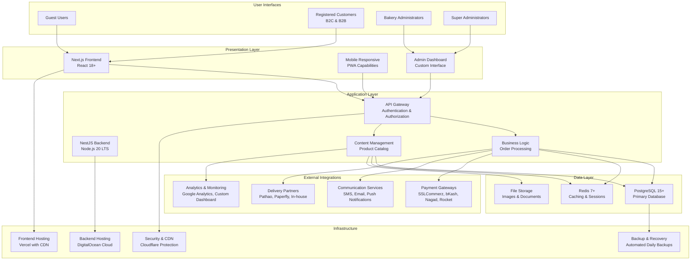

# SECTION 2.0: OVERALL DESCRIPTION

**Document Version:** 1.0  
**Date:** December 1, 2025  
**Prepared For:** Saffron Bakery & Dairy Enterprise Development Team  
**Document Status:** Final  
**Compliance:** IEEE 830-1998 Standard for Software Requirements Specifications  

---

## TABLE OF CONTENTS

2.1 [Product Perspective](#21-product-perspective)
2.2 [Product Functions](#22-product-functions)
2.3 [User Characteristics](#23-user-characteristics)
2.4 [Constraints](#24-constraints)
2.5 [Assumptions and Dependencies](#25-assumptions-and-dependencies)

---

## 2.1 PRODUCT PERSPECTIVE

### System Context and Architecture

The Saffron Bakery & Dairy Enterprise e-commerce platform is a comprehensive web-based system designed to serve the Bangladesh market with specialized bakery and dairy products. The system operates as a standalone platform with strategic integrations to external payment gateways, delivery services, and communication systems.

### System Architecture Diagram

### Technology Stack Overview

| Component | Technology | Version | Purpose |
|-----------|-------------|---------|---------|
| **Frontend Framework** | Next.js | 14+ | Server-side rendering, static generation, API routes |
| **UI Library** | React | 18+ | Component-based user interface development |
| **Backend Framework** | NestJS | Latest | Enterprise-grade Node.js application framework |
| **Database** | PostgreSQL | 15+ | Primary data storage with ACID compliance |
| **Caching** | Redis | 7+ | Session management, query caching, real-time data |
| **Frontend Hosting** | Vercel | Latest | Global CDN, serverless functions, edge deployment |
| **Backend Hosting** | DigitalOcean | Latest | Cloud infrastructure with Singapore region |
| **CDN & Security** | Cloudflare | Latest | Content delivery, DDoS protection, WAF |
| **Payment Processing** | SSLCommerz | Latest API | Primary payment gateway for Bangladesh |
| **Mobile Wallets** | bKash, Nagad, Rocket | Latest APIs | Bangladesh-specific mobile payment integration |

### System Interfaces

#### User Interfaces
- **Web Browser Interface**: Responsive web application supporting modern browsers (Chrome, Firefox, Safari, Edge)
- **Mobile Interface**: Progressive Web Application (PWA) with mobile-optimized experience
- **Administrative Interface**: Custom dashboard for content and order management

#### External System Interfaces
- **Payment Gateway APIs**: Secure integration with Bangladesh payment systems
- **SMS Gateway APIs**: Transactional SMS for order notifications and OTP
- **Email Service APIs**: Transactional and marketing email delivery
- **Delivery Partner APIs**: Real-time order tracking and fulfillment integration
- **Analytics APIs**: User behavior tracking and business intelligence

#### Internal System Interfaces
- **RESTful APIs**: Standardized API endpoints for frontend-backend communication
- **Database Interfaces**: Optimized database queries with connection pooling
- **Cache Interfaces**: Redis integration for performance optimization
- **File Storage Interfaces**: Cloud storage for product images and documents

### Relationship to Other Systems

The Saffron e-commerce platform operates as a standalone system but maintains critical interfaces with external services essential for Bangladesh market operations:

1. **Payment Ecosystem Integration**: Direct integration with Bangladesh's dominant payment methods
2. **Delivery Network Integration**: Connection to local delivery partners for order fulfillment
3. **Communication Infrastructure**: Integration with local SMS and email services
4. **Analytics Integration**: Connection to analytics platforms for business intelligence

The system is designed to be independent of existing bakery operations initially, with planned Phase 2 integration to internal ERP and inventory management systems.

---

## 2.2 PRODUCT FUNCTIONS

### Core E-Commerce Functions

#### 2.2.1 Product Catalog Management
- **Product Discovery**: Advanced search, filtering, and categorization system
- **Product Information Display**: Detailed product descriptions with bilingual content
- **Inventory Management**: Real-time stock tracking and availability status
- **Freshness Tracking**: Specialized system for bakery and dairy product freshness
- **Product Media**: High-quality images, 360-degree views, and product videos
- **Pricing Management**: Dynamic pricing with promotional capabilities
- **Product Variants**: Size, flavor, and customization options management

#### 2.2.2 Shopping Cart and Checkout
- **Cart Management**: Persistent shopping cart with synchronization across devices
- **Guest Checkout**: Streamlined checkout process without registration requirement
- **Multi-step Checkout**: Intuitive checkout flow with progress indicators
- **Address Management**: Multiple delivery addresses with validation
- **Order Summary**: Clear breakdown of costs including taxes and delivery fees
- **Payment Processing**: Secure integration with Bangladesh payment methods
- **Order Confirmation**: Immediate confirmation with detailed receipt

#### 2.2.3 User Account Management
- **Registration Process**: Simple registration with social media options
- **Profile Management**: Comprehensive user profiles with preferences
- **Order History**: Complete order history with tracking capabilities
- **Wishlist Management**: Save products for future purchases
- **Subscription Service**: Recurring order setup and management
- **Loyalty Program**: Points accumulation and redemption system
- **B2B Account Management**: Special features for business customers

#### 2.2.4 Order Processing and Fulfillment
- **Order Management**: Comprehensive order processing dashboard
- **Payment Verification**: Real-time payment confirmation and reconciliation
- **Order Routing**: Intelligent order assignment to delivery partners
- **Tracking System**: Real-time order tracking with notifications
- **Delivery Management**: Coordination with multiple delivery partners
- **Returns and Refunds**: Streamlined return and refund processing
- **Customer Communication**: Automated notifications throughout order lifecycle

### Content Management Functions

#### 2.2.5 Dynamic Content Management
- **Homepage Management**: Customizable homepage sections and banners
- **Static Pages**: Management of About Us, Contact, and informational pages
- **Blog Management**: Recipe and content blog with bilingual support
- **SEO Optimization**: Built-in SEO tools for content optimization
- **Media Library**: Centralized management of images and videos
- **Content Scheduling**: Scheduled content publication and promotions

#### 2.2.6 Marketing and Promotions
- **Coupon Management**: Creation and management of discount codes
- **Campaign Management**: Marketing campaign creation and tracking
- **Email Marketing**: Integrated email marketing capabilities
- **Social Media Integration**: Social media content sharing and integration
- **Analytics Dashboard**: Comprehensive marketing analytics and reporting

### Administrative Functions

#### 2.2.7 System Administration
- **User Management**: Comprehensive user account and role management
- **Security Management**: Access control and security configuration
- **System Configuration**: Flexible system settings and customization
- **Integration Management**: Configuration of third-party integrations
- **Performance Monitoring**: System health and performance monitoring
- **Backup Management**: Automated backup and recovery procedures

#### 2.2.8 Business Intelligence
- **Sales Analytics**: Comprehensive sales reporting and analysis
- **Customer Analytics**: Customer behavior and preference analysis
- **Product Analytics**: Product performance and popularity metrics
- **Financial Reporting**: Revenue, cost, and profitability analysis
- **Inventory Analytics**: Stock levels and turnover analysis
- **Marketing Analytics**: Campaign effectiveness and ROI analysis

### Specialized Bakery Functions

#### 2.2.9 Custom Cake Designer
- **Design Interface**: Interactive cake customization tool
- **Visual Preview**: Real-time preview of custom designs
- **Pricing Calculator**: Dynamic pricing based on customization
- **Order Integration**: Seamless integration with order system
- **Design Gallery**: Pre-designed templates and inspiration gallery

#### 2.2.10 Freshness Tracking System
- **Production Tracking**: Real-time production status monitoring
- **Freshness Indicators**: Visual indicators of product freshness
- **Expiration Management**: Automated expiration date tracking
- **Quality Control**: Quality assurance workflow integration
- **Batch Tracking**: Complete batch traceability system

---

## 2.3 USER CHARACTERISTICS

### 2.3.1 Guest Users

#### Demographic Profile
- **Age Range**: 18-55 years, with concentration 25-40
- **Technical Proficiency**: Basic to Intermediate digital literacy
- **Primary Devices**: Mobile smartphones (70%), desktop/laptop (30%)
- **Internet Access**: Primarily 4G mobile data, urban broadband
- **Geographic Distribution**: Major urban centers (Dhaka, Chittagong, Sylhet)

#### Behavioral Characteristics
- **Shopping Patterns**: Occasional purchases for special occasions
- **Decision Factors**: Price sensitivity, product quality, delivery convenience
- **Trust Requirements**: Clear product information, customer reviews
- **Payment Preferences**: Mobile wallets (bKash, Nagad), cash on delivery
- **Language Preference**: Bengali primary, English secondary

#### Goals and Motivations
- Discover quality bakery products for special occasions
- Compare prices and quality with local alternatives
- Find convenient delivery options for busy schedules
- Verify product freshness and quality before purchase
- Experience seamless online shopping without registration

#### Pain Points and Challenges
- Concerns about online food quality and freshness
- Difficulty trusting new bakery brands without physical inspection
- Limited time for shopping due to demanding work schedules
- Uncertainty about delivery timing and reliability
- Preference for seeing products before purchasing

### 2.3.2 Registered Customers (B2C)

#### Demographic Profile
- **Age Range**: 25-45 years, family-oriented
- **Technical Proficiency**: Intermediate to Advanced digital literacy
- **Primary Devices**: Mobile smartphones (60%), desktop/laptop (40%)
- **Internet Access**: High-speed broadband, 4G mobile data
- **Income Level**: Middle to upper-middle class (BDT 50,000-150,000/month)

#### Behavioral Characteristics
- **Shopping Patterns**: Regular weekly purchases, special occasion orders
- **Decision Factors**: Product quality, convenience, loyalty benefits
- **Trust Requirements**: Consistent quality, reliable delivery
- **Payment Preferences**: Multiple payment methods, saved preferences
- **Language Preference**: Bilingual comfort, context-dependent

#### Goals and Motivations
- Convenient weekly bakery shopping for family
- Ensure fresh, quality products for children
- Save time with recurring orders for regular items
- Discover new products and special offers
- Earn loyalty rewards for regular purchases

#### Pain Points and Challenges
- Limited time for physical shopping due to work and family commitments
- Concerns about product freshness when ordering online
- Difficulty managing multiple delivery addresses
- Need for reliable delivery for children's school events
- Budget management for family expenses

### 2.3.3 Business Customers (B2B)

#### Demographic Profile
- **Business Types**: Hotels, restaurants, cafes, corporate offices
- **Technical Proficiency**: Intermediate to Advanced business software literacy
- **Primary Devices**: Desktop/laptop for work, tablet for mobile operations
- **Internet Access**: High-speed business connections
- **Purchase Volume**: Regular bulk orders, high transaction values

#### Behavioral Characteristics
- **Shopping Patterns**: Scheduled bulk orders, recurring procurement
- **Decision Factors**: Product consistency, reliability, cost optimization
- **Trust Requirements**: Long-term supplier relationships, documentation
- **Payment Preferences**: Corporate credit terms, bank transfers
- **Language Preference**: Professional English, formal Bengali

#### Goals and Motivations
- Secure reliable bakery supply for business operations
- Maintain consistent quality for customer satisfaction
- Optimize procurement costs through bulk ordering
- Streamline ordering process for multiple locations
- Build supplier relationships for better service

#### Pain Points and Challenges
- Managing orders for multiple business locations
- Ensuring consistent quality across all deliveries
- Coordinating delivery schedules with business operations
- Managing invoices and payment terms
- Finding suppliers who understand business needs

### 2.3.4 Bakery Administrators

#### Demographic Profile
- **Role Types**: Content managers, marketing coordinators, order processors
- **Technical Proficiency**: Advanced digital literacy, marketing technology expertise
- **Primary Devices**: Laptop for content creation, smartphone for quick updates
- **Internet Access**: High-speed connection at office and home
- **Experience Level**: 2-5 years in digital marketing/content management

#### Behavioral Characteristics
- **Work Patterns**: Daily content updates, campaign management
- **Decision Factors**: Brand consistency, customer engagement
- **Tool Requirements**: User-friendly CMS, analytics capabilities
- **Collaboration Needs**: Cross-functional coordination
- **Language Requirements**: Bilingual content creation capabilities

#### Goals and Motivations
- Create engaging content that drives sales
- Ensure product information is accurate and up-to-date
- Develop promotional campaigns that increase customer engagement
- Maintain brand consistency across all digital touchpoints
- Optimize website performance for better conversion rates

#### Pain Points and Challenges
- Managing content in both Bengali and English
- Keeping product information synchronized with inventory
- Creating content that appeals to diverse customer segments
- Coordinating with multiple departments for content approval
- Balancing promotional content with brand storytelling

### 2.3.5 Super Administrators

#### Demographic Profile
- **Role Types**: System owners, IT managers, technical directors
- **Technical Proficiency**: Expert-level technical knowledge
- **Primary Devices**: High-performance workstations for technical tasks
- **Internet Access**: Multiple redundant connections
- **Experience Level**: 5+ years in system administration/technical management

#### Behavioral Characteristics
- **Work Patterns**: Strategic planning, system maintenance, troubleshooting
- **Decision Factors**: System reliability, security, scalability
- **Tool Requirements**: Comprehensive admin dashboard, monitoring tools
- **Risk Management**: Proactive system monitoring and maintenance
- **Technical Oversight**: Full system architecture responsibility

#### Goals and Motivations
- Ensure system reliability and security for business operations
- Optimize website performance for better user experience
- Implement new technologies to improve business efficiency
- Maintain data integrity and compliance with regulations
- Scale systems to support business growth

#### Pain Points and Challenges
- Balancing system security with user convenience
- Managing technical debt while implementing new features
- Ensuring system uptime during maintenance and updates
- Coordinating with multiple vendors and service providers
- Keeping up with evolving technology and security threats

---

## 2.4 CONSTRAINTS

### 2.4.1 Technical Constraints

#### Performance Constraints
- **Response Time Requirements**: 
  - Page load time: <2 seconds on 4G connection
  - API response time: <200ms for 95th percentile
  - Database query response: <50ms average
  - Checkout process completion: <3 seconds total
- **Scalability Requirements**:
  - Support 10,000 concurrent users
  - Handle 1,000 orders per hour at peak
  - Support 100,000 products in catalog
  - Database capacity for 1 million customer records
- **Mobile Optimization**:
  - Touch-optimized interface elements (minimum 44x44px)
  - Progressive Web App implementation
  - Offline functionality for basic features
  - Performance budget: <3MB total page weight

#### Technology Stack Constraints
- **Frontend Technology**: Next.js 14+ with React 18+ (mandatory)
- **Backend Technology**: Node.js 20 LTS with NestJS framework (mandatory)
- **Database Technology**: PostgreSQL 15+ with Redis 7+ caching (mandatory)
- **Hosting Infrastructure**: Vercel (frontend) + DigitalOcean (backend)
- **CDN Requirements**: Cloudflare with Bangladesh presence
- **Browser Support**: Modern browsers (Chrome 90+, Firefox 88+, Safari 14+, Edge 90+)

#### Integration Constraints
- **Payment Gateway Requirements**:
  - SSLCommerz primary integration (mandatory)
  - bKash mobile wallet support (mandatory)
  - Nagad mobile wallet support (mandatory)
  - Rocket mobile banking support (mandatory)
  - PCI DSS compliance for payment processing
- **Communication Service Requirements**:
  - SMS gateway integration for OTP and notifications
  - Email service integration for transactional emails
  - Push notification capability for PWA
- **Delivery Partner Integration**:
  - Real-time tracking API integration
  - Multiple delivery partner support
  - In-house delivery management capability

### 2.4.2 Business Constraints

#### Budget Constraints
- **Development Budget**: BDT 31 lakh (approximately USD 36,500) total
- **Infrastructure Costs**: Monthly hosting and service fees must remain within operational budget
- **Marketing Budget**: Digital marketing expenses aligned with customer acquisition costs
- **Maintenance Costs**: Ongoing maintenance and support within 15% of development budget annually
- **ROI Requirements**: System must generate positive ROI within 18 months of launch

#### Timeline Constraints
- **Development Timeline**: 9-month total development schedule
- **Phase 1 Launch**: Minimum viable product within 6 months
- **Feature Complete**: Full feature set within 9 months
- **Market Entry**: Launch before major festival season (Eid)
- **Scaling Timeline**: System ready for 5x traffic growth in Year 1

#### Resource Constraints
- **Development Team**: Limited team size with specific skill requirements
- **Content Creation**: Limited resources for bilingual content development
- **Customer Support**: Limited customer service team capacity
- **Technical Expertise**: Bangladesh-specific payment integration expertise
- **Training Requirements**: Staff training for new systems and processes

### 2.4.3 Regulatory Constraints

#### E-Commerce Regulations
- **Bangladesh E-Commerce Act 2023 Compliance**:
  - Business registration certificate display
  - Trade license information prominently shown
  - Clear return and refund policy
  - Terms of service agreement
  - Privacy policy implementation
  - Consumer protection compliance
- **Digital Commerce Policy Compliance**:
  - Digital signature capability for contracts
  - Transaction record retention requirements
  - Consumer dispute resolution procedures
  - Transparent pricing and terms

#### Payment Processing Regulations
- **Bangladesh Bank Requirements**:
  - Payment processing approval and licensing
  - Anti-money laundering compliance
  - Transaction record retention (minimum 7 years)
  - Currency display regulations (BDT)
  - Tax calculation and collection compliance
- **Mobile Financial Service Regulations**:
  - bKash merchant compliance requirements
  - Nagad service agreement compliance
  - Rocket banking integration compliance
  - Mobile wallet transaction limits
  - OTP verification requirements

#### Data Protection and Privacy
- **Data Protection Requirements**:
  - User consent for data collection
  - Data minimization principles
  - Purpose limitation for data usage
  - Data security and encryption
  - Right to access personal data
  - Right to data deletion
  - Data breach notification procedures
- **International Standards Alignment**:
  - GDPR principles implementation
  - Data portability provisions
  - Clear privacy notices
  - Cookie consent management
  - Privacy by design principles

### 2.4.4 Cultural Constraints

#### Religious and Cultural Requirements
- **Halal Compliance**:
  - All products must be halal-certified
  - Production process must follow halal guidelines
  - Ingredient sourcing must be halal-compliant
  - Storage and handling must maintain halal integrity
  - Clear halal certification display on products
  - Staff training on halal handling procedures
- **Cultural Sensitivity**:
  - Respect for Islamic values in content and imagery
  - Bengali language and cultural references
  - Festival-appropriate content and promotions
  - Gender-sensitive marketing approaches
  - Family-oriented messaging
  - Religious holiday observances in operations

#### Language and Communication Constraints
- **Bilingual Support Requirements**:
  - Bengali (primary language) implementation
  - English (secondary language) support
  - Easy language switching with preference persistence
  - All UI elements translated
  - All content translated (products, pages, emails)
  - Bengali typography support (Unicode)
  - Bengali number formats
- **Communication Style**:
  - Formal address with proper honorifics
  - Cultural references in marketing content
  - Visual preferences for Bangladeshi aesthetics
  - Social norms consideration in content

### 2.4.5 Infrastructure Constraints

#### Bangladesh Internet Infrastructure
- **Network Optimization Requirements**:
  - Optimization for 3G/4G mobile networks
  - Low-bandwidth compatibility (minimum 2Mbps)
  - Progressive loading for slow connections
  - Compressed images and assets
  - Minimal JavaScript for core functionality
- **Device Compatibility**:
  - Optimization for budget Android devices
  - Compatibility with older browser versions
  - Touch-friendly interface design
  - Limited memory and storage considerations
  - Battery usage optimization
  - Variable screen size support

#### Geographic Constraints
- **Delivery Coverage Limitations**:
  - Initial focus on major urban centers
  - Limited rural delivery capability
  - Delivery time variations by region
  - Infrastructure limitations in remote areas
- **Regional Considerations**:
  - Dhaka metropolitan area priority
  - Major divisional cities secondary
  - Rural areas limited service
  - International delivery out of scope

---

## 2.5 ASSUMPTIONS AND DEPENDENCIES

### 2.5.1 Technical Assumptions

#### Infrastructure Assumptions
- **Cloud Hosting Reliability**:
  - Vercel will maintain 99.99% uptime for frontend hosting
  - DigitalOcean will provide stable backend infrastructure
  - Singapore datacenter will provide optimal latency to Bangladesh
  - CDN (Cloudflare) will ensure fast content delivery across Bangladesh
  - **Impact**: High - Critical for performance requirements
  - **Mitigation**: Multi-region deployment if latency issues arise

- **Internet Infrastructure Capability**:
  - Bangladesh's 3G/4G mobile networks will support application requirements
  - Broadband infrastructure in urban areas will support desktop users
  - Network reliability will improve over the project timeline
  - Mobile data costs will remain reasonable for target users
  - **Impact**: Medium - Affects performance optimization strategy
  - **Mitigation**: Progressive Web App for offline functionality, data optimization

- **Device Capability Assumptions**:
  - 90% of target users have devices capable of running modern browsers
  - Average smartphone will have sufficient memory for application performance
  - Desktop users will have reasonably modern hardware
  - Touch interfaces will be standard on target devices
  - **Impact**: Medium - Influences feature complexity and design approach
  - **Mitigation**: Graceful degradation for older devices, progressive enhancement

#### Technology Stack Assumptions
- **Framework Stability and Support**:
  - Next.js 14+ will maintain LTS support throughout project lifecycle
  - NestJS framework will continue active development and support
  - PostgreSQL 15+ will receive security updates and performance improvements
  - Redis will maintain performance characteristics and reliability
  - **Impact**: High - Core to system architecture and long-term maintenance
  - **Mitigation**: Regular technology reviews and migration planning

- **Third-Party Service Reliability**:
  - Payment gateways (bKash, Nagad, Rocket) will maintain stable APIs
  - SMS gateway (SSL Wireless) will deliver messages consistently
  - Email service (SendGrid) will maintain high deliverability rates
  - Google services will remain accessible and stable in Bangladesh
  - **Impact**: High - Critical for business operations and customer experience
  - **Mitigation**: Multiple provider options where possible, service level agreements

- **Database Performance Assumptions**:
  - PostgreSQL configuration will handle 10,000 concurrent users efficiently
  - Query optimization will maintain sub-50ms response times under load
  - Caching strategy will effectively reduce database load
  - Connection pooling will manage high request volumes without degradation
  - **Impact**: High - Directly affects scalability and user experience
  - **Mitigation**: Regular performance monitoring and optimization, capacity planning

### 2.5.2 Business Dependencies

#### External Service Dependencies
- **Payment Gateway Providers**:
  - SSLCommerz approval and integration for comprehensive payment processing
  - bKash merchant account approval and API access (70% market share)
  - Nagad service agreement and technical integration
  - Rocket banking integration approval and API access
  - **Criticality**: Critical - No revenue without payment processing
  - **Risk Factors**: API changes, service downtime, policy updates, approval delays
  - **Contingency**: Multiple payment options, manual processing fallback, pre-application

- **Communication Services**:
  - SSL Wireless for SMS notifications and OTP delivery
  - SendGrid for email communications with high deliverability
  - WhatsApp Business API for customer support integration
  - Facebook Messenger for social customer service
  - **Criticality**: High - Essential for customer experience and transaction completion
  - **Risk Factors**: Service reliability, rate changes, delivery failures, regulatory changes
  - **Contingency**: Multiple providers, in-app notifications, service level agreements

- **Delivery Partners**:
  - Pathao partnership for same-day delivery in Dhaka
  - Paperfly agreement for scheduled deliveries
  - In-house delivery team development for premium service
  - Bangladesh Post partnership for rural deliveries
  - **Criticality**: High - Essential for order fulfillment and customer satisfaction
  - **Risk Factors**: Service availability, rate changes, coverage limitations, quality issues
  - **Contingency**: Multiple delivery partners, in-house capability, service level agreements

#### Infrastructure Dependencies
- **Cloud Services**:
  - Vercel for frontend hosting and CDN services
  - DigitalOcean for backend infrastructure and database hosting
  - Cloudflare for DDoS protection and CDN optimization
  - AWS S3/DigitalOcean Spaces for file storage and backup
  - **Criticality**: High - Foundation of technical infrastructure
  - **Risk Factors**: Service changes, pricing increases, regional restrictions, outages
  - **Contingency**: Multi-cloud strategy, local hosting options, backup providers

- **Domain and DNS Services**:
  - Domain registrar for .com and .com.bd domains
  - DNS management with failover capability
  - SSL certificate management and renewal
  - Email configuration (MX records, SPF, DKIM)
  - **Criticality**: Medium - Essential for service availability and professional appearance
  - **Risk Factors**: Domain expiration, DNS attacks, certificate issues, configuration errors
  - **Contingency**: Multiple DNS providers, automated renewal, monitoring services

### 2.5.3 Content Dependencies

#### Content Creation Resources
- **Professional Content Development**:
  - Professional photography services for product images
  - Bengali translation services for cultural adaptation
  - Content writers for blog and recipe content
  - Video production for farm and process storytelling
  - **Criticality**: Medium - Essential for user engagement and conversion
  - **Risk Factors**: Quality consistency, timeline delays, budget constraints
  - **Contingency**: In-house content team, user-generated content, simplified content strategy

#### Product Information Management
- **Accurate Product Data**:
  - Daily inventory updates from bakery operations
  - Freshness tracking data from production system
  - Nutritional information from quality control processes
  - Pricing information from finance team
  - **Criticality**: High - Core to business value proposition and customer trust
  - **Risk Factors**: Data accuracy, system integration, update frequency
  - **Contingency**: Manual data entry, simplified product information, regular audits

### 2.5.4 Bangladesh-Specific Dependencies

#### Market Environment Dependencies
- **Economic Factors**:
  - Stable BDT exchange rate for pricing consistency
  - Consumer purchasing power maintenance
  - Inflation rate remaining within manageable levels
  - Disposable income trends in target demographics
  - **Impact**: High - Affects pricing strategy and business model
  - **Mitigation**: Flexible pricing strategy, cost optimization, value proposition focus

- **Competitive Landscape**:
  - Existing bakery e-commerce platforms maintaining current market position
  - New market entrants following similar business models
  - Traditional bakeries maintaining physical presence
  - International platforms not entering Bangladesh market aggressively
  - **Impact**: Medium - Affects market positioning and differentiation strategy
  - **Mitigation**: Strong differentiation, local focus, quality emphasis

#### Regulatory Environment Dependencies
- **Government Policy Stability**:
  - E-commerce regulations remaining supportive
  - Digital economy policies encouraging growth
  - Payment processing regulations enabling innovation
  - Tax policies favorable to digital businesses
  - **Impact**: High - Essential for business viability
  - **Mitigation**: Legal compliance monitoring, industry association participation

- **Bangladesh Bank Policies**:
  - Supportive mobile financial services regulations
  - Reasonable transaction limits for business needs
  - Efficient approval processes for payment integrations
  - Stable foreign exchange policies for international components
  - **Impact**: High - Critical for payment processing
  - **Mitigation**: Early engagement, compliance focus, multiple payment options

### 2.5.5 Operational Dependencies

#### Human Resources Dependencies
- **Technical Team Availability**:
  - Skilled developers available for project timeline
  - Bangladesh-specific payment integration expertise
  - Bilingual content development capabilities
  - System administration and maintenance resources
  - **Impact**: High - Essential for project execution
  - **Mitigation**: Skills assessment, training plans, resource allocation

- **Customer Service Resources**:
  - Trained customer service team for launch
  - Bengali and English language support capability
  - Technical support for website issues
  - Order management and fulfillment team
  - **Impact**: Medium - Affects customer satisfaction
  - **Mitigation**: Training programs, staffing plans, outsourcing options

#### Supply Chain Dependencies
- **Production Capacity**:
  - Bakery production capacity meeting online demand
  - Quality control processes for online orders
  - Packaging capabilities for delivery
  - Freshness management for delivery timeline
  - **Impact**: High - Core to product quality and customer satisfaction
  - **Mitigation**: Capacity planning, process optimization, quality systems

- **Ingredient Supply**:
  - Reliable ingredient suppliers for increased production
  - Halal-certified ingredient sources
  - Quality assurance for all ingredients
  - Cost management for ingredient procurement
  - **Impact**: Medium - Affects product quality and profitability
  - **Mitigation**: Supplier relationships, quality standards, cost optimization

---

**Document Control Information**

| Version | Date | Author | Changes | Review Status |
|----------|--------|---------|-----------|----------------|
| 1.0 | December 1, 2025 | Documentation Team | Initial creation of Section 2 | Approved |

---

*End of Section 2: Overall Description*