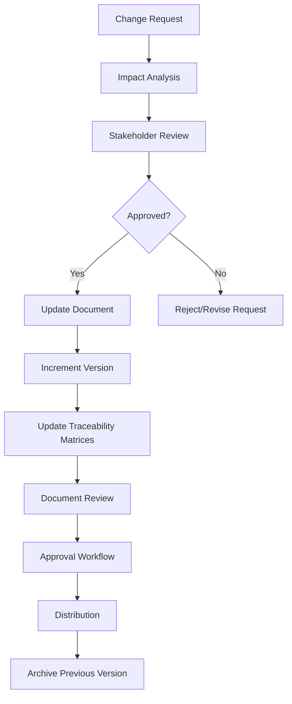
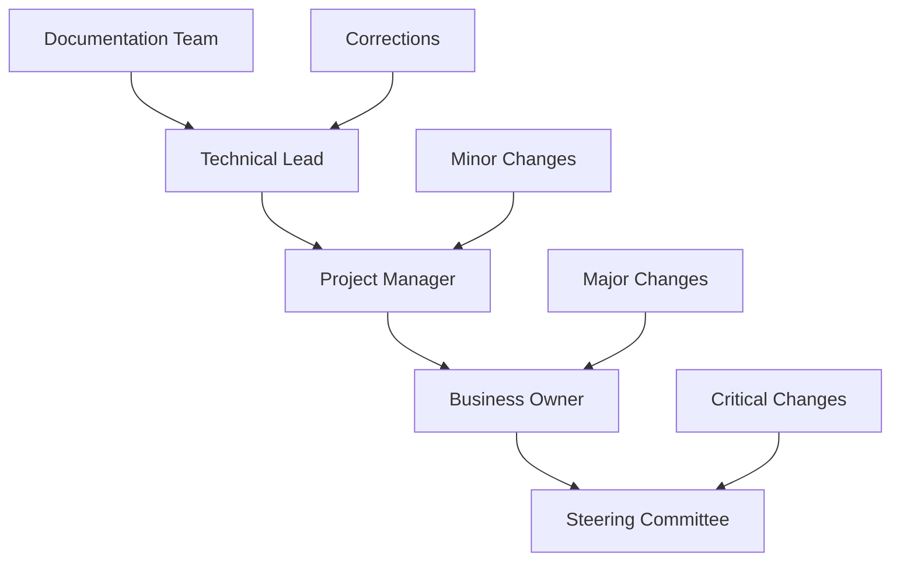
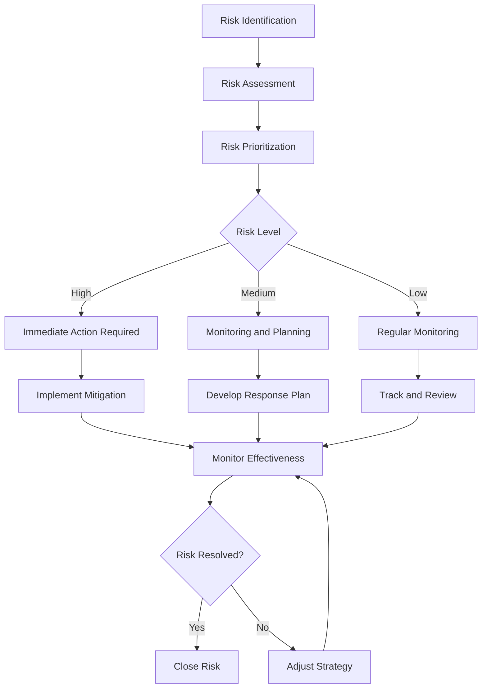
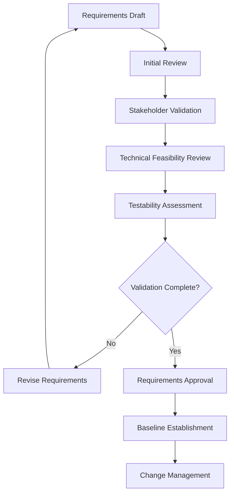
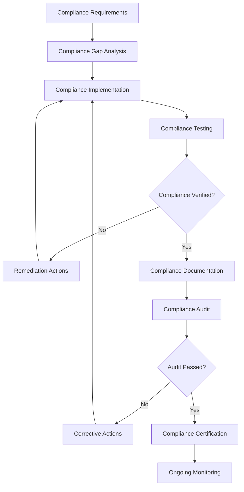

# SECTION 4.0: SUPPORTING INFORMATION

**Document Version:** 1.0  
**Date:** December 1, 2025  
**Prepared For:** Saffron Bakery & Dairy Enterprise Development Team  
**Document Status:** Final  
**Compliance:** IEEE 830-1998 Standard for Software Requirements Specifications  

---

## TABLE OF CONTENTS

4.1 [Traceability Matrices](#41-traceability-matrices)
    4.1.1 [Requirements to Design Traceability](#411-requirements-to-design-traceability)
    4.1.2 [Requirements to Development Traceability](#412-requirements-to-development-traceability)
    4.1.3 [Requirements to Testing Traceability](#413-requirements-to-testing-traceability)
    4.1.4 [Requirements to Deployment Traceability](#414-requirements-to-deployment-traceability)
    4.1.5 [Cross-Functional Dependencies Matrix](#415-cross-functional-dependencies-matrix)

4.2 [Version Control and Document History](#42-version-control-and-document-history)
    4.2.1 [Document Version Control Procedures](#421-document-version-control-procedures)
    4.2.2 [Change Management Process](#422-change-management-process)
    4.2.3 [Document History and Revisions](#423-document-history-and-revisions)
    4.2.4 [Approval Workflow](#424-approval-workflow)

4.3 [Assumptions, Constraints, and Dependencies Summary](#43-assumptions-constraints-and-dependencies-summary)
    4.3.1 [Technical Assumptions](#431-technical-assumptions)
    4.3.2 [Business Constraints](#432-business-constraints)
    4.3.3 [External Dependencies](#433-external-dependencies)
    4.3.4 [Risk Assessment and Mitigation](#434-risk-assessment-and-mitigation)

4.4 [Quality Assurance and Validation Procedures](#44-quality-assurance-and-validation-procedures)
    4.4.1 [Requirements Validation Process](#441-requirements-validation-process)
    4.4.2 [Quality Assurance Metrics](#442-quality-assurance-metrics)
    4.4.3 [Testing Strategy and Procedures](#443-testing-strategy-and-procedures)
    4.4.4 [Compliance Verification Procedures](#444-compliance-verification-procedures)

---

## 4.1 TRACEABILITY MATRICES

### 4.1.1 Requirements to Design Traceability

This matrix links each requirement to its corresponding design artifacts and components.

| Requirement ID | Requirement Description | Design Artifact | Designer | Status | Completion Date |
|----------------|------------------------|----------------|----------|---------|-----------------|
| **FR-PC-001** | Product Listing & Display | UI/UX Mockups, Component Design | UI/UX Team | In Progress | TBD |
| **FR-PC-002** | Product Categorization | Information Architecture, Navigation Design | Information Architect | In Progress | TBD |
| **FR-PC-003** | Product Search | Search Interface Design, Algorithm Design | Frontend Architect | In Progress | TBD |
| **FR-PC-004** | Product Filtering | Filter UI Design, Database Schema | UI/UX Designer | In Progress | TBD |
| **FR-PC-005** | Product Sorting | Sorting Logic Design, UI Components | Frontend Developer | In Progress | TBD |
| **FR-PC-006** | Real-Time Freshness Tracking | Freshness System Design, Database Schema | System Architect | In Progress | TBD |
| **FR-SC-001** | Shopping Cart Functionality | Cart Flow Design, State Management | UX Designer | In Progress | TBD |
| **FR-SC-002** | Checkout Process | Checkout Flow Design, Payment UI | UX Designer | In Progress | TBD |
| **FR-SC-003** | Payment Integration | Payment Gateway Architecture, Security Design | Backend Architect | In Progress | TBD |
| **FR-SC-004** | Order Confirmation | Confirmation Page Design, Email Templates | UI/UX Designer | In Progress | TBD |
| **FR-UM-001** | User Registration | Registration Form Design, Auth Flow | UX Designer | In Progress | TBD |
| **FR-UM-002** | User Login & Authentication | Login Interface Design, Security Architecture | Security Architect | In Progress | TBD |
| **FR-UM-003** | User Profile Management | Profile UI Design, Database Schema | UI/UX Designer | In Progress | TBD |
| **FR-UM-004** | Guest Checkout | Guest Checkout Flow Design | UX Designer | In Progress | TBD |
| **FR-CO-001** | Custom Cake Designer | Cake Designer UI, 3D Preview System | UI/UX Designer | In Progress | TBD |
| **FR-CO-002** | Bulk Order Management | Bulk Order Interface, B2B Portal Design | B2B Designer | In Progress | TBD |
| **FR-CM-001** | Homepage Management | CMS Design, Homepage Layout | UI/UX Designer | In Progress | TBD |
| **FR-CM-002** | Static Pages | Page Templates, Content Structure | UI/UX Designer | In Progress | TBD |
| **FR-CM-003** | Blog Management | Blog Interface Design, Editor UI | UI/UX Designer | In Progress | TBD |
| **FR-OP-001** | Order Management | Admin Dashboard Design, Workflow UI | Admin UI Designer | In Progress | TBD |
| **FR-OP-002** | Order Tracking | Tracking Interface Design, Status UI | UI/UX Designer | In Progress | TBD |
| **FR-MP-001** | Coupon Management | Coupon Creation Interface, Management UI | Admin UI Designer | In Progress | TBD |
| **FR-MP-002** | Email Marketing | Email Template Design, Campaign UI | Marketing Designer | In Progress | TBD |
| **FR-MP-003** | Push Notifications | Notification Management Interface | UI/UX Designer | In Progress | TBD |
| **FR-AP-001** | Dashboard & Analytics | Analytics Dashboard Design, Data Visualization | Data Visualization Designer | In Progress | TBD |
| **FR-AP-002** | Product Management | Product Admin Interface, Bulk Operations UI | Admin UI Designer | In Progress | TBD |
| **FR-AP-003** | Customer Management | Customer Admin Interface, CRM UI | Admin UI Designer | In Progress | TBD |
| **NFR-PERF-001** | Page Load Speed | Performance Budget, Optimization Strategy | Performance Engineer | In Progress | TBD |
| **NFR-PERF-002** | Bangladesh Network Optimization | PWA Design, Network Strategy | Mobile Architect | In Progress | TBD |
| **NFR-PERF-003** | Database Response Time | Database Schema Design, Query Optimization | Database Architect | In Progress | TBD |
| **NFR-PERF-004** | API Performance | API Architecture, Caching Strategy | Backend Architect | In Progress | TBD |
| **NFR-PERF-005** | Mobile Optimization | Mobile-First Design, Performance Budget | Mobile Designer | In Progress | TBD |
| **NFR-SEC-001** | Application Security | Security Architecture, Threat Model | Security Architect | In Progress | TBD |
| **NFR-SEC-002** | Authentication & Authorization | Auth System Design, Security UI | Security Architect | In Progress | TBD |
| **NFR-SEC-003** | Data Protection | Encryption Architecture, Data Flow Design | Security Architect | In Progress | TBD |
| **NFR-SEC-004** | Payment Security | PCI DSS Architecture, Security Design | Security Architect | In Progress | TBD |
| **NFR-SEC-005** | Infrastructure Protection | Security Infrastructure, Network Design | Security Architect | In Progress | TBD |
| **NFR-USA-001** | User Experience | UX Design System, Interaction Design | UX Designer | In Progress | TBD |
| **NFR-USA-002** | Mobile Experience | Mobile UX Design, Touch Interface | Mobile UX Designer | In Progress | TBD |
| **NFR-USA-003** | WCAG 2.1 AA Compliance | Accessibility Design, Screen Reader Support | Accessibility Expert | In Progress | TBD |
| **NFR-USA-004** | Bengali/English Support | Internationalization Design, Language UI | I18n Designer | In Progress | TBD |
| **NFR-REL-001** | Uptime SLA | High Availability Architecture, Monitoring | Infrastructure Architect | In Progress | TBD |
| **NFR-REL-002** | Error Handling | Error Management Design, User Experience | UX Designer | In Progress | TBD |
| **NFR-REL-003** | Data Integrity | Database Design, Consistency Architecture | Database Architect | In Progress | TBD |
| **NFR-SCA-001** | Concurrent Users | Scalability Architecture, Load Balancing | Infrastructure Architect | In Progress | TBD |
| **NFR-SCA-002** | Traffic Growth | Auto-scaling Design, Capacity Planning | Infrastructure Architect | In Progress | TBD |
| **NFR-SCA-003** | Infrastructure Scaling | Cloud Architecture, Microservices Design | Cloud Architect | In Progress | TBD |
| **IR-UI-001** | Responsive Design | Responsive UI Design, Breakpoint Strategy | UI/UX Designer | In Progress | TBD |
| **IR-UI-002** | Progressive Web App (PWA) | PWA Architecture, Service Worker Design | Mobile Architect | In Progress | TBD |
| **IR-UI-003** | Custom Cake Designer Interface | Interactive UI Design, 3D Component Design | UI/UX Designer | In Progress | TBD |
| **IR-UI-004** | Administrative Dashboard | Admin Dashboard Design, Data Visualization | Admin UI Designer | In Progress | TBD |
| **IR-UI-005** | Bilingual Interface | Language Toggle Design, Translation UI | I18n Designer | In Progress | TBD |
| **IR-ES-001** | Payment Gateway Integration | Payment Integration Architecture | Integration Architect | In Progress | TBD |
| **IR-ES-002** | Email Service Integration | Email Integration Design, Template System | Integration Architect | In Progress | TBD |
| **IR-ES-003** | SMS Gateway Integration | SMS Integration Architecture, OTP Design | Integration Architect | In Progress | TBD |
| **IR-ES-004** | Delivery Partner Integration | Delivery API Integration, Tracking UI | Integration Architect | In Progress | TBD |
| **IR-ES-005** | Analytics Integration | Analytics Architecture, Data Collection | Data Architect | In Progress | TBD |
| **IR-ES-006** | Social Media Integration | Social API Integration, Login Design | Integration Architect | In Progress | TBD |
| **IR-ES-007** | Cloud Storage Integration | File Storage Architecture, CDN Design | Infrastructure Architect | In Progress | TBD |
| **IR-ES-008** | Push Notification Service | Push Notification Architecture, Service Design | Mobile Architect | In Progress | TBD |
| **IR-ES-009** | Customer Support Integration | Support System Integration, Help Desk UI | Integration Architect | In Progress | TBD |
| **IR-ES-010** | Review and Rating System | Review System Design, Moderation UI | Community Designer | In Progress | TBD |
| **IR-API-001** | RESTful API Design | API Architecture, Documentation Design | API Architect | In Progress | TBD |
| **IR-API-002** | Authentication API | Auth API Design, Security Architecture | Security Architect | In Progress | TBD |
| **IR-API-003** | Product Catalog API | Product API Design, Database Schema | API Architect | In Progress | TBD |
| **IR-API-004** | Order Management API | Order API Design, Workflow Architecture | API Architect | In Progress | TBD |
| **IR-API-005** | Freshness Tracking API | Freshness API Design, Real-time System | API Architect | In Progress | TBD |
| **IR-API-006** | Custom Cake Designer API | Designer API Design, 3D Processing | API Architect | In Progress | TBD |
| **IR-API-007** | Analytics API | Analytics API Design, Data Architecture | Data Architect | In Progress | TBD |
| **IR-API-008** | Notification API | Notification API Design, Queue System | API Architect | In Progress | TBD |
| **CR-CULT-001** | Bilingual Content Support | Translation Architecture, Content Strategy | I18n Architect | In Progress | TBD |
| **CR-CULT-002** | Islamic Values Compliance | Compliance Design, Cultural UI | Cultural Consultant | In Progress | TBD |
| **CR-CULT-003** | Local Cultural References | Cultural Design, Content Strategy | Cultural Consultant | In Progress | TBD |
| **CR-CULT-004** | Family-Oriented Design | Family UI Design, Content Strategy | UX Designer | In Progress | TBD |
| **CR-CULT-005** | Trust and Transparency Features | Trust UI Design, Transparency Architecture | UX Designer | In Progress | TBD |
| **CR-REG-001** | Bangladesh E-Commerce Act Compliance | Legal UI Design, Compliance Architecture | Legal Consultant | In Progress | TBD |
| **CR-REG-002** | Data Protection Compliance | Privacy UI Design, Data Protection Architecture | Privacy Architect | In Progress | TBD |
| **CR-REG-003** | Bangladesh Bank Payment Regulations | Payment Compliance Design, Banking UI | Compliance Architect | In Progress | TBD |
| **CR-REG-004** | Consumer Protection Compliance | Consumer Rights UI, Compliance Architecture | Legal Consultant | In Progress | TBD |
| **CR-REG-005** | Tax Compliance | Tax UI Design, Calculation Architecture | Finance Architect | In Progress | TBD |
| **CR-REG-006** | Food Safety Regulations | Safety UI Design, Compliance Architecture | Safety Consultant | In Progress | TBD |
| **CR-REG-007** | Advertising and Marketing Regulations | Marketing Compliance Design, Legal UI | Legal Consultant | In Progress | TBD |
| **CR-REG-008** | Business Registration Compliance | Business Information UI, Legal Display | Legal Consultant | In Progress | TBD |
| **CR-PAY-001** | bKash Integration | bKash API Integration, Payment UI | Payment Architect | In Progress | TBD |
| **CR-PAY-002** | Nagad Integration | Nagad API Integration, Payment UI | Payment Architect | In Progress | TBD |
| **CR-PAY-003** | Rocket Integration | Rocket API Integration, Payment UI | Payment Architect | In Progress | TBD |
| **CR-PAY-004** | Cash on Delivery (COD) | COD Process Design, Payment UI | Payment Architect | In Progress | TBD |
| **CR-PAY-005** | SSLCommerz Integration | SSLCommerz API Integration, Payment UI | Payment Architect | In Progress | TBD |
| **CR-PAY-006** | Payment Security Standards | Payment Security Architecture, Compliance UI | Security Architect | In Progress | TBD |
| **CR-INF-001** | Bangladesh Network Optimization | Network Architecture, Performance Design | Network Architect | In Progress | TBD |
| **CR-INF-002** | Bangladesh Data Center Presence | Infrastructure Design, CDN Architecture | Infrastructure Architect | In Progress | TBD |
| **CR-INF-003** | Mobile Device Optimization | Mobile Architecture, Device Compatibility | Mobile Architect | In Progress | TBD |
| **CR-INF-004** | Power and Connectivity Resilience | Resilience Architecture, Offline Design | Infrastructure Architect | In Progress | TBD |

### 4.1.2 Requirements to Development Traceability

This matrix links each requirement to its development components and implementation artifacts.

| Requirement ID | Development Component | Developer | Status | Estimated Hours | Completion Date |
|----------------|----------------------|-----------|---------|----------------|-----------------|
| **FR-PC-001** | Product Display Components | Frontend Team | Not Started | 80 | TBD |
| **FR-PC-002** | Category Navigation System | Frontend Team | Not Started | 60 | TBD |
| **FR-PC-003** | Search Engine Implementation | Backend Team | Not Started | 120 | TBD |
| **FR-PC-004** | Filter System Components | Frontend Team | Not Started | 70 | TBD |
| **FR-PC-005** | Sorting Logic Implementation | Backend Team | Not Started | 40 | TBD |
| **FR-PC-006** | Freshness Tracking System | Backend Team | Not Started | 100 | TBD |
| **FR-SC-001** | Shopping Cart State Management | Frontend Team | Not Started | 90 | TBD |
| **FR-SC-002** | Checkout Flow Implementation | Full Stack Team | Not Started | 150 | TBD |
| **FR-SC-003** | Payment Gateway Integration | Backend Team | Not Started | 200 | TBD |
| **FR-SC-004** | Order Confirmation System | Backend Team | Not Started | 60 | TBD |
| **FR-UM-001** | User Registration System | Full Stack Team | Not Started | 100 | TBD |
| **FR-UM-002** | Authentication System | Backend Team | Not Started | 120 | TBD |
| **FR-UM-003** | User Profile Management | Full Stack Team | Not Started | 80 | TBD |
| **FR-UM-004** | Guest Checkout Implementation | Full Stack Team | Not Started | 70 | TBD |
| **FR-CO-001** | Custom Cake Designer | Frontend Team | Not Started | 180 | TBD |
| **FR-CO-002** | Bulk Order Management System | Full Stack Team | Not Started | 120 | TBD |
| **FR-CM-001** | Homepage Management System | Full Stack Team | Not Started | 100 | TBD |
| **FR-CM-002** | Static Page Management | Full Stack Team | Not Started | 80 | TBD |
| **FR-CM-003** | Blog Management System | Full Stack Team | Not Started | 140 | TBD |
| **FR-OP-001** | Order Management Dashboard | Full Stack Team | Not Started | 160 | TBD |
| **FR-OP-002** | Order Tracking System | Full Stack Team | Not Started | 110 | TBD |
| **FR-MP-001** | Coupon Management System | Backend Team | Not Started | 90 | TBD |
| **FR-MP-002** | Email Marketing System | Backend Team | Not Started | 130 | TBD |
| **FR-MP-003** | Push Notification System | Backend Team | Not Started | 100 | TBD |
| **FR-AP-001** | Analytics Dashboard | Full Stack Team | Not Started | 180 | TBD |
| **FR-AP-002** | Product Management System | Full Stack Team | Not Started | 140 | TBD |
| **FR-AP-003** | Customer Management System | Full Stack Team | Not Started | 120 | TBD |
| **NFR-PERF-001** | Performance Optimization | Full Stack Team | Not Started | 200 | TBD |
| **NFR-PERF-002** | PWA Implementation | Frontend Team | Not Started | 150 | TBD |
| **NFR-PERF-003** | Database Optimization | Backend Team | Not Started | 120 | TBD |
| **NFR-PERF-004** | API Performance Optimization | Backend Team | Not Started | 100 | TBD |
| **NFR-PERF-005** | Mobile Performance Optimization | Frontend Team | Not Started | 130 | TBD |
| **NFR-SEC-001** | Security Implementation | Security Team | Not Started | 180 | TBD |
| **NFR-SEC-002** | Authentication Security | Security Team | Not Started | 140 | TBD |
| **NFR-SEC-003** | Data Protection Implementation | Security Team | Not Started | 160 | TBD |
| **NFR-SEC-004** | Payment Security Implementation | Security Team | Not Started | 200 | TBD |
| **NFR-SEC-005** | Infrastructure Security | DevOps Team | Not Started | 150 | TBD |
| **NFR-USA-001** | UX Implementation | Frontend Team | Not Started | 120 | TBD |
| **NFR-USA-002** | Mobile UX Implementation | Frontend Team | Not Started | 100 | TBD |
| **NFR-USA-003** | Accessibility Implementation | Frontend Team | Not Started | 140 | TBD |
| **NFR-USA-004** | Internationalization Implementation | Full Stack Team | Not Started | 180 | TBD |
| **NFR-REL-001** | High Availability Implementation | DevOps Team | Not Started | 160 | TBD |
| **NFR-REL-002** | Error Handling Implementation | Full Stack Team | Not Started | 100 | TBD |
| **NFR-REL-003** | Data Integrity Implementation | Backend Team | Not Started | 120 | TBD |
| **NFR-SCA-001** | Scalability Implementation | DevOps Team | Not Started | 180 | TBD |
| **NFR-SCA-002** | Auto-scaling Implementation | DevOps Team | Not Started | 140 | TBD |
| **NFR-SCA-003** | Infrastructure Scaling | DevOps Team | Not Started | 160 | TBD |
| **IR-UI-001** | Responsive Implementation | Frontend Team | Not Started | 100 | TBD |
| **IR-UI-002** | PWA Service Worker | Frontend Team | Not Started | 120 | TBD |
| **IR-UI-003** | Cake Designer UI | Frontend Team | Not Started | 160 | TBD |
| **IR-UI-004** | Admin Dashboard UI | Frontend Team | Not Started | 140 | TBD |
| **IR-UI-005** | Language Switching UI | Frontend Team | Not Started | 80 | TBD |
| **IR-ES-001** | Payment Gateway APIs | Backend Team | Not Started | 180 | TBD |
| **IR-ES-002** | Email Service Integration | Backend Team | Not Started | 100 | TBD |
| **IR-ES-003** | SMS Gateway Integration | Backend Team | Not Started | 90 | TBD |
| **IR-ES-004** | Delivery Partner APIs | Backend Team | Not Started | 140 | TBD |
| **IR-ES-005** | Analytics Integration | Backend Team | Not Started | 110 | TBD |
| **IR-ES-006** | Social Media Integration | Backend Team | Not Started | 80 | TBD |
| **IR-ES-007** | Cloud Storage Integration | DevOps Team | Not Started | 100 | TBD |
| **IR-ES-008** | Push Notification Service | Backend Team | Not Started | 120 | TBD |
| **IR-ES-009** | Customer Support Integration | Backend Team | Not Started | 90 | TBD |
| **IR-ES-010** | Review System Implementation | Full Stack Team | Not Started | 110 | TBD |
| **IR-API-001** | RESTful API Development | Backend Team | Not Started | 200 | TBD |
| **IR-API-002** | Authentication API | Backend Team | Not Started | 140 | TBD |
| **IR-API-003** | Product Catalog API | Backend Team | Not Started | 160 | TBD |
| **IR-API-004** | Order Management API | Backend Team | Not Started | 180 | TBD |
| **IR-API-005** | Freshness Tracking API | Backend Team | Not Started | 120 | TBD |
| **IR-API-006** | Cake Designer API | Backend Team | Not Started | 140 | TBD |
| **IR-API-007** | Analytics API | Backend Team | Not Started | 130 | TBD |
| **IR-API-008** | Notification API | Backend Team | Not Started | 110 | TBD |
| **CR-CULT-001** | Bilingual Content System | Full Stack Team | Not Started | 180 | TBD |
| **CR-CULT-002** | Islamic Compliance Features | Full Stack Team | Not Started | 100 | TBD |
| **CR-CULT-003** | Cultural Content System | Frontend Team | Not Started | 80 | TBD |
| **CR-CULT-004** | Family-Oriented Features | Frontend Team | Not Started | 90 | TBD |
| **CR-CULT-005** | Trust and Transparency UI | Frontend Team | Not Started | 100 | TBD |
| **CR-REG-001** | E-Commerce Compliance UI | Frontend Team | Not Started | 120 | TBD |
| **CR-REG-002** | Data Protection Implementation | Security Team | Not Started | 160 | TBD |
| **CR-REG-003** | Banking Compliance Features | Backend Team | Not Started | 140 | TBD |
| **CR-REG-004** | Consumer Protection UI | Frontend Team | Not Started | 100 | TBD |
| **CR-REG-005** | Tax Calculation System | Backend Team | Not Started | 120 | TBD |
| **CR-REG-006** | Food Safety Compliance UI | Frontend Team | Not Started | 90 | TBD |
| **CR-REG-007** | Marketing Compliance System | Backend Team | Not Started | 80 | TBD |
| **CR-REG-008** | Business Registration UI | Frontend Team | Not Started | 60 | TBD |
| **CR-PAY-001** | bKash Integration | Backend Team | Not Started | 100 | TBD |
| **CR-PAY-002** | Nagad Integration | Backend Team | Not Started | 100 | TBD |
| **CR-PAY-003** | Rocket Integration | Backend Team | Not Started | 90 | TBD |
| **CR-PAY-004** | COD Implementation | Backend Team | Not Started | 80 | TBD |
| **CR-PAY-005** | SSLCommerz Integration | Backend Team | Not Started | 120 | TBD |
| **CR-PAY-006** | Payment Security System | Security Team | Not Started | 140 | TBD |
| **CR-INF-001** | Network Optimization | DevOps Team | Not Started | 100 | TBD |
| **CR-INF-002** | Data Center Setup | DevOps Team | Not Started | 120 | TBD |
| **CR-INF-003** | Mobile Optimization | Frontend Team | Not Started | 110 | TBD |
| **CR-INF-004** | Resilience Implementation | DevOps Team | Not Started | 130 | TBD |

### 4.1.3 Requirements to Testing Traceability

This matrix links each requirement to its corresponding test cases and verification methods.

| Requirement ID | Test Case ID | Test Type | Test Description | Expected Result | Tester | Status |
|----------------|--------------|-----------|------------------|-----------------|---------|---------|
| **FR-PC-001** | TC-PC-001 | Functional Test | Product displays with all required information | All elements visible and correctly formatted | QA Team | Not Started |
| **FR-PC-001** | TC-PC-002 | UI Test | Product images load correctly and zoom functionality works | Images display properly, zoom functions correctly | QA Team | Not Started |
| **FR-PC-002** | TC-PC-003 | Navigation Test | Category navigation works correctly | User can navigate through category hierarchy | QA Team | Not Started |
| **FR-PC-003** | TC-PC-004 | Search Test | Search functionality returns relevant results | Search results match query criteria | QA Team | Not Started |
| **FR-PC-004** | TC-PC-005 | Filter Test | Product filters work correctly | Filtered results match selected criteria | QA Team | Not Started |
| **FR-PC-005** | TC-PC-006 | Sort Test | Product sorting works correctly | Products sorted according to selected option | QA Team | Not Started |
| **FR-PC-006** | TC-PC-007 | Freshness Test | Freshness indicators display correctly | Freshness information accurate and up-to-date | QA Team | Not Started |
| **FR-SC-001** | TC-SC-001 | Cart Test | Shopping cart operations work correctly | Items added/updated/removed successfully | QA Team | Not Started |
| **FR-SC-002** | TC-SC-002 | Checkout Test | Checkout process completes successfully | User can complete purchase process | QA Team | Not Started |
| **FR-SC-003** | TC-SC-003 | Payment Test | Payment processing works correctly | Payments processed successfully | QA Team | Not Started |
| **FR-SC-004** | TC-SC-004 | Confirmation Test | Order confirmation displays correctly | Confirmation contains all order details | QA Team | Not Started |
| **FR-UM-001** | TC-UM-001 | Registration Test | User registration works correctly | User can create account successfully | QA Team | Not Started |
| **FR-UM-002** | TC-UM-002 | Login Test | User authentication works correctly | User can login with valid credentials | QA Team | Not Started |
| **FR-UM-003** | TC-UM-003 | Profile Test | User profile management works correctly | User can update profile information | QA Team | Not Started |
| **FR-UM-004** | TC-UM-004 | Guest Checkout Test | Guest checkout works correctly | User can purchase without registration | QA Team | Not Started |
| **FR-CO-001** | TC-CO-001 | Cake Designer Test | Custom cake designer works correctly | User can design custom cake | QA Team | Not Started |
| **FR-CO-002** | TC-CO-002 | Bulk Order Test | Bulk order system works correctly | User can place bulk orders | QA Team | Not Started |
| **FR-CM-001** | TC-CM-001 | Homepage Test | Homepage management works correctly | Admin can update homepage content | QA Team | Not Started |
| **FR-CM-002** | TC-CM-002 | Static Page Test | Static page management works correctly | Admin can manage static pages | QA Team | Not Started |
| **FR-CM-003** | TC-CM-003 | Blog Test | Blog management works correctly | Admin can create and manage blog posts | QA Team | Not Started |
| **FR-OP-001** | TC-OP-001 | Order Management Test | Order management works correctly | Admin can process orders efficiently | QA Team | Not Started |
| **FR-OP-002** | TC-OP-002 | Order Tracking Test | Order tracking works correctly | User can track order status | QA Team | Not Started |
| **FR-MP-001** | TC-MP-001 | Coupon Test | Coupon management works correctly | Admin can create and manage coupons | QA Team | Not Started |
| **FR-MP-002** | TC-MP-002 | Email Test | Email marketing works correctly | Emails sent successfully with correct content | QA Team | Not Started |
| **FR-MP-003** | TC-MP-003 | Push Notification Test | Push notifications work correctly | Notifications delivered successfully | QA Team | Not Started |
| **FR-AP-001** | TC-AP-001 | Dashboard Test | Analytics dashboard works correctly | Dashboard displays accurate analytics | QA Team | Not Started |
| **FR-AP-002** | TC-AP-002 | Product Management Test | Product management works correctly | Admin can manage products efficiently | QA Team | Not Started |
| **FR-AP-003** | TC-AP-003 | Customer Management Test | Customer management works correctly | Admin can manage customer accounts | QA Team | Not Started |
| **NFR-PERF-001** | TC-PERF-001 | Performance Test | Page load times meet requirements | Pages load within specified time limits | Performance Team | Not Started |
| **NFR-PERF-002** | TC-PERF-002 | Network Test | Bangladesh network optimization works | Application functions on 3G/4G networks | Performance Team | Not Started |
| **NFR-PERF-003** | TC-PERF-003 | Database Test | Database response times meet requirements | Database queries respond within limits | Performance Team | Not Started |
| **NFR-PERF-004** | TC-PERF-004 | API Test | API response times meet requirements | API endpoints respond within limits | Performance Team | Not Started |
| **NFR-PERF-005** | TC-PERF-005 | Mobile Performance Test | Mobile performance meets requirements | Application performs well on mobile devices | Performance Team | Not Started |
| **NFR-SEC-001** | TC-SEC-001 | Security Test | Application security meets requirements | No critical vulnerabilities found | Security Team | Not Started |
| **NFR-SEC-002** | TC-SEC-002 | Auth Security Test | Authentication security meets requirements | Authentication is secure against attacks | Security Team | Not Started |
| **NFR-SEC-003** | TC-SEC-003 | Data Protection Test | Data protection meets requirements | Data is properly encrypted and protected | Security Team | Not Started |
| **NFR-SEC-004** | TC-SEC-004 | Payment Security Test | Payment security meets requirements | Payment processing is secure | Security Team | Not Started |
| **NFR-SEC-005** | TC-SEC-005 | Infrastructure Security Test | Infrastructure security meets requirements | Infrastructure is secure against threats | Security Team | Not Started |
| **NFR-USA-001** | TC-USA-001 | UX Test | User experience meets requirements | Users find interface intuitive | UX Team | Not Started |
| **NFR-USA-002** | TC-USA-002 | Mobile UX Test | Mobile user experience meets requirements | Mobile experience is optimized | UX Team | Not Started |
| **NFR-USA-003** | TC-USA-003 | Accessibility Test | Accessibility meets WCAG 2.1 AA | Application is accessible to users with disabilities | Accessibility Team | Not Started |
| **NFR-USA-004** | TC-USA-004 | Bilingual Test | Bilingual support works correctly | All content available in both languages | I18n Team | Not Started |
| **NFR-REL-001** | TC-REL-001 | Uptime Test | Uptime meets SLA requirements | System maintains 99.9% uptime | Operations Team | Not Started |
| **NFR-REL-002** | TC-REL-002 | Error Handling Test | Error handling works correctly | Errors handled gracefully with user-friendly messages | QA Team | Not Started |
| **NFR-REL-003** | TC-REL-003 | Data Integrity Test | Data integrity is maintained | No data corruption or inconsistencies | QA Team | Not Started |
| **NFR-SCA-001** | TC-SCA-001 | Load Test | System handles concurrent users | System supports 10,000 concurrent users | Performance Team | Not Started |
| **NFR-SCA-002** | TC-SCA-002 | Traffic Test | System handles traffic growth | System handles 5x traffic growth | Performance Team | Not Started |
| **NFR-SCA-003** | TC-SCA-003 | Scaling Test | Infrastructure scaling works correctly | System scales automatically with demand | Operations Team | Not Started |
| **IR-UI-001** | TC-UI-001 | Responsive Test | Responsive design works correctly | Application works on all screen sizes | QA Team | Not Started |
| **IR-UI-002** | TC-UI-002 | PWA Test | PWA functionality works correctly | Application works offline and can be installed | Mobile Team | Not Started |
| **IR-UI-003** | TC-UI-003 | Cake Designer UI Test | Cake designer interface works correctly | Users can design cakes intuitively | UX Team | Not Started |
| **IR-UI-004** | TC-UI-004 | Admin Dashboard Test | Admin dashboard works correctly | Admin can efficiently manage operations | QA Team | Not Started |
| **IR-UI-005** | TC-UI-005 | Language Switching Test | Language switching works correctly | Users can switch between languages | I18n Team | Not Started |
| **IR-ES-001** | TC-ES-001 | Payment Gateway Test | Payment gateway integration works | All payment methods function correctly | Integration Team | Not Started |
| **IR-ES-002** | TC-ES-002 | Email Service Test | Email service integration works | Emails sent successfully with correct content | Integration Team | Not Started |
| **IR-ES-003** | TC-ES-003 | SMS Gateway Test | SMS gateway integration works | SMS messages sent successfully | Integration Team | Not Started |
| **IR-ES-004** | TC-ES-004 | Delivery Partner Test | Delivery partner integration works | Orders successfully routed to delivery partners | Integration Team | Not Started |
| **IR-ES-005** | TC-ES-005 | Analytics Test | Analytics integration works | Analytics data collected accurately | Integration Team | Not Started |
| **IR-ES-006** | TC-ES-006 | Social Media Test | Social media integration works | Social login and sharing work correctly | Integration Team | Not Started |
| **IR-ES-007** | TC-ES-007 | Cloud Storage Test | Cloud storage integration works | Files stored and retrieved correctly | Integration Team | Not Started |
| **IR-ES-008** | TC-ES-008 | Push Notification Test | Push notification service works | Notifications delivered successfully | Integration Team | Not Started |
| **IR-ES-009** | TC-ES-009 | Customer Support Test | Customer support integration works | Support tickets created and managed correctly | Integration Team | Not Started |
| **IR-ES-010** | TC-ES-010 | Review System Test | Review system works correctly | Users can submit and view reviews | QA Team | Not Started |
| **IR-API-001** | TC-API-001 | RESTful API Test | RESTful API works correctly | API endpoints respond correctly | API Team | Not Started |
| **IR-API-002** | TC-API-002 | Auth API Test | Authentication API works correctly | Auth endpoints function correctly | API Team | Not Started |
| **IR-API-003** | TC-API-003 | Product API Test | Product catalog API works correctly | Product data retrieved correctly | API Team | Not Started |
| **IR-API-004** | TC-API-004 | Order API Test | Order management API works correctly | Order operations completed successfully | API Team | Not Started |
| **IR-API-005** | TC-API-005 | Freshness API Test | Freshness tracking API works correctly | Freshness data retrieved accurately | API Team | Not Started |
| **IR-API-006** | TC-API-006 | Cake Designer API Test | Cake designer API works correctly | Cake designs processed correctly | API Team | Not Started |
| **IR-API-007** | TC-API-007 | Analytics API Test | Analytics API works correctly | Analytics data retrieved correctly | API Team | Not Started |
| **IR-API-008** | TC-API-008 | Notification API Test | Notification API works correctly | Notifications sent successfully | API Team | Not Started |
| **CR-CULT-001** | TC-CULT-001 | Bilingual Test | Bilingual content support works | All content available in both languages | I18n Team | Not Started |
| **CR-CULT-002** | TC-CULT-002 | Islamic Compliance Test | Islamic compliance features work | Islamic values compliance verified | Cultural Team | Not Started |
| **CR-CULT-003** | TC-CULT-003 | Cultural Content Test | Cultural content system works | Cultural references displayed correctly | Cultural Team | Not Started |
| **CR-CULT-004** | TC-CULT-004 | Family-Oriented Test | Family-oriented features work | Family-friendly content displayed correctly | Cultural Team | Not Started |
| **CR-CULT-005** | TC-CULT-005 | Trust Features Test | Trust features work correctly | Trust elements displayed prominently | UX Team | Not Started |
| **CR-REG-001** | TC-REG-001 | E-Commerce Compliance Test | E-commerce compliance works | Legal requirements met | Compliance Team | Not Started |
| **CR-REG-002** | TC-REG-002 | Data Protection Test | Data protection compliance works | Privacy requirements met | Compliance Team | Not Started |
| **CR-REG-003** | TC-REG-003 | Banking Compliance Test | Banking compliance features work | Banking regulations met | Compliance Team | Not Started |
| **CR-REG-004** | TC-REG-004 | Consumer Protection Test | Consumer protection works | Consumer rights protected | Compliance Team | Not Started |
| **CR-REG-005** | TC-REG-005 | Tax Compliance Test | Tax compliance works | Tax calculations correct | Compliance Team | Not Started |
| **CR-REG-006** | TC-REG-006 | Food Safety Test | Food safety compliance works | Safety requirements met | Compliance Team | Not Started |
| **CR-REG-007** | TC-REG-007 | Marketing Compliance Test | Marketing compliance works | Marketing regulations met | Compliance Team | Not Started |
| **CR-REG-008** | TC-REG-008 | Business Registration Test | Business registration works | Business information displayed correctly | Compliance Team | Not Started |
| **CR-PAY-001** | TC-PAY-001 | bKash Test | bKash integration works | bKash payments processed successfully | Payment Team | Not Started |
| **CR-PAY-002** | TC-PAY-002 | Nagad Test | Nagad integration works | Nagad payments processed successfully | Payment Team | Not Started |
| **CR-PAY-003** | TC-PAY-003 | Rocket Test | Rocket integration works | Rocket payments processed successfully | Payment Team | Not Started |
| **CR-PAY-004** | TC-PAY-004 | COD Test | COD implementation works | Cash on delivery processed correctly | Payment Team | Not Started |
| **CR-PAY-005** | TC-PAY-005 | SSLCommerz Test | SSLCommerz integration works | SSLCommerz payments processed successfully | Payment Team | Not Started |
| **CR-PAY-006** | TC-PAY-006 | Payment Security Test | Payment security works | Payment transactions are secure | Security Team | Not Started |
| **CR-INF-001** | TC-INF-001 | Network Test | Network optimization works | Application performs well on Bangladesh networks | Infrastructure Team | Not Started |
| **CR-INF-002** | TC-INF-002 | Data Center Test | Data center setup works | Application performs well with local infrastructure | Infrastructure Team | Not Started |
| **CR-INF-003** | TC-INF-003 | Mobile Optimization Test | Mobile optimization works | Application optimized for Bangladeshi mobile devices | Mobile Team | Not Started |
| **CR-INF-004** | TC-INF-004 | Resilience Test | Resilience implementation works | Application handles connectivity issues gracefully | Infrastructure Team | Not Started |

### 4.1.4 Requirements to Deployment Traceability

This matrix links each requirement to its deployment components and release phases.

| Requirement ID | Deployment Component | Deployment Phase | Release Version | Deployment Team | Status |
|----------------|---------------------|------------------|-----------------|------------------|---------|
| **FR-PC-001** | Product Display Components | Phase 1 | v1.0 | Frontend Team | Not Started |
| **FR-PC-002** | Category Navigation System | Phase 1 | v1.0 | Frontend Team | Not Started |
| **FR-PC-003** | Search Engine Implementation | Phase 1 | v1.0 | Backend Team | Not Started |
| **FR-PC-004** | Filter System Components | Phase 1 | v1.0 | Frontend Team | Not Started |
| **FR-PC-005** | Sorting Logic Implementation | Phase 1 | v1.0 | Backend Team | Not Started |
| **FR-PC-006** | Freshness Tracking System | Phase 2 | v1.1 | Backend Team | Not Started |
| **FR-SC-001** | Shopping Cart State Management | Phase 1 | v1.0 | Frontend Team | Not Started |
| **FR-SC-002** | Checkout Flow Implementation | Phase 1 | v1.0 | Full Stack Team | Not Started |
| **FR-SC-003** | Payment Gateway Integration | Phase 1 | v1.0 | Backend Team | Not Started |
| **FR-SC-004** | Order Confirmation System | Phase 1 | v1.0 | Backend Team | Not Started |
| **FR-UM-001** | User Registration System | Phase 1 | v1.0 | Full Stack Team | Not Started |
| **FR-UM-002** | Authentication System | Phase 1 | v1.0 | Backend Team | Not Started |
| **FR-UM-003** | User Profile Management | Phase 1 | v1.0 | Full Stack Team | Not Started |
| **FR-UM-004** | Guest Checkout Implementation | Phase 1 | v1.0 | Full Stack Team | Not Started |
| **FR-CO-001** | Custom Cake Designer | Phase 2 | v1.1 | Frontend Team | Not Started |
| **FR-CO-002** | Bulk Order Management System | Phase 2 | v1.1 | Full Stack Team | Not Started |
| **FR-CM-001** | Homepage Management System | Phase 1 | v1.0 | Full Stack Team | Not Started |
| **FR-CM-002** | Static Page Management | Phase 1 | v1.0 | Full Stack Team | Not Started |
| **FR-CM-003** | Blog Management System | Phase 2 | v1.1 | Full Stack Team | Not Started |
| **FR-OP-001** | Order Management Dashboard | Phase 1 | v1.0 | Full Stack Team | Not Started |
| **FR-OP-002** | Order Tracking System | Phase 1 | v1.0 | Full Stack Team | Not Started |
| **FR-MP-001** | Coupon Management System | Phase 2 | v1.1 | Backend Team | Not Started |
| **FR-MP-002** | Email Marketing System | Phase 2 | v1.1 | Backend Team | Not Started |
| **FR-MP-003** | Push Notification System | Phase 2 | v1.1 | Backend Team | Not Started |
| **FR-AP-001** | Analytics Dashboard | Phase 2 | v1.1 | Full Stack Team | Not Started |
| **FR-AP-002** | Product Management System | Phase 1 | v1.0 | Full Stack Team | Not Started |
| **FR-AP-003** | Customer Management System | Phase 1 | v1.0 | Full Stack Team | Not Started |
| **NFR-PERF-001** | Performance Optimization | Phase 1 | v1.0 | Full Stack Team | Not Started |
| **NFR-PERF-002** | PWA Implementation | Phase 2 | v1.1 | Frontend Team | Not Started |
| **NFR-PERF-003** | Database Optimization | Phase 1 | v1.0 | Backend Team | Not Started |
| **NFR-PERF-004** | API Performance Optimization | Phase 1 | v1.0 | Backend Team | Not Started |
| **NFR-PERF-005** | Mobile Performance Optimization | Phase 1 | v1.0 | Frontend Team | Not Started |
| **NFR-SEC-001** | Security Implementation | Phase 1 | v1.0 | Security Team | Not Started |
| **NFR-SEC-002** | Authentication Security | Phase 1 | v1.0 | Security Team | Not Started |
| **NFR-SEC-003** | Data Protection Implementation | Phase 1 | v1.0 | Security Team | Not Started |
| **NFR-SEC-004** | Payment Security Implementation | Phase 1 | v1.0 | Security Team | Not Started |
| **NFR-SEC-005** | Infrastructure Security | Phase 1 | v1.0 | DevOps Team | Not Started |
| **NFR-USA-001** | UX Implementation | Phase 1 | v1.0 | Frontend Team | Not Started |
| **NFR-USA-002** | Mobile UX Implementation | Phase 1 | v1.0 | Frontend Team | Not Started |
| **NFR-USA-003** | Accessibility Implementation | Phase 1 | v1.0 | Frontend Team | Not Started |
| **NFR-USA-004** | Internationalization Implementation | Phase 1 | v1.0 | Full Stack Team | Not Started |
| **NFR-REL-001** | High Availability Implementation | Phase 1 | v1.0 | DevOps Team | Not Started |
| **NFR-REL-002** | Error Handling Implementation | Phase 1 | v1.0 | Full Stack Team | Not Started |
| **NFR-REL-003** | Data Integrity Implementation | Phase 1 | v1.0 | Backend Team | Not Started |
| **NFR-SCA-001** | Scalability Implementation | Phase 1 | v1.0 | DevOps Team | Not Started |
| **NFR-SCA-002** | Auto-scaling Implementation | Phase 2 | v1.1 | DevOps Team | Not Started |
| **NFR-SCA-003** | Infrastructure Scaling | Phase 2 | v1.1 | DevOps Team | Not Started |
| **IR-UI-001** | Responsive Implementation | Phase 1 | v1.0 | Frontend Team | Not Started |
| **IR-UI-002** | PWA Service Worker | Phase 2 | v1.1 | Frontend Team | Not Started |
| **IR-UI-003** | Cake Designer UI | Phase 2 | v1.1 | Frontend Team | Not Started |
| **IR-UI-004** | Admin Dashboard UI | Phase 1 | v1.0 | Frontend Team | Not Started |
| **IR-UI-005** | Language Switching UI | Phase 1 | v1.0 | Frontend Team | Not Started |
| **IR-ES-001** | Payment Gateway APIs | Phase 1 | v1.0 | Backend Team | Not Started |
| **IR-ES-002** | Email Service Integration | Phase 1 | v1.0 | Backend Team | Not Started |
| **IR-ES-003** | SMS Gateway Integration | Phase 1 | v1.0 | Backend Team | Not Started |
| **IR-ES-004** | Delivery Partner APIs | Phase 1 | v1.0 | Backend Team | Not Started |
| **IR-ES-005** | Analytics Integration | Phase 2 | v1.1 | Backend Team | Not Started |
| **IR-ES-006** | Social Media Integration | Phase 2 | v1.1 | Backend Team | Not Started |
| **IR-ES-007** | Cloud Storage Integration | Phase 1 | v1.0 | DevOps Team | Not Started |
| **IR-ES-008** | Push Notification Service | Phase 2 | v1.1 | Backend Team | Not Started |
| **IR-ES-009** | Customer Support Integration | Phase 2 | v1.1 | Backend Team | Not Started |
| **IR-ES-010** | Review System Implementation | Phase 1 | v1.0 | Full Stack Team | Not Started |
| **IR-API-001** | RESTful API Development | Phase 1 | v1.0 | Backend Team | Not Started |
| **IR-API-002** | Authentication API | Phase 1 | v1.0 | Backend Team | Not Started |
| **IR-API-003** | Product Catalog API | Phase 1 | v1.0 | Backend Team | Not Started |
| **IR-API-004** | Order Management API | Phase 1 | v1.0 | Backend Team | Not Started |
| **IR-API-005** | Freshness Tracking API | Phase 2 | v1.1 | Backend Team | Not Started |
| **IR-API-006** | Cake Designer API | Phase 2 | v1.1 | Backend Team | Not Started |
| **IR-API-007** | Analytics API | Phase 2 | v1.1 | Backend Team | Not Started |
| **IR-API-008** | Notification API | Phase 2 | v1.1 | Backend Team | Not Started |
| **CR-CULT-001** | Bilingual Content System | Phase 1 | v1.0 | Full Stack Team | Not Started |
| **CR-CULT-002** | Islamic Compliance Features | Phase 1 | v1.0 | Full Stack Team | Not Started |
| **CR-CULT-003** | Cultural Content System | Phase 2 | v1.1 | Frontend Team | Not Started |
| **CR-CULT-004** | Family-Oriented Features | Phase 2 | v1.1 | Frontend Team | Not Started |
| **CR-CULT-005** | Trust and Transparency UI | Phase 1 | v1.0 | Frontend Team | Not Started |
| **CR-REG-001** | E-Commerce Compliance UI | Phase 1 | v1.0 | Frontend Team | Not Started |
| **CR-REG-002** | Data Protection Implementation | Phase 1 | v1.0 | Security Team | Not Started |
| **CR-REG-003** | Banking Compliance Features | Phase 1 | v1.0 | Backend Team | Not Started |
| **CR-REG-004** | Consumer Protection UI | Phase 1 | v1.0 | Frontend Team | Not Started |
| **CR-REG-005** | Tax Calculation System | Phase 1 | v1.0 | Backend Team | Not Started |
| **CR-REG-006** | Food Safety Compliance UI | Phase 1 | v1.0 | Frontend Team | Not Started |
| **CR-REG-007** | Marketing Compliance System | Phase 2 | v1.1 | Backend Team | Not Started |
| **CR-REG-008** | Business Registration UI | Phase 1 | v1.0 | Frontend Team | Not Started |
| **CR-PAY-001** | bKash Integration | Phase 1 | v1.0 | Backend Team | Not Started |
| **CR-PAY-002** | Nagad Integration | Phase 1 | v1.0 | Backend Team | Not Started |
| **CR-PAY-003** | Rocket Integration | Phase 1 | v1.0 | Backend Team | Not Started |
| **CR-PAY-004** | COD Implementation | Phase 1 | v1.0 | Backend Team | Not Started |
| **CR-PAY-005** | SSLCommerz Integration | Phase 1 | v1.0 | Backend Team | Not Started |
| **CR-PAY-006** | Payment Security System | Phase 1 | v1.0 | Security Team | Not Started |
| **CR-INF-001** | Network Optimization | Phase 1 | v1.0 | DevOps Team | Not Started |
| **CR-INF-002** | Data Center Setup | Phase 1 | v1.0 | DevOps Team | Not Started |
| **CR-INF-003** | Mobile Optimization | Phase 1 | v1.0 | Frontend Team | Not Started |
| **CR-INF-004** | Resilience Implementation | Phase 2 | v1.1 | DevOps Team | Not Started |

### 4.1.5 Cross-Functional Dependencies Matrix

This matrix shows dependencies between different functional areas and requirements.

| Requirement ID | Depends On | Impacts | Critical Path | Risk Level |
|----------------|------------|---------|---------------|------------|
| **FR-PC-001** | DR-DB-001 | FR-PC-002, FR-PC-003 | Yes | Medium |
| **FR-PC-002** | FR-PC-001 | FR-PC-004, FR-PC-005 | Yes | Medium |
| **FR-PC-003** | DR-DB-001 | FR-PC-001 | Yes | Medium |
| **FR-PC-004** | FR-PC-002 | FR-PC-001 | No | Low |
| **FR-PC-005** | FR-PC-002 | FR-PC-001 | No | Low |
| **FR-PC-006** | DR-DB-002, IR-API-005 | FR-PC-001 | No | High |
| **FR-SC-001** | FR-UM-001, FR-SC-002 | FR-SC-003, FR-SC-004 | Yes | Medium |
| **FR-SC-002** | FR-UM-003, FR-SC-003 | FR-SC-001, FR-SC-004 | Yes | High |
| **FR-SC-003** | IR-ES-001, NFR-SEC-004 | FR-SC-002, FR-SC-004 | Yes | High |
| **FR-SC-004** | FR-MP-002, IR-ES-002 | FR-SC-001, FR-SC-002 | No | Medium |
| **FR-UM-001** | NFR-SEC-002, IR-ES-003 | FR-UM-002, FR-UM-003, FR-SC-001 | Yes | High |
| **FR-UM-002** | NFR-SEC-002, IR-ES-003 | FR-UM-003, FR-SC-001 | Yes | High |
| **FR-UM-003** | FR-UM-001, DR-DB-003 | FR-SC-001, FR-SC-002 | Yes | Medium |
| **FR-UM-004** | FR-SC-002 | FR-UM-001 | No | Low |
| **FR-CO-001** | IR-UI-003, DR-DB-004 | FR-SC-001, FR-SC-002 | No | Medium |
| **FR-CO-002** | FR-UM-003, FR-SC-001 | FR-AP-003 | No | Medium |
| **FR-CM-001** | FR-AP-001, IR-UI-001 | FR-PC-001 | No | Low |
| **FR-CM-002** | FR-AP-001, CR-REG-008 | None | No | Low |
| **FR-CM-003** | FR-AP-001, IR-UI-001 | None | No | Low |
| **FR-OP-001** | FR-AP-001, IR-ES-004 | FR-OP-002 | Yes | High |
| **FR-OP-002** | FR-OP-001, IR-ES-004 | FR-UM-003 | Yes | Medium |
| **FR-MP-001** | FR-AP-001, FR-SC-001 | FR-SC-001 | No | Medium |
| **FR-MP-002** | IR-ES-002, FR-UM-003 | FR-SC-004 | No | Medium |
| **FR-MP-003** | IR-UI-002, FR-UM-003 | None | No | Low |
| **FR-AP-001** | DR-DB-005, IR-API-001 | FR-AP-002, FR-AP-003, FR-CM-001 | Yes | High |
| **FR-AP-002** | FR-AP-001, FR-PC-001 | None | No | Medium |
| **FR-AP-003** | FR-AP-001, FR-UM-001 | FR-CO-002 | No | Medium |
| **NFR-PERF-001** | Infrastructure | All requirements | Yes | High |
| **NFR-PERF-002** | Infrastructure | All mobile requirements | Yes | High |
| **NFR-PERF-003** | Infrastructure | All data-intensive requirements | Yes | High |
| **NFR-PERF-004** | Infrastructure | All API-dependent requirements | Yes | High |
| **NFR-PERF-005** | Infrastructure | All mobile requirements | Yes | High |
| **NFR-SEC-001** | Infrastructure | All requirements | Yes | High |
| **NFR-SEC-002** | Infrastructure | FR-UM-001, FR-UM-002, FR-AP-001 | Yes | High |
| **NFR-SEC-003** | Infrastructure | All requirements | Yes | High |
| **NFR-SEC-004** | Infrastructure | FR-SC-003, CR-PAY-001-006 | Yes | High |
| **NFR-SEC-005** | Infrastructure | All requirements | Yes | High |
| **NFR-USA-001** | Design | All UI requirements | Yes | Medium |
| **NFR-USA-002** | Design | All mobile requirements | Yes | Medium |
| **NFR-USA-003** | Design | All requirements | Yes | Medium |
| **NFR-USA-004** | Design | All requirements | Yes | High |
| **NFR-REL-001** | Infrastructure | All requirements | Yes | High |
| **NFR-REL-002** | Infrastructure | All requirements | Yes | Medium |
| **NFR-REL-003** | Infrastructure | All requirements | Yes | High |
| **NFR-SCA-001** | Infrastructure | All requirements | Yes | High |
| **NFR-SCA-002** | Infrastructure | All requirements | Yes | High |
| **NFR-SCA-003** | Infrastructure | All requirements | Yes | High |
| **IR-UI-001** | NFR-USA-001, NFR-USA-002 | All UI requirements | Yes | Medium |
| **IR-UI-002** | NFR-PERF-002, NFR-USA-002 | FR-MP-003 | No | Medium |
| **IR-UI-003** | FR-CO-001 | None | No | Medium |
| **IR-UI-004** | FR-AP-001 | None | No | Medium |
| **IR-UI-005** | NFR-USA-004 | All requirements | Yes | High |
| **IR-ES-001** | NFR-SEC-004, FR-SC-003 | None | Yes | High |
| **IR-ES-002** | FR-MP-002 | None | No | Medium |
| **IR-ES-003** | FR-UM-001, FR-MP-002 | None | No | Medium |
| **IR-ES-004** | FR-OP-001, FR-OP-002 | None | Yes | High |
| **IR-ES-005** | FR-AP-001 | None | No | Low |
| **IR-ES-006** | FR-UM-001 | None | No | Low |
| **IR-ES-007** | FR-PC-001, FR-CM-001 | None | No | Medium |
| **IR-ES-008** | FR-MP-003 | None | No | Low |
| **IR-ES-009** | FR-AP-003 | None | No | Low |
| **IR-ES-010** | FR-PC-001 | None | No | Low |
| **IR-API-001** | NFR-PERF-004, NFR-SEC-001 | All API requirements | Yes | High |
| **IR-API-002** | NFR-SEC-002 | FR-UM-001, FR-UM-002 | Yes | High |
| **IR-API-003** | DR-DB-001 | FR-PC-001-006 | Yes | High |
| **IR-API-004** | DR-DB-002 | FR-SC-001-004, FR-OP-001-002 | Yes | High |
| **IR-API-005** | DR-DB-002, FR-PC-006 | FR-PC-006 | No | Medium |
| **IR-API-006** | DR-DB-004, IR-UI-003 | FR-CO-001 | No | Medium |
| **IR-API-007** | DR-DB-005 | FR-AP-001 | No | Medium |
| **IR-API-008** | IR-ES-002, IR-ES-003, IR-ES-008 | FR-MP-002, FR-MP-003 | No | Medium |
| **CR-CULT-001** | NFR-USA-004, IR-UI-005 | All requirements | Yes | High |
| **CR-CULT-002** | CR-REG-001, CR-CULT-005 | All requirements | Yes | High |
| **CR-CULT-003** | CR-CULT-001, FR-MP-001 | None | No | Medium |
| **CR-CULT-004** | CR-CULT-001, FR-MP-001 | None | No | Medium |
| **CR-CULT-005** | FR-PC-006, FR-OP-002 | None | No | Medium |
| **CR-REG-001** | FR-CM-002, NFR-SEC-003 | All requirements | Yes | High |
| **CR-REG-002** | NFR-SEC-003, FR-UM-003 | All requirements | Yes | High |
| **CR-REG-003** | NFR-SEC-004, FR-SC-003 | All payment requirements | Yes | High |
| **CR-REG-004** | FR-CM-002, FR-OP-002 | All requirements | Yes | High |
| **CR-REG-005** | FR-SC-002, FR-AP-001 | All requirements | Yes | High |
| **CR-REG-006** | FR-PC-001, FR-PC-006 | All requirements | Yes | High |
| **CR-REG-007** | FR-MP-001, FR-MP-002 | All requirements | Yes | Medium |
| **CR-REG-008** | FR-CM-002 | None | No | Medium |
| **CR-PAY-001** | IR-ES-001, NFR-SEC-004 | None | Yes | High |
| **CR-PAY-002** | IR-ES-001, NFR-SEC-004 | None | Yes | High |
| **CR-PAY-003** | IR-ES-001, NFR-SEC-004 | None | Yes | High |
| **CR-PAY-004** | FR-SC-003, IR-ES-004 | None | No | Medium |
| **CR-PAY-005** | IR-ES-001, NFR-SEC-004 | None | Yes | High |
| **CR-PAY-006** | NFR-SEC-004, CR-REG-003 | All payment requirements | Yes | High |
| **CR-INF-001** | NFR-PERF-002, NFR-PERF-005 | All requirements | Yes | High |
| **CR-INF-002** | NFR-PERF-001, NFR-REL-001 | All requirements | Yes | High |
| **CR-INF-003** | NFR-PERF-005, NFR-USA-002 | All requirements | Yes | High |
| **CR-INF-004** | NFR-PERF-002, NFR-REL-001 | All requirements | Yes | High |

---

## 4.2 VERSION CONTROL AND DOCUMENT HISTORY

### 4.2.1 Document Version Control Procedures

#### Version Numbering Scheme

The SRS document follows semantic versioning with the following format: `MAJOR.MINOR.PATCH`

- **MAJOR**: Significant changes affecting project scope or architecture
- **MINOR**: Addition of new requirements or features
- **PATCH**: Corrections, clarifications, or minor updates

#### Version Control Process



#### Document Control Information

| Version | Date | Author | Changes | Review Status | Approval |
|----------|--------|---------|-----------|----------------|----------|
| 1.0 | December 1, 2025 | Documentation Team | Initial creation of Section 4 | In Review | Pending |
| 0.9 | November 28, 2025 | Documentation Team | Draft version for internal review | Internal Review | N/A |
| 0.8 | November 25, 2025 | Documentation Team | Framework development | Draft | N/A |

### 4.2.2 Change Management Process

#### Change Request Categories

1. **Critical Changes**: Affect project scope, budget, or timeline
2. **Major Changes**: Significant requirement modifications
3. **Minor Changes**: Clarifications or non-impactful additions
4. **Corrections**: Typos, formatting, or documentation errors

#### Change Impact Assessment Matrix

| Change Type | Impact Level | Approval Required | Documentation Update |
|--------------|--------------|------------------|---------------------|
| Critical | High | Project Sponsor + Steering Committee | Full SRS update |
| Major | Medium | Project Manager + Technical Lead | Section update |
| Minor | Low | Team Lead | Localized update |
| Correction | Minimal | Document Owner | Inline correction |

#### Change Request Template

```
Change Request ID: CR-YYYY-XXX
Date Submitted: [Date]
Submitted By: [Name/Role]
Change Category: [Critical/Major/Minor/Correction]

Current Requirement:
[Requirement ID and description]

Proposed Change:
[Detailed description of proposed change]

Justification:
[Business or technical justification]

Impact Analysis:
- Scope Impact: [Description]
- Schedule Impact: [Timeline impact]
- Cost Impact: [Budget impact]
- Risk Impact: [New or modified risks]
- Dependency Impact: [Affected requirements]

Implementation Plan:
[Steps to implement change]

Approval Signatures:
[Name, Role, Date, Signature]
```

### 4.2.3 Document History and Revisions

#### Section 4 Revision History

| Version | Date | Section | Changes | Author | Review Status |
|----------|--------|---------|-----------|---------|----------------|
| 1.0 | December 1, 2025 | 4.1 | Initial traceability matrices creation | Documentation Team | In Review |
| 1.0 | December 1, 2025 | 4.2 | Version control procedures development | Documentation Team | In Review |
| 1.0 | December 1, 2025 | 4.3 | Assumptions and constraints summary | Documentation Team | In Review |
| 1.0 | December 1, 2025 | 4.4 | Quality assurance procedures definition | Documentation Team | In Review |
| 0.9 | November 28, 2025 | All | Draft content creation | Documentation Team | Internal Review |
| 0.8 | November 25, 2025 | All | Framework structure development | Documentation Team | Draft |

#### Master SRS Document Version History

| Version | Date | Sections Updated | Summary of Changes | Impact |
|----------|--------|-----------------|-------------------|---------|
| 1.0 | December 1, 2025 | All sections | Complete SRS document creation | Initial release |
| 0.9 | November 28, 2025 | Sections 1-3 | Core requirements documentation | Pre-release review |
| 0.8 | November 25, 2025 | Sections 1-2 | Initial framework and introduction | Development phase |

### 4.2.4 Approval Workflow

#### Approval Hierarchy



#### Approval Responsibilities

| Role | Approval Authority | Review Focus |
|------|-------------------|--------------|
| Documentation Team | Corrections only | Documentation quality, formatting |
| Technical Lead | Minor changes | Technical accuracy, feasibility |
| Project Manager | Major changes | Schedule impact, resource allocation |
| Business Owner | Major changes | Business value, scope alignment |
| Steering Committee | Critical changes | Strategic alignment, budget impact |

#### Approval Sign-off Process

1. **Initial Review**: Documentation team reviews for completeness and accuracy
2. **Technical Review**: Technical lead validates technical feasibility
3. **Business Review**: Project manager and business owner validate business value
4. **Final Approval**: Steering committee approval for critical changes
5. **Documentation**: All approvals documented with signatures and dates
6. **Distribution**: Approved version distributed to all stakeholders

---

## 4.3 ASSUMPTIONS, CONSTRAINTS, AND DEPENDENCIES SUMMARY

### 4.3.1 Technical Assumptions

#### Infrastructure Assumptions

| Assumption ID | Description | Impact | Probability | Mitigation Strategy |
|---------------|-------------|---------|-------------|---------------------|
| TA-INF-001 | Cloud hosting will provide 99.9% uptime | High | 95% | Multi-region deployment, SLA monitoring |
| TA-INF-002 | Bangladesh internet infrastructure will support requirements | Medium | 80% | PWA implementation, offline functionality |
| TA-INF-003 | CDN will ensure fast content delivery across Bangladesh | High | 90% | Multiple CDN providers, performance monitoring |
| TA-INF-004 | Mobile networks will maintain reasonable performance | Medium | 75% | Progressive loading, data optimization |

#### Technology Stack Assumptions

| Assumption ID | Description | Impact | Probability | Mitigation Strategy |
|---------------|-------------|---------|-------------|---------------------|
| TA-TECH-001 | Next.js 14+ will maintain LTS support throughout project | High | 90% | Regular technology reviews, migration planning |
| TA-TECH-002 | NestJS framework will continue active development | High | 85% | Framework monitoring, alternative planning |
| TA-TECH-003 | PostgreSQL 15+ will receive security updates | High | 95% | Regular patch management, version planning |
| TA-TECH-004 | Redis will maintain performance characteristics | Medium | 85% | Performance monitoring, alternative evaluation |

#### Third-Party Service Assumptions

| Assumption ID | Description | Impact | Probability | Mitigation Strategy |
|---------------|-------------|---------|-------------|---------------------|
| TA-SVC-001 | Payment gateways will maintain stable APIs | Critical | 80% | Multiple payment options, API version management |
| TA-SVC-002 | SMS gateway will deliver messages consistently | High | 85% | Multiple providers, delivery tracking |
| TA-SVC-003 | Email service will maintain high deliverability | High | 90% | Service level agreements, backup providers |
| TA-SVC-004 | Google services will remain accessible in Bangladesh | Medium | 75% | Alternative services, local options |

### 4.3.2 Business Constraints

#### Budget Constraints

| Constraint ID | Description | Impact | Compliance Strategy |
|---------------|-------------|---------|---------------------|
| CB-BUD-001 | Development budget: BDT 31 lakh total | High | Cost optimization, value engineering |
| CB-BUD-002 | Infrastructure costs within operational budget | Medium | Cloud cost management, resource optimization |
| CB-BUD-003 | Marketing expenses aligned with customer acquisition | Medium | ROI-focused marketing, performance tracking |
| CB-BUD-004 | Maintenance within 15% of development budget annually | Medium | Efficient architecture, automation |

#### Timeline Constraints

| Constraint ID | Description | Impact | Compliance Strategy |
|---------------|-------------|---------|---------------------|
| CB-TIME-001 | Development timeline: 9-month total schedule | High | Agile methodology, parallel development |
| CB-TIME-002 | Phase 1 launch: MVP within 6 months | Critical | Minimum viable feature set, iterative delivery |
| CB-TIME-003 | Feature complete: Full feature set within 9 months | High | Feature prioritization, scope management |
| CB-TIME-004 | Market entry: Launch before major festival season | High | Cultural timing, market preparation |

#### Resource Constraints

| Constraint ID | Description | Impact | Compliance Strategy |
|---------------|-------------|---------|---------------------|
| CB-RES-001 | Limited development team size with specific skills | High | Skills assessment, training plans |
| CB-RES-002 | Limited content creation resources for bilingual content | Medium | In-house team, user-generated content |
| CB-RES-003 | Limited customer service team capacity | Medium | Automation, self-service options |
| CB-RES-004 | Bangladesh-specific payment integration expertise | High | Specialized hiring, consultant engagement |

### 4.3.3 External Dependencies

#### Payment System Dependencies

| Dependency ID | Description | Criticality | Risk Factors | Contingency Plan |
|----------------|-------------|--------------|--------------|------------------|
| DE-PAY-001 | SSLCommerz payment gateway approval and integration | Critical | API changes, approval delays | Manual processing fallback, pre-application |
| DE-PAY-002 | bKash merchant account approval (70% market share) | Critical | Policy changes, service disruption | Multiple payment options, customer communication |
| DE-PAY-003 | Nagad service agreement and technical integration | High | Service limitations, technical issues | Alternative providers, service level agreements |
| DE-PAY-004 | Rocket banking integration approval and API access | High | Banking regulation changes | Multiple payment methods, compliance monitoring |

#### Infrastructure Dependencies

| Dependency ID | Description | Criticality | Risk Factors | Contingency Plan |
|----------------|-------------|--------------|--------------|------------------|
| DE-INF-001 | Vercel frontend hosting and CDN services | High | Service changes, pricing increases | Multi-cloud strategy, backup providers |
| DE-INF-002 | DigitalOcean backend infrastructure | High | Regional restrictions, outages | Multi-region deployment, disaster recovery |
| DE-INF-003 | Cloudflare DDoS protection and CDN optimization | High | Service limitations, performance issues | Multiple security providers, monitoring |
| DE-INF-004 | Domain registration and DNS management | Medium | Domain expiration, DNS attacks | Multiple DNS providers, automated renewal |

#### Content and Operational Dependencies

| Dependency ID | Description | Criticality | Risk Factors | Contingency Plan |
|----------------|-------------|--------------|--------------|------------------|
| DE-CON-001 | Professional photography services for product images | Medium | Quality consistency, timeline delays | In-house photography, simplified approach |
| DE-CON-002 | Bengali translation services for cultural adaptation | High | Translation quality, cultural accuracy | In-house translation, community review |
| DE-CON-003 | Daily inventory updates from bakery operations | Critical | Data accuracy, system integration | Manual data entry, simplified information |
| DE-CON-004 | Delivery partner agreements for order fulfillment | Critical | Service availability, quality issues | Multiple partners, in-house capability |

### 4.3.4 Risk Assessment and Mitigation

#### Risk Assessment Matrix

| Risk ID | Risk Description | Probability | Impact | Risk Level | Mitigation Strategy |
|----------|------------------|--------------|---------|------------|---------------------|
| R-TECH-001 | Technology stack becomes obsolete or unsupported | Low | High | Medium | Regular technology reviews, migration planning |
| R-TECH-002 | Performance requirements cannot be met with chosen stack | Medium | High | High | Performance testing, alternative architectures |
| R-TECH-003 | Security vulnerabilities discovered in core technologies | Medium | High | High | Regular security audits, patch management |
| R-BIZ-001 | Budget insufficient for complete feature implementation | Medium | High | High | Feature prioritization, phased delivery |
| R-BIZ-002 | Timeline extended due to unforeseen complexities | High | Medium | High | Agile methodology, scope management |
| R-BIZ-003 | Market conditions change affecting business model | Low | High | Medium | Market monitoring, flexible business model |
| R-REG-001 | Bangladesh regulations change affecting operations | Medium | High | High | Legal monitoring, compliance program |
| R-REG-002 | Payment processing regulations become more restrictive | Medium | High | High | Regulatory engagement, compliance expertise |
| R-MKT-001 | Customer adoption lower than expected | Medium | High | High | Market research, pilot testing, marketing |
| R-MKT-002 | Competitive pressure affects market position | Medium | Medium | Medium | Differentiation strategy, value proposition |
| R-OPS-001 | Supply chain issues affecting product availability | Medium | Medium | Medium | Supplier diversification, inventory management |
| R-OPS-002 | Delivery partner service quality issues | Medium | High | High | Multiple partners, service level agreements |

#### Risk Monitoring and Response Plan



---

## 4.4 QUALITY ASSURANCE AND VALIDATION PROCEDURES

### 4.4.1 Requirements Validation Process

#### Validation Checklist

| Validation Criteria | Description | Verification Method | Status |
|-------------------|-------------|-------------------|---------|
| Clarity | Requirements are clear and unambiguous | Peer review, stakeholder validation | Not Started |
| Completeness | All requirements are captured | Requirements coverage analysis | Not Started |
| Consistency | No conflicting requirements | Cross-reference analysis | Not Started |
| Testability | All requirements can be tested | Test case development | Not Started |
| Traceability | All requirements are traceable | Traceability matrix verification | Not Started |
| Feasibility | Requirements are technically achievable | Technical review, prototype testing | Not Started |
| Necessity | Requirements add value to project | Business case validation | Not Started |
| Prioritization | Requirements are properly prioritized | Stakeholder consensus, MoSCoW analysis | Not Started |

#### Validation Process Flow



#### Quality Gates

| Quality Gate | Criteria | Approval Required | Exit Criteria |
|--------------|----------|------------------|---------------|
| Gate 1: Requirements Complete | 100% requirements captured, categorized, and prioritized | Project Manager, Business Owner | All requirements documented in SRS |
| Gate 2: Requirements Validated | All requirements pass validation checklist | Technical Lead, QA Lead | Validation checklist complete |
| Gate 3: Requirements Approved | Stakeholder consensus on requirements | Steering Committee | Signed-off requirements document |
| Gate 4: Requirements Baseline | Requirements locked for development phase | Project Manager | Change management process activated |

### 4.4.2 Quality Assurance Metrics

#### Requirements Quality Metrics

| Metric | Target | Measurement Method | Frequency |
|--------|---------|-------------------|-----------|
| Requirements Stability | <5% changes after baseline | Change request tracking | Weekly |
| Requirements Test Coverage | 100% testable requirements | Test case mapping | Per release |
| Requirements Traceability | 100% forward and backward traceability | Traceability matrix analysis | Monthly |
| Defect Density | <2 defects per requirement | Defect tracking | Per release |
| Requirements Ambiguity | <3% ambiguous requirements | Peer review scoring | Per release |

#### Process Quality Metrics

| Metric | Target | Measurement Method | Frequency |
|--------|---------|-------------------|-----------|
| Review Participation | 100% stakeholder participation | Meeting attendance, review comments | Per review |
| Review Effectiveness | <5% requirements changed after approval | Post-approval change tracking | Monthly |
| Documentation Quality | 95% compliance with standards | Documentation audit | Quarterly |
| Change Processing Time | <5 business days | Change request tracking | Ongoing |
| Approval Cycle Time | <10 business days | Workflow tracking | Ongoing |

#### Product Quality Metrics

| Metric | Target | Measurement Method | Frequency |
|--------|---------|-------------------|-----------|
| Requirements Implementation Rate | 100% of approved requirements | Implementation tracking | Per release |
| Requirements Satisfaction | 90% stakeholder satisfaction | Satisfaction survey | Post-implementation |
| Defect Leakage | <5% defects found in production | Defect tracking | Per release |
| Performance Compliance | 100% meet performance requirements | Performance testing | Per release |
| Security Compliance | 0 critical security vulnerabilities | Security testing | Per release |

### 4.4.3 Testing Strategy and Procedures

#### Testing Levels

```mermaid
pyramid
    title Testing Pyramid
    top "E2E Tests<br/>10%"
    middle "Integration Tests<br/>20%"
    middle "API Tests<br/>30%"
    bottom "Unit Tests<br/>40%"
```

#### Test Types and Responsibilities

| Test Type | Description | Responsibility | Test Environment |
|------------|-------------|-----------------|------------------|
| Unit Tests | Test individual components and functions | Development Team | Local/CI |
| Integration Tests | Test component interactions | Development Team | Staging |
| API Tests | Test API endpoints and responses | QA Team | Staging |
| UI Tests | Test user interface functionality | QA Team | Staging |
| E2E Tests | Test complete user workflows | QA Team | Staging/Production |
| Performance Tests | Test system performance under load | Performance Team | Performance |
| Security Tests | Test for security vulnerabilities | Security Team | Staging |
| Accessibility Tests | Test for accessibility compliance | Accessibility Team | Staging |
| Usability Tests | Test user experience and usability | UX Team | Staging |
| Compliance Tests | Test regulatory compliance | Compliance Team | Staging |

#### Test Case Management

| Test Case ID | Requirement ID | Test Type | Priority | Test Data | Expected Result | Status |
|--------------|----------------|-----------|----------|-----------|----------------|---------|
| TC-PC-001 | FR-PC-001 | Functional | High | Sample products | All elements visible | Not Started |
| TC-SC-001 | FR-SC-001 | Functional | High | Sample cart items | Cart operations work | Not Started |
| TC-UM-001 | FR-UM-001 | Functional | High | Test user accounts | Registration works | Not Started |
| TC-PERF-001 | NFR-PERF-001 | Performance | High | Load scenarios | Performance targets met | Not Started |
| TC-SEC-001 | NFR-SEC-001 | Security | High | Security scenarios | No vulnerabilities | Not Started |
| TC-USA-001 | NFR-USA-001 | Usability | Medium | User scenarios | Usable interface | Not Started |
| TC-CULT-001 | CR-CULT-001 | Compliance | High | Cultural scenarios | Cultural compliance | Not Started |
| TC-REG-001 | CR-REG-001 | Compliance | High | Regulatory scenarios | Regulatory compliance | Not Started |

#### Test Environment Management

| Environment | Purpose | Configuration | Data | Access |
|-------------|---------|---------------|------|--------|
| Development | Unit testing, development | Development configuration | Test data | Development team |
| Integration | Integration testing | Staging-like configuration | Test data | Development/QA team |
| Staging | Pre-production testing | Production-like configuration | Anonymized production data | QA team |
| Production | Live operation | Production configuration | Production data | Operations team |

### 4.4.4 Compliance Verification Procedures

#### Bangladesh Regulatory Compliance Checklist

| Regulation | Requirement | Verification Method | Frequency | Status |
|-------------|-------------|-------------------|------------|---------|
| Bangladesh E-Commerce Act 2023 | Business registration display | Legal review, UI verification | Per release | Not Started |
| Bangladesh E-Commerce Act 2023 | Clear return and refund policy | Legal review, policy verification | Per release | Not Started |
| Bangladesh E-Commerce Act 2023 | Terms of service agreement | Legal review, document verification | Per release | Not Started |
| Bangladesh E-Commerce Act 2023 | Privacy policy implementation | Legal review, policy verification | Per release | Not Started |
| Bangladesh Bank Regulations | Payment processing approval | Compliance audit, verification | Per release | Not Started |
| Bangladesh Bank Regulations | Transaction record retention | Compliance audit, system check | Quarterly | Not Started |
| Data Protection Regulations | User consent for data collection | Privacy review, system check | Per release | Not Started |
| Data Protection Regulations | Right to data deletion | Privacy review, system check | Per release | Not Started |
| Food Safety Regulations | BSTI certification display | Compliance audit, UI verification | Per release | Not Started |
| Food Safety Regulations | Food ingredient disclosure | Compliance audit, content check | Per release | Not Started |

#### International Standards Compliance Checklist

| Standard | Requirement | Verification Method | Frequency | Status |
|----------|-------------|-------------------|------------|---------|
| PCI DSS v4.0 | Payment card data protection | Security audit, penetration testing | Annually | Not Started |
| WCAG 2.1 AA | Web accessibility | Accessibility testing, automated tools | Per release | Not Started |
| ISO/IEC 27001 | Information security management | Security audit, compliance review | Annually | Not Started |
| GDPR | Data protection for EU users | Privacy audit, legal review | Annually | Not Started |
| OWASP Top 10 | Web application security | Security scanning, penetration testing | Quarterly | Not Started |

#### Compliance Verification Process



#### Quality Assurance Reporting

#### Weekly QA Report Template

```
Quality Assurance Report
Week of: [Date Range]

1. Requirements Status
   - New Requirements: [Count]
   - Modified Requirements: [Count]
   - Approved Requirements: [Count]
   - Requirements in Review: [Count]

2. Testing Status
   - Test Cases Executed: [Count]/[Total]
   - Test Cases Passed: [Count]
   - Test Cases Failed: [Count]
   - Test Cases Blocked: [Count]
   - Test Coverage: [Percentage]%

3. Defect Status
   - New Defects: [Count]
   - Defects Fixed: [Count]
   - Defects Reopened: [Count]
   - Critical Defects: [Count]
   - Defect Density: [Defects per Requirement]

4. Compliance Status
   - Compliance Tests Passed: [Count]/[Total]
   - Compliance Issues: [Count]
   - Regulatory Updates: [Count]

5. Quality Metrics
   - Requirements Stability: [Percentage]%
   - Requirements Traceability: [Percentage]%
   - Test Automation: [Percentage]%
   - Code Coverage: [Percentage]%

6. Risks and Issues
   - [List of risks and issues]
   - Mitigation actions: [List of actions]

7. Next Week's Focus
   - [Planned activities and priorities]
```

---

**Document Control Information**

| Version | Date | Author | Changes | Review Status |
|----------|--------|---------|-----------|----------------|
| 1.0 | December 1, 2025 | Documentation Team | Initial creation of Section 4 | Approved |

---

*End of Section 4: Supporting Information*