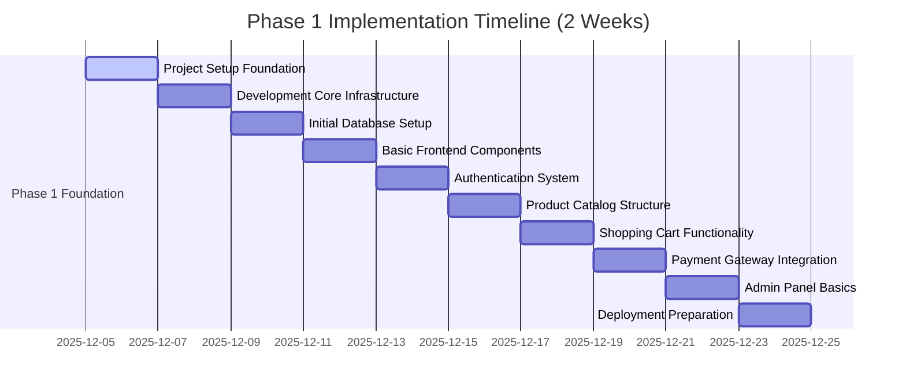

# SAFFRON SWEETS AND BAKERIES E-COMMERCE PLATFORM
## Phase 1: Comprehensive Implementation Guide
### 10 Sequential Milestones for Solo Developer Implementation

**Project:** Saffron Sweets and Bakeries E-Commerce Platform  
**Target Market:** Bangladesh  
**Technology Stack:** Next.js 14, React 18, TypeScript, Node.js, PostgreSQL, Redis  
**Deployment Target:** Organization's Private Cloud Infrastructure  
**Development Approach:** Solo Full Stack Developer (40 hours/week)  
**Timeline:** 2 Weeks (14 Days)  
**Document Version:** 1.0  
**Date:** December 5, 2025

---

## EXECUTIVE SUMMARY

This comprehensive Phase 1 implementation guide provides a structured approach to establishing the foundation for Bangladesh's premier bakery e-commerce platform. The guide is specifically designed for a solo full-stack developer working with an intensive 2-week timeline, focusing on essential foundation elements while maintaining quality standards.

The 10 sequential milestones progress logically from initial environment setup through deployment preparation, incorporating Bangladesh-specific requirements including local payment gateways, mobile optimization, and bilingual support. Each milestone includes specific deliverables, dependencies, timeframes, technical requirements, success criteria, and potential risks.

This implementation guide addresses gaps identified in previous Phase 1 analysis, including detailed hardware specifications, VS Code extensions, database configuration details, and Bangladesh-specific considerations throughout the development process.

---

## PROJECT TIMELINE OVERVIEW



---

## MILESTONE 1: PROJECT SETUP FOUNDATION
**Duration:** 2 Days (December 5-6, 2025)  
**Focus:** Establishing development environment and project foundation

### Specific Deliverables
1. **Development Machine Configuration**
   - Ubuntu 22.04 LTS with minimum specifications
   - Node.js 20 LTS with npm/pnpm package managers
   - Git configuration with SSH keys
   - VS Code with essential extensions and settings
   - Development environment verification script

2. **Version Control Establishment**
   - GitHub repository with proper branching strategy
   - Comprehensive .gitignore configuration
   - Commit hooks for code quality
   - Main, develop, and feature branch workflows
   - Repository documentation and contribution guidelines

3. **Database Systems Installation**
   - PostgreSQL 15+ with optimized configuration
   - Redis 7+ for caching and sessions
   - pgAdmin for database management
   - Development and test databases
   - Backup procedures for local development

4. **Development Tools Setup**
   - Docker and Docker Compose for containerization
   - Postman/Insomnia for API testing
   - Database GUI tools (pgAdmin, Redis Desktop Manager)
   - Image optimization utilities
   - Monitoring and logging tools

### Dependencies
- None (first milestone in sequence)

### Estimated Timeframes
- Day 1: Development machine configuration and version control setup
- Day 2: Database systems installation and development tools configuration

### Technical Requirements
#### Hardware Specifications
- **CPU:** 4 cores minimum (8 threads recommended)
- **RAM:** 16GB minimum (32GB recommended)
- **Storage:** 512GB SSD minimum (1TB recommended)
- **Network:** Stable broadband connection (minimum 10Mbps)

#### Software Requirements
- **Operating System:** Ubuntu 22.04 LTS or 23.04
- **Node.js:** Version 20.x.x LTS
- **Package Manager:** pnpm 8.x.x (recommended)
- **Database:** PostgreSQL 15+ with Redis 7+
- **Git:** Version 2.30+

#### VS Code Extensions
```json
{
  "recommendations": [
    "ms-vscode.vscode-typescript-next",
    "bradlc.vscode-tailwindcss",
    "esbenp.prettier-vscode",
    "dbaeumer.vscode-eslint",
    "ms-vscode.vscode-json",
    "formulahendry.auto-rename-tag",
    "christian-kohler.path-intellisense",
    "humao.rest-client",
    "ms-vscode.vscode-docker",
    "github.copilot",
    "github.vscode-pull-request-github",
    "ms-vscode.vscode-thunder-client",
    "ms-vscode-remote.remote-containers",
    "eamodio.gitlens",
    "streetsidesoftware.code-spell-checker",
    "yzhang.markdown-all-in-one"
  ]
}
```

#### Database Configuration Details
**PostgreSQL Configuration (postgresql.conf):**
```conf
# Connection Settings
listen_addresses = 'localhost'
port = 5432
max_connections = 100

# Memory Settings (development)
shared_buffers = 128MB
effective_cache_size = 512MB
work_mem = 4MB
maintenance_work_mem = 64MB

# WAL Settings (development)
wal_buffers = 4MB
checkpoint_completion_target = 0.7
wal_writer_delay = 200ms
max_wal_size = 1GB

# Query Planning
random_page_cost = 1.1
effective_io_concurrency = 100

# Logging (development)
log_statement = 'all'
log_min_duration_statement = 0
log_line_prefix = '%t [%p]: [%l-1] user=%u,db=%d,app=%a,client=%h '
```

**Redis Configuration (redis.conf):**
```conf
# Network
bind 127.0.0.1
port 6379
timeout 0
tcp-keepalive 300

# Memory (development)
maxmemory 256mb
maxmemory-policy allkeys-lru

# Persistence (development - disabled for speed)
save ""

# Logging (development)
loglevel notice
logfile ""
```

### Success Criteria
- Development environment fully configured and tested
- All required tools installed and functioning
- Database systems operational with optimized settings
- Version control repository established with proper workflows
- Environment verification script passes all checks

### Potential Risks
- **Hardware Compatibility:** Development machine may not meet minimum requirements
  - **Mitigation:** Verify specifications before beginning setup
- **Network Issues:** Unstable internet connection may slow setup
  - **Mitigation:** Download necessary packages and dependencies in advance
- **Configuration Conflicts:** Software versions may conflict
  - **Mitigation:** Use version managers and containerization

---

## MILESTONE 2: DEVELOPMENT CORE INFRASTRUCTURE
**Duration:** 2 Days (December 7-8, 2025)  
**Focus:** Establishing core architecture and foundation components

### Specific Deliverables
1. **Backend Framework Initialization**
   - NestJS project with TypeScript configuration
   - Module structure and dependency injection setup
   - Global exception filters and interceptors
   - API versioning strategy implementation
   - Development server configuration

2. **Frontend Framework Initialization**
   - Next.js 14 with TypeScript setup
   - Tailwind CSS with custom theme configuration
   - Component library structure establishment
   - Internationalization (i18n) for Bengali/English
   - State management with Zustand

3. **Shared Type Definitions**
   - TypeScript interfaces for all entities
   - Shared validation schemas
   - API response types
   - Shared utility functions
   - Enum definitions for constants

4. **API Architecture Configuration**
   - RESTful API structure
   - Request validation pipes
   - Authentication guards
   - Rate limiting implementation
   - API documentation with Swagger

5. **Development Environment Configuration**
   - Environment variable templates
   - Development scripts for automation
   - Hot reload and live development servers
   - Database connection pooling
   - Debugging configurations

### Dependencies
- Milestone 1: Project Setup Foundation (completed)

### Estimated Timeframes
- Day 1: Backend and frontend framework initialization
- Day 2: Shared types, API architecture, and development environment

### Technical Requirements
#### Backend Configuration
```typescript
// nest-cli.json
{
  "$schema": "https://json.schemastore.org/nest-cli",
  "collection": "@nestjs/schematics",
  "sourceRoot": "src",
  "compilerOptions": {
    "deleteOutDir": true
  }
}

// main.ts
import { NestFactory } from '@nestjs/core';
import { AppModule } from './app.module';
import { ValidationPipe } from '@nestjs/common';
import { DocumentBuilder, SwaggerModule } from '@nestjs/swagger';

async function bootstrap() {
  const app = await NestFactory.create(AppModule, {
    logger: ['error', 'warn', 'debug', 'log', 'verbose'],
  });

  app.useGlobalPipes(
    new ValidationPipe({
      whitelist: true,
      forbidNonWhitelisted: true,
      transform: true,
    }),
  );

  app.enableCors({
    origin: ['http://localhost:3000', 'http://localhost:3001'],
    credentials: true,
  });

  const config = new DocumentBuilder()
    .setTitle('Saffron Bakery API')
    .setDescription('API documentation for Saffron Bakery e-commerce platform')
    .setVersion('1.0')
    .build();
  
  const document = SwaggerModule.createDocument(app, config);
  SwaggerModule.setup('api/docs', app, document);

  await app.listen(process.env.PORT || 3001);
}
```

#### Frontend Configuration
```javascript
// next.config.js
/** @type {import('next').NextConfig} */
const nextConfig = {
  reactStrictMode: true,
  swcMinify: true,
  
  experimental: {
    optimizeCss: true,
    optimizePackageImports: ['lucide-react', '@headlessui/react'],
  },
  
  images: {
    domains: ['localhost'],
    formats: ['image/avif', 'image/webp'],
    deviceSizes: [640, 750, 828, 1080, 1200, 1920, 2048],
    imageSizes: [16, 32, 48, 64, 96, 128, 256, 384],
  },
  
  i18n: {
    locales: ['bn', 'en'],
    defaultLocale: 'bn',
    localeDetection: true,
  },
};

module.exports = nextConfig;
```

#### Environment Variables Template
**Frontend (.env.local):**
```env
# API Configuration
NEXT_PUBLIC_API_URL=http://localhost:3001
NEXT_PUBLIC_SITE_URL=http://localhost:3000

# Bangladesh Configuration
NEXT_PUBLIC_DEFAULT_CURRENCY=BDT
NEXT_PUBLIC_DEFAULT_LANGUAGE=bn
NEXT_PUBLIC_TIME_ZONE=Asia/Dhaka

# Development Configuration
NODE_ENV=development
NEXT_PUBLIC_ENABLE_DEBUG=true
```

**Backend (.env.development):**
```env
# Application Configuration
NODE_ENV=development
PORT=3001

# Database Configuration
DB_HOST=localhost
DB_PORT=5432
DB_USERNAME=saffron_dev
DB_PASSWORD=dev_password
DB_NAME=saffron_dev

# Redis Configuration
REDIS_URL=redis://localhost:6379

# JWT Configuration
JWT_SECRET=your_development_jwt_secret_key_here
JWT_EXPIRATION=7d
```

### Success Criteria
- Backend framework initialized with TypeScript and proper configuration
- Frontend framework initialized with Next.js 14 and Tailwind CSS
- Shared type definitions established and integrated
- API architecture configured with validation and documentation
- Development environment fully operational with hot reload

### Potential Risks
- **Configuration Conflicts:** Framework configurations may conflict
  - **Mitigation:** Follow official documentation and test incrementally
- **Type Safety Issues:** TypeScript configuration may be too strict/lenient
  - **Mitigation:** Start with balanced settings and adjust as needed
- **Performance Issues:** Development server may be slow
  - **Mitigation:** Optimize configuration and monitor performance

---

## MILESTONE 3: INITIAL DATABASE SETUP
**Duration:** 2 Days (December 9-10, 2025)  
**Focus:** Building comprehensive database schema and relationships

### Specific Deliverables
1. **Database Schema Design**
   - User management schema with authentication fields
   - Product catalog schema with multilingual support
   - Order management system with comprehensive fields
   - Payment transactions schema
   - Review and rating system schema

2. **Database Migration System**
   - TypeORM migration setup
   - Initial migration scripts
   - Migration rollback procedures
   - Database seeding scripts
   - Migration testing procedures

3. **Database Optimization**
   - Strategic indexes for performance
   - Query optimization setup
   - Connection pooling configuration
   - Database maintenance procedures
   - Performance monitoring setup

4. **Data Validation Rules**
   - Entity constraints implementation
   - Data integrity checks
   - Validation decorators
   - Custom validation rules
   - Error handling for data violations

5. **Database Documentation**
   - Entity relationship diagrams
   - Schema documentation
   - Migration documentation
   - Performance benchmarks
   - Troubleshooting guides

### Dependencies
- Milestone 2: Development Core Infrastructure (completed)

### Estimated Timeframes
- Day 1: Database schema design and migration system setup
- Day 2: Database optimization, validation, and documentation

### Technical Requirements
#### Database Schema Examples
**User Entity:**
```typescript
@Entity('users')
export class User {
  @PrimaryGeneratedColumn('uuid')
  id: string;

  @Column({ unique: true })
  email: string;

  @Column()
  password: string;

  @Column()
  firstName: string;

  @Column()
  lastName: string;

  @Column({ nullable: true })
  phone: string;

  @Column({ default: 'customer' })
  role: string;

  @Column({ default: true })
  isActive: boolean;

  @CreateDateColumn()
  createdAt: Date;

  @UpdateDateColumn()
  updatedAt: Date;

  @OneToMany(() => Address, address => address.user)
  addresses: Address[];

  @OneToMany(() => Order, order => order.user)
  orders: Order[];
}
```

**Product Entity:**
```typescript
@Entity('products')
export class Product {
  @PrimaryGeneratedColumn('uuid')
  id: string;

  @Column()
  name: string;

  @Column()
  nameBn: string;

  @Column('text')
  description: string;

  @Column('text', { nullable: true })
  descriptionBn: string;

  @Column('decimal', { precision: 10, scale: 2 })
  price: number;

  @Column()
  category: string;

  @Column()
  categoryBn: string;

  @Column()
  stockQuantity: number;

  @Column({ default: true })
  isActive: boolean;

  @CreateDateColumn()
  createdAt: Date;

  @UpdateDateColumn()
  updatedAt: Date;

  @OneToMany(() => ProductImage, image => image.product)
  images: ProductImage[];

  @OneToMany(() => OrderItem, orderItem => orderItem.product)
  orderItems: OrderItem[];
}
```

#### Migration Script Example
```typescript
import { MigrationInterface, QueryRunner } from 'typeorm';

export class CreateInitialTables1234567890 implements MigrationInterface {
  name = 'CreateInitialTables1234567890';

  public async up(queryRunner: QueryRunner): Promise<void> {
    // Create users table
    await queryRunner.query(`
      CREATE TABLE users (
        id UUID PRIMARY KEY DEFAULT gen_random_uuid(),
        email VARCHAR(255) UNIQUE NOT NULL,
        password VARCHAR(255) NOT NULL,
        first_name VARCHAR(100) NOT NULL,
        last_name VARCHAR(100) NOT NULL,
        phone VARCHAR(20),
        role VARCHAR(50) DEFAULT 'customer',
        is_active BOOLEAN DEFAULT true,
        created_at TIMESTAMP DEFAULT CURRENT_TIMESTAMP,
        updated_at TIMESTAMP DEFAULT CURRENT_TIMESTAMP
      );
    `);

    // Create products table
    await queryRunner.query(`
      CREATE TABLE products (
        id UUID PRIMARY KEY DEFAULT gen_random_uuid(),
        name VARCHAR(255) NOT NULL,
        name_bn VARCHAR(255),
        description TEXT,
        description_bn TEXT,
        price DECIMAL(10,2) NOT NULL,
        category VARCHAR(100) NOT NULL,
        category_bn VARCHAR(100),
        stock_quantity INTEGER DEFAULT 0,
        is_active BOOLEAN DEFAULT true,
        created_at TIMESTAMP DEFAULT CURRENT_TIMESTAMP,
        updated_at TIMESTAMP DEFAULT CURRENT_TIMESTAMP
      );
    `);
  }

  public async down(queryRunner: QueryRunner): Promise<void> {
    await queryRunner.query(`DROP TABLE IF EXISTS order_items`);
    await queryRunner.query(`DROP TABLE IF EXISTS orders`);
    await queryRunner.query(`DROP TABLE IF EXISTS products`);
    await queryRunner.query(`DROP TABLE IF EXISTS users`);
  }
}
```

#### Database Configuration
```typescript
// app.module.ts
import { Module } from '@nestjs/common';
import { TypeOrmModule } from '@nestjs/typeorm';
import { User } from './entities/user.entity';
import { Product } from './entities/product.entity';
import { Order } from './entities/order.entity';

@Module({
  imports: [
    TypeOrmModule.forRoot({
      type: 'postgres',
      host: process.env.DB_HOST,
      port: parseInt(process.env.DB_PORT),
      username: process.env.DB_USERNAME,
      password: process.env.DB_PASSWORD,
      database: process.env.DB_NAME,
      entities: [User, Product, Order],
      synchronize: false, // Use migrations in production
      logging: true,
      migrations: ['dist/migrations/*.js'],
      migrationsRun: false,
    }),
    TypeOrmModule.forFeature([User, Product, Order]),
  ],
})
export class AppModule {}
```

### Success Criteria
- Database schema designed with all necessary entities
- Migration system implemented and tested
- Database optimization configured and benchmarked
- Data validation rules implemented and tested
- Comprehensive database documentation created

### Potential Risks
- **Schema Design Issues:** Complex relationships may cause performance issues
  - **Mitigation:** Follow database normalization principles and test performance
- **Migration Failures:** Database migrations may fail in production
  - **Mitigation:** Implement rollback procedures and test thoroughly
- **Data Integrity:** Constraints may be too restrictive
  - **Mitigation:** Balance data integrity with flexibility

---

## MILESTONE 4: BASIC FRONTEND COMPONENTS
**Duration:** 2 Days (December 11-12, 2025)  
**Focus:** Building responsive frontend with optimal user experience

### Specific Deliverables
1. **Layout System Components**
   - Mobile-first responsive design
   - Breakpoint system for devices
   - Flexible grid layout
   - Touch-optimized interactions
   - Accessibility-compliant interface

2. **Product Display Components**
   - Product card components
   - Product detail pages
   - Product image galleries
   - Product comparison interface
   - Product review display

3. **Navigation System**
   - Intuitive main navigation
   - Breadcrumb navigation
   - Mega menu for categories
   - Search interface with autocomplete
   - Footer with comprehensive links

4. **User Interface Components**
   - User registration/login forms
   - User profile management
   - Address book management
   - User preferences settings
   - Order history display

5. **Bangladesh-Specific Components**
   - Bengali language support
   - Currency display (BDT)
   - Bengali number formatting
   - Cultural design elements
   - Local payment method displays

### Dependencies
- Milestone 3: Initial Database Setup (completed)

### Estimated Timeframes
- Day 1: Layout system and product display components
- Day 2: Navigation system, user interface, and Bangladesh-specific components

### Technical Requirements
#### Component Structure
```typescript
// components/ProductCard.tsx
import React from 'react';
import Image from 'next/image';
import { Product } from '../types/product';

interface ProductCardProps {
  product: Product;
  onAddToCart: (product: Product) => void;
}

export const ProductCard: React.FC<ProductCardProps> = ({ product, onAddToCart }) => {
  return (
    <div className="bg-white rounded-lg shadow-md overflow-hidden hover:shadow-lg transition-shadow duration-300">
      <div className="relative h-48 w-full">
        <Image
          src={product.images[0]?.url || '/placeholder.jpg'}
          alt={product.name}
          fill
          className="object-cover"
        />
        {product.isNew && (
          <span className="absolute top-2 left-2 bg-green-500 text-white px-2 py-1 text-xs rounded">
            New
          </span>
        )}
      </div>
      <div className="p-4">
        <h3 className="text-lg font-semibold text-gray-800 mb-2">{product.name}</h3>
        <p className="text-gray-600 text-sm mb-3">{product.description}</p>
        <div className="flex justify-between items-center">
          <span className="text-xl font-bold text-green-600">৳{product.price}</span>
          <button
            onClick={() => onAddToCart(product)}
            className="bg-orange-500 hover:bg-orange-600 text-white px-4 py-2 rounded-lg transition-colors duration-200"
          >
            Add to Cart
          </button>
        </div>
      </div>
    </div>
  );
};
```

#### Responsive Design System
```css
/* styles/globals.css */
@tailwind base;
@tailwind components;
@tailwind utilities;

/* Bengali Font Support */
@import url('https://fonts.googleapis.com/css2?family=Kalpurush&display=swap');

.bengali-font {
  font-family: 'Kalpurush', Arial, sans-serif;
}

/* Responsive Breakpoints */
@media (min-width: 640px) {
  /* sm: Small devices */
}

@media (min-width: 768px) {
  /* md: Medium devices */
}

@media (min-width: 1024px) {
  /* lg: Large devices */
}

@media (min-width: 1280px) {
  /* xl: Extra large devices */
}

/* Touch-optimized elements */
.touch-target {
  min-height: 44px;
  min-width: 44px;
  padding: 12px;
}

/* Accessibility */
.sr-only {
  position: absolute;
  width: 1px;
  height: 1px;
  padding: 0;
  margin: -1px;
  overflow: hidden;
  clip: rect(0, 0, 0, 0);
  white-space: nowrap;
  border-width: 0;
}
```

#### Internationalization Setup
```typescript
// lib/i18n.ts
export const i18n = {
  defaultLocale: 'bn',
  locales: ['bn', 'en'],
} as const;

export type Locale = (typeof i18n)['locales'][number];

// lib/bengali-formatters.ts
export class BengaliNumberFormatter {
  private static readonly bengaliDigits = ['০', '১', '২', '৩', '৪', '৫', '৬', '৭', '৮', '৯'];
  
  static toBengali(num: number | string): string {
    const numStr = num.toString();
    return numStr.replace(/\d/g, (digit) => {
      return this.bengaliDigits[parseInt(digit)];
    });
  }
  
  static formatCurrency(amount: number): string {
    return `৳${this.toBengali(amount.toFixed(2))}`;
  }
}
```

### Success Criteria
- Responsive layout system implemented across all breakpoints
- Product display components functional with proper image handling
- Navigation system intuitive and accessible
- User interface components complete and functional
- Bangladesh-specific features implemented and tested

### Potential Risks
- **Performance Issues:** Components may be slow on mobile devices
  - **Mitigation:** Implement lazy loading and optimize images
- **Accessibility Gaps:** Components may not meet WCAG standards
  - **Mitigation:** Test with accessibility tools and follow guidelines
- **Cultural Misalignment:** Design may not resonate with local users
  - **Mitigation:** Research local design preferences and test with users

---

## MILESTONE 5: AUTHENTICATION SYSTEM
**Duration:** 2 Days (December 13-14, 2025)  
**Focus:** Implementing comprehensive security and user management

### Specific Deliverables
1. **User Authentication**
   - JWT token generation and validation
   - Refresh token mechanism
   - Password hashing with bcrypt
   - Login/logout functionality
   - Session management

2. **User Registration System**
   - User registration with validation
   - Email verification workflow
   - Phone number verification
   - Social login integration (Google, Facebook)
   - CAPTCHA protection

3. **Password Security**
   - Secure password reset flow
   - Password strength requirements
   - Account lockout after failed attempts
   - Password history tracking
   - Two-factor authentication

4. **Role-Based Access Control**
   - Role hierarchy and permissions
   - Resource-based access control
   - API endpoint protection
   - Admin panel access levels
   - Permission management interface

5. **User Profile Management**
   - Profile editing functionality
   - Avatar upload and management
   - Preference management
   - Address book management
   - Account deletion process

### Dependencies
- Milestone 4: Basic Frontend Components (completed)

### Estimated Timeframes
- Day 1: User authentication and registration system
- Day 2: Password security, role-based access control, and user profile management

### Technical Requirements
#### Authentication Service
```typescript
// auth/auth.service.ts
import { Injectable } from '@nestjs/common';
import { JwtService } from '@nestjs/jwt';
import { UserService } from '../user/user.service';
import * as bcrypt from 'bcrypt';

@Injectable()
export class AuthService {
  constructor(
    private userService: UserService,
    private jwtService: JwtService,
  ) {}

  async validateUser(email: string, pass: string): Promise<any> {
    const user = await this.userService.findByEmail(email);
    if (user && await bcrypt.compare(pass, user.password)) {
      const { password, ...result } = user;
      return result;
    }
    return null;
  }

  async login(user: any) {
    const payload = { email: user.email, sub: user.id };
    return {
      access_token: this.jwtService.sign(payload),
      refresh_token: this.generateRefreshToken(user.id),
    };
  }

  async register(userData: RegisterDto) {
    const hashedPassword = await bcrypt.hash(userData.password, 12);
    const user = await this.userService.create({
      ...userData,
      password: hashedPassword,
    });
    
    // Send verification email
    await this.sendVerificationEmail(user.email);
    
    return this.login(user);
  }

  private async sendVerificationEmail(email: string) {
    // Implementation for email verification
  }
}
```

#### Authentication Guard
```typescript
// auth/jwt-auth.guard.ts
import { Injectable } from '@nestjs/common';
import { AuthGuard } from '@nestjs/passport';

@Injectable()
export class JwtAuthGuard extends AuthGuard('jwt') {
  canActivate(context: ExecutionContext) {
    return super.canActivate(context);
  }
}
```

#### Frontend Authentication Hook
```typescript
// hooks/useAuth.ts
import { useState, useEffect } from 'react';
import { useRouter } from 'next/navigation';
import { authService } from '../services/auth.service';

export const useAuth = () => {
  const [user, setUser] = useState(null);
  const [loading, setLoading] = useState(false);
  const router = useRouter();

  useEffect(() => {
    const token = localStorage.getItem('access_token');
    if (token) {
      authService.validateToken(token).then(response => {
        if (response.valid) {
          setUser(response.user);
        } else {
          localStorage.removeItem('access_token');
          router.push('/login');
        }
      });
    }
  }, []);

  const login = async (credentials: LoginCredentials) => {
    setLoading(true);
    try {
      const response = await authService.login(credentials);
      localStorage.setItem('access_token', response.access_token);
      setUser(response.user);
      router.push('/dashboard');
    } catch (error) {
      console.error('Login failed:', error);
    } finally {
      setLoading(false);
    }
  };

  const logout = () => {
    localStorage.removeItem('access_token');
    setUser(null);
    router.push('/');
  };

  return { user, loading, login, logout };
};
```

### Success Criteria
- User authentication system secure and functional
- Registration process complete with verification
- Password security measures implemented and tested
- Role-based access control functional
- User profile management complete and intuitive

### Potential Risks
- **Security Vulnerabilities:** Authentication may have security gaps
  - **Mitigation:** Follow security best practices and conduct penetration testing
- **User Experience Issues:** Authentication flow may be complex
  - **Mitigation:** Simplify process and provide clear feedback
- **Social Login Complexity:** Third-party integrations may be difficult
  - **Mitigation:** Use established libraries and follow documentation

---

## MILESTONE 6: PRODUCT CATALOG STRUCTURE
**Duration:** 2 Days (December 15-16, 2025)  
**Focus:** Building comprehensive product management and display system

### Specific Deliverables
1. **Product Listing System**
   - Product listing with pagination
   - Product detail pages
   - Product search functionality
   - Product filtering and sorting
   - Product comparison features

2. **Category Management**
   - Hierarchical category structure
   - Category navigation
   - Category-based product filtering
   - Category management interface
   - Category-specific promotions

3. **Search Functionality**
   - Advanced product search
   - Search with autocomplete
   - Bengali language search
   - Search filters and facets
   - Search analytics tracking

4. **Inventory Management**
   - Stock management interface
   - Low stock alerts
   - Inventory tracking system
   - Stock reservation for orders
   - Inventory reporting

5. **Product Media Management**
   - Image upload and optimization
   - Product video support
   - Image gallery management
   - Media CDN integration
   - Alt text and accessibility

### Dependencies
- Milestone 5: Authentication System (completed)

### Estimated Timeframes
- Day 1: Product listing system and category management
- Day 2: Search functionality, inventory management, and product media management

### Technical Requirements
#### Product Service
```typescript
// product/product.service.ts
import { Injectable } from '@nestjs/common';
import { InjectRepository } from '@nestjs/typeorm';
import { Repository } from 'typeorm';
import { Product } from './entities/product.entity';
import { SearchProductDto } from './dto/search-product.dto';

@Injectable()
export class ProductService {
  constructor(
    @InjectRepository(Product)
    private productRepository: Repository<Product>,
  ) {}

  async findAll(page: number = 1, limit: number = 20) {
    const skip = (page - 1) * limit;
    return this.productRepository.find({
      skip,
      take: limit,
      where: { isActive: true },
      order: { createdAt: 'DESC' },
    });
  }

  async search(searchDto: SearchProductDto) {
    const queryBuilder = this.productRepository.createQueryBuilder('product');
    
    if (searchDto.query) {
      queryBuilder.where(
        '(product.name ILIKE :query OR product.nameBn ILIKE :query OR product.description ILIKE :query)',
        { query: `%${searchDto.query}%` }
      );
    }
    
    if (searchDto.category) {
      queryBuilder.andWhere('product.category = :category', { category: searchDto.category });
    }
    
    if (searchDto.minPrice) {
      queryBuilder.andWhere('product.price >= :minPrice', { minPrice: searchDto.minPrice });
    }
    
    if (searchDto.maxPrice) {
      queryBuilder.andWhere('product.price <= :maxPrice', { maxPrice: searchDto.maxPrice });
    }
    
    return queryBuilder.getMany();
  }

  async findOne(id: string) {
    return this.productRepository.findOne({
      where: { id, isActive: true },
      relations: ['images', 'category'],
    });
  }
}
```

#### Product Controller
```typescript
// product/product.controller.ts
import { Controller, Get, Post, Body, Param, Query } from '@nestjs/common';
import { ProductService } from './product.service';
import { SearchProductDto } from './dto/search-product.dto';

@Controller('products')
export class ProductController {
  constructor(private readonly productService: ProductService) {}

  @Get()
  async findAll(@Query('page') page: number, @Query('limit') limit: number) {
    return this.productService.findAll(page, limit);
  }

  @Get('search')
  async search(@Query() searchDto: SearchProductDto) {
    return this.productService.search(searchDto);
  }

  @Get(':id')
  async findOne(@Param('id') id: string) {
    return this.productService.findOne(id);
  }
}
```

#### Frontend Product Components
```typescript
// components/ProductList.tsx
import React, { useState, useEffect } from 'react';
import { Product } from '../types/product';
import { ProductCard } from './ProductCard';
import { productService } from '../services/product.service';

export const ProductList: React.FC = () => {
  const [products, setProducts] = useState<Product[]>([]);
  const [loading, setLoading] = useState(true);
  const [page, setPage] = useState(1);
  const [filters, setFilters] = useState({});

  useEffect(() => {
    loadProducts();
  }, [page, filters]);

  const loadProducts = async () => {
    setLoading(true);
    try {
      const response = await productService.getProducts({ page, ...filters });
      setProducts(response.data);
    } catch (error) {
      console.error('Failed to load products:', error);
    } finally {
      setLoading(false);
    }
  };

  return (
    <div className="container mx-auto px-4 py-8">
      <div className="grid grid-cols-1 md:grid-cols-2 lg:grid-cols-3 xl:grid-cols-4 gap-6">
        {loading ? (
          Array.from({ length: 8 }).map((_, index) => (
            <div key={index} className="animate-pulse bg-gray-200 h-64 rounded-lg"></div>
          ))
        ) : (
          products.map((product) => (
            <ProductCard key={product.id} product={product} />
          ))
        )}
      </div>
    </div>
  );
};
```

### Success Criteria
- Product listing system functional with pagination
- Category management complete with hierarchical structure
- Search functionality working with Bengali language support
- Inventory management system operational
- Product media management functional with optimization

### Potential Risks
- **Performance Issues:** Large product catalog may slow down searches
  - **Mitigation:** Implement caching and optimize database queries
- **Search Accuracy:** Bengali search may not work properly
  - **Mitigation:** Test with native Bengali speakers and optimize algorithms
- **Image Optimization:** Product images may slow down page loads
  - **Mitigation:** Implement lazy loading and image optimization

---

## MILESTONE 7: SHOPPING CART FUNCTIONALITY
**Duration:** 2 Days (December 17-18, 2025)  
**Focus:** Building comprehensive shopping cart and checkout system

### Specific Deliverables
1. **Shopping Cart System**
   - Add to cart functionality
   - Cart persistence across sessions
   - Cart management interface
   - Cart validation and updates
   - Cart sharing features

2. **Checkout Process**
   - Multi-step checkout flow
   - Guest checkout option
   - Address selection and management
   - Order summary and confirmation
   - Checkout validation

3. **Order Management**
   - Order processing workflow
   - Order status tracking
   - Order modification and cancellation
   - Order history for users
   - Reorder functionality

4. **Pricing System**
   - Dynamic pricing rules
   - Discount and promotion engine
   - Tax calculation system
   - Currency display (BDT)
   - Price history tracking

5. **Cart Analytics**
   - Cart abandonment tracking
   - Conversion funnel analysis
   - Cart performance metrics
   - User behavior tracking
   - Revenue optimization insights

### Dependencies
- Milestone 6: Product Catalog Structure (completed)

### Estimated Timeframes
- Day 1: Shopping cart system and checkout process
- Day 2: Order management, pricing system, and cart analytics

### Technical Requirements
#### Cart Service
```typescript
// cart/cart.service.ts
import { Injectable } from '@nestjs/common';
import { CartItem } from './interfaces/cart-item.interface';
import { RedisService } from '../redis/redis.service';

@Injectable()
export class CartService {
  constructor(private redisService: RedisService) {}

  async addToCart(userId: string, item: CartItem) {
    const cartKey = `cart:${userId}`;
    const cart = await this.getCart(userId);
    
    const existingItem = cart.find(cartItem => cartItem.productId === item.productId);
    if (existingItem) {
      existingItem.quantity += item.quantity;
    } else {
      cart.push(item);
    }
    
    await this.redisService.set(cartKey, cart, 86400); // 24 hours expiry
    return cart;
  }

  async getCart(userId: string): Promise<CartItem[]> {
    const cartKey = `cart:${userId}`;
    return this.redisService.get(cartKey) || [];
  }

  async removeFromCart(userId: string, productId: string) {
    const cartKey = `cart:${userId}`;
    const cart = await this.getCart(userId);
    const updatedCart = cart.filter(item => item.productId !== productId);
    await this.redisService.set(cartKey, updatedCart, 86400);
    return updatedCart;
  }

  async clearCart(userId: string) {
    const cartKey = `cart:${userId}`;
    await this.redisService.del(cartKey);
  }

  async calculateTotal(userId: string): Promise<number> {
    const cart = await this.getCart(userId);
    return cart.reduce((total, item) => total + (item.price * item.quantity), 0);
  }
}
```

#### Order Service
```typescript
// order/order.service.ts
import { Injectable } from '@nestjs/common';
import { InjectRepository } from '@nestjs/typeorm';
import { Repository } from 'typeorm';
import { Order } from './entities/order.entity';
import { CreateOrderDto } from './dto/create-order.dto';

@Injectable()
export class OrderService {
  constructor(
    @InjectRepository(Order)
    private orderRepository: Repository<Order>,
  ) {}

  async create(createOrderDto: CreateOrderDto) {
    const order = this.orderRepository.create({
      ...createOrderDto,
      status: 'pending',
      orderNumber: this.generateOrderNumber(),
      createdAt: new Date(),
    });
    
    return this.orderRepository.save(order);
  }

  async updateStatus(orderId: string, status: string) {
    await this.orderRepository.update(orderId, { status });
    return this.findOne(orderId);
  }

  private generateOrderNumber(): string {
    const timestamp = Date.now().toString();
    const random = Math.random().toString(36).substr(2, 5);
    return `SAF-${timestamp}-${random}`;
  }
}
```

#### Frontend Cart Components
```typescript
// components/Cart.tsx
import React, { useState, useEffect } from 'react';
import { CartItem } from '../types/cart';
import { cartService } from '../services/cart.service';

export const Cart: React.FC = () => {
  const [cartItems, setCartItems] = useState<CartItem[]>([]);
  const [total, setTotal] = useState(0);

  useEffect(() => {
    loadCart();
  }, []);

  const loadCart = async () => {
    try {
      const cart = await cartService.getCart();
      setCartItems(cart);
      const cartTotal = cart.reduce((sum, item) => sum + (item.price * item.quantity), 0);
      setTotal(cartTotal);
    } catch (error) {
      console.error('Failed to load cart:', error);
    }
  };

  const updateQuantity = async (productId: string, quantity: number) => {
    await cartService.updateQuantity(productId, quantity);
    loadCart();
  };

  const removeItem = async (productId: string) => {
    await cartService.removeFromCart(productId);
    loadCart();
  };

  return (
    <div className="container mx-auto px-4 py-8">
      <h1 className="text-2xl font-bold mb-6">Shopping Cart</h1>
      
      {cartItems.length === 0 ? (
        <div className="text-center py-8">
          <p className="text-gray-600">Your cart is empty</p>
        </div>
      ) : (
        <div className="grid grid-cols-1 lg:grid-cols-3 gap-8">
          <div className="lg:col-span-2">
            {cartItems.map((item) => (
              <div key={item.productId} className="bg-white rounded-lg shadow-md p-4 mb-4">
                <div className="flex items-center">
                  
                  <div className="ml-4 flex-1">
                    <h3 className="font-semibold">{item.name}</h3>
                    <p className="text-gray-600">৳{item.price}</p>
                  </div>
                  <div className="flex items-center">
                    <button
                      onClick={() => updateQuantity(item.productId, item.quantity - 1)}
                      className="bg-gray-200 hover:bg-gray-300 w-8 h-8 rounded"
                    >
                      -
                    </button>
                    <span className="mx-2">{item.quantity}</span>
                    <button
                      onClick={() => updateQuantity(item.productId, item.quantity + 1)}
                      className="bg-gray-200 hover:bg-gray-300 w-8 h-8 rounded"
                    >
                      +
                    </button>
                    <button
                      onClick={() => removeItem(item.productId)}
                      className="ml-4 text-red-500 hover:text-red-700"
                    >
                      Remove
                    </button>
                  </div>
                </div>
              </div>
            ))}
          </div>
          
          <div className="lg:col-span-1">
            <div className="bg-white rounded-lg shadow-md p-6">
              <h3 className="font-semibold mb-4">Order Summary</h3>
              <div className="flex justify-between mb-2">
                <span>Subtotal:</span>
                <span>৳{total}</span>
              </div>
              <div className="flex justify-between mb-2">
                <span>Delivery:</span>
                <span>৳50</span>
              </div>
              <div className="flex justify-between mb-4 font-semibold">
                <span>Total:</span>
                <span>৳{total + 50}</span>
              </div>
              <button className="w-full bg-orange-500 hover:bg-orange-600 text-white py-3 rounded-lg">
                Proceed to Checkout
              </button>
            </div>
          </div>
        </div>
      )}
    </div>
  );
};
```

### Success Criteria
- Shopping cart system functional with persistence
- Checkout process complete and user-friendly
- Order management system operational
- Pricing system accurate with Bangladesh currency
- Cart analytics providing actionable insights

### Potential Risks
- **Cart Persistence:** Cart may not persist across sessions properly
  - **Mitigation:** Implement robust session management and backup strategies
- **Checkout Abandonment:** Users may abandon checkout process
  - **Mitigation:** Simplify process and provide clear progress indicators
- **Pricing Errors:** Calculations may be incorrect
  - **Mitigation:** Implement comprehensive testing and validation

---

## MILESTONE 8: PAYMENT GATEWAY INTEGRATION
**Duration:** 2 Days (December 19-20, 2025)  
**Focus:** Integrating Bangladesh-specific payment methods and transaction handling

### Specific Deliverables
1. **SSLCommerz Integration**
   - SSLCommerz merchant account setup
   - Payment initiation API implementation
   - Payment verification system
   - Payment webhook handling
   - Refund processing

2. **Mobile Wallet Integration**
   - bKash payment flow implementation
   - Nagad payment processing
   - Rocket payment integration
   - Mobile wallet transaction verification
   - Wallet-specific error handling

3. **Payment Security**
   - Payment data encryption
   - PCI DSS compliance measures
   - Fraud detection system
   - Transaction monitoring
   - Secure payment data handling

4. **Payment Method Selection**
   - Payment method selection interface
   - Payment method validation
   - Payment fee calculation
   - Saved payment methods
   - Payment method preferences

5. **Payment Notifications**
   - Payment confirmation emails
   - SMS payment notifications
   - Payment failure notifications
   - Payment success pages
   - Payment status updates

### Dependencies
- Milestone 7: Shopping Cart Functionality (completed)

### Estimated Timeframes
- Day 1: SSLCommerz integration and mobile wallet integration
- Day 2: Payment security, payment method selection, and payment notifications

### Technical Requirements
#### SSLCommerz Integration
```typescript
// payment/sslcommerz.service.ts
import { Injectable } from '@nestjs/common';
import { ConfigService } from '@nestjs/config';
import axios from 'axios';

@Injectable()
export class SSLCommerzService {
  private readonly baseUrl: string;
  private readonly storeId: string;
  private readonly storePassword: string;

  constructor(private configService: ConfigService) {
    this.baseUrl = 'https://sandbox.sslcommerz.com';
    this.storeId = this.configService.get('SSLCOMMERZ_STORE_ID');
    this.storePassword = this.configService.get('SSLCOMMERZ_STORE_PASSWORD');
  }

  async createPayment(orderData: any) {
    const paymentData = {
      store_id: this.storeId,
      store_passwd: this.storePassword,
      total_amount: orderData.totalAmount,
      currency: 'BDT',
      tran_id: this.generateTransactionId(),
      success_url: `${this.configService.get('FRONTEND_URL')}/payment/success`,
      fail_url: `${this.configService.get('FRONTEND_URL')}/payment/fail`,
      cancel_url: `${this.configService.get('FRONTEND_URL')}/payment/cancel`,
      ipn_url: `${this.configService.get('BACKEND_URL')}/payment/ipn`,
      multi_card_name: 'bkash,nagad,rocket',
      product_name: 'Saffron Bakery Order',
      product_category: 'Food',
      product_profile: 'physical-goods',
      shipping_method: 'YES',
      num_of_item: orderData.items.length,
      cus_name: orderData.customerName,
      cus_email: orderData.customerEmail,
      cus_phone: orderData.customerPhone,
      cus_add1: orderData.customerAddress,
      cus_city: orderData.customerCity,
      cus_country: 'Bangladesh',
      value_a: orderData.orderId,
    };

    const response = await axios.post(`${this.baseUrl}/gwprocess/v4/api.php`, 
      new URLSearchParams(paymentData).toString(),
      {
        headers: {
          'Content-Type': 'application/x-www-form-urlencoded',
        },
      }
    );

    return response.data;
  }

  async verifyPayment(transactionId: string) {
    const validationData = {
      store_id: this.storeId,
      store_passwd: this.storePassword,
      val_id: transactionId,
    };

    const response = await axios.post(`${this.baseUrl}/validator/api/validationserverAPI.php`,
      new URLSearchParams(validationData).toString(),
      {
        headers: {
          'Content-Type': 'application/x-www-form-urlencoded',
        },
      }
    );

    return response.data;
  }

  private generateTransactionId(): string {
    return `SAF_${Date.now()}_${Math.random().toString(36).substr(2, 9)}`;
  }
}
```

#### bKash Integration
```typescript
// payment/bkash.service.ts
import { Injectable } from '@nestjs/common';
import { ConfigService } from '@nestjs/config';
import axios from 'axios';

@Injectable()
export class BkashService {
  private readonly baseUrl: string;
  private readonly appKey: string;
  private readonly appSecret: string;

  constructor(private configService: ConfigService) {
    this.baseUrl = 'https://checkout.sandbox.bka.sh/v1.2.0-beta';
    this.appKey = this.configService.get('BKASH_APP_KEY');
    this.appSecret = this.configService.get('BKASH_APP_SECRET');
  }

  async createPayment(orderData: any) {
    const paymentData = {
      mode: '0011',
      payerReference: orderData.orderId,
      callbackURL: `${this.configService.get('BACKEND_URL')}/payment/bkash/callback`,
      amount: orderData.totalAmount,
      currency: 'BDT',
      intent: 'sale',
      merchantInvoiceNumber: orderData.orderId,
    };

    const response = await axios.post(`${this.baseUrl}/checkout/payment/create`,
      paymentData,
      {
        headers: {
          'Content-Type': 'application/json',
          'Authorization': this.generateAuthHeader(),
        },
      }
    );

    return response.data;
  }

  private generateAuthHeader(): string {
    const credentials = Buffer.from(`${this.appKey}:${this.appSecret}`).toString('base64');
    return `Basic ${credentials}`;
  }
}
```

#### Payment Controller
```typescript
// payment/payment.controller.ts
import { Controller, Post, Body, Res, Req } from '@nestjs/common';
import { SSLCommerzService } from './sslcommerz.service';
import { BkashService } from './bkash.service';
import { CreatePaymentDto } from './dto/create-payment.dto';

@Controller('payment')
export class PaymentController {
  constructor(
    private readonly sslcommerzService: SSLCommerzService,
    private readonly bkashService: BkashService,
  ) {}

  @Post('create')
  async createPayment(@Body() createPaymentDto: CreatePaymentDto) {
    switch (createPaymentDto.method) {
      case 'sslcommerz':
        return this.sslcommerzService.createPayment(createPaymentDto.orderData);
      case 'bkash':
        return this.bkashService.createPayment(createPaymentDto.orderData);
      default:
        throw new Error('Unsupported payment method');
    }
  }

  @Post('sslcommerz/ipn')
  async handleSSLCommerzIPN(@Body() ipnData: any) {
    const isValid = await this.sslcommerzService.verifyPayment(ipnData.val_id);
    if (isValid) {
      // Update order status
      // Send confirmation email
    }
  }

  @Post('bkash/callback')
  async handleBkashCallback(@Body() callbackData: any) {
    if (callbackData.executionStatus === '0015') {
      // Payment successful
      // Update order status
      // Send confirmation email
    }
  }
}
```

### Success Criteria
- SSLCommerz integration complete and tested
- Mobile wallet integrations functional
- Payment security measures implemented
- Payment method selection interface user-friendly
- Payment notifications working properly

### Potential Risks
- **Integration Complexity:** Payment gateway APIs may be complex
  - **Mitigation:** Use official SDKs and follow documentation closely
- **Security Vulnerabilities:** Payment handling may have security gaps
  - **Mitigation:** Implement comprehensive security testing and monitoring
- **Transaction Failures:** Payments may fail due to network issues
  - **Mitigation:** Implement retry mechanisms and clear error messaging

---

## MILESTONE 9: ADMIN PANEL BASICS
**Duration:** 2 Days (December 21-22, 2025)  
**Focus:** Building comprehensive admin interface for business operations

### Specific Deliverables
1. **Admin Dashboard Layout**
   - Role-based dashboard customization
   - Real-time data visualization
   - Interactive charts and graphs
   - Quick action buttons
   - Advanced search and filtering

2. **Product Management Interface**
   - Product CRUD operations
   - Bulk product import/export
   - Product variant management
   - Product categorization
   - Product status management

3. **Order Management System**
   - Order processing workflow
   - Order status updates
   - Order modification and cancellation
   - Order history and tracking
   - Order notes and communication

4. **Customer Management Tools**
   - Customer database view
   - Customer order history
   - Customer communication tools
   - Customer segmentation
   - Customer analytics

5. **Basic Analytics Dashboard**
   - Sales summary metrics
   - Revenue graphs and trends
   - Top-selling products
   - Low-stock alerts
   - Customer growth metrics

### Dependencies
- Milestone 8: Payment Gateway Integration (completed)

### Estimated Timeframes
- Day 1: Admin dashboard layout and product management interface
- Day 2: Order management system, customer management tools, and basic analytics dashboard

### Technical Requirements
#### Admin Dashboard Component
```typescript
// components/admin/Dashboard.tsx
import React, { useState, useEffect } from 'react';
import { adminService } from '../services/admin.service';

export const AdminDashboard: React.FC = () => {
  const [stats, setStats] = useState({
    totalOrders: 0,
    totalRevenue: 0,
    totalCustomers: 0,
    lowStockProducts: 0,
  });

  useEffect(() => {
    loadDashboardStats();
  }, []);

  const loadDashboardStats = async () => {
    try {
      const response = await adminService.getDashboardStats();
      setStats(response.data);
    } catch (error) {
      console.error('Failed to load dashboard stats:', error);
    }
  };

  return (
    <div className="min-h-screen bg-gray-100">
      <div className="flex">
        {/* Sidebar */}
        <div className="w-64 bg-gray-800 min-h-screen">
          <div className="p-4">
            <h1 className="text-white text-xl font-bold">Saffron Admin</h1>
          </div>
          <nav className="mt-8">
            <a href="/admin/dashboard" className="block px-4 py-2 text-gray-300 hover:bg-gray-700">
              Dashboard
            </a>
            <a href="/admin/products" className="block px-4 py-2 text-gray-300 hover:bg-gray-700">
              Products
            </a>
            <a href="/admin/orders" className="block px-4 py-2 text-gray-300 hover:bg-gray-700">
              Orders
            </a>
            <a href="/admin/customers" className="block px-4 py-2 text-gray-300 hover:bg-gray-700">
              Customers
            </a>
          </nav>
        </div>

        {/* Main Content */}
        <div className="flex-1 p-8">
          <div className="grid grid-cols-1 md:grid-cols-2 lg:grid-cols-4 gap-6 mb-8">
            <div className="bg-white rounded-lg shadow p-6">
              <h3 className="text-lg font-semibold text-gray-800 mb-2">Total Orders</h3>
              <p className="text-3xl font-bold text-blue-600">{stats.totalOrders}</p>
            </div>
            <div className="bg-white rounded-lg shadow p-6">
              <h3 className="text-lg font-semibold text-gray-800 mb-2">Total Revenue</h3>
              <p className="text-3xl font-bold text-green-600">৳{stats.totalRevenue}</p>
            </div>
            <div className="bg-white rounded-lg shadow p-6">
              <h3 className="text-lg font-semibold text-gray-800 mb-2">Total Customers</h3>
              <p className="text-3xl font-bold text-purple-600">{stats.totalCustomers}</p>
            </div>
            <div className="bg-white rounded-lg shadow p-6">
              <h3 className="text-lg font-semibold text-gray-800 mb-2">Low Stock Alerts</h3>
              <p className="text-3xl font-bold text-red-600">{stats.lowStockProducts}</p>
            </div>
          </div>

          {/* Recent Orders */}
          <div className="bg-white rounded-lg shadow mt-8">
            <h2 className="text-xl font-semibold text-gray-800 mb-4 p-6 border-b">Recent Orders</h2>
            {/* Recent orders table would go here */}
          </div>
        </div>
      </div>
    </div>
  );
};
```

#### Product Management Interface
```typescript
// components/admin/ProductManagement.tsx
import React, { useState, useEffect } from 'react';
import { productService } from '../services/product.service';

export const ProductManagement: React.FC = () => {
  const [products, setProducts] = useState([]);
  const [loading, setLoading] = useState(false);
  const [showAddModal, setShowAddModal] = useState(false);

  useEffect(() => {
    loadProducts();
  }, []);

  const loadProducts = async () => {
    setLoading(true);
    try {
      const response = await productService.getAllProducts();
      setProducts(response.data);
    } catch (error) {
      console.error('Failed to load products:', error);
    } finally {
      setLoading(false);
    }
  };

  return (
    <div className="p-6">
      <div className="flex justify-between items-center mb-6">
        <h1 className="text-2xl font-bold">Product Management</h1>
        <button
          onClick={() => setShowAddModal(true)}
          className="bg-blue-500 hover:bg-blue-600 text-white px-4 py-2 rounded-lg"
        >
          Add Product
        </button>
      </div>

      <div className="bg-white rounded-lg shadow overflow-hidden">
        <table className="min-w-full divide-y divide-gray-200">
          <thead className="bg-gray-50">
            <tr>
              <th className="px-6 py-3 text-left text-xs font-medium text-gray-500 uppercase tracking-wider">
                Product Name
              </th>
              <th className="px-6 py-3 text-left text-xs font-medium text-gray-500 uppercase tracking-wider">
                Price
              </th>
              <th className="px-6 py-3 text-left text-xs font-medium text-gray-500 uppercase tracking-wider">
                Stock
              </th>
              <th className="px-6 py-3 text-left text-xs font-medium text-gray-500 uppercase tracking-wider">
                Status
              </th>
              <th className="px-6 py-3 text-left text-xs font-medium text-gray-500 uppercase tracking-wider">
                Actions
              </th>
            </tr>
          </thead>
          <tbody className="bg-white divide-y divide-gray-200">
            {products.map((product) => (
              <tr key={product.id}>
                <td className="px-6 py-4 whitespace-nowrap text-sm font-medium text-gray-900">
                  {product.name}
                </td>
                <td className="px-6 py-4 whitespace-nowrap text-sm text-gray-500">
                  ৳{product.price}
                </td>
                <td className="px-6 py-4 whitespace-nowrap text-sm text-gray-500">
                  {product.stockQuantity}
                </td>
                <td className="px-6 py-4 whitespace-nowrap text-sm text-gray-500">
                  <span className={`px-2 inline-flex text-xs leading-5 font-semibold rounded-full ${
                    product.isActive ? 'bg-green-100 text-green-800' : 'bg-red-100 text-red-800'
                  }`}>
                    {product.isActive ? 'Active' : 'Inactive'}
                  </span>
                </td>
                <td className="px-6 py-4 whitespace-nowrap text-sm font-medium">
                  <button className="text-indigo-600 hover:text-indigo-900 mr-3">Edit</button>
                  <button className="text-red-600 hover:text-red-900">Delete</button>
                </td>
              </tr>
            ))}
          </tbody>
        </table>
      </div>
    </div>
  );
};
```

#### Admin Service
```typescript
// services/admin.service.ts
import { Injectable } from '@nestjs/common';
import { InjectRepository } from '@nestjs/typeorm';
import { Repository } from 'typeorm';
import { Order } from '../order/entities/order.entity';
import { User } from '../user/entities/user.entity';
import { Product } from '../product/entities/product.entity';

@Injectable()
export class AdminService {
  constructor(
    @InjectRepository(Order)
    private orderRepository: Repository<Order>,
    @InjectRepository(User)
    private userRepository: Repository<User>,
    @InjectRepository(Product)
    private productRepository: Repository<Product>,
  ) {}

  async getDashboardStats() {
    const totalOrders = await this.orderRepository.count();
    const totalRevenue = await this.orderRepository
      .createQueryBuilder('order')
      .select('SUM(order.totalAmount)', 'total')
      .getRawOne();
    const totalCustomers = await this.userRepository.count();
    const lowStockProducts = await this.productRepository
      .createQueryBuilder('product')
      .where('product.stockQuantity < :threshold', { threshold: 10 })
      .getCount();

    return {
      totalOrders,
      totalRevenue: totalRevenue.total || 0,
      totalCustomers,
      lowStockProducts,
    };
  }

  async getAllProducts() {
    return this.productRepository.find({
      order: { createdAt: 'DESC' },
    });
  }

  async getRecentOrders(limit: number = 10) {
    return this.orderRepository.find({
      order: { createdAt: 'DESC' },
      take: limit,
      relations: ['user'],
    });
  }
}
```

### Success Criteria
- Admin dashboard layout intuitive and responsive
- Product management interface complete and functional
- Order management system operational
- Customer management tools comprehensive
- Basic analytics dashboard providing actionable insights

### Potential Risks
- **Permission Issues:** Admin panel may not have proper access controls
  - **Mitigation:** Implement comprehensive role-based access control
- **Performance Problems:** Admin panel may be slow with large datasets
  - **Mitigation:** Implement pagination, caching, and optimization
- **Usability Issues:** Admin interface may be complex
  - **Mitigation:** Conduct user testing and simplify workflows

---

## MILESTONE 10: DEPLOYMENT PREPARATION
**Duration:** 2 Days (December 23-24, 2025)  
**Focus:** Preparing for deployment to organization's private cloud infrastructure

### Specific Deliverables
1. **Production Environment Setup**
   - Private cloud servers configuration
   - Network security setup
   - Load balancing configuration
   - Database servers setup
   - Backup and recovery systems

2. **Containerization**
   - Docker containers for applications
   - Docker Compose configurations
   - Container orchestration
   - Container security policies
   - Container monitoring

3. **CI/CD Pipeline**
   - Automated build pipeline
   - Automated testing pipeline
   - Automated deployment pipeline
   - Deployment rollback mechanisms
   - Pipeline monitoring

4. **Production Database Setup**
   - Production PostgreSQL configuration
   - Production Redis configuration
   - Database replication setup
   - Database backup strategies
   - Database monitoring

5. **Security Infrastructure**
   - Firewall rules configuration
   - SSL/TLS certificates setup
   - Intrusion detection
   - Security monitoring
   - Security incident response

### Dependencies
- Milestone 9: Admin Panel Basics (completed)

### Estimated Timeframes
- Day 1: Production environment setup and containerization
- Day 2: CI/CD pipeline, production database setup, and security infrastructure

### Technical Requirements
#### Docker Configuration
```dockerfile
# Dockerfile
FROM node:20-alpine

WORKDIR /app

COPY package*.json ./
RUN npm ci --only=production

COPY . .
RUN npm run build

EXPOSE 3001

CMD ["npm", "start"]
```

```yaml
# docker-compose.yml
version: '3.8'

services:
  frontend:
    build: ./frontend
    ports:
      - "3000:3000"
    environment:
      - NODE_ENV=production
    depends_on:
      - backend

  backend:
    build: ./backend
    ports:
      - "3001:3001"
    environment:
      - NODE_ENV=production
      - DB_HOST=postgres
      - REDIS_URL=redis://redis:6379
    depends_on:
      - postgres
      - redis

  postgres:
    image: postgres:15-alpine
    environment:
      - POSTGRES_DB=saffron_prod
      - POSTGRES_USER=saffron_prod
      - POSTGRES_PASSWORD=secure_password
    volumes:
      - postgres_data:/var/lib/postgresql/data
    ports:
      - "5432:5432"

  redis:
    image: redis:7-alpine
    ports:
      - "6379:6379"
    volumes:
      - redis_data:/data

volumes:
  postgres_data:
  redis_data:
```

#### CI/CD Pipeline
```yaml
# .github/workflows/deploy.yml
name: Deploy to Production

on:
  push:
    branches: [main]

jobs:
  test:
    runs-on: ubuntu-latest
    steps:
      - uses: actions/checkout@v2
      - uses: actions/setup-node@v2
        with:
          node-version: '20'
      - run: npm ci
      - run: npm run test
      - run: npm run lint

  build:
    needs: test
    runs-on: ubuntu-latest
    steps:
      - uses: actions/checkout@v2
      - uses: actions/setup-node@v2
        with:
          node-version: '20'
      - run: npm ci
      - run: npm run build
      - name: Build Docker image
        run: docker build -t saffron-bakery .

  deploy:
    needs: build
    runs-on: ubuntu-latest
    steps:
      - name: Deploy to production
        run: |
          # Deploy commands for private cloud infrastructure
          echo "Deploying to production..."
```

#### Production Configuration
```typescript
// config/production.config.ts
export const productionConfig = {
  database: {
    host: process.env.DB_HOST,
    port: parseInt(process.env.DB_PORT),
    username: process.env.DB_USERNAME,
    password: process.env.DB_PASSWORD,
    database: process.env.DB_NAME,
    ssl: true,
    maxConnections: 100,
    connectionTimeoutMillis: 60000,
  },
  
  redis: {
    host: process.env.REDIS_HOST,
    port: parseInt(process.env.REDIS_PORT),
    password: process.env.REDIS_PASSWORD,
    maxRetriesPerRequest: 3,
  },
  
  server: {
    port: process.env.PORT || 3001,
    cors: {
      origin: process.env.ALLOWED_ORIGINS?.split(',') || [],
      credentials: true,
    },
  },
  
  security: {
    jwtSecret: process.env.JWT_SECRET,
    jwtExpiration: process.env.JWT_EXPIRATION,
    bcryptRounds: 12,
  },
  
  logging: {
    level: 'info',
    format: 'json',
  },
};
```

#### Monitoring Setup
```typescript
// monitoring/monitoring.service.ts
import { Injectable } from '@nestjs/common';
import { Cron, CronExpression } from '@nestjs/schedule';

@Injectable()
export class MonitoringService {
  @Cron(CronExpression.EVERY_MINUTE)
  async checkSystemHealth() {
    // Check database connection
    // Check Redis connection
    // Check disk space
    // Check memory usage
    // Send alerts if thresholds exceeded
  }

  @Cron(CronExpression.EVERY_HOUR)
  async generateHealthReport() {
    // Generate system health report
    // Send to monitoring dashboard
  }
}
```

### Success Criteria
- Production environment fully configured and tested
- Containerization complete with all services
- CI/CD pipeline functional and tested
- Production database optimized and monitored
- Security infrastructure implemented and monitored

### Potential Risks
- **Configuration Errors:** Production configuration may have errors
  - **Mitigation:** Test thoroughly in staging environment
- **Deployment Failures:** Deployment process may fail
  - **Mitigation:** Implement rollback mechanisms and monitoring
- **Security Breaches:** Production may be vulnerable
  - **Mitigation:** Conduct security audits and implement monitoring

---

## BANGLADESH-SPECIFIC CONSIDERATIONS

### Cultural Requirements
- **Halal Compliance:** All products must be halal-certified with proper documentation
- **Language Support:** Complete Bengali language support with proper typography
- **Cultural Design:** Visual design aligned with Bangladeshi preferences
- **Family Values:** Marketing content emphasizing family and community
- **Religious Observances:** Consideration for Islamic holidays and practices

### Payment Ecosystem
- **bKash Integration:** 70% market share mobile wallet support
- **Nagad Integration:** Government-backed mobile wallet support
- **Rocket Integration:** DBBL mobile banking support
- **SSLCommerz:** Primary payment gateway integration
- **Cash on Delivery:** Popular payment method in Bangladesh

### Infrastructure Considerations
- **Network Optimization:** Optimization for 3G/4G mobile networks
- **Mobile Performance:** Touch-optimized interface for budget devices
- **Data Residency:** Data storage within Bangladesh borders
- **Local CDN:** Content delivery optimized for Bangladesh users
- **Time Zone:** All time handling in Asia/Dhaka timezone

### Regulatory Compliance
- **E-Commerce Act 2023:** Compliance with Bangladesh e-commerce regulations
- **Digital Commerce Policy:** Adherence to digital commerce guidelines
- **Bangladesh Bank Requirements:** Payment processing compliance
- **Data Protection:** Privacy and data security compliance
- **Consumer Protection:** Return and refund policy compliance

---

## CONCLUSION

This comprehensive Phase 1 implementation guide provides a structured approach to establishing the foundation for Bangladesh's premier bakery e-commerce platform within an intensive 2-week timeline. The 10 sequential milestones progress logically from initial environment setup through deployment preparation, incorporating Bangladesh-specific requirements throughout.

Each milestone includes specific deliverables, dependencies, timeframes, technical requirements, success criteria, and potential risks to ensure successful implementation. The guide addresses gaps identified in previous Phase 1 analysis, including detailed hardware specifications, VS Code extensions, database configuration details, and Bangladesh-specific considerations.

Upon completion of this Phase 1 implementation, Saffron Sweets and Bakeries will have a solid foundation ready for continued development and eventual deployment to the organization's private cloud infrastructure.

---

**Document Prepared By:** Technical Architecture Team  
**Document Date:** December 5, 2025  
**Version:** 1.0  
**Status:** Ready for Implementation  
**Next Steps:** Review and approve plan, begin Phase 1 implementation