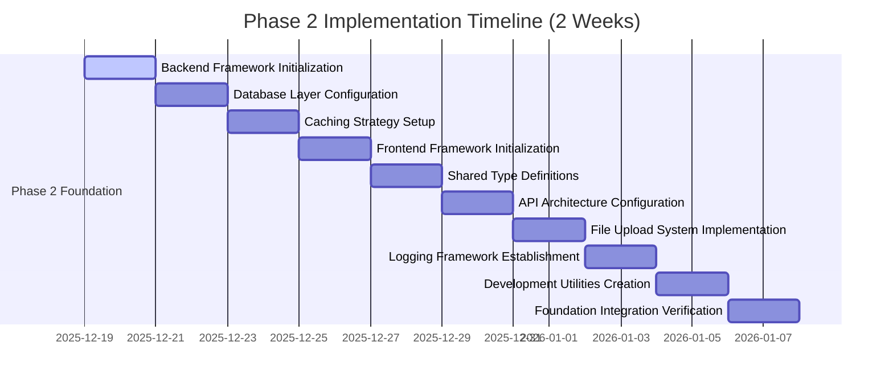

# SAFFRON SWEETS AND BAKERIES E-COMMERCE PLATFORM
## Phase 2: Comprehensive Implementation Guide
### 10 Sequential Milestones for Solo Developer Implementation

**Project:** Saffron Sweets and Bakeries E-Commerce Platform  
**Target Market:** Bangladesh  
**Technology Stack:** Next.js 14, React 18, TypeScript, Node.js, PostgreSQL, Redis  
**Deployment Target:** Organization's Private Cloud Infrastructure  
**Development Approach:** Solo Full Stack Developer (40 hours/week)  
**Timeline:** 2 Weeks (14 Days)  
**Document Version:** 1.0  
**Date:** December 5, 2025

---

## EXECUTIVE SUMMARY

This comprehensive Phase 2 implementation guide provides a structured approach to establishing the core architecture and foundation components for Bangladesh's premier bakery e-commerce platform. The guide is specifically designed for a solo full-stack developer working with an intensive 2-week timeline, focusing on establishing robust technical foundations while maintaining quality standards.

The 10 sequential milestones progress logically from backend framework initialization through foundation integration verification, incorporating Bangladesh-specific requirements including local compliance, cultural considerations, and technical specifications. Each milestone includes specific deliverables, dependencies, timeframes, technical requirements, success criteria, and potential risks.

This implementation guide builds upon the foundation established in Phase 1, creating a solid technical architecture that will support all subsequent development phases while ensuring scalability, security, and maintainability.

---

## PROJECT TIMELINE OVERVIEW



---

## MILESTONE 1: BACKEND FRAMEWORK INITIALIZATION
**Duration:** 2 Days (December 19-20, 2025)  
**Focus:** Establishing robust NestJS backend architecture with TypeScript

### Specific Deliverables
1. **NestJS Project Setup**
   - Initialize NestJS project with TypeScript configuration
   - Configure module structure with dependency injection
   - Set up global exception filters and interceptors
   - Implement API versioning strategy
   - Configure development server with hot reload

2. **Core Module Architecture**
   - Establish app module structure with proper imports
   - Configure shared modules (common, config, utils)
   - Set up module-based dependency injection
   - Implement module lifecycle hooks
   - Create module testing framework

3. **Global Configuration Setup**
   - Environment variable management with validation
   - Database connection configuration
   - CORS configuration for frontend integration
   - Security middleware configuration
   - Logging configuration setup

4. **Development Environment Optimization**
   - Hot reload configuration for rapid development
   - Debug configuration with source maps
   - Development database seeding
   - API testing environment setup
   - Performance monitoring setup

5. **Bangladesh-Specific Backend Configuration**
   - Time zone configuration (Asia/Dhaka)
   - Local currency formatting (BDT)
   - Bengali language support preparation
   - Local compliance settings
   - Regional data processing rules

### Dependencies
- Milestone 10: Deployment Preparation from Phase 1 (completed)

### Estimated Timeframes
- Day 1: NestJS project setup and core module architecture
- Day 2: Global configuration, development environment optimization, and Bangladesh-specific configuration

### Technical Requirements
#### NestJS Project Configuration
```typescript
// nest-cli.json
{
  "$schema": "https://json.schemastore.org/nest-cli",
  "collection": "@nestjs/schematics",
  "sourceRoot": "src",
  "compilerOptions": {
    "deleteOutDir": true,
    "webpack": true,
    "webpackConfigPath": "webpack.config.js"
  }
}

// tsconfig.json
{
  "compilerOptions": {
    "module": "commonjs",
    "declaration": true,
    "removeComments": true,
    "emitDecoratorMetadata": true,
    "experimentalDecorators": true,
    "allowSyntheticDefaultImports": true,
    "target": "ES2021",
    "sourceMap": true,
    "outDir": "./dist",
    "baseUrl": "./",
    "incremental": true,
    "skipLibCheck": true,
    "strictNullChecks": false,
    "noImplicitAny": false,
    "strictBindCallApply": false,
    "forceConsistentCasingInFileNames": false,
    "noFallthroughCasesInSwitch": false,
    "paths": {
      "@/*": ["src/*"],
      "@shared/*": ["src/shared/*"],
      "@config/*": ["src/config/*"]
    }
  }
}
```

#### Main Application Configuration
```typescript
// src/main.ts
import { NestFactory } from '@nestjs/core';
import { AppModule } from './app.module';
import { ValidationPipe } from '@nestjs/common';
import { DocumentBuilder, SwaggerModule } from '@nestjs/swagger';
import { ConfigService } from '@nestjs/config';
import helmet from 'helmet';
import * as compression from 'compression';
import { LoggingInterceptor } from './common/interceptors/logging.interceptor';
import { ExceptionFilter } from './common/filters/exception.filter';

async function bootstrap() {
  const app = await NestFactory.create(AppModule, {
    logger: ['error', 'warn', 'debug', 'log', 'verbose'],
  });

  const configService = app.get(ConfigService);

  // Security middleware
  app.use(helmet({
    contentSecurityPolicy: {
      directives: {
        defaultSrc: ["'self'"],
        styleSrc: ["'self'", "'unsafe-inline'"],
        scriptSrc: ["'self'"],
        imgSrc: ["'self'", "data:", "https:"],
      },
    },
  }));

  // Compression middleware
  app.use(compression());

  // Global validation pipe
  app.useGlobalPipes(
    new ValidationPipe({
      whitelist: true,
      forbidNonWhitelisted: true,
      transform: true,
      transformOptions: {
        enableImplicitConversion: true,
      },
    }),
  );

  // CORS configuration
  app.enableCors({
    origin: [
      'http://localhost:3000',
      'https://saffron-bakery.com',
      'https://www.saffron-bakery.com',
    ],
    credentials: true,
    methods: ['GET', 'POST', 'PUT', 'DELETE', 'PATCH', 'OPTIONS'],
    allowedHeaders: ['Content-Type', 'Authorization', 'X-Requested-With'],
  });

  // Global interceptors and filters
  app.useGlobalInterceptors(new LoggingInterceptor());
  app.useGlobalFilters(new ExceptionFilter());

  // API documentation
  const config = new DocumentBuilder()
    .setTitle('Saffron Bakery API')
    .setDescription('Comprehensive API for Saffron Sweets and Bakeries e-commerce platform')
    .setVersion('2.0.0')
    .addTag('auth', 'Authentication and authorization')
    .addTag('products', 'Product management')
    .addTag('orders', 'Order processing')
    .addTag('payments', 'Payment processing')
    .addTag('users', 'User management')
    .addBearerAuth()
    .build();

  const document = SwaggerModule.createDocument(app, config);
  SwaggerModule.setup('api/docs', app, document);

  // Bangladesh-specific configuration
  app.use((req, res, next) => {
    // Set timezone headers
    res.setHeader('X-Timezone', 'Asia/Dhaka');
    // Set currency headers
    res.setHeader('X-Currency', 'BDT');
    next();
  });

  const port = configService.get<number>('PORT') || 3001;
  await app.listen(port);
  console.log(`Application is running on: ${await app.getUrl()}`);
}

bootstrap();
```

#### App Module Structure
```typescript
// src/app.module.ts
import { Module } from '@nestjs/common';
import { ConfigModule, ConfigService } from '@nestjs/config';
import { TypeOrmModule } from '@nestjs/typeorm';
import { RedisModule } from '@nestjs/redis';
import { AuthModule } from './auth/auth.module';
import { UsersModule } from './users/users.module';
import { ProductsModule } from './products/products.module';
import { OrdersModule } from './orders/orders.module';
import { PaymentsModule } from './payments/payments.module';
import { CommonModule } from './common/common.module';
import { configuration } from './config/configuration';

@Module({
  imports: [
    // Configuration module
    ConfigModule.forRoot({
      isGlobal: true,
      load: [configuration],
      envFilePath: ['.env.development', '.env'],
    }),

    // Database module
    TypeOrmModule.forRootAsync({
      imports: [ConfigModule],
      useFactory: (configService: ConfigService) => ({
        type: 'postgres',
        host: configService.get('DB_HOST'),
        port: configService.get('DB_PORT'),
        username: configService.get('DB_USERNAME'),
        password: configService.get('DB_PASSWORD'),
        database: configService.get('DB_NAME'),
        entities: [__dirname + '/**/*.entity{.ts,.js}'],
        synchronize: false,
        logging: configService.get('NODE_ENV') === 'development',
        migrations: [__dirname + '/migrations/*{.ts,.js}'],
        migrationsRun: false,
        timezone: 'Asia/Dhaka', // Bangladesh timezone
      }),
      inject: [ConfigService],
    }),

    // Redis module
    RedisModule.forRootAsync({
      imports: [ConfigModule],
      useFactory: (configService: ConfigService) => ({
        host: configService.get('REDIS_HOST'),
        port: configService.get('REDIS_PORT'),
        password: configService.get('REDIS_PASSWORD'),
        db: 0,
        retryDelayOnFailover: 100,
        maxRetriesPerRequest: 3,
      }),
      inject: [ConfigService],
    }),

    // Feature modules
    AuthModule,
    UsersModule,
    ProductsModule,
    OrdersModule,
    PaymentsModule,
    CommonModule,
  ],
  providers: [ConfigService],
})
export class AppModule {}
```

#### Bangladesh-Specific Configuration
```typescript
// src/config/bangladesh.config.ts
export const bangladeshConfig = {
  timezone: 'Asia/Dhaka',
  currency: {
    code: 'BDT',
    symbol: '৳',
    decimalPlaces: 2,
  },
  language: {
    default: 'bn',
    supported: ['bn', 'en'],
    rtl: false,
  },
  business: {
    workingHours: {
      start: '09:00',
      end: '22:00',
      weekends: ['friday'], // Friday is weekend in Bangladesh
    },
    holidays: [
      // Major Bangladesh holidays
      '2025-02-21', // International Mother Language Day
      '2025-03-17', // Independence Day
      '2025-03-26', // Independence Day
      '2025-04-14', // Bengali New Year
      '2025-05-01', // May Day
      '2025-12-16', // Victory Day
      '2025-12-25', // Christmas Day
    ],
  },
  compliance: {
    dataResidency: true, // Data must stay within Bangladesh
    taxRate: 0.15, // 15% VAT
    paymentMethods: ['bkash', 'nagad', 'rocket', 'sslcommerz', 'cod'],
  },
};
```

### Success Criteria
- NestJS project initialized with TypeScript and proper configuration
- Core module architecture established with dependency injection
- Global configuration setup with environment management
- Development environment optimized for rapid development
- Bangladesh-specific configuration implemented and tested

### Potential Risks
- **Configuration Complexity:** Multiple configuration files may become difficult to manage
  - **Mitigation:** Use centralized configuration service with validation
- **Module Dependencies:** Circular dependencies may occur
  - **Mitigation:** Follow dependency injection best practices and use forwardRef
- **Development Environment Issues:** Hot reload may not work properly
  - **Mitigation:** Test configuration incrementally and use proper webpack setup

---

## MILESTONE 2: DATABASE LAYER CONFIGURATION
**Duration:** 2 Days (December 21-22, 2025)  
**Focus:** Establishing robust TypeORM database layer with PostgreSQL

### Specific Deliverables
1. **TypeORM Configuration**
   - Set up TypeORM with PostgreSQL connection
   - Configure database migration system
   - Establish entity relationships and constraints
   - Implement repository pattern
   - Configure database connection pooling

2. **Entity Base Classes**
   - Create base entity with common fields
   - Implement soft delete functionality
   - Add audit fields (created, updated, deleted)
   - Create timestamp management
   - Implement entity validation decorators

3. **Database Migration System**
   - Set up migration creation workflow
   - Implement migration rollback procedures
   - Create migration testing framework
   - Establish migration versioning
   - Set up automated migration execution

4. **Repository Pattern Implementation**
   - Create base repository with common methods
   - Implement custom repository methods
   - Set up query builder utilities
   - Create pagination helpers
   - Implement transaction management

5. **Bangladesh-Specific Database Configuration**
   - Configure Bangladesh timezone handling
   - Set up Bengali text search capabilities
   - Implement local currency storage
   - Configure data residency compliance
   - Set up regional data formatting

### Dependencies
- Milestone 1: Backend Framework Initialization (completed)

### Estimated Timeframes
- Day 1: TypeORM configuration and entity base classes
- Day 2: Database migration system, repository pattern, and Bangladesh-specific configuration

### Technical Requirements
#### TypeORM Configuration
```typescript
// src/config/database.config.ts
import { TypeOrmModuleOptions } from '@nestjs/typeorm';
import { ConfigService } from '@nestjs/config';

export const getDatabaseConfig = (configService: ConfigService): TypeOrmModuleOptions => ({
  type: 'postgres',
  host: configService.get<string>('DB_HOST', 'localhost'),
  port: configService.get<number>('DB_PORT', 5432),
  username: configService.get<string>('DB_USERNAME'),
  password: configService.get<string>('DB_PASSWORD'),
  database: configService.get<string>('DB_NAME'),
  
  // Entity configuration
  entities: [__dirname + '/../**/*.entity{.ts,.js}'],
  synchronize: configService.get<string>('NODE_ENV') === 'development',
  migrationsRun: false,
  migrations: [__dirname + '/../migrations/*{.ts,.js}'],
  
  // Connection pool configuration
  extra: {
    connectionLimit: 100,
    acquireTimeoutMillis: 60000,
    createTimeoutMillis: 30000,
    destroyTimeoutMillis: 5000,
    idleTimeoutMillis: 600000,
    reapIntervalMillis: 1000,
    createRetryIntervalMillis: 200,
  },
  
  // Logging configuration
  logging: configService.get<string>('NODE_ENV') === 'development' ? ['query', 'error', 'schema', 'warn'] : ['error'],
  
  // Bangladesh-specific configuration
  timezone: 'Asia/Dhaka',
  charset: 'utf8',
  clientEncoding: 'utf8',
  
  // Performance configuration
  maxQueryExecutionTime: 1000,
  keepConnectionAlive: true,
  
  // SSL configuration for production
  ssl: configService.get<string>('NODE_ENV') === 'production' ? {
    rejectUnauthorized: false,
    ca: configService.get<string>('DB_CA_CERT'),
    key: configService.get<string>('DB_KEY'),
    cert: configService.get<string>('DB_CERT'),
  } : false,
});
```

#### Base Entity Class
```typescript
// src/common/entities/base.entity.ts
import { 
  Entity, 
  PrimaryGeneratedColumn, 
  CreateDateColumn, 
  UpdateDateColumn, 
  DeleteDateColumn,
  Column,
  BeforeInsert,
  BeforeUpdate,
} from 'typeorm';
import { Exclude } from 'class-transformer';

@Entity()
export abstract class BaseEntity {
  @PrimaryGeneratedColumn('uuid')
  id: string;

  @CreateDateColumn({
    type: 'timestamp with time zone',
    default: () => 'CURRENT_TIMESTAMP',
    comment: 'Record creation timestamp in Bangladesh timezone',
  })
  @Exclude()
  createdAt: Date;

  @UpdateDateColumn({
    type: 'timestamp with time zone',
    default: () => 'CURRENT_TIMESTAMP',
    comment: 'Record last update timestamp in Bangladesh timezone',
  })
  @Exclude()
  updatedAt: Date;

  @DeleteDateColumn({
    type: 'timestamp with time zone',
    nullable: true,
    comment: 'Record soft delete timestamp in Bangladesh timezone',
  })
  @Exclude()
  deletedAt?: Date;

  // Bangladesh-specific fields
  @Column({
    type: 'varchar',
    length: 3,
    default: 'BDT',
    comment: 'Currency code for Bangladesh market',
  })
  currency: string;

  @Column({
    type: 'varchar',
    length: 50,
    nullable: true,
    comment: 'Timezone for record operations',
  })
  timezone: string;

  @BeforeInsert()
  beforeInsert() {
    this.timezone = this.timezone || 'Asia/Dhaka';
  }

  @BeforeUpdate()
  beforeUpdate() {
    this.timezone = this.timezone || 'Asia/Dhaka';
  }
}
```

#### Base Repository Class
```typescript
// src/common/repositories/base.repository.ts
import { Repository, EntityTarget, ObjectLiteral, FindManyOptions, FindOneOptions } from 'typeorm';
import { BaseEntity } from '../entities/base.entity';
import { PaginationDto } from '../dto/pagination.dto';
import { IPaginationResult } from '../interfaces/pagination-result.interface';

export abstract class BaseRepository<T extends BaseEntity> extends Repository<T> {
  constructor(private entityTarget: EntityTarget<T>) {
    super();
  }

  async findWithPagination(
    paginationDto: PaginationDto,
    options?: FindManyOptions<T>,
  ): Promise<IPaginationResult<T>> {
    const { page = 1, limit = 20, sortBy, sortOrder = 'ASC' } = paginationDto;
    
    const skip = (page - 1) * limit;
    
    const [items, total] = await this.findAndCount({
      ...options,
      skip,
      take: limit,
      order: sortBy ? { [sortBy]: sortOrder } : { createdAt: 'DESC' },
    });

    return {
      items,
      total,
      page,
      limit,
      totalPages: Math.ceil(total / limit),
      hasNext: page * limit < total,
      hasPrevious: page > 1,
    };
  }

  async findOneActive(id: string): Promise<T | null> {
    return this.findOne({
      where: { id, deletedAt: null },
    });
  }

  async softDelete(id: string): Promise<void> {
    await this.update(id, { deletedAt: new Date() });
  }

  async restore(id: string): Promise<void> {
    await this.update(id, { deletedAt: null });
  }

  // Bangladesh-specific search with Bengali support
  async searchBengali(
    searchTerm: string,
    fields: string[] = [],
    options?: FindManyOptions<T>,
  ): Promise<T[]> {
    const queryBuilder = this.createQueryBuilder('entity');
    
    if (fields.length > 0) {
      const searchConditions = fields.map(field => 
        `entity.${field} ILIKE :searchTerm OR entity.${field}_bn ILIKE :searchTerm`
      ).join(' OR ');
      
      queryBuilder.where(searchConditions, { searchTerm: `%${searchTerm}%` });
    } else {
      queryBuilder.where(
        'entity.name ILIKE :searchTerm OR entity.name_bn ILIKE :searchTerm',
        { searchTerm: `%${searchTerm}%` }
      );
    }
    
    return queryBuilder.getMany();
  }
}
```

#### Migration Template
```typescript
// src/migrations/BaseMigration.ts
import { MigrationInterface, QueryRunner, Table } from 'typeorm';

export abstract class BaseMigration implements MigrationInterface {
  abstract name: string;

  protected async createTable(
    queryRunner: QueryRunner,
    tableName: string,
    columns: any[],
  ): Promise<void> {
    const table = new Table({
      name: tableName,
      columns: [
        {
          name: 'id',
          type: 'uuid',
          isPrimary: true,
          generationStrategy: 'uuid',
          default: 'gen_random_uuid()',
        },
        {
          name: 'created_at',
          type: 'timestamp with time zone',
          default: 'CURRENT_TIMESTAMP',
        },
        {
          name: 'updated_at',
          type: 'timestamp with time zone',
          default: 'CURRENT_TIMESTAMP',
        },
        {
          name: 'deleted_at',
          type: 'timestamp with time zone',
          isNullable: true,
        },
        ...columns,
      ],
    });

    await queryRunner.createTable(table);
  }

  protected async addBengaliSupport(
    queryRunner: QueryRunner,
    tableName: string,
    fields: string[],
  ): Promise<void> {
    for (const field of fields) {
      await queryRunner.query(`
        ALTER TABLE ${tableName} 
        ADD COLUMN ${field}_bn VARCHAR(255) 
        COMMENT 'Bengali translation of ${field}'
      `);
    }
  }

  protected async addBangladeshIndexes(
    queryRunner: QueryRunner,
    tableName: string,
    indexes: Array<{ columns: string[], unique?: boolean }>,
  ): Promise<void> {
    for (const index of indexes) {
      const indexName = `idx_${tableName}_${index.columns.join('_')}`;
      await queryRunner.createIndex(
        tableName,
        index.columns,
        { unique: index.unique || false, name: indexName }
      );
    }
  }
}
```

#### Database Service
```typescript
// src/database/database.service.ts
import { Injectable } from '@nestjs/common';
import { ConfigService } from '@nestjs/config';
import { Connection, createConnection } from 'typeorm';
import { getDatabaseConfig } from '../config/database.config';

@Injectable()
export class DatabaseService {
  private connection: Connection;

  constructor(private configService: ConfigService) {}

  async getConnection(): Promise<Connection> {
    if (!this.connection) {
      this.connection = await createConnection(getDatabaseConfig(this.configService));
    }
    return this.connection;
  }

  async runMigrations(): Promise<void> {
    const connection = await this.getConnection();
    await connection.runMigrations();
  }

  async closeConnection(): Promise<void> {
    if (this.connection) {
      await this.connection.close();
      this.connection = null;
    }
  }

  // Bangladesh-specific database operations
  async getBangladeshTime(): Promise<Date> {
    const response = await this.connection.query(`
      SELECT CURRENT_TIMESTAMP AT TIME ZONE 'Asia/Dhaka' as bangladesh_time
    `);
    return response[0].bangladesh_time;
  }

  async formatCurrency(amount: number): Promise<string> {
    return `৳${amount.toFixed(2)}`;
  }
}
```

### Success Criteria
- TypeORM configured with PostgreSQL connection and pooling
- Base entity and repository classes implemented
- Database migration system established and tested
- Repository pattern implemented with common operations
- Bangladesh-specific database configuration functional

### Potential Risks
- **Connection Issues:** Database connection may fail due to configuration
  - **Mitigation:** Implement connection retry logic and proper error handling
- **Migration Conflicts:** Migrations may conflict in team environments
  - **Mitigation:** Use proper migration naming and versioning
- **Performance Issues:** Complex queries may be slow
  - **Mitigation:** Implement proper indexing and query optimization

---

## MILESTONE 3: CACHING STRATEGY SETUP
**Duration:** 2 Days (December 23-24, 2025)  
**Focus:** Implementing comprehensive Redis caching strategy

### Specific Deliverables
1. **Redis Configuration**
   - Set up Redis connection in NestJS
   - Configure Redis client with connection pooling
   - Implement Redis health monitoring
   - Set up Redis clustering for scalability
   - Configure Redis persistence and backup

2. **Cache Service Implementation**
   - Create generic cache service
   - Implement cache decorators
   - Set up cache invalidation strategies
   - Create cache warming mechanisms
   - Implement cache analytics

3. **Session Management**
   - Set up Redis-based session storage
   - Implement session serialization
   - Create session security measures
   - Set up session expiration policies
   - Implement session analytics

4. **API Response Caching**
   - Implement response caching middleware
   - Set up cache key generation
   - Create cache invalidation on data changes
   - Implement cache warming for popular content
   - Set up cache performance monitoring

5. **Bangladesh-Specific Caching**
   - Configure caching for local payment methods
   - Set up currency conversion caching
   - Implement Bengali content caching
   - Create regional data caching
   - Set up local delivery information caching

### Dependencies
- Milestone 2: Database Layer Configuration (completed)

### Estimated Timeframes
- Day 1: Redis configuration and cache service implementation
- Day 2: Session management, API response caching, and Bangladesh-specific caching

### Technical Requirements
#### Redis Module Configuration
```typescript
// src/redis/redis.module.ts
import { Module, Global } from '@nestjs/common';
import { ConfigModule, ConfigService } from '@nestjs/config';
import { RedisModule as NestRedisModule } from '@nestjs/redis';

@Global()
@Module({
  imports: [
    NestRedisModule.forRootAsync({
      imports: [ConfigModule],
      useFactory: async (configService: ConfigService) => ({
        config: {
          host: configService.get('REDIS_HOST', 'localhost'),
          port: configService.get('REDIS_PORT', 6379),
          password: configService.get('REDIS_PASSWORD'),
          db: configService.get('REDIS_DB', 0),
          
          // Connection pooling
          maxRetriesPerRequest: 3,
          retryDelayOnFailover: 100,
          lazyConnect: true,
          keepAlive: 30000,
          
          // Bangladesh-specific configuration
          keyPrefix: 'saffron_bakery:',
          
          // Performance optimization
          enableReadyCheck: true,
          maxLoadingTimeout: 5000,
          
          // Cluster configuration for production
          cluster: configService.get('NODE_ENV') === 'production' ? [
            { host: configService.get('REDIS_CLUSTER_HOST_1'), port: 6379 },
            { host: configService.get('REDIS_CLUSTER_HOST_2'), port: 6379 },
            { host: configService.get('REDIS_CLUSTER_HOST_3'), port: 6379 },
          ] : undefined,
        },
      }),
      inject: [ConfigService],
    }),
  ],
  exports: ['REDIS_CLIENT'],
})
export class RedisModule {}
```

#### Cache Service
```typescript
// src/cache/cache.service.ts
import { Injectable, Inject } from '@nestjs/common';
import { Redis } from 'ioredis';
import { ConfigService } from '@nestjs/config';

@Injectable()
export class CacheService {
  constructor(
    @Inject('REDIS_CLIENT') private readonly redis: Redis,
    private configService: ConfigService,
  ) {}

  async get<T>(key: string): Promise<T | null> {
    try {
      const value = await this.redis.get(key);
      return value ? JSON.parse(value) : null;
    } catch (error) {
      console.error(`Cache get error for key ${key}:`, error);
      return null;
    }
  }

  async set<T>(
    key: string, 
    value: T, 
    ttl: number = 3600
  ): Promise<void> {
    try {
      await this.redis.setex(key, ttl, JSON.stringify(value));
    } catch (error) {
      console.error(`Cache set error for key ${key}:`, error);
    }
  }

  async del(key: string): Promise<void> {
    try {
      await this.redis.del(key);
    } catch (error) {
      console.error(`Cache delete error for key ${key}:`, error);
    }
  }

  async invalidatePattern(pattern: string): Promise<void> {
    try {
      const keys = await this.redis.keys(pattern);
      if (keys.length > 0) {
        await this.redis.del(...keys);
      }
    } catch (error) {
      console.error(`Cache invalidation error for pattern ${pattern}:`, error);
    }
  }

  // Bangladesh-specific caching methods
  async cacheCurrencyRates(): Promise<void> {
    const cacheKey = 'currency_rates:bdt';
    const rates = {
      BDT: 1,
      USD: 0.0092,
      EUR: 0.0085,
      GBP: 0.0073,
    };
    await this.set(cacheKey, rates, 86400); // 24 hours
  }

  async cachePaymentMethods(): Promise<void> {
    const cacheKey = 'payment_methods:bangladesh';
    const methods = [
      { id: 'bkash', name: 'bKash', fee: 0.015 },
      { id: 'nagad', name: 'Nagad', fee: 0.018 },
      { id: 'rocket', name: 'Rocket', fee: 0.020 },
      { id: 'sslcommerz', name: 'SSLCommerz', fee: 0.025 },
      { id: 'cod', name: 'Cash on Delivery', fee: 0.030 },
    ];
    await this.set(cacheKey, methods, 604800); // 7 days
  }

  async cacheDeliveryZones(): Promise<void> {
    const cacheKey = 'delivery_zones:bangladesh';
    const zones = [
      { id: 'dhaka', name: 'Dhaka', fee: 50, estimatedTime: '1-2 hours' },
      { id: 'chattogram', name: 'Chattogram', fee: 80, estimatedTime: '2-3 hours' },
      { id: 'rajshahi', name: 'Rajshahi', fee: 70, estimatedTime: '2-3 hours' },
      { id: 'khulna', name: 'Khulna', fee: 75, estimatedTime: '2-3 hours' },
      { id: 'sylhet', name: 'Sylhet', fee: 85, estimatedTime: '3-4 hours' },
      { id: 'barisal', name: 'Barisal', fee: 90, estimatedTime: '3-4 hours' },
      { id: 'rangpur', name: 'Rangpur', fee: 95, estimatedTime: '3-4 hours' },
    ];
    await this.set(cacheKey, zones, 86400); // 24 hours
  }
}
```

#### Cache Decorator
```typescript
// src/cache/cache.decorator.ts
import { SetMetadata } from '@nestjs/common';
import { CacheService } from './cache.service';

export const CACHE_KEY_METADATA = 'cache_key';
export const CACHE_TTL_METADATA = 'cache_ttl';

export const Cache = (key: string, ttl: number = 3600) => {
  return (target: any, propertyKey: string, descriptor: PropertyDescriptor) => {
    const originalMethod = descriptor.value;

    descriptor.value = async function (...args: any[]) {
      const cacheKey = `${key}:${JSON.stringify(args)}`;
      const cacheService = this.cacheService || new CacheService();
      
      // Try to get from cache
      const cachedResult = await cacheService.get(cacheKey);
      if (cachedResult !== null) {
        return cachedResult;
      }

      // Execute original method
      const result = await originalMethod.apply(this, args);
      
      // Cache the result
      await cacheService.set(cacheKey, result, ttl);
      
      return result;
    };

    SetMetadata(CACHE_KEY_METADATA, key)(target, propertyKey, descriptor);
    SetMetadata(CACHE_TTL_METADATA, ttl)(target, propertyKey, descriptor);
  };
};
```

#### Session Management Service
```typescript
// src/session/session.service.ts
import { Injectable } from '@nestjs/common';
import { Redis } from 'ioredis';
import { v4 as uuidv4 } from 'uuid';

@Injectable()
export class SessionService {
  constructor(@Inject('REDIS_CLIENT') private readonly redis: Redis) {}

  async createSession(userId: string, userData: any): Promise<string> {
    const sessionId = uuidv4();
    const sessionKey = `session:${sessionId}`;
    const userSessionKey = `user_sessions:${userId}`;
    
    const sessionData = {
      userId,
      userData,
      createdAt: new Date().toISOString(),
      lastActivity: new Date().toISOString(),
      timezone: 'Asia/Dhaka',
    };

    // Create session
    await this.redis.setex(sessionKey, 86400, JSON.stringify(sessionData)); // 24 hours
    
    // Add to user's active sessions
    await this.redis.sadd(userSessionKey, sessionId);
    await this.redis.expire(userSessionKey, 86400);
    
    return sessionId;
  }

  async getSession(sessionId: string): Promise<any | null> {
    const sessionKey = `session:${sessionId}`;
    const sessionData = await this.redis.get(sessionKey);
    
    if (sessionData) {
      const session = JSON.parse(sessionData);
      
      // Update last activity
      session.lastActivity = new Date().toISOString();
      await this.redis.setex(sessionKey, 86400, JSON.stringify(session));
      
      return session;
    }
    
    return null;
  }

  async destroySession(sessionId: string): Promise<void> {
    const sessionKey = `session:${sessionId}`;
    const sessionData = await this.redis.get(sessionKey);
    
    if (sessionData) {
      const session = JSON.parse(sessionData);
      const userSessionKey = `user_sessions:${session.userId}`;
      
      // Remove session
      await this.redis.del(sessionKey);
      
      // Remove from user's active sessions
      await this.redis.srem(userSessionKey, sessionId);
    }
  }

  async getUserSessions(userId: string): Promise<string[]> {
    const userSessionKey = `user_sessions:${userId}`;
    return this.redis.smembers(userSessionKey);
  }

  // Bangladesh-specific session features
  async setBangladeshContext(sessionId: string): Promise<void> {
    const sessionKey = `session:${sessionId}`;
    const sessionData = await this.redis.get(sessionKey);
    
    if (sessionData) {
      const session = JSON.parse(sessionData);
      session.bangladeshContext = {
        currency: 'BDT',
        timezone: 'Asia/Dhaka',
        language: 'bn',
        paymentMethods: ['bkash', 'nagad', 'rocket', 'sslcommerz', 'cod'],
        deliveryZones: ['dhaka', 'chattogram', 'rajshahi', 'khulna', 'sylhet', 'barisal', 'rangpur'],
      };
      
      await this.redis.setex(sessionKey, 86400, JSON.stringify(session));
    }
  }
}
```

#### Cache Interceptor
```typescript
// src/cache/cache.interceptor.ts
import { 
  Injectable, 
  ExecutionContext, 
  CallHandler, 
  NestInterceptor 
} from '@nestjs/common';
import { Observable, of } from 'rxjs';
import { tap } from 'rxjs/operators';
import { Reflector } from '@nestjs/core';
import { CacheService } from './cache.service';
import { CACHE_KEY_METADATA, CACHE_TTL_METADATA } from './cache.decorator';

@Injectable()
export class CacheInterceptor implements NestInterceptor {
  constructor(
    private readonly cacheService: CacheService,
    private readonly reflector: Reflector,
  ) {}

  intercept(
    context: ExecutionContext,
    next: CallHandler,
  ): Observable<any> {
    const cacheKey = this.reflector.get<string>(
      CACHE_KEY_METADATA,
      context.getHandler(),
    );
    const cacheTTL = this.reflector.get<number>(
      CACHE_TTL_METADATA,
      context.getHandler(),
    );

    if (!cacheKey) {
      return next.handle();
    }

    const request = context.switchToHttp().getRequest();
    const cacheKeyWithParams = `${cacheKey}:${JSON.stringify(request.params)}:${JSON.stringify(request.query)}`;

    return this.cacheService.get(cacheKeyWithParams).then(cachedResponse => {
      if (cachedResponse) {
        return of(cachedResponse);
      }

      return next.handle().pipe(
        tap(response => {
          this.cacheService.set(cacheKeyWithParams, response, cacheTTL);
        }),
      );
    });
  }
}
```

### Success Criteria
- Redis configured with connection pooling and monitoring
- Cache service implemented with decorators and invalidation
- Session management system functional with security measures
- API response caching implemented with performance monitoring
- Bangladesh-specific caching strategies operational

### Potential Risks
- **Cache Invalidation:** Cache may not invalidate properly when data changes
  - **Mitigation:** Implement event-driven cache invalidation
- **Memory Issues:** Redis may consume excessive memory
  - **Mitigation:** Implement proper TTL and memory monitoring
- **Session Security:** Sessions may be vulnerable to hijacking
  - **Mitigation:** Implement proper session validation and security measures

---

## MILESTONE 4: FRONTEND FRAMEWORK INITIALIZATION
**Duration:** 2 Days (December 25-26, 2025)  
**Focus:** Establishing Next.js 14 frontend with TypeScript and Tailwind CSS

### Specific Deliverables
1. **Next.js Project Setup**
   - Initialize Next.js 14 project with TypeScript
   - Configure Tailwind CSS with custom theme
   - Set up component library structure
   - Configure internationalization (i18n) for Bengali/English
   - Establish state management with Zustand

2. **Project Structure Organization**
   - Create standardized directory structure
   - Set up component organization
   - Configure page routing structure
   - Establish utility functions organization
   - Create asset management system

3. **Development Environment Configuration**
   - Configure hot reload and fast refresh
   - Set up development server
   - Configure proxy for API calls
   - Set up debugging configuration
   - Create development scripts

4. **Bangladesh-Specific Frontend Setup**
   - Configure Bengali language support
   - Set up BDT currency formatting
   - Implement Bangladesh timezone handling
   - Configure mobile-first design
   - Set up local font and typography

5. **Performance Optimization Setup**
   - Configure image optimization
   - Set up code splitting
   - Implement lazy loading
   - Configure bundle optimization
   - Set up performance monitoring

### Dependencies
- Milestone 3: Caching Strategy Setup (completed)

### Estimated Timeframes
- Day 1: Next.js project setup and project structure organization
- Day 2: Development environment configuration, Bangladesh-specific setup, and performance optimization

### Technical Requirements
#### Next.js Configuration
```javascript
// next.config.js
/** @type {import('next').NextConfig} */
const nextConfig = {
  reactStrictMode: true,
  swcMinify: true,
  
  experimental: {
    optimizeCss: true,
    optimizePackageImports: ['lucide-react', '@headlessui/react', 'clsx'],
    serverComponentsExternalPackages: ['@prisma/client'],
  },
  
  images: {
    domains: ['localhost', 'saffron-bakery.com', 'cdn.saffron-bakery.com'],
    formats: ['image/avif', 'image/webp'],
    deviceSizes: [640, 750, 828, 1080, 1200, 1920, 2048],
    imageSizes: [16, 32, 48, 64, 96, 128, 256, 384],
    minimumCacheTTL: 60,
  },
  
  i18n: {
    locales: ['bn', 'en'],
    defaultLocale: 'bn',
    localeDetection: true,
    domains: [
      {
        domain: 'saffron-bakery.com',
        defaultLocale: 'bn',
      },
      {
        domain: 'en.saffron-bakery.com',
        defaultLocale: 'en',
      },
    ],
  },
  
  env: {
    CUSTOM_KEY: process.env.CUSTOM_KEY,
  },
  
  async rewrites() {
    return [
      {
        source: '/api/:path*',
        destination: `${process.env.NEXT_PUBLIC_API_URL}/api/:path*`,
      },
    ];
  },
  
  async redirects() {
    return [
      {
        source: '/home',
        destination: '/',
        permanent: true,
      },
    ];
  },
  
  webpack: (config, { buildId, dev, isServer, defaultLoaders, webpack }) => {
    // Bangladesh-specific webpack configuration
    config.resolve.alias = {
      ...config.resolve.alias,
      '@components': path.resolve(__dirname, 'src/components'),
      '@lib': path.resolve(__dirname, 'src/lib'),
      '@styles': path.resolve(__dirname, 'src/styles'),
      '@types': path.resolve(__dirname, 'src/types'),
      '@utils': path.resolve(__dirname, 'src/utils'),
      '@hooks': path.resolve(__dirname, 'src/hooks'),
      '@store': path.resolve(__dirname, 'src/store'),
    };
    
    return config;
  },
};

module.exports = nextConfig;
```

#### Tailwind CSS Configuration
```javascript
// tailwind.config.js
const defaultTheme = require('tailwindcss/defaultTheme');
const colors = require('tailwindcss/colors');

module.exports = {
  content: [
    './src/pages/**/*.{js,ts,jsx,tsx,mdx}',
    './src/components/**/*.{js,ts,jsx,tsx,mdx}',
    './src/app/**/*.{js,ts,jsx,tsx,mdx}',
  ],
  theme: {
    extend: {
      colors: {
        // Saffron brand colors
        saffron: {
          50: '#fff8f0',
          100: '#fef3e2',
          200: '#fde8c3',
          300: '#fbd9a4',
          400: '#f8c774',
          500: '#f59e0b', // Primary saffron
          600: '#d97706',
          700: '#b45309',
          800: '#92400e',
          900: '#78350f',
        },
        // Bangladesh theme colors
        bangladesh: {
          green: '#006a4e', // Bangladesh flag green
          red: '#f42a41', // Bangladesh flag red
        },
        // Currency and payment colors
        currency: {
          bdt: '#006a4e',
          success: '#10b981',
          warning: '#f59e0b',
          error: '#ef4444',
        },
      },
      fontFamily: {
        // Bengali font support
        bengali: ['Kalpurush', 'Arial', 'sans-serif'],
        sans: ['Inter', 'system-ui', 'sans-serif'],
      },
      fontSize: {
        // Mobile-optimized font sizes for Bangladesh
        'mobile-xs': ['0.75rem', { lineHeight: '1rem' }],
        'mobile-sm': ['0.875rem', { lineHeight: '1.25rem' }],
        'mobile-base': ['1rem', { lineHeight: '1.5rem' }],
        'mobile-lg': ['1.125rem', { lineHeight: '1.75rem' }],
      },
      spacing: {
        '18': '4.5rem',
        '88': '22rem',
        '128': '32rem',
      },
      animation: {
        'fade-in': 'fadeIn 0.5s ease-in-out',
        'slide-up': 'slideUp 0.3s ease-out',
        'bounce-gentle': 'bounceGentle 2s infinite',
      },
    },
  },
  plugins: [
    require('@tailwindcss/forms'),
    require('@tailwindcss/typography'),
    require('@tailwindcss/aspect-ratio'),
  ],
};
```

#### Internationalization Setup
```typescript
// lib/i18n.ts
export const i18n = {
  defaultLocale: 'bn',
  locales: ['bn', 'en'],
} as const;

export type Locale = (typeof i18n)['locales'][number];

// Bengali number formatter
export class BengaliNumberFormatter {
  private static readonly bengaliDigits = ['০', '১', '২', '৩', '৪', '৫', '৬', '৭', '৮', '৯'];
  
  static toBengali(num: number | string): string {
    const numStr = num.toString();
    return numStr.replace(/\d/g, (digit) => {
      return this.bengaliDigits[parseInt(digit)];
    });
  }
  
  static formatCurrency(amount: number): string {
    return `৳${this.toBengali(amount.toFixed(2))}`;
  }
  
  static formatDate(date: Date): string {
    const options: Intl.DateTimeFormatOptions = {
      timeZone: 'Asia/Dhaka',
      year: 'numeric',
      month: 'long',
      day: 'numeric',
    };
    
    return new Intl.DateTimeFormat('bn-BD', options).format(date);
  }
}

// Translation utilities
export const translations = {
  bn: {
    common: {
      welcome: 'স্বাগতম',
      login: 'লগইন',
      register: 'নিবন্ধনভুক্ত',
      cart: 'কার্ট',
      checkout: 'চেকআউট',
      payment: 'পেমেন্ট',
      order: 'অর্ডার',
      delivery: 'ডেলিভারি',
      contact: 'যোগাযোগ',
      about: 'আমাদের সম্পর্কে',
    },
    currency: {
      bdt: 'টাকা',
      price: 'মূল্য',
      total: 'সর্বমোট',
      discount: 'ছাড়',
      tax: 'ভ্যাট',
    },
    navigation: {
      home: 'হোম',
      products: 'পণ্যসাম',
      categories: 'বিভাগ',
      offers: 'অফার',
      account: 'একাউন্ট',
    },
  },
  en: {
    common: {
      welcome: 'Welcome',
      login: 'Login',
      register: 'Register',
      cart: 'Cart',
      checkout: 'Checkout',
      payment: 'Payment',
      order: 'Order',
      delivery: 'Delivery',
      contact: 'Contact',
      about: 'About Us',
    },
    currency: {
      bdt: 'Taka',
      price: 'Price',
      total: 'Total',
      discount: 'Discount',
      tax: 'Tax',
    },
    navigation: {
      home: 'Home',
      products: 'Products',
      categories: 'Categories',
      offers: 'Offers',
      account: 'Account',
    },
  },
};
```

#### Zustand Store Setup
```typescript
// store/index.ts
import { create } from 'zustand';
import { persist } from 'zustand/middleware';

// Types
interface UserState {
  user: User | null;
  isAuthenticated: boolean;
  language: 'bn' | 'en';
  currency: 'BDT';
  timezone: string;
  login: (user: User) => void;
  logout: () => void;
  setLanguage: (language: 'bn' | 'en') => void;
  setCurrency: (currency: 'BDT') => void;
}

interface CartState {
  items: CartItem[];
  total: number;
  itemCount: number;
  addItem: (item: CartItem) => void;
  removeItem: (productId: string) => void;
  updateQuantity: (productId: string, quantity: number) => void;
  clearCart: () => void;
}

interface UIState {
  isLoading: boolean;
  sidebarOpen: boolean;
  theme: 'light' | 'dark';
  notifications: Notification[];
  setLoading: (loading: boolean) => void;
  toggleSidebar: () => void;
  setTheme: (theme: 'light' | 'dark') => void;
  addNotification: (notification: Notification) => void;
  removeNotification: (id: string) => void;
}

// Bangladesh-specific store configuration
const useUserStore = create<UserState>()(
  persist(
    (set, get) => ({
      user: null,
      isAuthenticated: false,
      language: 'bn', // Default to Bengali
      currency: 'BDT',
      timezone: 'Asia/Dhaka',
      
      login: (user) => set({ user, isAuthenticated: true }),
      logout: () => set({ user: null, isAuthenticated: false }),
      setLanguage: (language) => set({ language }),
      setCurrency: (currency) => set({ currency }),
    }),
    {
      name: 'saffron-user-storage',
      getStorage: () => localStorage,
      setStorage: () => localStorage,
    }
  )
);

const useCartStore = create<CartState>()(
  persist(
    (set, get) => ({
      items: [],
      total: 0,
      itemCount: 0,
      
      addItem: (item) => {
        const { items } = get();
        const existingItem = items.find(i => i.productId === item.productId);
        
        if (existingItem) {
          existingItem.quantity += item.quantity;
        } else {
          items.push(item);
        }
        
        const total = items.reduce((sum, item) => sum + (item.price * item.quantity), 0);
        const itemCount = items.reduce((sum, item) => sum + item.quantity, 0);
        
        set({ items, total, itemCount });
      },
      
      removeItem: (productId) => {
        const { items } = get();
        const updatedItems = items.filter(item => item.productId !== productId);
        const total = updatedItems.reduce((sum, item) => sum + (item.price * item.quantity), 0);
        const itemCount = updatedItems.reduce((sum, item) => sum + item.quantity, 0);
        
        set({ items: updatedItems, total, itemCount });
      },
      
      updateQuantity: (productId, quantity) => {
        const { items } = get();
        const item = items.find(i => i.productId === productId);
        
        if (item) {
          item.quantity = quantity;
        }
        
        const total = items.reduce((sum, item) => sum + (item.price * item.quantity), 0);
        const itemCount = items.reduce((sum, item) => sum + item.quantity, 0);
        
        set({ items, total, itemCount });
      },
      
      clearCart: () => set({ items: [], total: 0, itemCount: 0 }),
    }),
    {
      name: 'saffron-cart-storage',
      getStorage: () => localStorage,
      setStorage: () => localStorage,
    }
  )
);

export { useUserStore, useCartStore };
```

#### Project Structure
```
saffron-bakery-frontend/
├── public/
│   ├── icons/
│   ├── images/
│   └── locales/
│       ├── bn/
│       │   └── common.json
│       └── en/
│           └── common.json
├── src/
│   ├── app/                    # Next.js 13+ app directory
│   │   ├── [locale]/
│   │   │   ├── layout.tsx
│   │   │   ├── page.tsx
│   │   │   └── globals.css
│   │   ├── globals.css
│   │   ├── layout.tsx
│   │   └── page.tsx
│   ├── components/
│   │   ├── ui/              # Reusable UI components
│   │   │   ├── Button.tsx
│   │   │   ├── Input.tsx
│   │   │   ├── Modal.tsx
│   │   │   └── index.ts
│   │   ├── layout/           # Layout components
│   │   │   ├── Header.tsx
│   │   │   ├── Footer.tsx
│   │   │   ├── Sidebar.tsx
│   │   │   └── index.ts
│   │   ├── product/          # Product components
│   │   │   ├── ProductCard.tsx
│   │   │   ├── ProductList.tsx
│   │   │   ├── ProductDetail.tsx
│   │   │   └── index.ts
│   │   ├── cart/             # Cart components
│   │   │   ├── CartItem.tsx
│   │   │   ├── CartSummary.tsx
│   │   │   └── index.ts
│   │   └── index.ts
│   ├── hooks/                 # Custom React hooks
│   │   ├── useAuth.ts
│   │   ├── useCart.ts
│   │   ├── useLocalStorage.ts
│   │   ├── useDebounce.ts
│   │   └── index.ts
│   ├── lib/                   # Utility libraries
│   │   ├── api.ts
│   │   ├── auth.ts
│   │   ├── currency.ts
│   │   ├── i18n.ts
│   │   ├── utils.ts
│   │   └── validations.ts
│   ├── store/                 # Zustand stores
│   │   ├── userStore.ts
│   │   ├── cartStore.ts
│   │   ├── uiStore.ts
│   │   └── index.ts
│   ├── styles/                 # Global styles
│   │   ├── globals.css
│   │   ├── components.css
│   │   └── bengali.css
│   ├── types/                 # TypeScript definitions
│   │   ├── api.ts
│   │   ├── user.ts
│   │   ├── product.ts
│   │   ├── cart.ts
│   │   └── index.ts
│   └── utils/                 # Utility functions
│       ├── api.ts
│       ├── currency.ts
│       ├── date.ts
│       ├── storage.ts
│       └── validation.ts
├── .env.local
├── .env.example
├── package.json
├── tsconfig.json
├── tailwind.config.js
├── next.config.js
└── README.md
```

### Success Criteria
- Next.js 14 project initialized with TypeScript and proper configuration
- Tailwind CSS configured with custom theme and Bangladesh colors
- Component library structure established with organization
- Internationalization configured for Bengali/English with proper formatting
- State management implemented with Zustand and persistence

### Potential Risks
- **Configuration Complexity:** Multiple configuration files may conflict
  - **Mitigation:** Use centralized configuration management
- **Performance Issues:** Large bundle sizes may slow down mobile
  - **Mitigation:** Implement proper code splitting and optimization
- **Internationalization Issues:** Bengali text may not render properly
  - **Mitigation:** Test with Bengali fonts and proper Unicode support

---

## MILESTONE 5: SHARED TYPE DEFINITIONS
**Duration:** 2 Days (December 27-28, 2025)  
**Focus:** Creating comprehensive TypeScript interfaces and shared utilities

### Specific Deliverables
1. **Entity Type Definitions**
   - Define TypeScript interfaces for all entities
   - Create shared validation schemas
   - Establish API response types
   - Create shared utility functions
   - Set up enum definitions for constants

2. **API Type Definitions**
   - Define request/response interfaces
   - Create API error types
   - Set up pagination types
   - Create filter and search types
   - Define webhook payload types

3. **Frontend Component Types**
   - Define component prop interfaces
   - Create event handler types
   - Set up form validation types
   - Create UI state types
   - Define animation and transition types

4. **Bangladesh-Specific Types**
   - Define Bangladesh payment method types
   - Create local currency types
   - Set up Bengali text types
   - Define local delivery zone types
   - Create compliance and regulatory types

5. **Shared Utilities Library**
   - Create validation utilities
   - Implement formatting utilities
   - Set up date/time utilities
   - Create currency conversion utilities
   - Implement Bangladesh-specific utilities

### Dependencies
- Milestone 4: Frontend Framework Initialization (completed)

### Estimated Timeframes
- Day 1: Entity type definitions and API type definitions
- Day 2: Frontend component types, Bangladesh-specific types, and shared utilities library

### Technical Requirements
#### Entity Type Definitions
```typescript
// shared/types/entities.ts
export interface BaseEntity {
  id: string;
  createdAt: Date;
  updatedAt: Date;
  deletedAt?: Date;
  currency: string;
  timezone: string;
}

export interface User extends BaseEntity {
  email: string;
  firstName: string;
  lastName: string;
  firstNameBn?: string;
  lastNameBn?: string;
  phone?: string;
  role: UserRole;
  isActive: boolean;
  emailVerified: boolean;
  phoneVerified: boolean;
  avatar?: string;
  preferences: UserPreferences;
  addresses: Address[];
}

export interface Address extends BaseEntity {
  userId: string;
  type: AddressType;
  name: string;
  nameBn?: string;
  addressLine1: string;
  addressLine1Bn?: string;
  addressLine2?: string;
  addressLine2Bn?: string;
  city: string;
  cityBn?: string;
  postalCode: string;
  division: BangladeshDivision;
  district: BangladeshDistrict;
  isDefault: boolean;
  coordinates?: {
    latitude: number;
    longitude: number;
  };
}

export interface Product extends BaseEntity {
  name: string;
  nameBn: string;
  slug: string;
  description: string;
  descriptionBn?: string;
  shortDescription: string;
  shortDescriptionBn?: string;
  sku: string;
  price: number;
  comparePrice?: number;
  cost: number;
  weight?: number;
  dimensions?: {
    length: number;
    width: number;
    height: number;
  };
  category: Category;
  tags: string[];
  tagsBn?: string[];
  images: ProductImage[];
  attributes: ProductAttribute[];
  variants?: ProductVariant[];
  stockQuantity: number;
  stockStatus: StockStatus;
  isActive: boolean;
  isFeatured: boolean;
  isNew: boolean;
  isOnSale: boolean;
  salePrice?: number;
  saleStart?: Date;
  saleEnd?: Date;
  seoTitle?: string;
  seoDescription?: string;
  seoKeywords?: string[];
}

export interface Order extends BaseEntity {
  orderNumber: string;
  userId: string;
  status: OrderStatus;
  currency: string;
  subtotal: number;
  taxAmount: number;
  shippingAmount: number;
  discountAmount: number;
  totalAmount: number;
  paymentMethod: PaymentMethod;
  paymentStatus: PaymentStatus;
  shippingAddress: Address;
  billingAddress: Address;
  items: OrderItem[];
  notes?: string;
  estimatedDelivery?: Date;
  actualDelivery?: Date;
  trackingNumber?: string;
  deliveryPartner?: DeliveryPartner;
}

export interface OrderItem extends BaseEntity {
  orderId: string;
  productId: string;
  product?: Product;
  quantity: number;
  price: number;
  total: number;
  weight?: number;
  notes?: string;
}

// Enums
export enum UserRole {
  CUSTOMER = 'customer',
  ADMIN = 'admin',
  MANAGER = 'manager',
  DELIVERY = 'delivery',
}

export enum AddressType {
  HOME = 'home',
  WORK = 'work',
  OTHER = 'other',
}

export enum BangladeshDivision {
  DHAKA = 'dhaka',
  CHATTOGRAM = 'chattogram',
  RAJSHAHI = 'rajshahi',
  KHULNA = 'khulna',
  SYLHET = 'sylhet',
  BARISAL = 'barisal',
  RANGPUR = 'rangpur',
  MYMENSINGH = 'mymensingh',
}

export enum BangladeshDistrict {
  DHAKA = 'dhaka',
  GAZIPUR = 'gazipur',
  NARAYANGANJ = 'narayanganj',
  MANIKGANJ = 'manikganj',
  TANGAIL = 'tangail',
  // Add all 64 districts of Bangladesh
}

export enum StockStatus {
  IN_STOCK = 'in_stock',
  OUT_OF_STOCK = 'out_of_stock',
  ON_BACKORDER = 'on_backorder',
  LIMITED = 'limited',
}

export enum OrderStatus {
  PENDING = 'pending',
  CONFIRMED = 'confirmed',
  PROCESSING = 'processing',
  SHIPPED = 'shipped',
  DELIVERED = 'delivered',
  CANCELLED = 'cancelled',
  REFUNDED = 'refunded',
}

export enum PaymentMethod {
  BKASH = 'bkash',
  NAGAD = 'nagad',
  ROCKET = 'rocket',
  SSLCOMMERCZ = 'sslcommerz',
  COD = 'cod',
}

export enum PaymentStatus {
  PENDING = 'pending',
  PROCESSING = 'processing',
  COMPLETED = 'completed',
  FAILED = 'failed',
  REFUNDED = 'refunded',
  CANCELLED = 'cancelled',
}
```

#### API Type Definitions
```typescript
// shared/types/api.ts
export interface ApiResponse<T = any> {
  success: boolean;
  data?: T;
  message?: string;
  error?: string;
  errors?: ValidationError[];
  meta?: {
    pagination?: PaginationMeta;
    timestamp: string;
    requestId: string;
  };
}

export interface PaginationMeta {
  page: number;
  limit: number;
  total: number;
  totalPages: number;
  hasNext: boolean;
  hasPrevious: boolean;
}

export interface ApiError {
  code: string;
  message: string;
  details?: any;
  timestamp: string;
  path: string;
}

export interface ValidationError {
  field: string;
  message: string;
  value?: any;
}

export interface PaginationParams {
  page?: number;
  limit?: number;
  sortBy?: string;
  sortOrder?: 'ASC' | 'DESC';
}

export interface SearchParams extends PaginationParams {
  query?: string;
  category?: string;
  minPrice?: number;
  maxPrice?: number;
  inStock?: boolean;
  onSale?: boolean;
  featured?: boolean;
}

export interface FilterParams extends PaginationParams {
  categories?: string[];
  tags?: string[];
  priceRange?: [number, number];
  weightRange?: [number, number];
  rating?: number;
}

// Bangladesh-specific API types
export interface BangladeshPaymentRequest {
  method: PaymentMethod;
  amount: number;
  currency: 'BDT';
  customerInfo: {
    name: string;
    phone: string;
    email: string;
  };
  deliveryInfo?: {
    address: string;
    city: string;
    district: string;
    postalCode: string;
  };
  metadata?: {
    orderId: string;
    description: string;
  };
}

export interface BangladeshDeliveryRequest {
  partner: DeliveryPartner;
  pickupAddress: Address;
  deliveryAddress: Address;
  packageInfo: {
    weight: number;
    dimensions: {
      length: number;
      width: number;
      height: number;
    };
    value: number;
    description: string;
  };
  specialInstructions?: string;
  preferredTime?: Date;
}

export interface DeliveryPartner {
  id: string;
  name: string;
  nameBn?: string;
  code: string;
  isActive: boolean;
  supportedAreas: string[];
  pricing: {
    baseFee: number;
    perKmFee: number;
    weightFee: number;
    freeDeliveryThreshold?: number;
  };
  contact: {
    phone: string;
    email: string;
  };
}

export enum DeliveryPartner {
  PATHAO = 'pathao',
  UBER = 'uber',
  SHADHIN = 'shadhin',
  REDX = 'redx',
  STEADFAST = 'steadfast',
}
```

#### Frontend Component Types
```typescript
// shared/types/components.ts
export interface BaseComponentProps {
  className?: string;
  children?: React.ReactNode;
  testId?: string;
}

export interface ButtonProps extends BaseComponentProps {
  variant?: 'primary' | 'secondary' | 'outline' | 'ghost' | 'danger';
  size?: 'xs' | 'sm' | 'md' | 'lg' | 'xl';
  disabled?: boolean;
  loading?: boolean;
  icon?: React.ReactNode;
  iconPosition?: 'left' | 'right';
  fullWidth?: boolean;
  onClick?: () => void;
  type?: 'button' | 'submit' | 'reset';
}

export interface InputProps extends BaseComponentProps {
  type?: 'text' | 'email' | 'password' | 'number' | 'tel' | 'search';
  placeholder?: string;
  placeholderBn?: string;
  value?: string;
  defaultValue?: string;
  error?: string;
  errorBn?: string;
  disabled?: boolean;
  required?: boolean;
  maxLength?: number;
  minLength?: number;
  pattern?: string;
  autoComplete?: string;
  label?: string;
  labelBn?: string;
  helperText?: string;
  helperTextBn?: string;
  leftIcon?: React.ReactNode;
  rightIcon?: React.ReactNode;
  onChange?: (value: string) => void;
  onBlur?: (value: string) => void;
  onFocus?: (value: string) => void;
}

export interface ModalProps extends BaseComponentProps {
  isOpen: boolean;
  onClose: () => void;
  title?: string;
  titleBn?: string;
  size?: 'sm' | 'md' | 'lg' | 'xl' | 'full';
  closeOnBackdropClick?: boolean;
  showCloseButton?: boolean;
  footer?: React.ReactNode;
  preventClose?: boolean;
}

export interface ProductCardProps extends BaseComponentProps {
  product: Product;
  onAddToCart?: (product: Product) => void;
  onQuickView?: (product: Product) => void;
  onWishlist?: (product: Product) => void;
  showCompare?: boolean;
  showWishlist?: boolean;
  showQuickAdd?: boolean;
  lazy?: boolean;
  priority?: 'high' | 'low';
}

export interface CartItemProps extends BaseComponentProps {
  item: OrderItem;
  onQuantityChange?: (productId: string, quantity: number) => void;
  onRemove?: (productId: string) => void;
  onMoveToWishlist?: (productId: string) => void;
  editable?: boolean;
  showImage?: boolean;
  showPrice?: boolean;
  compact?: boolean;
}

// Bangladesh-specific component types
export interface BengaliInputProps extends InputProps {
  lang?: 'bn' | 'en';
  showBengaliKeyboard?: boolean;
  bengaliFont?: boolean;
  autoTranslate?: boolean;
}

export interface CurrencyDisplayProps extends BaseComponentProps {
  amount: number;
  currency?: 'BDT' | 'USD' | 'EUR';
  showCode?: boolean;
  showSymbol?: boolean;
  format?: 'compact' | 'full' | 'accounting';
  locale?: 'bn' | 'en';
}

export interface PaymentMethodSelectorProps extends BaseComponentProps {
  selectedMethod?: PaymentMethod;
  onMethodSelect?: (method: PaymentMethod) => void;
  availableMethods?: PaymentMethod[];
  showFees?: boolean;
  showLogos?: boolean;
  compact?: boolean;
}

export interface DeliveryZoneSelectorProps extends BaseComponentProps {
  selectedZone?: string;
  onZoneSelect?: (zone: string) => void;
  availableZones?: BangladeshDivision[];
  showFees?: boolean;
  showEstimatedTime?: boolean;
  compact?: boolean;
}
```

#### Shared Utilities Library
```typescript
// shared/utils/currency.ts
export class CurrencyUtils {
  private static readonly EXCHANGE_RATES = {
    BDT: 1,
    USD: 0.0092,
    EUR: 0.0085,
    GBP: 0.0073,
  };

  static formatCurrency(
    amount: number,
    currency: string = 'BDT',
    locale: string = 'bn'
  ): string {
    const formatter = new Intl.NumberFormat(locale === 'bn' ? 'bn-BD' : 'en-US', {
      style: 'currency',
      currency: this.getCurrencyCode(currency),
      minimumFractionDigits: 2,
      maximumFractionDigits: 2,
    });

    return formatter.format(amount);
  }

  static convertCurrency(
    amount: number,
    fromCurrency: string,
    toCurrency: string
  ): number {
    const fromRate = this.EXCHANGE_RATES[fromCurrency as keyof typeof this.EXCHANGE_RATES];
    const toRate = this.EXCHANGE_RATES[toCurrency as keyof typeof this.EXCHANGE_RATES];
    
    if (!fromRate || !toRate) {
      throw new Error(`Exchange rate not available for ${fromCurrency} to ${toCurrency}`);
    }
    
    return (amount / fromRate) * toRate;
  }

  static getCurrencySymbol(currency: string): string {
    const symbols = {
      BDT: '৳',
      USD: '$',
      EUR: '€',
      GBP: '£',
    };
    
    return symbols[currency as keyof typeof symbols] || currency;
  }

  static getCurrencyCode(currency: string): string {
    const codes = {
      BDT: 'BDT',
      USD: 'USD',
      EUR: 'EUR',
      GBP: 'GBP',
    };
    
    return codes[currency as keyof typeof codes] || 'USD';
  }

  // Bangladesh-specific currency utilities
  static formatBDT(amount: number, showSymbol: boolean = true): string {
    const bengaliDigits = ['০', '১', '২', '৩', '৪', '৫', '৬', '৭', '৮', '৯'];
    const formattedAmount = amount.toFixed(2);
    const bengaliAmount = formattedAmount.replace(/\d/g, (digit) => {
      return bengaliDigits[parseInt(digit)];
    });
    
    return showSymbol ? `৳${bengaliAmount}` : bengaliAmount;
  }

  static calculateVAT(amount: number, rate: number = 0.15): number {
    return amount * rate;
  }

  static calculateWithVAT(amount: number, rate: number = 0.15): number {
    return amount + this.calculateVAT(amount, rate);
  }
}

// shared/utils/date.ts
export class DateUtils {
  static formatDate(
    date: Date,
    format: string = 'YYYY-MM-DD',
    locale: string = 'bn'
  ): string {
    const options: Intl.DateTimeFormatOptions = {
      timeZone: 'Asia/Dhaka',
      year: 'numeric',
      month: 'long',
      day: 'numeric',
    };

    if (locale === 'bn') {
      return new Intl.DateTimeFormat('bn-BD', options).format(date);
    }
    
    return new Intl.DateTimeFormat('en-US', options).format(date);
  }

  static formatTime(
    date: Date,
    format: string = 'HH:mm',
    locale: string = 'bn'
  ): string {
    const options: Intl.DateTimeFormatOptions = {
      timeZone: 'Asia/Dhaka',
      hour: '2-digit',
      minute: '2-digit',
      hour12: locale === 'en',
    };

    if (locale === 'bn') {
      return new Intl.DateTimeFormat('bn-BD', options).format(date);
    }
    
    return new Intl.DateTimeFormat('en-US', options).format(date);
  }

  static formatDateTime(
    date: Date,
    locale: string = 'bn'
  ): string {
    const options: Intl.DateTimeFormatOptions = {
      timeZone: 'Asia/Dhaka',
      year: 'numeric',
      month: 'short',
      day: 'numeric',
      hour: '2-digit',
      minute: '2-digit',
      hour12: locale === 'en',
    };

    if (locale === 'bn') {
      return new Intl.DateTimeFormat('bn-BD', options).format(date);
    }
    
    return new Intl.DateTimeFormat('en-US', options).format(date);
  }

  // Bangladesh-specific date utilities
  static isBangladeshHoliday(date: Date): boolean {
    const holidays = [
      '2025-02-21', // International Mother Language Day
      '2025-03-17', // Independence Day
      '2025-03-26', // Independence Day
      '2025-04-14', // Bengali New Year
      '2025-05-01', // May Day
      '2025-12-16', // Victory Day
      '2025-12-25', // Christmas Day
    ];

    const dateStr = date.toISOString().split('T')[0];
    return holidays.includes(dateStr);
  }

  static isWeekend(date: Date): boolean {
    const day = date.getDay();
    // Friday is weekend in Bangladesh
    return day === 5;
  }

  static addBusinessDays(date: Date, days: number): Date {
    const result = new Date(date);
    let businessDaysAdded = 0;
    
    while (businessDaysAdded < days) {
      result.setDate(result.getDate() + 1);
      
      if (!this.isWeekend(result) && !this.isBangladeshHoliday(result)) {
        businessDaysAdded++;
      }
    }
    
    return result;
  }

  static getBangladeshTime(): Date {
    return new Date(new Date().toLocaleString('en-US', { timeZone: 'Asia/Dhaka' }));
  }
}

// shared/utils/validation.ts
export class ValidationUtils {
  static validateBangladeshPhone(phone: string): boolean {
    // Bangladesh phone number format: +880XXXXXXXXXX or 01XXXXXXXXXX
    const bangladeshPhoneRegex = /^(?:\+880|01)?\d{9,11}$/;
    return bangladeshPhoneRegex.test(phone);
  }

  static validateBangladeshNID(nid: string): boolean {
    // Bangladesh National ID format: 10 or 13 digits
    const nidRegex = /^\d{10}(\d{3})?$/;
    return nidRegex.test(nid);
  }

  static validateBengaliName(name: string): boolean {
    // Check if name contains valid Bengali characters
    const bengaliRegex = /^[\u0980-\u09FF\s]+$/;
    return bengaliRegex.test(name);
  }

  static validateEmail(email: string): boolean {
    const emailRegex = /^[^\s@]+@[^\s@]+\.[^\s@]+$/;
    return emailRegex.test(email);
  }

  static validatePassword(password: string): {
    isValid: boolean;
    errors: string[];
  } {
    const errors: string[] = [];
    
    if (password.length < 8) {
      errors.push('Password must be at least 8 characters long');
    }
    
    if (!/[A-Z]/.test(password)) {
      errors.push('Password must contain at least one uppercase letter');
    }
    
    if (!/[a-z]/.test(password)) {
      errors.push('Password must contain at least one lowercase letter');
    }
    
    if (!/\d/.test(password)) {
      errors.push('Password must contain at least one number');
    }
    
    if (!/[!@#$%^&*]/.test(password)) {
      errors.push('Password must contain at least one special character');
    }
    
    return {
      isValid: errors.length === 0,
      errors,
    };
  }

  static validateAddress(address: Address): {
    isValid: boolean;
    errors: string[];
  } {
    const errors: string[] = [];
    
    if (!address.name?.trim()) {
      errors.push('Address name is required');
    }
    
    if (!address.addressLine1?.trim()) {
      errors.push('Address line 1 is required');
    }
    
    if (!address.city?.trim()) {
      errors.push('City is required');
    }
    
    if (!address.postalCode?.trim()) {
      errors.push('Postal code is required');
    }
    
    if (!address.division) {
      errors.push('Division is required');
    }
    
    if (!address.district) {
      errors.push('District is required');
    }
    
    return {
      isValid: errors.length === 0,
      errors,
    };
  }
}
```

### Success Criteria
- Comprehensive TypeScript interfaces defined for all entities
- API type definitions created with proper validation
- Frontend component types established with Bangladesh support
- Bangladesh-specific types implemented for local requirements
- Shared utilities library created with validation and formatting

### Potential Risks
- **Type Inconsistency:** Types may become inconsistent across frontend/backend
  - **Mitigation:** Use shared type definitions and regular reviews
- **Validation Complexity:** Complex validation rules may have edge cases
  - **Mitigation:** Test thoroughly with real Bangladesh data
- **Performance Issues:** Complex type checking may slow down development
  - **Mitigation:** Optimize TypeScript configuration and use incremental compilation

---

## MILESTONE 6: API ARCHITECTURE CONFIGURATION
**Duration:** 2 Days (December 29-30, 2025)  
**Focus:** Establishing comprehensive RESTful API architecture with security

### Specific Deliverables
1. **RESTful API Structure**
   - Set up RESTful API endpoints
   - Configure HTTP methods and status codes
   - Implement proper error handling
   - Set up API versioning
   - Create API documentation with Swagger

2. **Request Validation System**
   - Configure validation pipes
   - Set up input sanitization
   - Implement custom validators
   - Create validation error handling
   - Set up validation decorators

3. **Authentication Guards**
   - Implement JWT authentication guards
   - Set up role-based access control
   - Create API key authentication
   - Implement rate limiting
   - Set up session validation

4. **API Security Configuration**
   - Configure CORS settings
   - Set up helmet security headers
   - Implement rate limiting
   - Set up request logging
   - Configure API monitoring

5. **Bangladesh-Specific API Configuration**
   - Set up Bangladesh-specific endpoints
   - Configure local payment method APIs
   - Implement Bengali language support
   - Set up local compliance endpoints
   - Create regional data APIs

### Dependencies
- Milestone 5: Shared Type Definitions (completed)

### Estimated Timeframes
- Day 1: RESTful API structure and request validation system
- Day 2: Authentication guards, API security configuration, and Bangladesh-specific configuration

### Technical Requirements
#### API Controller Base
```typescript
// src/common/controllers/base.controller.ts
import { 
  Controller, 
  Get, 
  Post, 
  Put, 
  Delete, 
  Patch, 
  Param, 
  Query, 
  Body,
  HttpStatus,
  HttpCode,
} from '@nestjs/common';
import { ApiOperation, ApiResponse, ApiParam, ApiQuery } from '@nestjs/swagger';
import { PaginationDto } from '../dto/pagination.dto';
import { ApiResponse as IApiResponse } from '../interfaces/api-response.interface';

@Controller()
export abstract class BaseController {
  protected getSuccessResponse<T>(data: T, message?: string): IApiResponse<T> {
    return {
      success: true,
      data,
      message,
      meta: {
        timestamp: new Date().toISOString(),
        requestId: this.generateRequestId(),
      },
    };
  }

  protected getErrorResponse(message: string, error?: string): IApiResponse {
    return {
      success: false,
      message,
      error,
      meta: {
        timestamp: new Date().toISOString(),
        requestId: this.generateRequestId(),
      },
    };
  }

  protected getPaginatedResponse<T>(
    data: T[],
    pagination: PaginationDto,
    total: number
  ): IApiResponse<T[]> {
    return {
      success: true,
      data,
      meta: {
        pagination: {
          page: pagination.page || 1,
          limit: pagination.limit || 20,
          total,
          totalPages: Math.ceil(total / (pagination.limit || 20)),
          hasNext: (pagination.page || 1) * (pagination.limit || 20) < total,
          hasPrevious: (pagination.page || 1) > 1,
        },
        timestamp: new Date().toISOString(),
        requestId: this.generateRequestId(),
      },
    };
  }

  private generateRequestId(): string {
    return `req_${Date.now()}_${Math.random().toString(36).substr(2, 9)}`;
  }

  @Get('health')
  @ApiOperation({ summary: 'Health check endpoint' })
  @ApiResponse({ status: 200, description: 'Service is healthy' })
  getHealth() {
    return {
      status: 'healthy',
      timestamp: new Date().toISOString(),
      timezone: 'Asia/Dhaka',
      version: '2.0.0',
    };
  }
}
```

#### Validation Pipes
```typescript
// src/common/pipes/validation.pipe.ts
import { 
  PipeTransform, 
  Injectable, 
  ArgumentMetadata, 
  BadRequestException 
} from '@nestjs/common';
import { validate } from 'class-validator';
import { plainToClass } from 'class-transformer';
import { ValidationUtils } from '../utils/validation.utils';

@Injectable()
export class CustomValidationPipe implements PipeTransform<any> {
  async transform(value: any, { metatype }: ArgumentMetadata) {
    if (!metatype || !this.toValidate(metatype)) {
      return value;
    }

    const object = plainToClass(metatype, value);
    const errors = await validate(object);

    if (errors.length > 0) {
      const errorMessages = errors.map(error => {
        const constraints = error.constraints;
        return constraints ? Object.values(constraints).join(', ') : error.toString();
      });

      throw new BadRequestException({
        success: false,
        message: 'Validation failed',
        errors: errors.map(error => ({
          field: error.property,
          message: errorMessages[0],
          value: error.value,
        })),
      });
    }

    // Bangladesh-specific validation
    if (this.containsBangladeshSpecificFields(object)) {
      const bdErrors = this.validateBangladeshSpecificFields(object);
      if (bdErrors.length > 0) {
        throw new BadRequestException({
          success: false,
          message: 'Bangladesh-specific validation failed',
          errors: bdErrors,
        });
      }
    }

    return object;
  }

  private toValidate(metatype: Function): boolean {
    const types: Function[] = [String, Boolean, Number, Array, Object];
    return !types.includes(metatype);
  }

  private containsBangladeshSpecificFields(object: any): boolean {
    const bdFields = ['phone', 'nid', 'address', 'paymentMethod'];
    return bdFields.some(field => object[field] !== undefined);
  }

  private validateBangladeshSpecificFields(object: any): any[] {
    const errors = [];

    if (object.phone && !ValidationUtils.validateBangladeshPhone(object.phone)) {
      errors.push({
        field: 'phone',
        message: 'Invalid Bangladesh phone number format',
        value: object.phone,
      });
    }

    if (object.nid && !ValidationUtils.validateBangladeshNID(object.nid)) {
      errors.push({
        field: 'nid',
        message: 'Invalid Bangladesh National ID format',
        value: object.nid,
      });
    }

    if (object.address) {
      const addressValidation = ValidationUtils.validateAddress(object.address);
      if (!addressValidation.isValid) {
        errors.push(...addressValidation.errors);
      }
    }

    return errors;
  }
}
```

#### Authentication Guards
```typescript
// src/common/guards/jwt-auth.guard.ts
import { 
  Injectable, 
  CanActivate, 
  ExecutionContext, 
  UnauthorizedException,
  ForbiddenException 
} from '@nestjs/common';
import { Reflector } from '@nestjs/core';
import { JwtService } from '@nestjs/jwt';
import { ConfigService } from '@nestjs/config';
import { ROLES_KEY } from '../decorators/roles.decorator';
import { UserRole } from '../types/entities';

@Injectable()
export class JwtAuthGuard implements CanActivate {
  constructor(
    private jwtService: JwtService,
    private configService: ConfigService,
    private reflector: Reflector,
  ) {}

  async canActivate(context: ExecutionContext): Promise<boolean> {
    const request = context.switchToHttp().getRequest();
    const token = this.extractTokenFromHeader(request);

    if (!token) {
      throw new UnauthorizedException('Access token is required');
    }

    try {
      const payload = await this.jwtService.verifyAsync(token, {
        secret: this.configService.get('JWT_SECRET'),
      });

      // Bangladesh-specific token validation
      if (!this.validateBangladeshContext(payload)) {
        throw new ForbiddenException('Invalid token context for Bangladesh region');
      }

      request.user = payload;
      
      // Check roles if required
      const requiredRoles = this.reflector.get<UserRole[]>(ROLES_KEY, context.getHandler());
      if (requiredRoles) {
        return this.validateRoles(payload.role, requiredRoles);
      }

      return true;
    } catch (error) {
      throw new UnauthorizedException('Invalid or expired token');
    }
  }

  private extractTokenFromHeader(request: any): string | null {
    const authHeader = request.headers.authorization;
    if (authHeader && authHeader.startsWith('Bearer ')) {
      return authHeader.substring(7);
    }
    return null;
  }

  private validateBangladeshContext(payload: any): boolean {
    return (
      payload.timezone === 'Asia/Dhaka' &&
      payload.currency === 'BDT' &&
      payload.region === 'bangladesh'
    );
  }

  private validateRoles(userRole: UserRole, requiredRoles: UserRole[]): boolean {
    return requiredRoles.some(role => userRole === role);
  }
}
```

#### Rate Limiting
```typescript
// src/common/guards/rate-limit.guard.ts
import { 
  Injectable, 
  CanActivate, 
  ExecutionContext, 
  HttpException,
  HttpStatus 
} from '@nestjs/common';
import { Reflector } from '@nestjs/core';
import { Redis } from 'ioredis';

@Injectable()
export class RateLimitGuard implements CanActivate {
  private readonly rateLimits = new Map<string, { count: number; resetTime: number }>();

  constructor(@Inject('REDIS_CLIENT') private readonly redis: Redis) {}

  async canActivate(context: ExecutionContext): Promise<boolean> {
    const request = context.switchToHttp().getRequest();
    const key = this.generateKey(request);
    const limit = this.getLimit(context);
    const windowMs = this.getWindowMs(context);

    const current = await this.redis.get(key);
    const count = current ? parseInt(current) : 0;

    if (count >= limit) {
      throw new HttpException(
        {
          success: false,
          message: `Rate limit exceeded. Maximum ${limit} requests per ${windowMs}ms allowed.`,
          retryAfter: Math.ceil((this.rateLimits.get(key)?.resetTime - Date.now()) / 1000),
        },
        HttpStatus.TOO_MANY_REQUESTS
      );
    }

    await this.redis.setex(key, windowMs / 1000, (count + 1).toString());
    
    // Update rate limit tracking
    this.rateLimits.set(key, {
      count: count + 1,
      resetTime: Date.now() + windowMs,
    });

    return true;
  }

  private generateKey(request: any): string {
    const ip = request.ip || request.connection.remoteAddress;
    const endpoint = request.route.path;
    return `rate_limit:${ip}:${endpoint}`;
  }

  private getLimit(context: ExecutionContext): number {
    const reflector = new Reflector();
    const customLimit = reflector.get<number>('rate_limit', context.getHandler());
    
    // Bangladesh-specific rate limits
    const defaultLimits = {
      '/api/auth/login': 5, // 5 login attempts per minute
      '/api/auth/register': 3, // 3 registrations per minute
      '/api/payments': 10, // 10 payment attempts per minute
      '/api/orders': 20, // 20 orders per minute
      default: 100, // 100 requests per minute for other endpoints
    };

    return customLimit || defaultLimits[context.switchToHttp().getRequest().route.path] || defaultLimits.default;
  }

  private getWindowMs(context: ExecutionContext): number {
    const reflector = new Reflector();
    const customWindow = reflector.get<number>('rate_window', context.getHandler());
    
    // Bangladesh-specific rate limit windows
    const defaultWindows = {
      '/api/auth/login': 60000, // 1 minute
      '/api/auth/register': 60000, // 1 minute
      '/api/payments': 60000, // 1 minute
      '/api/orders': 60000, // 1 minute
      default: 60000, // 1 minute
    };

    return customWindow || defaultWindows[context.switchToHttp().getRequest().route.path] || defaultWindows.default;
  }
}
```

#### API Documentation Configuration
```typescript
// src/common/swagger/swagger.config.ts
import { DocumentBuilder, SwaggerCustomOptions } from '@nestjs/swagger';

export const swaggerConfig = new DocumentBuilder()
  .setTitle('Saffron Bakery E-Commerce API')
  .setDescription(`
    Comprehensive API documentation for Saffron Sweets and Bakeries e-commerce platform.
    
    ## Bangladesh-Specific Features
    
    ### Payment Methods
    - **bKash**: Mobile wallet integration
    - **Nagad**: Digital payment service
    - **Rocket**: Mobile banking
    - **SSLCommerz**: Payment gateway
    - **Cash on Delivery**: Traditional payment
    
    ### Delivery Services
    - **Pathao**: Express delivery
    - **Uber**: Food delivery
    - **Shadhin**: Local delivery
    - **RedX**: Logistics service
    - **Steadfast**: Courier service
    
    ### Language Support
    - **Bengali (bn)**: Primary language with full support
    - **English (en)**: Secondary language
    
    ### Currency
    - **BDT (Bangladeshi Taka)**: Primary currency
    
    ### Timezone
    - **Asia/Dhaka**: Bangladesh Standard Time
    
    ## Authentication
    
    All protected endpoints require a valid JWT token in the Authorization header:
    \`Authorization: Bearer <token>\`
    
    ## Rate Limiting
    
    API endpoints are rate-limited to prevent abuse:
    - Authentication endpoints: 5 requests per minute
    - Payment endpoints: 10 requests per minute
    - General endpoints: 100 requests per minute
  `)
  .setVersion('2.0.0')
  .setContact('Saffron Bakery Support', 'support@saffron-bakery.com')
  .setLicense('MIT')
  .addTag('auth', 'Authentication and authorization')
  .addTag('users', 'User management')
  .addTag('products', 'Product catalog and management')
  .addTag('orders', 'Order processing and management')
  .addTag('payments', 'Payment processing and methods')
  .addTag('delivery', 'Delivery services and tracking')
  .addTag('cart', 'Shopping cart management')
  .addTag('admin', 'Administrative functions')
  .addBearerAuth()
  .addApiKey({ 
    type: 'apiKey', 
    name: 'X-API-Key',
    description: 'API key for external integrations',
  })
  .addServer('http://localhost:3001', 'Development server')
  .addServer('https://api.saffron-bakery.com', 'Production server')
  .addServer('https://staging-api.saffron-bakery.com', 'Staging server')
  .build();

export const swaggerCustomOptions: SwaggerCustomOptions = {
  customSiteTitle: 'Saffron Bakery API Documentation',
  customfavIcon: '/favicon.ico',
  customCss: `
    .swagger-ui .topbar { 
      background-color: #f59e0b; 
      border-bottom: 2px solid #d97706; 
    }
    .swagger-ui .topbar-wrapper .link { 
      color: white; 
    }
    .swagger-ui .info .title {
      color: #d97706;
    }
  `,
};
```

### Success Criteria
- RESTful API structure established with proper HTTP methods
- Request validation system implemented with Bangladesh-specific rules
- Authentication guards functional with role-based access control
- API security configured with rate limiting and monitoring
- Comprehensive API documentation created with Swagger

### Potential Risks
- **Security Vulnerabilities:** API endpoints may have security gaps
  - **Mitigation:** Implement comprehensive security testing and regular audits
- **Rate Limiting Issues:** Aggressive rate limiting may block legitimate users
  - **Mitigation:** Monitor rate limit effectiveness and adjust as needed
- **Documentation Outdated:** API documentation may become outdated
  - **Mitigation:** Implement automated documentation updates

---

## MILESTONE 7: FILE UPLOAD SYSTEM IMPLEMENTATION
**Duration:** 2 Days (December 31, 2025 - January 1, 2026)  
**Focus:** Implementing comprehensive file upload and media management system

### Specific Deliverables
1. **Multipart File Handling**
   - Configure multipart file upload middleware
   - Set up file size limits
   - Implement file type validation
   - Create file upload security measures
   - Set up upload progress tracking

2. **Image Optimization Pipeline**
   - Implement image compression
   - Set up image resizing and cropping
   - Create multiple format generation
   - Implement image watermarking
   - Set up CDN preparation

3. **File Storage Abstraction**
   - Create storage interface
   - Implement local file storage
   - Set up cloud storage integration
   - Create file backup systems
   - Implement file cleanup procedures

4. **File Validation and Security**
   - Implement file type validation
   - Set up virus scanning
   - Create file metadata extraction
   - Implement file access controls
   - Set up audit logging

5. **Bangladesh-Specific File Handling**
   - Configure local file format support
   - Set up Bengali text file handling
   - Implement local image optimization
   - Create regional CDN configuration
   - Set up compliance-based file handling

### Dependencies
- Milestone 6: API Architecture Configuration (completed)

### Estimated Timeframes
- Day 1: Multipart file handling and image optimization pipeline
- Day 2: File storage abstraction, validation/security, and Bangladesh-specific handling

### Technical Requirements
#### File Upload Middleware
```typescript
// src/files/multer.config.ts
import { diskStorage } from 'multer';
import { extname } from 'path';
import { v4 as uuidv4 } from 'uuid';

export const multerConfig = {
  storage: diskStorage({
    destination: (req, file, cb) => {
      const uploadPath = process.env.NODE_ENV === 'production' 
        ? '/var/www/saffron-bakery/uploads' 
        : './uploads';
      cb(null, uploadPath);
    },
    filename: (req, file, cb) => {
      const uniqueSuffix = uuidv4();
      const ext = extname(file.originalname);
      cb(null, `${uniqueSuffix}${ext}`);
    },
  }),
  
  limits: {
    fileSize: 10 * 1024 * 1024, // 10MB limit
    files: 5, // Maximum 5 files per request
  },
  
  fileFilter: (req, file, cb) => {
    const allowedMimes = [
      'image/jpeg',
      'image/png',
      'image/webp',
      'image/avif',
      'application/pdf',
      'text/plain',
      'text/csv',
    ];
    
    const allowedExtensions = ['.jpg', '.jpeg', '.png', '.webp', '.avif', '.pdf', '.txt', '.csv'];
    
    const ext = extname(file.originalname).toLowerCase();
    const mime = file.mimetype;
    
    if (allowedMimes.includes(mime) && allowedExtensions.includes(ext)) {
      cb(null, true);
    } else {
      cb(new Error(`File type ${ext} (${mime}) is not allowed`));
    }
  },
};

// Bangladesh-specific file configurations
export const bangladeshFileConfig = {
  image: {
    maxWidth: 1920,
    maxHeight: 1080,
    quality: 85,
    formats: ['webp', 'avif', 'jpeg'],
    watermark: {
      text: 'Saffron Bakery',
      position: 'bottom-right',
      opacity: 0.7,
    },
  },
  document: {
    maxSize: 5 * 1024 * 1024, // 5MB for documents
    allowedTypes: ['pdf', 'doc', 'docx', 'txt'],
    scanForVirus: true,
  },
  compression: {
    enabled: true,
    level: 7, // 1-9 compression level
    progressive: true,
  },
};
```

#### File Upload Service
```typescript
// src/files/file-upload.service.ts
import { Injectable } from '@nestjs/common';
import { ConfigService } from '@nestjs/config';
import sharp from 'sharp';
import { v4 as uuidv4 } from 'uuid';
import { extname, join } from 'path';

@Injectable()
export class FileUploadService {
  constructor(private configService: ConfigService) {}

  async uploadFile(file: Express.Multer.File, options?: {
    compress?: boolean;
    resize?: boolean;
    watermark?: boolean;
  }): Promise<{
    original: string;
    compressed?: string;
    thumbnails?: string[];
    metadata: FileMetadata;
  }> {
    const fileId = uuidv4();
    const ext = extname(file.originalname);
    const originalName = `${fileId}${ext}`;
    const uploadDir = this.getUploadDirectory();
    const originalPath = join(uploadDir, originalName);

    // Save original file
    await this.saveFile(file, originalPath);

    const metadata = await this.extractMetadata(file, originalPath);

    const result: any = {
      original: originalName,
      metadata,
    };

    // Process image files
    if (file.mimetype.startsWith('image/')) {
      if (options?.compress) {
        result.compressed = await this.compressImage(originalPath, uploadDir, fileId, ext);
      }
      
      if (options?.resize) {
        result.thumbnails = await this.generateThumbnails(originalPath, uploadDir, fileId);
      }
      
      if (options?.watermark) {
        await this.addWatermark(result.compressed || originalPath);
      }
    }

    return result;
  }

  private async saveFile(file: Express.Multer.File, path: string): Promise<void> {
    return new Promise((resolve, reject) => {
      const fs = require('fs');
      fs.writeFile(path, file.buffer, (err) => {
        if (err) reject(err);
        else resolve();
      });
    });
  }

  private async compressImage(
    inputPath: string,
    outputDir: string,
    fileId: string,
    originalExt: string
  ): Promise<string> {
    const formats = ['webp', 'avif'];
    const compressedFiles = [];

    for (const format of formats) {
      const outputPath = join(outputDir, `${fileId}_compressed.${format}`);
      
      await sharp(inputPath)
        .resize(1920, 1080, { fit: 'inside', withoutEnlargement: true })
        .jpeg({ quality: 85, progressive: true })
        .toFile(outputPath);
        
      compressedFiles.push(outputPath);
    }

    // Return the most efficient format
    return compressedFiles[0]; // WebP is usually the most efficient
  }

  private async generateThumbnails(
    inputPath: string,
    outputDir: string,
    fileId: string
  ): Promise<string[]> {
    const sizes = [
      { name: 'small', width: 150, height: 150 },
      { name: 'medium', width: 300, height: 300 },
      { name: 'large', width: 600, height: 600 },
    ];

    const thumbnails = [];

    for (const size of sizes) {
      const outputPath = join(outputDir, `${fileId}_thumb_${size.name}.webp`);
      
      await sharp(inputPath)
        .resize(size.width, size.height, { fit: 'cover' })
        .webp({ quality: 80 })
        .toFile(outputPath);
        
      thumbnails.push(outputPath);
    }

    return thumbnails;
  }

  private async addWatermark(imagePath: string): Promise<void> {
    const watermarkPath = join(process.cwd(), 'assets', 'watermark.png');
    
    await sharp(imagePath)
      .composite([
        { input: imagePath, gravity: 'center' },
        { input: watermarkPath, gravity: 'southeast' }
      ])
      .toFile(imagePath);
  }

  private async extractMetadata(
    file: Express.Multer.File,
    path: string
  ): Promise<FileMetadata> {
    const metadata = await sharp(file.buffer).metadata();
    
    return {
      originalName: file.originalname,
      mimeType: file.mimetype,
      size: file.size,
      width: metadata.width,
      height: metadata.height,
      format: metadata.format,
      uploadedAt: new Date(),
      uploadedBy: 'system', // Will be updated with user info
      timezone: 'Asia/Dhaka',
    };
  }

  private getUploadDirectory(): string {
    return process.env.NODE_ENV === 'production' 
      ? '/var/www/saffron-bakery/uploads' 
      : './uploads';
  }

  // Bangladesh-specific file processing
  async processBangladeshSpecific(file: Express.Multer.File): Promise<{
    optimizedForMobile: boolean;
    compressedForLocalNetwork: boolean;
    bengaliTextExtracted?: string;
  }> {
    const result = {
      optimizedForMobile: false,
      compressedForLocalNetwork: false,
    };

    // Optimize for mobile networks common in Bangladesh
    if (file.mimetype.startsWith('image/')) {
      const metadata = await sharp(file.buffer).metadata();
      
      if (metadata.width > 1200 || metadata.height > 800) {
        // Resize for mobile optimization
        result.optimizedForMobile = true;
      }
      
      // Higher compression for slower networks
      result.compressedForLocalNetwork = true;
    }

    // Extract Bengali text from documents
    if (file.mimetype === 'text/plain' || file.mimetype === 'application/pdf') {
      result.bengaliTextExtracted = await this.extractBengaliText(file.buffer);
    }

    return result;
  }

  private async extractBengaliText(buffer: Buffer): Promise<string> {
    // Implement OCR or text extraction for Bengali documents
    // This is a placeholder for actual implementation
    return 'Bengali text extraction not implemented yet';
  }
}

interface FileMetadata {
  originalName: string;
  mimeType: string;
  size: number;
  width?: number;
  height?: number;
  format?: string;
  uploadedAt: Date;
  uploadedBy: string;
  timezone: string;
}
```

#### File Storage Interface
```typescript
// src/files/storage.interface.ts
export interface IStorageProvider {
  upload(file: FileUploadData): Promise<StorageResult>;
  download(fileId: string): Promise<Buffer>;
  delete(fileId: string): Promise<void>;
  exists(fileId: string): Promise<boolean>;
  getMetadata(fileId: string): Promise<FileMetadata>;
  listFiles(prefix?: string): Promise<StorageFile[]>;
}

export interface FileUploadData {
  buffer: Buffer;
  originalName: string;
  mimeType: string;
  size: number;
  metadata?: any;
}

export interface StorageResult {
  fileId: string;
  url: string;
  metadata: FileMetadata;
  cdnUrl?: string;
}

export interface StorageFile {
  fileId: string;
  name: string;
  size: number;
  mimeType: string;
  createdAt: Date;
  url: string;
}

// Local storage implementation
export class LocalStorageProvider implements IStorageProvider {
  private readonly basePath: string;

  constructor(basePath: string) {
    this.basePath = basePath;
  }

  async upload(file: FileUploadData): Promise<StorageResult> {
    const fileId = uuidv4();
    const ext = extname(file.originalName);
    const fileName = `${fileId}${ext}`;
    const filePath = join(this.basePath, fileName);

    await fs.promises.writeFile(filePath, file.buffer);

    return {
      fileId,
      url: `/uploads/${fileName}`,
      metadata: {
        originalName: file.originalName,
        mimeType: file.mimeType,
        size: file.size,
        uploadedAt: new Date(),
        uploadedBy: 'system',
        timezone: 'Asia/Dhaka',
      },
    };
  }

  async download(fileId: string): Promise<Buffer> {
    const files = await this.listFiles();
    const file = files.find(f => f.fileId.startsWith(fileId));
    
    if (!file) {
      throw new Error(`File ${fileId} not found`);
    }

    return fs.promises.readFile(join(this.basePath, file.name));
  }

  async delete(fileId: string): Promise<void> {
    const files = await this.listFiles();
    const filesToDelete = files.filter(f => f.fileId.startsWith(fileId));
    
    for (const file of filesToDelete) {
      await fs.promises.unlink(join(this.basePath, file.name));
    }
  }

  async exists(fileId: string): Promise<boolean> {
    const files = await this.listFiles();
    return files.some(f => f.fileId.startsWith(fileId));
  }

  async getMetadata(fileId: string): Promise<FileMetadata> {
    const files = await this.listFiles();
    const file = files.find(f => f.fileId.startsWith(fileId));
    
    if (!file) {
      throw new Error(`File ${fileId} not found`);
    }

    return file.metadata;
  }

  async listFiles(prefix?: string): Promise<StorageFile[]> {
    const files = await fs.promises.readdir(this.basePath);
    const result: StorageFile[] = [];

    for (const fileName of files) {
      const filePath = join(this.basePath, fileName);
      const stats = await fs.promises.stat(filePath);
      const fileId = fileName.split('.')[0];

      if (!prefix || fileId.startsWith(prefix)) {
        result.push({
          fileId,
          name: fileName,
          size: stats.size,
          mimeType: this.getMimeType(fileName),
          createdAt: stats.mtime,
          url: `/uploads/${fileName}`,
        });
      }
    }

    return result;
  }

  private getMimeType(fileName: string): string {
    const ext = extname(fileName).toLowerCase();
    const mimeTypes = {
      '.jpg': 'image/jpeg',
      '.jpeg': 'image/jpeg',
      '.png': 'image/png',
      '.webp': 'image/webp',
      '.avif': 'image/avif',
      '.pdf': 'application/pdf',
      '.txt': 'text/plain',
    };

    return mimeTypes[ext] || 'application/octet-stream';
  }
}

// Bangladesh CDN configuration
export class BangladeshCDNProvider implements IStorageProvider {
  private readonly cdnEndpoint: string;
  private readonly accessKey: string;
  private readonly secretKey: string;

  constructor() {
    this.cdnEndpoint = process.env.BANGLADESH_CDN_ENDPOINT;
    this.accessKey = process.env.BANGLADESH_CDN_ACCESS_KEY;
    this.secretKey = process.env.BANGLADESH_CDN_SECRET_KEY;
  }

  async upload(file: FileUploadData): Promise<StorageResult> {
    // Upload to Bangladesh CDN
    const formData = new FormData();
    formData.append('file', new Blob([file.buffer]), file.originalName);
    formData.append('access_key', this.accessKey);
    formData.append('timestamp', Date.now().toString());
    formData.append('signature', this.generateSignature(file));

    const response = await fetch(`${this.cdnEndpoint}/upload`, {
      method: 'POST',
      body: formData,
    });

    if (!response.ok) {
      throw new Error(`CDN upload failed: ${response.statusText}`);
    }

    const result = await response.json();
    
    return {
      fileId: result.fileId,
      url: result.url,
      cdnUrl: result.cdnUrl,
      metadata: {
        originalName: file.originalName,
        mimeType: file.mimeType,
        size: file.size,
        uploadedAt: new Date(),
        uploadedBy: 'system',
        timezone: 'Asia/Dhaka',
      },
    };
  }

  private generateSignature(file: FileUploadData): string {
    // Generate signature for Bangladesh CDN
    const crypto = require('crypto');
    const payload = {
      fileName: file.originalName,
      mimeType: file.mimeType,
      size: file.size,
      timestamp: Date.now(),
    };

    return crypto
      .createHmac('sha256', this.secretKey)
      .update(JSON.stringify(payload))
      .digest('hex');
  }

  // Implement other required methods...
}
```

#### File Upload Controller
```typescript
// src/files/file-upload.controller.ts
import { 
  Controller, 
  Post, 
  UseInterceptors, 
  UploadedFile, 
  ParseFilePipe,
  Body,
  HttpCode,
  HttpStatus,
} from '@nestjs/common';
import { FileUploadService } from './file-upload.service';
import { FileUploadInterceptor } from './file-upload.interceptor';
import { ApiOperation, ApiResponse, ApiConsumes } from '@nestjs/swagger';

@Controller('files')
@UseInterceptors(FileUploadInterceptor)
export class FileUploadController {
  constructor(private readonly fileUploadService: FileUploadService) {}

  @Post('upload')
  @HttpCode(HttpStatus.OK)
  @ApiOperation({ summary: 'Upload file' })
  @ApiConsumes('multipart/form-data')
  @ApiResponse({ status: 200, description: 'File uploaded successfully' })
  async uploadFile(
    @UploadedFile(ParseFilePipe) file: Express.Multer.File,
    @Body() uploadOptions: {
      compress?: boolean;
      resize?: boolean;
      watermark?: boolean;
      optimizeForBangladesh?: boolean;
    },
  ) {
    try {
      const result = await this.fileUploadService.uploadFile(file, {
        ...uploadOptions,
        optimizeForBangladesh: true,
      });

      return {
        success: true,
        data: result,
        message: 'File uploaded successfully',
      };
    } catch (error) {
      return {
        success: false,
        message: `File upload failed: ${error.message}`,
        error: error.message,
      };
    }
  }

  @Post('upload-multiple')
  @HttpCode(HttpStatus.OK)
  @ApiOperation({ summary: 'Upload multiple files' })
  @ApiConsumes('multipart/form-data')
  async uploadMultipleFiles(
    @UploadedFiles(ParseFilePipe) files: Express.Multer.File[],
  ) {
    const results = [];

    for (const file of files) {
      try {
        const result = await this.fileUploadService.uploadFile(file, {
          compress: true,
          resize: true,
          optimizeForBangladesh: true,
        });
        results.push({
          file: result.original,
          success: true,
        });
      } catch (error) {
        results.push({
          file: file.originalname,
          success: false,
          error: error.message,
        });
      }
    }

    return {
      success: true,
      data: results,
      message: `${results.filter(r => r.success).length} files uploaded successfully`,
    };
  }

  @Get(':fileId')
  @ApiOperation({ summary: 'Download file' })
  async downloadFile(@Param('fileId') fileId: string) {
    try {
      const buffer = await this.fileUploadService.downloadFile(fileId);
      const metadata = await this.fileUploadService.getMetadata(fileId);
      
      return {
        success: true,
        data: buffer,
        metadata,
        message: 'File downloaded successfully',
      };
    } catch (error) {
      return {
        success: false,
        message: `File download failed: ${error.message}`,
        error: error.message,
      };
    }
  }

  @Delete(':fileId')
  @HttpCode(HttpStatus.NO_CONTENT)
  @ApiOperation({ summary: 'Delete file' })
  async deleteFile(@Param('fileId') fileId: string) {
    try {
      await this.fileUploadService.deleteFile(fileId);
      
      return {
        success: true,
        message: 'File deleted successfully',
      };
    } catch (error) {
      return {
        success: false,
        message: `File deletion failed: ${error.message}`,
        error: error.message,
      };
    }
  }
}
```

### Success Criteria
- Multipart file handling configured with security and validation
- Image optimization pipeline functional with compression and resizing
- File storage abstraction implemented with multiple providers
- File validation and security measures implemented
- Bangladesh-specific file handling optimized for local requirements

### Potential Risks
- **Storage Issues:** File storage may fail or become inconsistent
  - **Mitigation:** Implement proper error handling and backup systems
- **Security Vulnerabilities:** File upload may be exploited
  - **Mitigation:** Implement comprehensive validation and virus scanning
- **Performance Issues:** Large file uploads may slow down system
  - **Mitigation:** Implement proper compression and CDN integration

---

## MILESTONE 8: LOGGING FRAMEWORK ESTABLISHMENT
**Duration:** 2 Days (January 2-3, 2026)  
**Focus:** Implementing comprehensive logging and monitoring system

### Speci