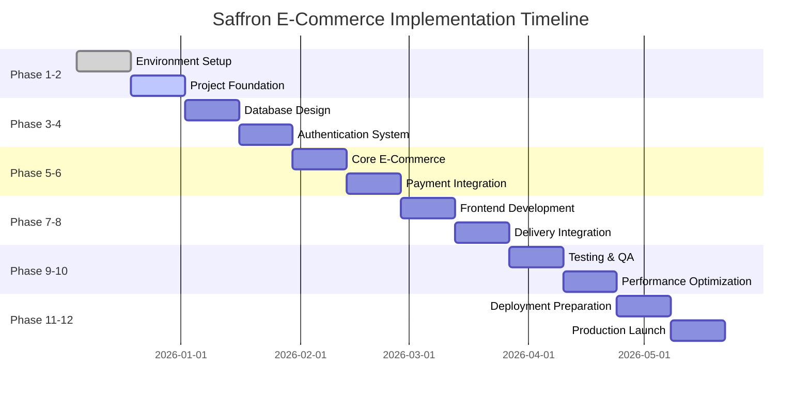

# SAFFRON SWEETS AND BAKERIES E-COMMERCE PLATFORM
## 12-PHASE COMPREHENSIVE IMPLEMENTATION PLAN
### Optimized for Solo Full Stack Developer - 6 Month Timeline

**Project:** Saffron Sweets and Bakeries E-Commerce Platform  
**Target Market:** Bangladesh  
**Technology Stack:** Next.js 14, React 18, TypeScript, Node.js, PostgreSQL, Redis  
**Deployment Target:** Organization's Private Cloud Infrastructure  
**Development Approach:** Solo Full Stack Developer (40 hours/week)  
**Timeline:** 6 Months (24 Weeks)  
**Document Version:** 1.0  
**Date:** December 5, 2025

---

## EXECUTIVE SUMMARY

This comprehensive 12-phase implementation plan provides a structured approach to developing Bangladesh's premier bakery e-commerce platform. The plan is specifically designed for a solo full-stack developer working full-time, with a compressed 6-month timeline optimized for rapid time-to-market while maintaining quality standards.

Each phase contains precisely 10 specific milestones, totaling 120 actionable deliverables that progress logically from initial environment setup through final deployment. The plan incorporates Bangladesh-specific requirements including local payment gateways (bKash, Nagad, Rocket, SSL Wireless), delivery services (Pathao, Uber, Shadhin), mobile optimization, and bilingual support.

The implementation follows modern development practices with continuous integration, automated testing, and deployment to the organization's private cloud infrastructure. The phased approach allows for iterative development, regular progress checkpoints, and flexibility to adapt to changing requirements while maintaining project momentum.

---

## PROJECT TIMELINE OVERVIEW

---

## PHASE 1: ENVIRONMENT SETUP AND PROJECT INITIALIZATION
**Duration:** 2 Weeks (December 5-18, 2025)  
**Focus:** Establishing development environment and project foundation

### Milestones:
1. **Configure Development Machine**
   - Set up Ubuntu 22.04 LTS with required specifications
   - Install Node.js 20 LTS with npm/yarn package managers
   - Configure Git with SSH keys for repository access
   - Set up VS Code with essential extensions and settings
   - Verify all tools are functioning correctly

2. **Establish Version Control**
   - Create GitHub repository with proper branching strategy
   - Set up .gitignore with comprehensive exclusions
   - Configure commit hooks for code quality
   - Establish main, develop, and feature branch workflows
   - Create repository documentation and contribution guidelines

3. **Install Database Systems**
   - Install PostgreSQL 15+ with optimized configuration
   - Set up Redis 7+ for caching and sessions
   - Configure pgAdmin for database management
   - Create development and test databases
   - Establish backup procedures for local development

4. **Set Up Development Tools**
   - Install Docker and Docker Compose for containerization
   - Configure Postman/Insomnia for API testing
   - Set up database GUI tools (pgAdmin, Redis Desktop Manager)
   - Install image optimization utilities
   - Configure monitoring and logging tools

5. **Create Project Structure**
   - Establish monorepo structure with frontend, backend, shared modules
   - Create standardized directory organization
   - Set up package.json files with proper dependencies
   - Configure TypeScript with strict settings
   - Establish naming conventions and coding standards

6. **Configure Development Environment**
   - Set up environment variable templates
   - Create development scripts for automation
   - Configure hot reload and live development servers
   - Establish database connection pooling
   - Set up debugging configurations

7. **Implement Code Quality Tools**
   - Configure ESLint with comprehensive rules
   - Set up Prettier for code formatting
   - Configure Husky for pre-commit hooks
   - Set up automated testing framework
   - Establish code coverage requirements

8. **Create Documentation Framework**
   - Set up README with project overview
   - Create API documentation template
   - Establish development workflow documentation
   - Create deployment guide template
   - Set up changelog and versioning documentation

9. **Establish Development Workflow**
   - Define branching strategy for solo development
   - Create commit message conventions
   - Set up code review process (self-review)
   - Establish testing procedures
   - Define deployment pipeline stages

10. **Verify Environment Integration**
   - Test all tool integrations
   - Verify database connectivity
   - Test API development server
   - Verify frontend build process
   - Create environment verification script

---

## PHASE 2: PROJECT FOUNDATION AND ARCHITECTURE
**Duration:** 2 Weeks (December 19, 2025 - January 1, 2026)  
**Focus:** Establishing core architecture and foundation components

### Milestones:
1. **Initialize Backend Framework**
   - Set up NestJS project with TypeScript
   - Configure module structure and dependency injection
   - Set up global exception filters
   - Configure request/response interceptors
   - Establish API versioning strategy

2. **Configure Database Layer**
   - Set up TypeORM with PostgreSQL connection
   - Configure database migrations system
   - Establish entity relationships and constraints
   - Set up repository pattern
   - Configure database connection pooling

3. **Set Up Caching Strategy**
   - Configure Redis connection in NestJS
   - Implement caching decorators and services
   - Set up session management
   - Configure API response caching
   - Establish cache invalidation strategies

4. **Initialize Frontend Framework**
   - Set up Next.js 14 with TypeScript
   - Configure Tailwind CSS with custom theme
   - Set up component library structure
   - Configure internationalization (i18n) for Bengali/English
   - Establish state management with Zustand

5. **Create Shared Type Definitions**
   - Define TypeScript interfaces for all entities
   - Create shared validation schemas
   - Establish API response types
   - Create shared utility functions
   - Set up enum definitions for constants

6. **Configure API Architecture**
   - Set up RESTful API structure
   - Configure request validation pipes
   - Set up authentication guards
   - Configure rate limiting
   - Establish API documentation with Swagger

7. **Implement File Upload System**
   - Configure multipart file handling
   - Set up image optimization pipeline
   - Create file storage abstraction
   - Implement file validation and security
   - Set up CDN preparation for static assets

8. **Establish Logging Framework**
   - Configure structured logging with Winston
   - Set up log levels and categories
   - Implement error tracking integration
   - Configure log rotation and retention
   - Set up development vs production logging

9. **Create Development Utilities**
   - Set up database seeding scripts
   - Create data migration utilities
   - Implement test data factories
   - Set up development API mocking
   - Create database reset scripts

10. **Verify Foundation Integration**
   - Test backend API connectivity
   - Verify frontend build process
   - Test database migrations
   - Validate shared type usage
   - Create integration test suite

---

## PHASE 3: DATABASE DESIGN AND IMPLEMENTATION
**Duration:** 2 Weeks (January 2-15, 2026)  
**Focus:** Building comprehensive database schema and relationships

### Milestones:
1. **Design User Management Schema**
   - Create users table with authentication fields
   - Design user roles and permissions structure
   - Implement user profile and preferences
   - Create address book with multiple addresses
   - Set up user activity tracking

2. **Implement Product Catalog Schema**
   - Create products table with multilingual support
   - Design categories with hierarchical structure
   - Implement product variants and attributes
   - Create product images and media management
   - Set up inventory tracking system

3. **Design Order Management System**
   - Create orders table with comprehensive fields
   - Implement order items with product relationships
   - Design order status workflow
   - Create order history and tracking
   - Set up order notes and communication log

4. **Implement Payment Schema**
   - Create payment transactions table
   - Design payment method configurations
   - Implement refund and dispute tracking
   - Create payment webhook logging
   - Set up payment reconciliation system

5. **Create Review and Rating System**
   - Design product reviews with moderation
   - Implement rating calculation system
   - Create review helpfulness voting
   - Set up review reporting system
   - Implement review response management

6. **Design Content Management Schema**
   - Create CMS pages with multilingual content
   - Implement blog and article management
   - Design media library with categorization
   - Create menu and navigation structure
   - Set up SEO metadata management

7. **Implement Notification System Schema**
   - Create notification templates
   - Design user notification preferences
   - Implement notification queue system
   - Create notification history
   - Set up email/SMS logging

8. **Create Analytics and Reporting Schema**
   - Design visitor tracking system
   - Implement sales analytics tables
   - Create user behavior tracking
   - Set up performance metrics storage
   - Design reporting aggregation tables

9. **Implement Database Optimization**
   - Create strategic indexes for performance
   - Implement database partitioning strategy
   - Set up query optimization
   - Configure connection pooling
   - Create database maintenance procedures

10. **Verify Database Implementation**
   - Test all relationships and constraints
   - Verify data integrity
   - Test migration scripts
   - Validate performance benchmarks
   - Create database documentation

---

## PHASE 4: AUTHENTICATION AND SECURITY IMPLEMENTATION
**Duration:** 2 Weeks (January 16-29, 2026)  
**Focus:** Implementing comprehensive security and user management

### Milestones:
1. **Implement User Authentication**
   - Create JWT token generation and validation
   - Implement refresh token mechanism
   - Set up password hashing with bcrypt
   - Create login/logout functionality
   - Implement session management

2. **Build User Registration System**
   - Create user registration with validation
   - Implement email verification workflow
   - Set up phone number verification
   - Create social login integration (Google, Facebook)
   - Implement CAPTCHA protection

3. **Implement Password Security**
   - Create secure password reset flow
   - Implement password strength requirements
   - Set up account lockout after failed attempts
   - Create password history tracking
   - Implement two-factor authentication

4. **Build Role-Based Access Control**
   - Implement role hierarchy and permissions
   - Create resource-based access control
   - Set up API endpoint protection
   - Implement admin panel access levels
   - Create permission management interface

5. **Implement API Security**
   - Set up request rate limiting
   - Implement CORS configuration
   - Create input validation and sanitization
   - Set up SQL injection prevention
   - Implement XSS protection

6. **Build User Profile Management**
   - Create profile editing functionality
   - Implement avatar upload and management
   - Set up preference management
   - Create address book management
   - Implement account deletion process

7. **Implement Admin Authentication**
   - Create admin login with enhanced security
   - Implement admin session management
   - Set up admin activity logging
   - Create admin role verification
   - Implement admin password policies

8. **Build Security Monitoring**
   - Implement login attempt tracking
   - Create suspicious activity detection
   - Set up security event logging
   - Implement automated security alerts
   - Create security audit trail

9. **Implement Data Protection**
   - Set up data encryption at rest
   - Implement secure data transmission
   - Create data anonymization for analytics
   - Implement GDPR compliance features
   - Set up data retention policies

10. **Verify Security Implementation**
   - Conduct security penetration testing
   - Verify authentication flows
   - Test authorization controls
   - Validate data protection measures
   - Create security documentation

---

## PHASE 5: CORE E-COMMERCE FUNCTIONALITY DEVELOPMENT
**Duration:** 2 Weeks (January 30 - February 12, 2026)  
**Focus:** Building essential e-commerce features and business logic

### Milestones:
1. **Implement Product Catalog**
   - Create product listing with pagination
   - Implement product detail pages
   - Build product search functionality
   - Create product filtering and sorting
   - Implement product comparison features

2. **Build Shopping Cart System**
   - Create add to cart functionality
   - Implement cart persistence across sessions
   - Build cart management interface
   - Implement cart validation and updates
   - Create cart sharing features

3. **Develop Checkout Process**
   - Create multi-step checkout flow
   - Implement guest checkout option
   - Build address selection and management
   - Create order summary and confirmation
   - Implement checkout validation

4. **Implement Order Management**
   - Create order processing workflow
   - Build order status tracking
   - Implement order modification and cancellation
   - Create order history for users
   - Implement reorder functionality

5. **Build Inventory System**
   - Create stock management interface
   - Implement low stock alerts
   - Build inventory tracking system
   - Create stock reservation for orders
   - Implement inventory reporting

6. **Develop Product Management**
   - Create product CRUD operations
   - Implement bulk product import/export
   - Build product variant management
   - Create product categorization
   - Implement product status management

7. **Implement Pricing System**
   - Create dynamic pricing rules
   - Implement discount and promotion engine
   - Build tax calculation system
   - Create currency display (BDT)
   - Implement price history tracking

8. **Build Search Functionality**
   - Implement advanced product search
   - Create search with autocomplete
   - Build Bengali language search
   - Implement search filters and facets
   - Create search analytics tracking

9. **Develop Category Management**
   - Create hierarchical category structure
   - Implement category navigation
   - Build category-based product filtering
   - Create category management interface
   - Implement category-specific promotions

10. **Verify E-Commerce Functionality**
   - Test complete purchase flow
   - Verify inventory management
   - Test product management features
   - Validate pricing calculations
   - Create user acceptance testing

---

## PHASE 6: PAYMENT GATEWAY INTEGRATION
**Duration:** 2 Weeks (February 13-26, 2026)  
**Focus:** Integrating Bangladesh-specific payment methods and transaction handling

### Milestones:
1. **Integrate SSLCommerz Payment Gateway**
   - Set up SSLCommerz merchant account
   - Implement payment initiation API
   - Build payment verification system
   - Create payment webhook handling
   - Implement refund processing

2. **Integrate bKash Mobile Wallet**
   - Set up bKash merchant API integration
   - Implement bKash payment flow
   - Create bKash transaction verification
   - Build bKash refund mechanism
   - Implement bKash payment status tracking

3. **Integrate Nagad Payment System**
   - Set up Nagad API integration
   - Implement Nagad payment processing
   - Create Nagad transaction validation
   - Build Nagad refund functionality
   - Implement Nagad payment confirmation

4. **Integrate Rocket Payment Gateway**
   - Set up DBBL Rocket API
   - Implement Rocket payment processing
   - Create Rocket transaction verification
   - Build Rocket refund system
   - Implement Rocket payment status updates

5. **Build Payment Method Selection**
   - Create payment method selection interface
   - Implement payment method validation
   - Build payment fee calculation
   - Create saved payment methods
   - Implement payment method preferences

6. **Implement Transaction Security**
   - Set up payment data encryption
   - Implement PCI DSS compliance measures
   - Create fraud detection system
   - Build transaction monitoring
   - Implement secure payment data handling

7. **Build Payment Dashboard**
   - Create payment transaction overview
   - Implement payment reconciliation tools
   - Build refund management interface
   - Create payment analytics and reporting
   - Implement payment dispute handling

8. **Implement Payment Notifications**
   - Create payment confirmation emails
   - Implement SMS payment notifications
   - Build payment failure notifications
   - Create payment success pages
   - Implement payment status updates

9. **Build Payment Testing Framework**
   - Create sandbox payment testing
   - Implement payment flow testing
   - Build payment error simulation
   - Create payment load testing
   - Implement payment regression testing

10. **Verify Payment Integration**
   - Test all payment methods end-to-end
   - Verify payment security measures
   - Test payment error handling
   - Validate payment notifications
   - Conduct payment compliance testing

---

## PHASE 7: FRONTEND DEVELOPMENT AND UI/UX IMPLEMENTATION
**Duration:** 2 Weeks (February 27 - March 12, 2026)  
**Focus:** Building responsive frontend with optimal user experience

### Milestones:
1. **Create Responsive Layout System**
   - Build mobile-first responsive design
   - Implement breakpoint system for devices
   - Create flexible grid layout
   - Implement touch-optimized interactions
   - Build accessibility-compliant interface

2. **Develop Product Display Components**
   - Create product card components
   - Build product detail pages
   - Implement product image galleries
   - Create product comparison interface
   - Build product review display

3. **Build Shopping Interface**
   - Create intuitive shopping cart interface
   - Build wishlist functionality
   - Implement quick add to cart features
   - Create saved items management
   - Build recently viewed products

4. **Implement User Account Interface**
   - Create user registration/login forms
   - Build user profile management
   - Implement order history display
   - Create address book management
   - Build user preferences settings

5. **Develop Navigation System**
   - Create intuitive main navigation
   - Build breadcrumb navigation
   - Implement mega menu for categories
   - Create search interface with autocomplete
   - Build footer with comprehensive links

6. **Implement Bengali Language Support**
   - Create complete Bengali translation
   - Implement language switcher
   - Build Bengali number formatting
   - Create Bengali date formatting
   - Implement RTL support considerations

7. **Build Mobile Optimization**
   - Create Progressive Web App (PWA)
   - Implement offline functionality
   - Build mobile-specific gestures
   - Create mobile-optimized checkout
   - Implement push notifications

8. **Develop Admin Interface**
   - Create admin dashboard layout
   - Build product management interface
   - Implement order management system
   - Create user management tools
   - Build reporting and analytics dashboard

9. **Implement Performance Optimization**
   - Create lazy loading for images
   - Implement code splitting
   - Build image optimization pipeline
   - Create caching strategies
   - Implement bundle size optimization

10. **Verify Frontend Implementation**
   - Test responsive design across devices
   - Verify cross-browser compatibility
   - Test accessibility compliance
   - Validate performance metrics
   - Conduct user experience testing

---

## PHASE 8: DELIVERY SERVICE INTEGRATION
**Duration:** 2 Weeks (March 13-26, 2026)  
**Focus:** Integrating Bangladesh delivery services and logistics

### Milestones:
1. **Integrate Pathao Delivery Service**
   - Set up Pathao API integration
   - Implement Pathao delivery booking
   - Create Pathao delivery tracking
   - Build Pathao pricing calculation
   - Implement Pathao delivery status updates

2. **Integrate Uber Delivery System**
   - Set up Uber Eats API integration
   - Implement Uber delivery booking
   - Create Uber delivery tracking
   - Build Uber delivery pricing
   - Implement Uber delivery notifications

3. **Integrate Shadhin Delivery**
   - Set up Shadhin delivery API
   - Implement Shadhin delivery booking
   - Create Shadhin delivery tracking
   - Build Shadhin delivery management
   - Implement Shadhin delivery analytics

4. **Build Delivery Management System**
   - Create delivery scheduling interface
   - Implement delivery zone management
   - Build delivery time slot selection
   - Create delivery fee calculation
   - Implement delivery route optimization

5. **Implement Delivery Tracking**
   - Create real-time delivery tracking
   - Build delivery status notifications
   - Implement delivery map visualization
   - Create delivery ETA calculations
   - Build delivery history tracking

6. **Develop Delivery Address System**
   - Create delivery address validation
   - Implement geocoding for addresses
   - Build delivery zone mapping
   - Create address autocomplete
   - Implement delivery instructions

7. **Build Delivery Analytics**
   - Create delivery performance metrics
   - Implement delivery cost analysis
   - Build delivery time analytics
   - Create delivery partner comparison
   - Implement delivery optimization reports

8. **Implement Delivery Notifications**
   - Create delivery confirmation SMS
   - Build delivery status emails
   - Implement delivery driver communication
   - Create delivery delay notifications
   - Build delivery completion alerts

9. **Develop Delivery Admin Tools**
   - Create delivery management dashboard
   - Build delivery assignment system
   - Implement delivery issue resolution
   - Create delivery reporting tools
   - Build delivery partner management

10. **Verify Delivery Integration**
   - Test all delivery services end-to-end
   - Verify delivery tracking accuracy
   - Test delivery notifications
   - Validate delivery fee calculations
   - Conduct delivery service performance testing

---

## PHASE 9: TESTING AND QUALITY ASSURANCE
**Duration:** 2 Weeks (March 27 - April 9, 2026)  
**Focus:** Comprehensive testing and quality assurance

### Milestones:
1. **Implement Unit Testing**
   - Create comprehensive unit test suite
   - Test all backend API endpoints
   - Test frontend components
   - Implement database testing
   - Create utility function testing

2. **Build Integration Testing**
   - Test API integration points
   - Test payment gateway integrations
   - Test delivery service integrations
   - Test database integrations
   - Test third-party service integrations

3. **Implement End-to-End Testing**
   - Create complete user journey tests
   - Test purchase flow from start to finish
   - Test user registration and login flows
   - Test admin management flows
   - Test mobile user experience

4. **Build Performance Testing**
   - Implement load testing for API
   - Test frontend performance
   - Test database query performance
   - Test concurrent user handling
   - Create performance benchmarking

5. **Implement Security Testing**
   - Conduct penetration testing
   - Test authentication security
   - Test payment security
   - Test data protection measures
   - Implement vulnerability scanning

6. **Build Cross-Browser Testing**
   - Test on Chrome, Firefox, Safari, Edge
   - Test on mobile browsers
   - Test on different operating systems
   - Test on various screen resolutions
   - Create browser compatibility matrix

7. **Implement Usability Testing**
   - Conduct user experience testing
   - Test interface intuitiveness
   - Test accessibility compliance
   - Test mobile usability
   - Create usability testing reports

8. **Build Bangladesh-Specific Testing**
   - Test Bengali language functionality
   - Test local payment methods
   - Test delivery services
   - Test mobile network performance
   - Test local cultural requirements

9. **Implement Regression Testing**
   - Create automated regression test suite
   - Test new features against existing functionality
   - Test performance regression
   - Test security regression
   - Create regression testing automation

10. **Verify Quality Assurance**
   - Conduct final quality review
   - Verify all requirements are met
   - Test deployment readiness
   - Validate performance benchmarks
   - Create quality assurance report

---

## PHASE 10: PERFORMANCE OPTIMIZATION
**Duration:** 2 Weeks (April 10-23, 2026)  
**Focus:** Optimizing system performance and scalability

### Milestones:
1. **Optimize Database Performance**
   - Implement query optimization
   - Create database indexing strategy
   - Optimize database connections
   - Implement database caching
   - Create database performance monitoring

2. **Implement Frontend Optimization**
   - Optimize JavaScript bundle size
   - Implement code splitting strategies
   - Optimize image loading
   - Implement browser caching
   - Create performance monitoring

3. **Build Caching Strategy**
   - Implement Redis caching for API responses
   - Create CDN caching strategy
   - Implement browser caching
   - Create application-level caching
   - Build cache invalidation strategies

4. **Optimize API Performance**
   - Implement API response optimization
   - Create API rate limiting
   - Optimize API authentication
   - Implement API compression
   - Build API performance monitoring

5. **Implement Mobile Optimization**
   - Optimize for mobile networks
   - Implement progressive loading
   - Optimize touch interactions
   - Create mobile-specific caching
   - Build mobile performance monitoring

6. **Build Image Optimization**
   - Implement responsive images
   - Create image compression pipeline
   - Implement lazy loading
   - Create image CDN integration
   - Build image optimization monitoring

7. **Optimize Server Performance**
   - Implement server load balancing
   - Optimize server configurations
   - Create server monitoring
   - Implement auto-scaling strategies
   - Build server performance tuning

8. **Implement Bangladesh Optimization**
   - Optimize for local network conditions
   - Implement Bangladesh-specific CDN
   - Optimize for mobile data usage
   - Create local performance monitoring
   - Build network optimization strategies

9. **Build Performance Monitoring**
   - Create application performance monitoring
   - Implement real-time performance alerts
   - Build performance analytics dashboard
   - Create performance reporting
   - Implement performance bottleneck detection

10. **Verify Performance Optimization**
   - Conduct performance testing
   - Verify optimization effectiveness
   - Test under load conditions
   - Validate performance benchmarks
   - Create performance optimization report

---

## PHASE 11: DEPLOYMENT TO PRIVATE CLOUD INFRASTRUCTURE
**Duration:** 2 Weeks (April 24 - May 7, 2026)  
**Focus:** Preparing and deploying to organization's private cloud

### Milestones:
1. **Configure Private Cloud Infrastructure**
   - Set up private cloud servers
   - Configure network security
   - Implement load balancing
   - Set up database servers
   - Create backup and recovery systems

2. **Implement Containerization**
   - Create Docker containers for applications
   - Set up Docker Compose configurations
   - Implement container orchestration
   - Create container security policies
   - Build container monitoring

3. **Build CI/CD Pipeline**
   - Set up automated build pipeline
   - Implement automated testing pipeline
   - Create automated deployment pipeline
   - Build deployment rollback mechanisms
   - Implement pipeline monitoring

4. **Configure Production Database**
   - Set up production PostgreSQL
   - Configure production Redis
   - Implement database replication
   - Create database backup strategies
   - Set up database monitoring

5. **Implement Security Infrastructure**
   - Configure firewall rules
   - Set up SSL/TLS certificates
   - Implement intrusion detection
   - Create security monitoring
   - Build security incident response

6. **Build Monitoring and Logging**
   - Set up application monitoring
   - Implement log aggregation
   - Create alerting systems
   - Build performance monitoring
   - Implement security monitoring

7. **Configure Backup Systems**
   - Set up automated backups
   - Implement disaster recovery
   - Create backup verification
   - Build backup monitoring
   - Implement backup testing

8. **Implement Bangladesh Compliance**
   - Configure data residency
   - Implement local compliance requirements
   - Set up data protection measures
   - Create compliance monitoring
   - Build compliance reporting

9. **Build Deployment Automation**
   - Create automated deployment scripts
   - Implement zero-downtime deployment
   - Build deployment testing
   - Create rollback procedures
   - Implement deployment monitoring

10. **Verify Deployment Preparation**
   - Test deployment procedures
   - Verify infrastructure readiness
   - Test backup and recovery
   - Validate security measures
   - Create deployment readiness report

---

## PHASE 12: DOCUMENTATION AND POST-DEPLOYMENT MAINTENANCE
**Duration:** 2 Weeks (May 8-21, 2026)  
**Focus:** Final documentation and maintenance procedures

### Milestones:
1. **Create Technical Documentation**
   - Document API endpoints
   - Create database schema documentation
   - Document deployment procedures
   - Create troubleshooting guides
   - Build technical architecture documentation

2. **Build User Documentation**
   - Create user manuals
   - Build admin guides
   - Create FAQ documentation
   - Build video tutorials
   - Create help center content

3. **Implement Maintenance Procedures**
   - Create maintenance schedules
   - Implement update procedures
   - Create backup procedures
   - Build monitoring procedures
   - Implement incident response procedures

4. **Build Training Materials**
   - Create admin training materials
   - Build user training guides
   - Create developer documentation
   - Build video training content
   - Create knowledge base

5. **Implement Analytics and Reporting**
   - Set up business analytics
   - Create performance reporting
   - Implement user behavior tracking
   - Build sales reporting
   - Create custom dashboards

6. **Build Support Systems**
   - Create ticketing system
   - Implement chat support
   - Build phone support procedures
   - Create email support templates
   - Implement support escalation

7. **Create Launch Preparation**
   - Prepare launch checklist
   - Create launch announcement materials
   - Prepare marketing materials
   - Create press release
   - Build launch event planning

8. **Implement Post-Launch Monitoring**
   - Set up real-time monitoring
   - Create alerting systems
   - Implement performance monitoring
   - Build user feedback collection
   - Create issue tracking

9. **Build Continuous Improvement**
   - Create feedback collection system
   - Implement A/B testing framework
   - Build feature request tracking
   - Create user satisfaction surveys
   - Implement improvement planning

10. **Verify Project Completion**
   - Conduct final project review
   - Verify all requirements met
   - Create project completion report
   - Document lessons learned
   - Plan future enhancements

---

## PROJECT SUCCESS METRICS

### Development Metrics
- **Code Coverage:** >80% for all critical components
- **Performance:** <3 second page load on 3G networks
- **Mobile Responsiveness:** 100% compatibility across devices
- **Security:** Zero critical vulnerabilities
- **Accessibility:** WCAG 2.1 Level AA compliance

### Business Metrics
- **Timeline:** 6 months from start to production
- **Budget:** Within BDT 31 lakh total budget
- **Quality:** <2% post-launch critical bugs
- **Performance:** 99.5% uptime in first 3 months
- **User Adoption:** 10,000+ users in first 3 months

### Technical Metrics
- **Database Performance:** <100ms query response time
- **API Performance:** <200ms average response time
- **Page Load Speed:** <2 seconds on 4G networks
- **Mobile Performance:** <3 seconds on 3G networks
- **Search Performance:** <500ms search response time

---

## RISK MITIGATION STRATEGIES

### Technical Risks
1. **Payment Integration Complexity**
   - Mitigation: Early integration with sandbox environments
   - Backup: Multiple payment options
   - Monitoring: Real-time payment failure alerts

2. **Performance Bottlenecks**
   - Mitigation: Continuous performance monitoring
   - Backup: Auto-scaling infrastructure
   - Planning: Performance budget enforcement

3. **Security Vulnerabilities**
   - Mitigation: Regular security audits
   - Backup: Incident response procedures
   - Monitoring: Real-time security alerts

### Project Risks
1. **Timeline Delays**
   - Mitigation: Phased approach with buffer time
   - Backup: Prioritized feature delivery
   - Monitoring: Weekly progress reviews

2. **Scope Creep**
   - Mitigation: Strict change control process
   - Backup: Feature deferral to Phase 2
   - Planning: Clear requirement documentation

3. **Resource Constraints**
   - Mitigation: Solo developer optimization
   - Backup: External consultant support
   - Planning: Realistic workload distribution

---

## CONCLUSION

This comprehensive 12-phase implementation plan provides a structured approach to developing Bangladesh's premier bakery e-commerce platform within a compressed 6-month timeline. The plan is specifically designed for a solo full-stack developer, with careful consideration of Bangladesh-specific requirements including local payment gateways, delivery services, and mobile optimization.

Each phase contains precisely 10 actionable milestones that progress logically from environment setup through final deployment and maintenance. The plan emphasizes quality through comprehensive testing, performance optimization, and security implementation while maintaining rapid development pace.

The implementation strategy leverages modern technologies (Next.js 14, NestJS, PostgreSQL, Redis) deployed to the organization's private cloud infrastructure, ensuring data sovereignty and control while maintaining scalability and performance standards.

Upon completion of this 12-phase plan, Saffron Sweets and Bakeries will have a world-class e-commerce platform ready to serve the Bangladesh market with unique features that differentiate from competitors and establish the brand as a digital leader in the bakery industry.

---

**Document Prepared By:** Technical Architecture Team  
**Document Date:** December 5, 2025  
**Version:** 1.0  
**Status:** Ready for Implementation  
**Next Steps:** Review and approve plan, begin Phase 1 implementation